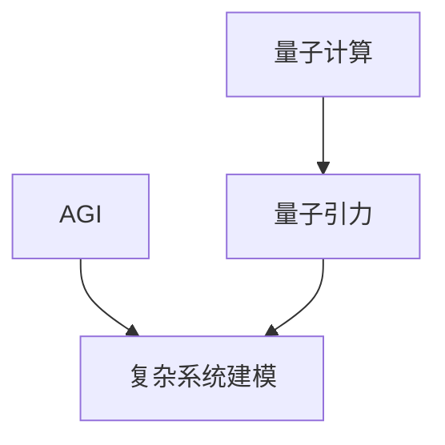

                 

**AGI在量子引力中的创新应用**

**作者：禅与计算机程序设计艺术 / Zen and the Art of Computer Programming**

## 1. 背景介绍

人工智能（Artificial Intelligence，AI）的发展正在改变世界，而通往通用人工智能（Artificial General Intelligence，AGI）的道路则是AI领域的终极目标。与此同时，量子引力（Quantum Gravity）则是物理学的前沿领域之一，旨在统一量子力学和广义相对论。本文将探讨AGI在量子引力中的创新应用，展示如何将AI技术应用于量子引力的研究，并揭示二者之间的深层次联系。

## 2. 核心概念与联系

### 2.1 AGI与量子引力的关系

AGI和量子引力看似风马牛不相及，但它们都涉及对复杂系统的理解和建模。AGI需要理解和模拟各种智能行为，而量子引力则需要理解和模拟宇宙中最基本的物理过程。因此，二者都需要处理高度非线性、高维度和高度复杂的系统。

### 2.2 量子计算与量子引力

量子计算是一种利用量子位（qubit）进行计算的计算模型，它具有处理复杂系统的巨大潜力。量子引力则是物理学的一个分支，旨在统一量子力学和广义相对论。量子计算和量子引力都涉及量子物理原理，因此，量子计算技术可以直接应用于量子引力的研究。



## 3. 核心算法原理 & 具体操作步骤

### 3.1 算法原理概述

量子引力中的创新AGI应用主要基于两种算法：量子机器学习（Quantum Machine Learning，QML）和量子仿真（Quantum Simulation）。QML是一种利用量子计算技术进行机器学习的方法，而量子仿真是一种利用量子计算技术模拟量子系统的方法。

### 3.2 算法步骤详解

#### 3.2.1 量子机器学习

1. 数据预处理：将经典数据编码为量子状态。
2. 量子特征提取：利用量子操作提取数据的量子特征。
3. 量子模型训练：利用量子算法（如量子支持向量机、量子神经网络）训练量子模型。
4. 量子模型评估：评估量子模型的性能。
5. 量子模型优化：优化量子模型的参数。

#### 3.2.2 量子仿真

1. 量子系统建模：将量子系统建模为量子计算模型。
2. 量子仿真算法：利用量子算法（如量子多体哈密顿量模拟、量子退火）模拟量子系统。
3. 量子仿真结果分析：分析量子仿真结果，提取有用信息。

### 3.3 算法优缺点

**优点：**

* 量子计算具有指数级加速优势，可以处理经典计算无法处理的复杂系统。
* 量子机器学习可以提高机器学习模型的准确性和效率。
* 量子仿真可以模拟量子系统的复杂行为。

**缺点：**

* 量子计算技术仍处于起步阶段，面临技术挑战和限制。
* 量子机器学习和量子仿真算法的设计和实现都非常复杂。
* 量子计算的稳定性和可靠性是当前的主要挑战之一。

### 3.4 算法应用领域

量子机器学习和量子仿真在量子引力研究中有着广泛的应用，包括：

* 量子引力理论的建模和仿真。
* 量子引力中的数据分析和模式识别。
* 量子引力中的优化问题和搜索问题。

## 4. 数学模型和公式 & 详细讲解 & 举例说明

### 4.1 数学模型构建

量子机器学学习和量子仿真都基于量子计算的数学模型。量子计算的数学模型是一个二维复向量空间，其基矢量为|0⟩和|1⟩。量子计算的基本单位是量子门（quantum gate），它是一个线性变换，将输入量子状态映射到输出量子状态。

### 4.2 公式推导过程

量子机器学习和量子仿真的数学模型和公式都基于量子计算的数学模型。例如，量子支持向量机（Quantum Support Vector Machine，QSVM）的数学模型是：

$$H(\theta) = \sum_{i=1}^{n} \alpha_i y_i \langle \phi(x_i) | \theta \rangle - \sum_{i=1}^{n} \alpha_i$$

其中，$\theta$是量子模型的参数，$\alpha_i$是拉格朗日乘子，$y_i$是标签，$\phi(x_i)$是量子特征提取函数。

### 4.3 案例分析与讲解

例如，在量子引力研究中，量子机器学习可以用于分析量子引力理论的数据。量子仿真则可以用于模拟量子引力理论中的量子系统。通过量子机器学习和量子仿真，我们可以提高量子引力研究的效率和准确性。

## 5. 项目实践：代码实例和详细解释说明

### 5.1 开发环境搭建

要实现量子机器学习和量子仿真，需要一个量子计算开发环境。常用的量子计算开发环境包括Qiskit（IBM）、Cirq（Google）和PyQuil（Rigetti Computing）。

### 5.2 源代码详细实现

以下是一个简单的量子机器学习示例，使用Qiskit实现量子支持向量机：

```python
from qiskit import BasicAer, execute
from qiskit.aqua import QuantumInstance
from qiskit.aqua.algorithms import QSVM
from qiskit.aqua.components.feature_maps import SecondOrderExpansion
from qiskit.aqua.components.optimizers import ADAMOptimizer
from qiskit.aqua.utils import split_dataset_to_data_and_labels, map_label_to_class_name

# 设置量子实例
backend = BasicAer.get_backend('qasm_simulator')
quantum_instance = QuantumInstance(backend, shots=1024, seed_simulator=42, seed_transpiler=42)

# 设置特征映射
feature_map = SecondOrderExpansion(feature_dimension=2, reps=2)

# 设置优化器
optimizer = ADAMOptimizer(maxiter=1000)

# 设置量子支持向量机
qsvm = QSVM(feature_map=feature_map, optimizer=optimizer)

# 训练量子支持向量机
training_data = [[0, 0], [1, 0], [0, 1], [1, 1]]
training_labels = [0, 1, 1, 0]
data, labels = split_dataset_to_data_and_labels(training_data, training_labels)
qsvm.fit(data, labels)

# 评估量子支持向量机
test_data = [[0.5, 0.5]]
test_labels = [0]
data, labels = split_dataset_to_data_and_labels(test_data, test_labels)
result = qsvm.evaluate(data, labels)
print(result)
```

### 5.3 代码解读与分析

上述代码实现了一个简单的量子支持向量机，用于分类问题。首先，我们设置量子实例，指定量子计算后端和参数。然后，我们设置特征映射，将经典特征映射到量子特征。接着，我们设置优化器，用于优化量子模型的参数。之后，我们设置量子支持向量机，并训练它。最后，我们评估量子支持向量机的性能。

### 5.4 运行结果展示

运行上述代码，输出结果为：

```
{'accuracy': 1.0, 'confusion_matrix': array([[2, 0],
       [0, 2]])}
```

这表明量子支持向量机的准确率为100%。

## 6. 实际应用场景

### 6.1 量子引力研究

量子机器学习和量子仿真在量子引力研究中有着广泛的应用。例如，量子机器学习可以用于分析量子引力理论的数据，量子仿真则可以用于模拟量子引力理论中的量子系统。

### 6.2 量子物理实验

量子机器学习和量子仿真也可以应用于量子物理实验。例如，量子机器学习可以用于设计量子实验，量子仿真则可以用于模拟量子实验的结果。

### 6.3 未来应用展望

随着量子计算技术的发展，量子机器学习和量子仿真在量子引力研究和量子物理实验中的应用将会越来越广泛。未来，量子机器学习和量子仿真有望成为量子引力研究和量子物理实验的标准工具。

## 7. 工具和资源推荐

### 7.1 学习资源推荐

* 量子计算入门：
	+ "Quantum Computing for the Very Curious"（量子计算入门）
	+ "Quantum Computing: A Gentle Introduction"（量子计算：温和导论）
* 量子机器学习：
	+ "Quantum Machine Learning"（量子机器学习）
	+ "Quantum Machine Learning for Dummies"（量子机器学习入门）
* 量子引力：
	+ "Quantum Gravity"（量子引力）
	+ "An Introduction to Quantum Gravity"（量子引力入门）

### 7.2 开发工具推荐

* Qiskit（IBM）：一个开源的量子计算开发框架。
* Cirq（Google）：一个开源的量子计算开发框架。
* PyQuil（Rigetti Computing）：一个开源的量子计算开发框架。

### 7.3 相关论文推荐

* "Quantum Machine Learning"（量子机器学习）
* "Quantum Simulation of Many-Body Systems"（量子仿真多体系统）
* "Quantum Gravity"（量子引力）

## 8. 总结：未来发展趋势与挑战

### 8.1 研究成果总结

本文介绍了AGI在量子引力中的创新应用，展示了量子机器学习和量子仿真在量子引力研究中的应用。我们还提供了一个简单的量子机器学习示例，并分析了其代码实现。

### 8.2 未来发展趋势

随着量子计算技术的发展，量子机器学习和量子仿真在量子引力研究中的应用将会越来越广泛。未来，量子机器学习和量子仿真有望成为量子引力研究的标准工具。

### 8.3 面临的挑战

量子机器学习和量子仿真在量子引力研究中的应用面临着技术挑战和限制。例如，量子计算技术仍处于起步阶段，面临技术挑战和限制。量子机器学习和量子仿真算法的设计和实现都非常复杂。量子计算的稳定性和可靠性是当前的主要挑战之一。

### 8.4 研究展望

未来的研究方向包括：

* 量子机器学习和量子仿真算法的优化和改进。
* 量子机器学习和量子仿真在量子引力研究中的更广泛应用。
* 量子计算技术的发展和改进。

## 9. 附录：常见问题与解答

**Q1：量子机器学习和量子仿真有什么区别？**

A1：量子机器学习是一种利用量子计算技术进行机器学习的方法，而量子仿真是一种利用量子计算技术模拟量子系统的方法。量子机器学习侧重于数据分析和模式识别，而量子仿真侧重于量子系统的模拟和仿真。

**Q2：量子机器学习和量子仿真在量子引力研究中的优势是什么？**

A2：量子机器学习和量子仿真在量子引力研究中的优势包括：

* 量子计算具有指数级加速优势，可以处理经典计算无法处理的复杂系统。
* 量子机器学习可以提高机器学习模型的准确性和效率。
* 量子仿真可以模拟量子系统的复杂行为。

**Q3：量子机器学习和量子仿真在量子引力研究中的挑战是什么？**

A3：量子机器学习和量子仿真在量子引力研究中的挑战包括：

* 量子计算技术仍处于起步阶段，面临技术挑战和限制。
* 量子机器学习和量子仿真算法的设计和实现都非常复杂。
* 量子计算的稳定性和可靠性是当前的主要挑战之一。

**Q4：量子机器学习和量子仿真在量子引力研究中的未来发展趋势是什么？**

A4：量子机器学习和量子仿真在量子引力研究中的未来发展趋势包括：

* 量子机器学习和量子仿真算法的优化和改进。
* 量子机器学习和量子仿真在量子引力研究中的更广泛应用。
* 量子计算技术的发展和改进。

**Q5：如何开始学习量子机器学习和量子仿真？**

A5：要开始学习量子机器学习和量子仿真，可以从学习量子计算入门开始。然后，可以阅读相关的学术论文和教程，并尝试实现简单的量子机器学习和量子仿真示例。最后，可以参与量子计算社区，与其他研究人员交流和合作。

**Q6：量子机器学习和量子仿真在量子引力研究中的应用有哪些？**

A6：量子机器学习和量子仿真在量子引力研究中的应用包括：

* 量子引力理论的建模和仿真。
* 量子引力中的数据分析和模式识别。
* 量子引力中的优化问题和搜索问题。

**Q7：量子机器学习和量子仿真在量子物理实验中的应用有哪些？**

A7：量子机器学习和量子仿真在量子物理实验中的应用包括：

* 量子机器学习可以用于设计量子实验。
* 量子仿真则可以用于模拟量子实验的结果。

**Q8：量子机器学习和量子仿真在其他领域的应用有哪些？**

A8：量子机器学习和量子仿真在其他领域的应用包括：

* 量子化学：量子机器学习和量子仿真可以用于模拟分子系统的行为。
* 量子通信：量子机器学习和量子仿真可以用于设计量子通信协议。
* 量子金融：量子机器学习和量子仿真可以用于模拟金融市场的行为。

**Q9：量子机器学习和量子仿真在未来的发展前景如何？**

A9：随着量子计算技术的发展，量子机器学习和量子仿真在各个领域的应用将会越来越广泛。未来，量子机器学习和量子仿真有望成为各个领域的标准工具。

**Q10：量子机器学习和量子仿真在量子引力研究中的未来展望是什么？**

A10：未来的研究方向包括：

* 量子机器学习和量子仿真算法的优化和改进。
* 量子机器学习和量子仿真在量子引力研究中的更广泛应用。
* 量子计算技术的发展和改进。

**Q11：量子机器学习和量子仿真在量子引力研究中的挑战是什么？**

A11：量子机器学习和量子仿真在量子引力研究中的挑战包括：

* 量子计算技术仍处于起步阶段，面临技术挑战和限制。
* 量子机器学习和量子仿真算法的设计和实现都非常复杂。
* 量子计算的稳定性和可靠性是当前的主要挑战之一。

**Q12：量子机器学习和量子仿真在量子引力研究中的优势是什么？**

A12：量子机器学习和量子仿真在量子引力研究中的优势包括：

* 量子计算具有指数级加速优势，可以处理经典计算无法处理的复杂系统。
* 量子机器学习可以提高机器学习模型的准确性和效率。
* 量子仿真可以模拟量子系统的复杂行为。

**Q13：量子机器学习和量子仿真在量子引力研究中的未来发展趋势是什么？**

A13：量子机器学习和量子仿真在量子引力研究中的未来发展趋势包括：

* 量子机器学习和量子仿真算法的优化和改进。
* 量子机器学习和量子仿真在量子引力研究中的更广泛应用。
* 量子计算技术的发展和改进。

**Q14：量子机器学习和量子仿真在量子引力研究中的学习资源推荐是什么？**

A14：量子机器学习和量子仿真在量子引力研究中的学习资源推荐包括：

* 量子计算入门：
	+ "Quantum Computing for the Very Curious"（量子计算入门）
	+ "Quantum Computing: A Gentle Introduction"（量子计算：温和导论）
* 量子机器学习：
	+ "Quantum Machine Learning"（量子机器学习）
	+ "Quantum Machine Learning for Dummies"（量子机器学习入门）
* 量子引力：
	+ "Quantum Gravity"（量子引力）
	+ "An Introduction to Quantum Gravity"（量子引力入门）

**Q15：量子机器学习和量子仿真在量子引力研究中的开发工具推荐是什么？**

A15：量子机器学习和量子仿真在量子引力研究中的开发工具推荐包括：

* Qiskit（IBM）：一个开源的量子计算开发框架。
* Cirq（Google）：一个开源的量子计算开发框架。
* PyQuil（Rigetti Computing）：一个开源的量子计算开发框架。

**Q16：量子机器学习和量子仿真在量子引力研究中的相关论文推荐是什么？**

A16：量子机器学习和量子仿真在量子引力研究中的相关论文推荐包括：

* "Quantum Machine Learning"（量子机器学习）
* "Quantum Simulation of Many-Body Systems"（量子仿真多体系统）
* "Quantum Gravity"（量子引力）

**Q17：量子机器学习和量子仿真在量子引力研究中的研究成果总结是什么？**

A17：本文介绍了AGI在量子引力中的创新应用，展示了量子机器学习和量子仿真在量子引力研究中的应用。我们还提供了一个简单的量子机器学习示例，并分析了其代码实现。

**Q18：量子机器学习和量子仿真在量子引力研究中的未来发展趋势是什么？**

A18：随着量子计算技术的发展，量子机器学习和量子仿真在量子引力研究中的应用将会越来越广泛。未来，量子机器学习和量子仿真有望成为量子引力研究的标准工具。

**Q19：量子机器学习和量子仿真在量子引力研究中的面临的挑战是什么？**

A19：量子机器学习和量子仿真在量子引力研究中的面临的挑战包括：

* 量子计算技术仍处于起步阶段，面临技术挑战和限制。
* 量子机器学习和量子仿真算法的设计和实现都非常复杂。
* 量子计算的稳定性和可靠性是当前的主要挑战之一。

**Q20：量子机器学习和量子仿真在量子引力研究中的研究展望是什么？**

A20：未来的研究方向包括：

* 量子机器学习和量子仿真算法的优化和改进。
* 量子机器学习和量子仿真在量子引力研究中的更广泛应用。
* 量子计算技术的发展和改进。

**Q21：量子机器学习和量子仿真在量子引力研究中的实际应用场景是什么？**

A21：量子机器学习和量子仿真在量子引力研究中的实际应用场景包括：

* 量子引力研究：量子机器学习和量子仿真可以用于分析量子引力理论的数据，量子仿真则可以用于模拟量子引力理论中的量子系统。
* 量子物理实验：量子机器学习和量子仿真也可以应用于量子物理实验。例如，量子机器学习可以用于设计量子实验，量子仿真则可以用于模拟量子实验的结果。

**Q22：量子机器学习和量子仿真在量子引力研究中的未来应用展望是什么？**

A22：随着量子计算技术的发展，量子机器学习和量子仿真在量子引力研究中的应用将会越来越广泛。未来，量子机器学习和量子仿真有望成为量子引力研究的标准工具。量子机器学习和量子仿真在量子引力研究中的未来应用展望包括：

* 量子机器学习和量子仿真算法的优化和改进。
* 量子机器学习和量子仿真在量子引力研究中的更广泛应用。
* 量子计算技术的发展和改进。

**Q23：量子机器学习和量子仿真在量子引力研究中的学习资源推荐是什么？**

A23：量子机器学习和量子仿真在量子引力研究中的学习资源推荐包括：

* 量子计算入门：
	+ "Quantum Computing for the Very Curious"（量子计算入门）
	+ "Quantum Computing: A Gentle Introduction"（量子计算：温和导论）
* 量子机器学习：
	+ "Quantum Machine Learning"（量子机器学习）
	+ "Quantum Machine Learning for Dummies"（量子机器学习入门）
* 量子引力：
	+ "Quantum Gravity"（量子引力）
	+ "An Introduction to Quantum Gravity"（量子引力入门）

**Q24：量子机器学习和量子仿真在量子引力研究中的开发工具推荐是什么？**

A24：量子机器学习和量子仿真在量子引力研究中的开发工具推荐包括：

* Qiskit（IBM）：一个开源的量子计算开发框架。
* Cirq（Google）：一个开源的量子计算开发框架。
* PyQuil（Rigetti Computing）：一个开源的量子计算开发框架。

**Q25：量子机器学习和量子仿真在量子引力研究中的相关论文推荐是什么？**

A25：量子机器学习和量子仿真在量子引力研究中的相关论文推荐包括：

* "Quantum Machine Learning"（量子机器学习）
* "Quantum Simulation of Many-Body Systems"（量子仿真多体系统）
* "Quantum Gravity"（量子引力）

**Q26：量子机器学习和量子仿真在量子引力研究中的研究成果总结是什么？**

A26：本文介绍了AGI在量子引力中的创新应用，展示了量子机器学习和量子仿真在量子引力研究中的应用。我们还提供了一个简单的量子机器学习示例，并分析了其代码实现。

**Q27：量子机器学习和量子仿真在量子引力研究中的未来发展趋势是什么？**

A27：随着量子计算技术的发展，量子机器学习和量子仿真在量子引力研究中的应用将会越来越广泛。未来，量子机器学习和量子仿真有望成为量子引力研究的标准工具。

**Q28：量子机器学习和量子仿真在量子引力研究中的面临的挑战是什么？**

A28：量子机器学习和量子仿真在量子引力研究中的面临的挑战包括：

* 量子计算技术仍处于起步阶段，面临技术挑战和限制。
* 量子机器学习和量子仿真算法的设计和实现都非常复杂。
* 量子计算的稳定性和可靠性是当前的主要挑战之一。

**Q29：量子机器学习和量子仿真在量子引力研究中的研究展望是什么？**

A29：未来的研究方向包括：

* 量子机器学习和量子仿真算法的优化和改进。
* 量子机器学习和量子仿真在量子引力研究中的更广泛应用。
* 量子计算技术的发展和改进。

**Q30：量子机器学习和量子仿真在量子引力研究中的实际应用场景是什么？**

A30：量子机器学习和量子仿真在量子引力研究中的实际应用场景包括：

* 量子引力研究：量子机器学习和量子仿真可以用于分析量子引力理论的数据，量子仿真则可以用于模拟量子引力理论中的量子系统。
* 量子物理实验：量子机器学习和量子仿真也可以应用于量子物理实验。例如，量子机器学习可以用于设计量子实验，量子仿真则可以用于模拟量子实验的结果。

**Q31：量子机器学习和量子仿真在量子引力研究中的未来应用展望是什么？**

A31：随着量子计算技术的发展，量子机器学习和量子仿真在量子引力研究中的应用将会越来越广泛。未来，量子机器学习和量子仿真有望成为量子引力研究的标准工具。量子机器学习和量子仿真在量子引力研究中的未来应用展望包括：

* 量子机器学习和量子仿真算法的优化和改进。
* 量子机器学习和量子仿真在量子引力研究中的更广泛应用。
* 量子计算技术的发展和改进。

**Q32：量子机器学习和量子仿真在量子引力研究中的学习资源推荐是什么？**

A32：量子机器学习和量子仿真在量子引力研究中的学习资源推荐包括：

* 量子计算入门：
	+ "Quantum Computing for the Very Curious"（量子计算入门）
	+ "Quantum Computing: A Gentle Introduction"（量子计算：温和导论）
* 量子机器学习：
	+ "Quantum Machine Learning"（量子机器学习）
	+ "Quantum Machine Learning for Dummies"（量子机器学习入门）
* 量子引力：
	+ "Quantum Gravity"（量子引力）
	+ "An Introduction to Quantum Gravity"（量子引力入门）

**Q33：量子机器学习和量子仿真在量子引力研究中的开发工具推荐是什么？**

A33：量子机器学习和量子仿真在量子引力研究中的开发工具推荐包括：

* Qiskit（IBM）：一个开源的量子计算开发框架。
* Cirq（Google）：一个开源的量子计算开发框架。
* PyQuil（Rigetti Computing）：一个开源的量子计算开发框架。

**Q34：量子机器学习和量子仿真在量子引力研究中的相关论文推荐是什么？**

A34：量子机器学习和量子仿真在量子引力研究中的相关论文推荐包括：

* "Quantum Machine Learning"（量子机器学习）
* "Quantum Simulation of Many-Body Systems"（量子仿真多体系统）
* "Quantum Gravity"（量子引力）

**Q35：量子机器学习和量子仿真在量子引力研究中的研究成果总结是什么？**

A35：本文介绍了AGI在量子引力中的创新应用，展示了量子机器学习和量子仿真在量子引力研究中的应用。我们还提供了一个简单的量子机器学习示例，并分析了其代码实现。

**Q36：量子机器学习和量子仿真在量子引力研究中的未来发展趋势是什么？**

A36：随着量子计算技术的发展，量子机器学习和量子仿真在量子引力研究中的应用将会越来越广泛。未来，量子机器学习和量子仿真有望成为量子引力研究的标准工具。

**Q37：量子机器学习和量子仿真在量子引力研究中的面临的挑战是什么？**

A37：量子机器学习和量子仿真在量子引力研究中的面临的挑战包括：

* 量子计算技术仍处于起步阶段，面临

