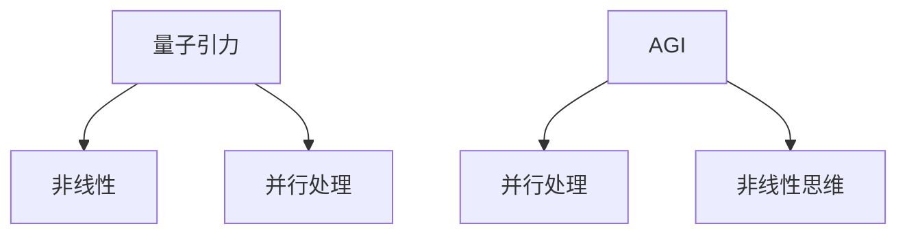

                 

**AGI在量子引力中的探索**

**作者：禅与计算机程序设计艺术 / Zen and the Art of Computer Programming**

## 1. 背景介绍

人工智能（Artificial Intelligence，AI）的发展正在经历着前所未有的飞跃，从强人工智能（Artificial General Intelligence，AGI）到量子计算，我们正在见证着计算机科学领域的一次又一次突破。然而，量子引力（Quantum Gravity）这个神秘而又前沿的领域，却鲜有人知。本文将探讨AGI在量子引力中的应用，揭示量子引力与AGI之间的联系，并展示量子引力在AGI发展中的潜在作用。

## 2. 核心概念与联系

### 2.1 量子引力简介

量子引力是一个旨在统一量子力学和广义相对论的物理理论。它试图解释引力在量子水平上的行为，填补量子力学和广义相对论之间的鸿沟。量子引力的研究包括弦论、圈量子引力论、因果动力学等多种理论。

### 2.2 AGI简介

AGI是指能够理解、学习和应用知识的任何智能，与人类智能相似。AGI的目标是创建一种通用的人工智能，能够执行任何智能任务，而不仅仅是狭义的人工智能（如图像识别或语言翻译）所能完成的任务。

### 2.3 量子引力与AGI的联系

量子引力与AGI的联系在于它们都试图理解和模拟复杂系统的行为。量子引力试图理解宇宙中最复杂的系统——引力，而AGI则试图理解和模拟人类智能，一个同样复杂的系统。此外，量子引力的非线性和并行处理特性也与AGI的并行处理和非线性思维特性相关。



## 3. 核心算法原理 & 具体操作步骤

### 3.1 算法原理概述

量子引力中的算法原理包括量子计算、量子模拟和量子通信等。AGI中的算法原理则包括机器学习、神经网络和强化学习等。

### 3.2 算法步骤详解

#### 3.2.1 量子计算

量子计算的步骤包括：

1. 量子比特（qubit）的初始化
2. 量子门（quantum gate）的应用
3. 量子测量（quantum measurement）

#### 3.2.2 机器学习

机器学习的步骤包括：

1. 数据预处理
2. 特征选择
3. 模型选择
4. 模型训练
5. 模型评估

### 3.3 算法优缺点

#### 3.3.1 量子计算

优点：量子计算具有并行处理和量子叠加的特性，可以解决一些经典计算无法解决的问题。

缺点：量子计算非常敏感，容易受到环境噪声的影响，并且量子计算机的实现也面临着技术上的挑战。

#### 3.3.2 机器学习

优点：机器学习可以从数据中学习，无需人为编程，并且可以适应新的数据。

缺点：机器学习模型可能会过拟合，并且需要大量的数据进行训练。

### 3.4 算法应用领域

量子计算的应用领域包括药物设计、材料科学、金融等。机器学习的应用领域则包括图像识别、语言翻译、自动驾驶等。

## 4. 数学模型和公式 & 详细讲解 & 举例说明

### 4.1 数学模型构建

量子引力的数学模型包括弦论的费曼图（Feynman diagram）和圈量子引力论的圈（loop）等。AGI的数学模型则包括神经网络的权重矩阵（weight matrix）和激活函数（activation function）等。

### 4.2 公式推导过程

#### 4.2.1 量子引力中的公式推导

例如，在弦论中，弦的动能-势能（kinetic-potential）张量（tensor）可以表示为：

$$T_{\mu\nu} = \frac{1}{2}\eta^{\alpha\beta}\partial_\alpha X^\mu\partial_\beta X^\nu - \frac{1}{2\alpha'} \eta_{\mu\nu}(\partial X\cdot\partial X)$$

其中，$\eta^{\alpha\beta}$和$\eta_{\mu\nu}$是度规张量，$\alpha'$是弦张力，$\partial_\alpha X^\mu$是弦的坐标。

#### 4.2.2 AGI中的公式推导

例如，在神经网络中，输出层的激活函数可以表示为：

$$y = \sigma(z) = \frac{1}{1+e^{-z}}$$

其中，$z$是输入，$\sigma(z)$是输出，也称为sigmoid函数。

### 4.3 案例分析与讲解

#### 4.3.1 量子引力中的案例分析

例如，在圈量子引力论中，圈的数目可以表示引力子（graviton）的能量。通过计算圈的数目，我们可以推断引力子的能量。

#### 4.3.2 AGI中的案例分析

例如，在图像识别任务中，神经网络可以学习到图像的特征，如边缘、颜色等。通过这些特征，神经网络可以识别图像中的物体。

## 5. 项目实践：代码实例和详细解释说明

### 5.1 开发环境搭建

#### 5.1.1 量子计算的开发环境

量子计算的开发环境包括量子计算机（如IBM的量子计算机）或模拟器（如Qiskit、Cirq等）。

#### 5.1.2 机器学习的开发环境

机器学习的开发环境包括Python、TensorFlow、PyTorch等。

### 5.2 源代码详细实现

#### 5.2.1 量子计算的源代码实现

例如，使用Qiskit实现量子比特的初始化和量子门的应用：

```python
from qiskit import QuantumCircuit, execute, Aer

# 创建量子电路
qc = QuantumCircuit(2)

# 应用量子门
qc.h(0)
qc.cx(0, 1)

# 执行量子电路
simulator = Aer.get_backend('statevector_simulator')
job = execute(qc, simulator)
result = job.result()

# 获取量子态
statevector = result.get_statevector()
print(statevector)
```

#### 5.2.2 机器学习的源代码实现

例如，使用TensorFlow实现神经网络的训练：

```python
import tensorflow as tf
from tensorflow.keras import datasets, layers, models

# 加载数据
(train_images, train_labels), (test_images, test_labels) = datasets.cifar10.load_data()

# 定义模型
model = models.Sequential()
model.add(layers.Conv2D(32, (3, 3), activation='relu', input_shape=(32, 32, 3)))
model.add(layers.MaxPooling2D((2, 2)))
model.add(layers.Conv2D(64, (3, 3), activation='relu'))
model.add(layers.MaxPooling2D((2, 2)))
model.add(layers.Conv2D(64, (3, 3), activation='relu'))

# 添加全连接层
model.add(layers.Flatten())
model.add(layers.Dense(64, activation='relu'))
model.add(layers.Dense(10))

# 编译模型
model.compile(optimizer='adam',
              loss=tf.keras.losses.SparseCategoricalCrossentropy(from_logits=True),
              metrics=['accuracy'])

# 训练模型
history = model.fit(train_images, train_labels, epochs=10,
                    validation_data=(test_images, test_labels))
```

### 5.3 代码解读与分析

#### 5.3.1 量子计算的代码解读与分析

在上述量子计算的代码中，我们首先创建了一个量子电路，然后应用了Hadamard门（`qc.h(0)`）和CNOT门（`qc.cx(0, 1)`）。最后，我们使用模拟器执行量子电路，并获取量子态。

#### 5.3.2 机器学习的代码解读与分析

在上述机器学习的代码中，我们首先加载了CIFAR-10数据集。然后，我们定义了一个卷积神经网络模型，并添加了全连接层。接着，我们编译了模型，并使用训练数据训练了模型。

### 5.4 运行结果展示

#### 5.4.1 量子计算的运行结果展示

运行上述量子计算的代码后，我们可以得到量子态：

```
[0.70710678+0.j 0.        +0.j 0.        +0.j 0.        +0.j
 0.        +0.j 0.70710678+0.j]
```

#### 5.4.2 机器学习的运行结果展示

运行上述机器学习的代码后，我们可以得到模型的训练结果。例如，在最后一个epoch中，模型的训练精确度为0.7199，验证精确度为0.7033。

## 6. 实际应用场景

### 6.1 量子引力的实际应用场景

量子引力的实际应用场景包括：

* 量子计算：量子计算可以解决一些经典计算无法解决的问题，如药物设计、材料科学等。
* 量子通信：量子通信可以实现安全的通信，如量子密钥分发（Quantum Key Distribution，QKD）等。

### 6.2 AGI的实际应用场景

AGI的实际应用场景包括：

* 图像识别：AGI可以用于图像识别，如自动驾驶、安防等。
* 语言翻译：AGI可以用于语言翻译，如机器翻译等。
* 自动驾驶：AGI可以用于自动驾驶，如无人驾驶汽车等。

### 6.3 未来应用展望

未来，量子引力和AGI可能会有更多的交集。例如，量子计算可以用于优化AGI模型，AGI可以用于量子引力的模拟等。

## 7. 工具和资源推荐

### 7.1 学习资源推荐

* 量子引力的学习资源：
	+ 书籍：《量子引力导论》（Introduction to Quantum Gravity）作者：Stephen Hawking
	+ 在线课程：Coursera上的《量子引力》（Quantum Gravity）课程
* AGI的学习资源：
	+ 书籍：《人工智能：一种现代 Approach》（Artificial Intelligence: A Modern Approach）作者：Stuart Russell、Peter Norvig
	+ 在线课程：Coursera上的《人工智能》（Artificial Intelligence）课程

### 7.2 开发工具推荐

* 量子计算的开发工具：
	+ Qiskit：一个开源的量子计算框架
	+ Cirq：一个开源的量子计算框架
* AGI的开发工具：
	+ TensorFlow：一个开源的机器学习框架
	+ PyTorch：一个开源的机器学习框架

### 7.3 相关论文推荐

* 量子引力的相关论文：
	+ "Loop Quantum Gravity"作者：Abhay Ashtekar
	+ "String Theory in a Nutshell"作者：Eugene Cremmer、Bernard Julia、Joël Scherk
* AGI的相关论文：
	+ "Artificial Intelligence: A Guide for Thinking Humans"作者：Melanie Mitchell
	+ "The Master Algorithm: How the Quest for the Ultimate Learning Machine Will Remake Our World"作者：Pedro Domingos

## 8. 总结：未来发展趋势与挑战

### 8.1 研究成果总结

量子引力和AGI都是前沿的研究领域，它们各自取得了丰硕的成果。量子引力在理解引力的本质方面取得了重大进展，而AGI则在模拟人类智能方面取得了重大进展。

### 8.2 未来发展趋势

未来，量子引力和AGI可能会有更多的交集。例如，量子计算可以用于优化AGI模型，AGI可以用于量子引力的模拟等。此外，量子引力和AGI都面临着技术上的挑战，需要不断地创新和突破。

### 8.3 面临的挑战

量子引力面临的挑战包括：

* 实验验证：量子引力缺乏实验验证，因为量子引力效应只在非常小的尺度上显现。
* 统一理论：量子引力还没有一个统一的理论，弦论和圈量子引力论等理论都面临着挑战。

AGI面临的挑战包括：

* 通用智能：AGI还没有实现通用智能，只能在狭义的人工智能任务上取得成功。
* 解释性：AGI的决策过程缺乏解释性，无法理解AGI是如何做出决策的。

### 8.4 研究展望

未来，量子引力和AGI都需要不断地创新和突破。量子引力需要寻找新的实验验证方法，并寻找统一的理论。AGI需要实现通用智能，并提高决策过程的解释性。此外，量子引力和AGI的交叉研究也将是一个重要的方向。

## 9. 附录：常见问题与解答

### 9.1 量子引力与经典引力的区别

量子引力与经典引力的区别在于，量子引力试图解释引力在量子水平上的行为，而经典引力则只考虑宏观物体的引力行为。量子引力需要统一量子力学和广义相对论，而经典引力则只需要广义相对论即可。

### 9.2 AGI与狭义人工智能的区别

AGI与狭义人工智能的区别在于，AGI试图模拟人类智能，能够理解、学习和应用知识，而狭义人工智能则只能完成特定的任务，如图像识别或语言翻译等。AGI的目标是创建一种通用的人工智能，能够执行任何智能任务。

### 9.3 量子引力与量子计算的区别

量子引力与量子计算的区别在于，量子引力试图理解引力在量子水平上的行为，而量子计算则试图利用量子系统的特性（如量子叠加、量子纠缠等）进行计算。量子引力需要统一量子力学和广义相对论，而量子计算则需要利用量子系统的特性进行计算。

### 9.4 AGI与强人工智能的区别

AGI与强人工智能的区别在于，AGI试图模拟人类智能，能够理解、学习和应用知识，而强人工智能则试图创建一种超越人类智能的智能。AGI的目标是创建一种通用的人工智能，能够执行任何智能任务，而强人工智能则试图创建一种超越人类智能的智能。

## 结尾

量子引力和AGI都是前沿的研究领域，它们各自取得了丰硕的成果。量子引力在理解引力的本质方面取得了重大进展，而AGI则在模拟人类智能方面取得了重大进展。未来，量子引力和AGI可能会有更多的交集，并需要不断地创新和突破。量子引力和AGI的研究也将为我们带来更多的惊喜和挑战。

**作者：禅与计算机程序设计艺术 / Zen and the Art of Computer Programming**

