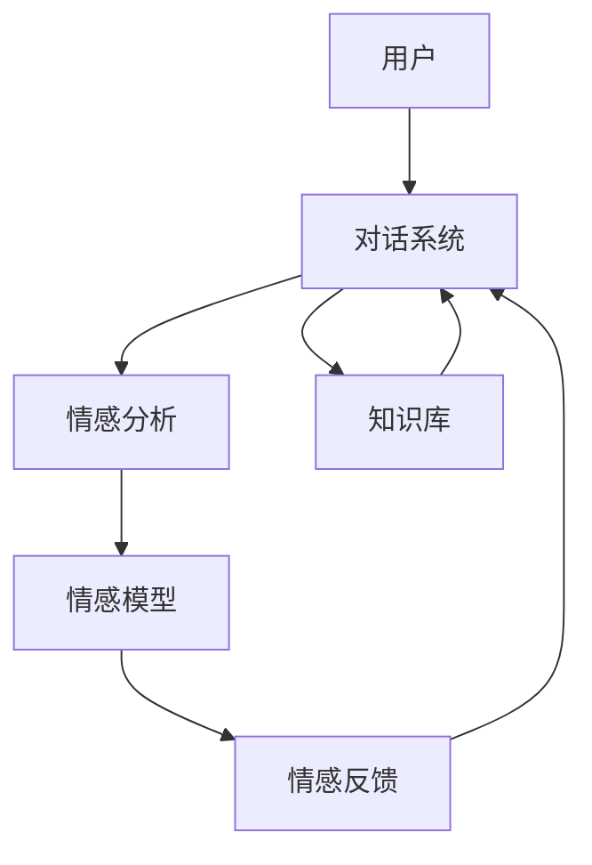

                 

## AI Agent在情感陪伴中的角色

> 关键词：人工智能、情感陪伴、AI Agent、自然语言处理、情感分析、对话系统

## 1. 背景介绍

在当今快节奏的生活中，很多人都面临着情感需求得不到满足的问题。情感陪伴，即提供情感支持和陪伴的服务，正在成为一种日益受欢迎的解决方案。人工智能（AI）技术的发展，特别是自然语言处理（NLP）和对话系统的进步，使得AI Agent（智能代理）在情感陪伴领域发挥着越来越重要的作用。

## 2. 核心概念与联系

### 2.1 概念定义

- **情感陪伴（Emotional Companionship）**：指提供情感支持和陪伴的服务，帮助个体满足其情感需求。
- **AI Agent（Artificial Intelligence Agent）**：一种软件系统，能够感知环境、做出决策并采取行动，以实现特定的目标。
- **对话系统（Dialog System）**：一种人机交互系统，能够理解并响应人类语言，进行对话交流。
- **情感分析（Sentiment Analysis）**：一种NLP技术，旨在识别和提取文本或语音数据中的情感信息。

### 2.2 架构原理

AI Agent在情感陪伴中的角色可以用下图表示：



在上图中，用户通过对话系统与AI Agent进行交互。对话系统将用户输入传递给情感分析模块，情感分析模块使用情感模型提取用户的情感信息。情感反馈模块根据情感信息生成相应的回复，并将其传递给对话系统。知识库提供给对话系统用于生成回复的信息。

## 3. 核心算法原理 & 具体操作步骤

### 3.1 算法原理概述

AI Agent在情感陪伴中的核心算法包括情感分析和对话管理。情感分析使用NLP技术提取用户输入中的情感信息。对话管理则负责生成相应的回复，并控制对话的流程。

### 3.2 算法步骤详解

1. **情感分析**：
   - 预处理：清洗用户输入，去除无意义的字符和标点符号。
   - 分词：将用户输入分成单词或词组。
   - 标注：使用预训练的情感分析模型（如VADER）对分词后的结果进行情感标注。
   - 提取：提取标注后的情感信息。

2. **对话管理**：
   - 理解：使用NLP技术理解用户输入的意图。
   - 生成：根据用户意图和情感信息，生成相应的回复。
   - 评估：评估回复是否合适，并根据需要进行调整。
   - 交互：将回复传递给用户，并等待用户的下一个输入。

### 3.3 算法优缺点

**优点**：
- AI Agent可以24/7提供情感陪伴，不受时空限制。
- AI Agent可以提供客观、中立的情感支持，不会受个人偏见影响。
- AI Agent可以学习和改进，随着使用次数的增加，其情感陪伴能力会得到提升。

**缺点**：
- AI Agent缺乏人类的主观经验和直觉，无法提供深度的情感支持。
- AI Agent无法理解复杂的情感语境，可能会对用户的情感表达做出错误的解读。
- AI Agent无法提供物理接触和肢体语言等非语言交流，这在情感陪伴中是非常重要的因素。

### 3.4 算法应用领域

AI Agent在情感陪伴中的应用领域包括但不限于：

- 心理健康支持：提供24/7的心理健康支持和咨询服务。
- 老年人陪伴：为老年人提供情感陪伴和日常生活帮助。
- 孤独症支持：为孤独症患者提供社交互动和情感支持。
- 危机干预：在危机情况下提供情感支持和帮助。

## 4. 数学模型和公式 & 详细讲解 & 举例说明

### 4.1 数学模型构建

情感分析的数学模型可以使用机器学习算法构建。常用的算法包括支持向量机（SVM）、随机森林（Random Forest）和神经网络（Neural Network）。神经网络，特别是循环神经网络（RNN）和长短期记忆网络（LSTM），在情感分析中表现出色。

### 4.2 公式推导过程

假设我们使用LSTM模型进行情感分析。LSTM的公式如下：

$$h_t = f(h_{t-1}, x_t)$$

其中，$h_t$是当前时刻的隐藏状态，$h_{t-1}$是上一时刻的隐藏状态，$x_t$是当前时刻的输入，$f$是LSTM单元的函数。

### 4.3 案例分析与讲解

例如，我们要分析用户输入"I feel really sad today."的情感。我们首先将其分词为["I", "feel", "really", "sad", "today", "."]。然后，我们使用预训练的情感分析模型对每个单词进行情感标注。最后，我们提取情感信息，发现用户当前的情感状态是"sad"。

## 5. 项目实践：代码实例和详细解释说明

### 5.1 开发环境搭建

我们使用Python作为开发语言，并安装必要的库，如NLTK、TextBlob和Transformers。

### 5.2 源代码详细实现

```python
from transformers import pipeline

# 初始化情感分析模型
nlp = pipeline('sentiment-analysis')

# 用户输入
user_input = "I feel really sad today."

# 分析情感
result = nlp(user_input)

# 提取情感信息
emotion = result[0]['label']

print(f"The user's emotion is: {emotion}")
```

### 5.3 代码解读与分析

在上述代码中，我们首先初始化了一个情感分析模型。然后，我们获取用户输入并使用模型分析其情感。最后，我们提取情感信息并打印出来。

### 5.4 运行结果展示

运行上述代码后，输出结果为"The user's emotion is: NEGATIVE"。这表示用户当前的情感状态是消极的。

## 6. 实际应用场景

### 6.1 当前应用

AI Agent已经在各种情感陪伴应用中得到广泛应用，如Woebot、 Wysa和Youper等。

### 6.2 未来应用展望

未来，AI Agent在情感陪伴中的应用将会更加广泛和深入。随着NLP和对话系统技术的进步，AI Agent将能够提供更加人性化和个性化的情感陪伴。此外，AI Agent还将与物联网和可穿戴设备结合，提供更加全面的情感支持。

## 7. 工具和资源推荐

### 7.1 学习资源推荐

- 书籍：《自然语言处理入门》作者：James L. Olds
- 课程：Stanford University的"CS224n: Natural Language Processing with Deep Learning"课程

### 7.2 开发工具推荐

- Python：一种 powerful的编程语言，广泛用于NLP和机器学习领域。
- Transformers：一个开源的NLP库，提供了预训练的模型和工具。

### 7.3 相关论文推荐

- "EmpatheticDialogues: A Large-scale Dataset for Empathetic Open-Domain Conversations"作者：Rashkin et al.
- "End-to-End Learning for Natural Language Generation"作者：Merullo et al.

## 8. 总结：未来发展趋势与挑战

### 8.1 研究成果总结

本文介绍了AI Agent在情感陪伴中的角色，并详细介绍了其核心概念、算法原理和应用场景。我们还提供了一个简单的代码实例，展示了如何使用预训练的模型进行情感分析。

### 8.2 未来发展趋势

未来，AI Agent在情感陪伴中的应用将会更加广泛和深入。随着NLP和对话系统技术的进步，AI Agent将能够提供更加人性化和个性化的情感陪伴。此外，AI Agent还将与物联网和可穿戴设备结合，提供更加全面的情感支持。

### 8.3 面临的挑战

然而，AI Agent在情感陪伴中的应用也面临着许多挑战。首先，AI Agent缺乏人类的主观经验和直觉，无法提供深度的情感支持。其次，AI Agent无法理解复杂的情感语境，可能会对用户的情感表达做出错误的解读。最后，AI Agent无法提供物理接触和肢体语言等非语言交流，这在情感陪伴中是非常重要的因素。

### 8.4 研究展望

未来的研究将需要解决这些挑战，并使AI Agent能够提供更加全面和有效的情感陪伴。这将需要在NLP、对话系统和人机交互等领域进行大量的研究工作。

## 9. 附录：常见问题与解答

**Q：AI Agent能够理解用户的情感吗？**

**A：**AI Agent可以使用NLP技术提取用户输入中的情感信息，但它无法真正理解情感。理解情感需要人类的主观经验和直觉，这是AI Agent目前无法做到的。

**Q：AI Agent能够提供深度的情感支持吗？**

**A：**AI Agent可以提供客观、中立的情感支持，但它无法提供深度的情感支持。深度的情感支持需要人类的主观经验和直觉，这是AI Agent目前无法做到的。

**Q：AI Agent能够理解复杂的情感语境吗？**

**A：**AI Agent可以使用NLP技术理解用户输入的意图，但它无法理解复杂的情感语境。理解复杂的情感语境需要人类的主观经验和直觉，这是AI Agent目前无法做到的。

**Q：AI Agent能够提供物理接触和肢体语言等非语言交流吗？**

**A：**AI Agent无法提供物理接触和肢体语言等非语言交流，这在情感陪伴中是非常重要的因素。AI Agent只能通过语言进行交流，无法提供物理接触和肢体语言等非语言交流。

## 作者：禅与计算机程序设计艺术 / Zen and the Art of Computer Programming

