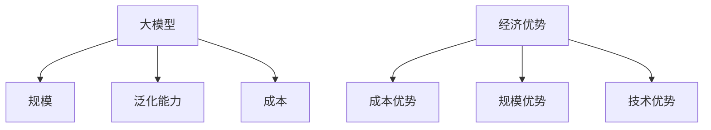

                 

## AI 大模型创业：如何利用经济优势？

> 关键词：大模型、经济优势、创业、算法、数据、计算资源、商业模式

## 1. 背景介绍

当前，人工智能（AI）领域正处于大模型（Large Language Models）的发展时期。大模型是指具有数十亿参数的模型，能够理解和生成人类语言，并展示出惊人的泛化能力。然而，构建和部署大模型需要大量的计算资源和数据，这使得大模型创业面临着巨大的挑战。本文将探讨如何利用经济优势进行大模型创业，以期在竞争激烈的AI市场中取得成功。

## 2. 核心概念与联系

### 2.1 大模型的定义与特点

大模型是指具有数十亿参数的模型，能够理解和生成人类语言，并展示出惊人的泛化能力。大模型的特点包括：

- **规模**：大模型具有数十亿参数，需要大量的计算资源和数据进行训练。
- **泛化能力**：大模型能够理解和生成人类语言，并展示出惊人的泛化能力，能够应用于各种任务。
- **成本**：构建和部署大模型需要大量的计算资源和数据，这使得大模型创业面临着巨大的挑战。

### 2.2 经济优势的定义与类型

经济优势是指企业在市场竞争中占据优势的因素，包括成本优势、规模优势、技术优势等。大模型创业可以通过以下几种方式获得经济优势：

- **成本优势**：通过降低计算资源和数据成本，提高大模型创业的经济可行性。
- **规模优势**：通过扩大大模型的规模，提高大模型的泛化能力和商业价值。
- **技术优势**：通过开发新的算法和技术，提高大模型的性能和可靠性。

### 2.3 核心概念联系图



## 3. 核心算法原理 & 具体操作步骤

### 3.1 算法原理概述

大模型的核心算法是Transformer模型，它使用自注意力机制（Self-Attention）和位置编码（Positional Encoding）来处理序列数据。大模型的训练过程包括数据预处理、模型构建、训练和评估等步骤。

### 3.2 算法步骤详解

#### 3.2.1 数据预处理

大模型的数据预处理包括文本清洗、分词、标记化和数据增强等步骤。文本清洗包括去除特殊字符、标点符号和停用词等操作。分词和标记化是将文本转换为模型可以处理的形式。数据增强是通过对数据进行随机操作（如随机删除、随机插入等）来增加数据量和丰富数据多样性。

#### 3.2.2 模型构建

大模型的模型构建包括位置编码、自注意力机制和 Feed-Forward 网络等步骤。位置编码是为了解决循环神经网络（RNN）无法处理序列顺序信息的问题。自注意力机制是Transformer模型的核心，它可以同时关注序列中的所有位置。Feed-Forward 网络是一个简单的全连接网络，用于对自注意力机制的输出进行非线性变换。

#### 3.2.3 训练和评估

大模型的训练过程包括数据加载、模型初始化、优化器选择、损失函数选择和训练循环等步骤。评估过程包括验证集评估、测试集评估和性能指标选择等步骤。

### 3.3 算法优缺点

大模型的优点包括泛化能力强、可以理解和生成人类语言、可以应用于各种任务等。缺点包括计算资源需求大、数据需求大、训练时间长等。

### 3.4 算法应用领域

大模型的应用领域包括自然语言处理（NLP）、计算机视觉（CV）、推荐系统、自动驾驶等。大模型可以用于文本生成、机器翻译、图像分类、推荐算法等任务。

## 4. 数学模型和公式 & 详细讲解 & 举例说明

### 4.1 数学模型构建

大模型的数学模型是基于Transformer模型构建的。Transformer模型使用自注意力机制和位置编码来处理序列数据。自注意力机制的数学表达式如下：

$$Attention(Q, K, V) = softmax(\frac{QK^T}{\sqrt{d_k}})V$$

其中，$Q$, $K$, $V$分别是查询、键和值矩阵，$d_k$是键矩阵的维度。

位置编码的数学表达式如下：

$$PE_{(pos, 2i)} = sin(\frac{pos}{10000^{2i/d_{model}}})$$
$$PE_{(pos, 2i+1)} = cos(\frac{pos}{10000^{2i/d_{model}}})$$

其中，$pos$是位置，$i$是维度，$d_{model}$是模型的维度。

### 4.2 公式推导过程

自注意力机制的推导过程如下：

1. 计算查询、键和值矩阵的点积，并除以键矩阵的维度平方根。
2. 使用softmax函数对上一步的结果进行归一化，得到注意力权重。
3. 将注意力权重与值矩阵相乘，得到自注意力机制的输出。

位置编码的推导过程如下：

1. 计算位置和维度的乘积，并除以$10000^{2i/d_{model}}$。
2. 使用$sin$函数对上一步的结果进行变换，得到位置编码的偶数维度。
3. 使用$cos$函数对上一步的结果进行变换，得到位置编码的奇数维度。

### 4.3 案例分析与讲解

例如，假设我们要构建一个大模型来进行机器翻译任务。我们首先需要收集大量的双语数据，然后进行数据预处理，包括文本清洗、分词、标记化和数据增强等步骤。接着，我们构建Transformer模型，包括位置编码、自注意力机制和Feed-Forward网络等步骤。然后，我们选择合适的优化器和损失函数，并进行模型训练。最后，我们对模型进行评估，并选择合适的性能指标。

## 5. 项目实践：代码实例和详细解释说明

### 5.1 开发环境搭建

大模型的开发环境需要配备强大的计算资源，包括GPU、CPU和大量内存。我们推荐使用NVIDIA A100 GPU和AMD EPYC CPU，并配备至少512GB内存。开发环境还需要安装Python、PyTorch、Transformers等相关库。

### 5.2 源代码详细实现

大模型的源代码可以参考Hugging Face的Transformers库。以下是大模型训练的伪代码：

```python
from transformers import AutoTokenizer, AutoModelForSeq2SeqLM, Trainer, TrainingArguments

# 1. 加载预训练模型和分词器
model_name = "t5-base"
tokenizer = AutoTokenizer.from_pretrained(model_name)
model = AutoModelForSeq2SeqLM.from_pretrained(model_name)

# 2. 加载数据
train_dataset = load_dataset("path/to/train.json")
val_dataset = load_dataset("path/to/val.json")

# 3. 数据预处理
def preprocess_function(examples):
    inputs = [f"translate English to German: {x['en']}" for x in examples["translation"]]
    targets = [x["de"] for x in examples["translation"]]
    model_inputs = tokenizer(inputs, max_length=128, truncation=True)

    with tokenizer.as_target_tokenizer():
        labels = tokenizer(targets, max_length=128, truncation=True)

    model_inputs["labels"] = labels["input_ids"]
    return model_inputs

train_dataset = train_dataset.map(preprocess_function, batched=True)
val_dataset = val_dataset.map(preprocess_function, batched=True)

# 4. 训练参数设置
training_args = TrainingArguments(
    output_dir="./results",
    num_train_epochs=3,
    per_device_train_batch_size=16,
    per_device_eval_batch_size=64,
    warmup_steps=500,
    weight_decay=0.01,
    logging_dir="./logs",
)

# 5. 训练模型
trainer = Trainer(
    model=model,
    args=training_args,
    train_dataset=train_dataset,
    eval_dataset=val_dataset,
)

trainer.train()
```

### 5.3 代码解读与分析

上述代码首先加载预训练模型和分词器，然后加载数据集，并进行数据预处理。接着，设置训练参数，并创建Trainer对象。最后，调用`trainer.train()`函数进行模型训练。

### 5.4 运行结果展示

训练完成后，我们可以使用`trainer.evaluate()`函数对模型进行评估，并输出性能指标。例如：

```python
eval_results = trainer.evaluate()
print(f"Perplexity: {eval_results['eval_loss']:.2f}")
```

## 6. 实际应用场景

大模型的实际应用场景包括：

### 6.1 自然语言处理

大模型可以用于文本生成、机器翻译、文本分类等任务。例如，我们可以使用大模型来构建一个智能客服系统，帮助用户解答问题。

### 6.2 计算机视觉

大模型可以用于图像分类、目标检测等任务。例如，我们可以使用大模型来构建一个自动驾驶系统，帮助车辆识别路况和障碍物。

### 6.3 推荐系统

大模型可以用于用户画像、内容推荐等任务。例如，我们可以使用大模型来构建一个个性化推荐系统，帮助用户发现感兴趣的内容。

### 6.4 未来应用展望

未来，大模型的应用场景将会更加广泛，包括医疗、金融、教育等领域。大模型将会成为各行各业的核心技术，帮助企业提高效率和竞争力。

## 7. 工具和资源推荐

### 7.1 学习资源推荐

- **课程**：Stanford CS224n Natural Language Processing with Deep Learning
- **书籍**：Natural Language Processing with Python
- **论文**：Attention is All You Need

### 7.2 开发工具推荐

- **开发环境**：Jupyter Notebook
- **库**：PyTorch、Transformers、Hugging Face Datasets
- **硬件**：NVIDIA A100 GPU、AMD EPYC CPU

### 7.3 相关论文推荐

- **大模型**：The Illustrated Transformer
- **自注意力机制**：Attention is All You Need
- **Transformer模型**：The Transformer Model: A State-of-the-Art Natural Language Processing Model

## 8. 总结：未来发展趋势与挑战

### 8.1 研究成果总结

本文介绍了大模型的定义、特点、核心算法原理、数学模型和公式、项目实践、实际应用场景、工具和资源推荐等内容。大模型是当前AI领域的热点，具有强大的泛化能力和商业价值。然而，构建和部署大模型需要大量的计算资源和数据，这使得大模型创业面临着巨大的挑战。

### 8.2 未来发展趋势

未来，大模型的发展趋势包括：

- **模型规模**：大模型的规模将会进一步扩大，达到千亿甚至万亿参数级别。
- **多模态学习**：大模型将会结合计算机视觉、自然语言处理等多模态学习任务，实现更强大的泛化能力。
- **知识增强**：大模型将会结合外部知识，实现知识增强，提高泛化能力和商业价值。

### 8.3 面临的挑战

大模型创业面临的挑战包括：

- **计算资源**：构建和部署大模型需要大量的计算资源，这使得大模型创业面临着巨大的成本压力。
- **数据**：大模型需要大量的数据进行训练，这使得大模型创业面临着数据获取和标注的挑战。
- **可解释性**：大模型的决策过程不易理解，这使得大模型创业面临着可解释性的挑战。

### 8.4 研究展望

未来，大模型的研究展望包括：

- **模型压缩**：开发新的模型压缩技术，降低大模型的计算资源需求。
- **数据增强**：开发新的数据增强技术，提高大模型的泛化能力和商业价值。
- **可解释性**：开发新的可解释性技术，提高大模型的可解释性和商业价值。

## 9. 附录：常见问题与解答

**Q1：大模型的优点是什么？**

A1：大模型的优点包括泛化能力强、可以理解和生成人类语言、可以应用于各种任务等。

**Q2：大模型的缺点是什么？**

A2：大模型的缺点包括计算资源需求大、数据需求大、训练时间长等。

**Q3：大模型的应用领域有哪些？**

A3：大模型的应用领域包括自然语言处理、计算机视觉、推荐系统、自动驾驶等。

**Q4：大模型的核心算法原理是什么？**

A4：大模型的核心算法原理是Transformer模型，它使用自注意力机制和位置编码来处理序列数据。

**Q5：大模型的数学模型是什么？**

A5：大模型的数学模型是基于Transformer模型构建的，它使用自注意力机制和位置编码来处理序列数据。

## 作者：禅与计算机程序设计艺术 / Zen and the Art of Computer Programming

