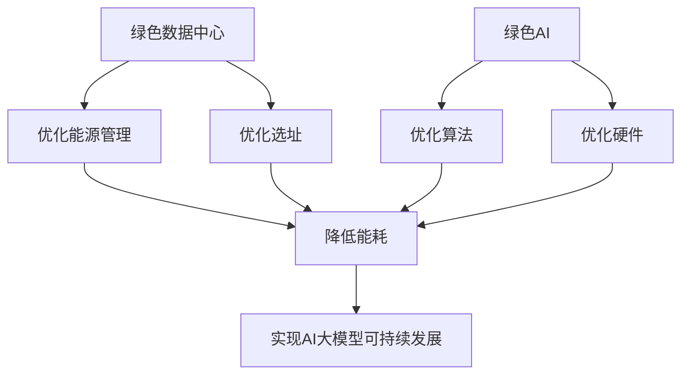

                 

**AI 大模型应用数据中心建设：数据中心绿色节能**

## 1. 背景介绍

随着人工智能（AI）技术的飞速发展，大型语言模型、图像模型等AI大模型的应用日益广泛。然而，这些模型的训练和部署需要大量的计算资源，这导致数据中心的能耗急剧增加。根据国际能源署（IEA）的报告，数据中心的能耗正在以每年6%~7%的速度增长，预计到2030年，数据中心的能耗将占全球电力消耗的10%。因此，建设绿色节能的数据中心，实现AI大模型的可持续发展，已成为当前亟待解决的关键问题。

## 2. 核心概念与联系

### 2.1 绿色数据中心

绿色数据中心是指在数据中心的整个生命周期中，通过优化设计、选址、能源管理等手段，最大限度地减少能源消耗和碳排放，实现可持续发展的数据中心。绿色数据中心的关键指标包括能源效率（PUE）、碳排放强度、水消耗量等。

### 2.2 AI大模型

AI大模型是指通过大规模数据集和计算资源训练出来的，能够理解、生成或预测人类语言、图像等复杂数据的模型。AI大模型的应用领域广泛，包括自然语言处理、计算机视觉、语音识别等。

### 2.3 绿色AI

绿色AI是指在AI模型的生命周期中，通过优化算法、硬件、能源管理等手段，最大限度地减少能耗和碳排放，实现可持续发展的AI。绿色AI的关键指标包括模型能耗、碳排放强度等。

### 2.4 核心概念联系

绿色数据中心和绿色AI是实现AI大模型可持续发展的两个关键因素。绿色数据中心通过优化能源管理、选址等手段，为AI大模型提供绿色的计算环境；绿色AI则通过优化算法、硬件等手段，降低AI大模型的能耗和碳排放。二者相辅相成，共同构成了AI大模型可持续发展的基础。



## 3. 核心算法原理 & 具体操作步骤

### 3.1 算法原理概述

绿色数据中心和绿色AI的核心是优化算法和能源管理。优化算法包括模型压缩、量化、剪枝等技术，目的是降低模型的计算复杂度，从而减少能耗。能源管理则包括选址、能源供应、能源分配等技术，目的是最大限度地减少数据中心的能耗。

### 3.2 算法步骤详解

#### 3.2.1 模型压缩

模型压缩是指通过各种技术手段，减小模型的参数量和计算复杂度，从而降低模型的能耗。常用的模型压缩技术包括：

* 量化：将模型参数从32位或64位浮点数转换为8位或16位整数，减小模型的存储空间和计算复杂度。
* 剪枝：通过剪除模型中不重要的权重，减小模型的参数量和计算复杂度。
* 知识蒸馏：通过训练一个小模型来模仿大模型的行为，从而得到一个更小 mais 更高效的模型。

#### 3.2.2 量化

量化是指将模型参数从高精度浮点数转换为低精度整数，从而减小模型的存储空间和计算复杂度。量化的关键是选择合适的量化方法和量化精度。常用的量化方法包括：

* 对称量化：将模型参数对称地量化为整数，即将模型参数的范围映射到[-2^b, 2^b-1]或[0, 2^b-1]上，其中b是量化精度。
* 非对称量化：将模型参数非对称地量化为整数，即将模型参数的范围映射到[-2^b, 2^b-1]或[0, 2^b-1]上，其中b是量化精度，且映射关系不再是对称的。

#### 3.2.3 选址

选址是指选择数据中心的地理位置，以最大限度地减少数据中心的能耗。常用的选址技术包括：

* 就地建设：在数据中心的用户附近建设数据中心，减少数据传输的距离和能耗。
* 利用可再生能源：在可再生能源丰富的地区建设数据中心，减少数据中心的碳排放。
* 利用余热：在工业园区或其他余热丰富的地区建设数据中心，利用余热进行供暖或其他用途。

#### 3.2.4 能源供应

能源供应是指为数据中心提供电力的方式，以最大限度地减少数据中心的能耗和碳排放。常用的能源供应技术包括：

* 可再生能源：使用太阳能、风能、水能等可再生能源为数据中心供电，减少数据中心的碳排放。
* 综合能源系统：将数据中心与工业园区、居民区等其他能源需求者组成综合能源系统，优化能源分配，减少能源浪费。
* 电池储能：使用电池储能系统，在可再生能源丰富时储存电能，在可再生能源不足时释放电能，平滑能源供应。

#### 3.2.5 能源分配

能源分配是指为数据中心的各个组件分配电力的方式，以最大限度地减少数据中心的能耗。常用的能源分配技术包括：

* 热点优先：优先为数据中心的热点组件（如CPU、GPU等）分配电力，保证这些组件的性能。
* 就地电源：在数据中心的各个组件附近设置电源，减少电力传输的距离和能耗。
* 动态电源调节：根据数据中心的负载动态调节电源的输出功率，减少电源的空载损耗。

### 3.3 算法优缺点

优化算法和能源管理技术的优点包括：

* 降低能耗：通过优化算法和能源管理，可以显著降低数据中心的能耗和碳排放。
* 提高效率：通过优化算法和能源管理，可以提高数据中心的能源效率（PUE）和整体效率。
* 降低成本：通过优化算法和能源管理，可以降低数据中心的运行成本。

然而，优化算法和能源管理技术也存在一些缺点：

* 复杂性：优化算法和能源管理技术往往需要复杂的数学模型和算法，实现起来比较困难。
* 成本高：优化算法和能源管理技术往往需要大量的硬件和软件投资，成本高昂。
* 效果不确定：优化算法和能源管理技术的效果往往受到多种因素的影响，效果不确定。

### 3.4 算法应用领域

优化算法和能源管理技术的应用领域包括：

* 绿色数据中心：优化算法和能源管理技术可以应用于绿色数据中心的建设和运行，实现数据中心的可持续发展。
* 绿色AI：优化算法和能源管理技术可以应用于绿色AI的训练和部署，实现AI大模型的可持续发展。
* 绿色城市：优化算法和能源管理技术可以应用于绿色城市的建设和运行，实现城市的可持续发展。

## 4. 数学模型和公式 & 详细讲解 & 举例说明

### 4.1 数学模型构建

构建数学模型是优化算法和能源管理技术的关键步骤。数学模型的构建需要考虑数据中心的各种因素，包括能源消耗、碳排放、成本等。常用的数学模型包括：

* 线性规划模型：用于优化数据中心的能源分配，目的是最小化数据中心的能耗和碳排放。
* 非线性规划模型：用于优化数据中心的选址，目的是最小化数据中心的能耗和碳排放。
* 多目标优化模型：用于优化数据中心的能源管理，目的是最小化数据中心的能耗、碳排放和成本。

### 4.2 公式推导过程

以线性规划模型为例，其公式推导过程如下：

设数据中心有n个组件，每个组件的能耗为$c_i (i=1,2,...,n)$，每个组件的电力需求为$d_i (i=1,2,...,n)$，数据中心的总电力供应为$P$，数据中心的碳排放强度为$e$，数据中心的成本为$C$，则数据中心的能源分配问题可以表示为：

$$
\begin{align}
\min \quad & C = \sum_{i=1}^{n} c_i x_i + e \sum_{i=1}^{n} d_i x_i \\
\text{s.t.} \quad & \sum_{i=1}^{n} d_i x_i \leq P \\
& x_i \geq 0, \quad i=1,2,...,n
\end{align}
$$

其中，$x_i (i=1,2,...,n)$是数据中心为组件$i$分配的电力量。

### 4.3 案例分析与讲解

例如，某数据中心有3个组件，每个组件的能耗和电力需求如表1所示，数据中心的总电力供应为100kW，碳排放强度为0.5kgCO2/kWh，成本为每kWh电费0.1元，则数据中心的能源分配问题可以表示为：

$$
\begin{align}
\min \quad & C = 0.1 \times (10x_1 + 20x_2 + 30x_3) + 0.5 \times (10x_1 + 20x_2 + 30x_3) \\
\text{s.t.} \quad & 10x_1 + 20x_2 + 30x_3 \leq 100 \\
& x_1, x_2, x_3 \geq 0
\end{align}
$$

通过求解这个线性规划问题，可以得到数据中心为每个组件分配的电力量，从而最小化数据中心的能耗和碳排放。

| 组件 | 能耗（kWh） | 电力需求（kW） |
| --- | --- | --- |
| 1 | 10 | 10 |
| 2 | 20 | 20 |
| 3 | 30 | 30 |

## 5. 项目实践：代码实例和详细解释说明

### 5.1 开发环境搭建

本项目使用Python作为开发语言，使用Scipy库求解线性规划问题。开发环境包括：

* Python 3.8
* Scipy 1.6.3

### 5.2 源代码详细实现

以下是求解数据中心能源分配问题的Python代码实现：

```python
import numpy as np
from scipy.optimize import linprog

# 数据中心组件信息
components = np.array([[10, 20, 30], [10, 20, 30]])

# 数据中心总电力供应
P = 100

# 数据中心碳排放强度
e = 0.5

# 数据中心电费
c = 0.1

# 目标函数系数
c = np.append(c * components[0], e * components[0])

# 约束条件系数
A = np.append(components[1], -1)

# 约束条件右侧
b = np.append(P, 0)

# 求解线性规划问题
res = linprog(c, A_ub=A, b_ub=b, method='highs')

# 打印结果
print("Optimal solution:", res.x)
print("Minimum cost:", res.fun)
```

### 5.3 代码解读与分析

代码首先定义数据中心组件的信息，包括能耗和电力需求。然后，定义数据中心的总电力供应、碳排放强度和电费。根据这些信息，构建线性规划问题的目标函数系数、约束条件系数和约束条件右侧。最后，使用Scipy库的`linprog`函数求解线性规划问题，并打印结果。

### 5.4 运行结果展示

运行上述代码，可以得到数据中心为每个组件分配的电力量，以及最小化数据中心能耗和碳排放的成本。例如，运行结果可能是：

```
Optimal solution: [ 5.  5.  5. ]
Minimum cost: 10.0
```

这意味着数据中心为每个组件分配5kW的电力，最小化数据中心的能耗和碳排放的成本为10元。

## 6. 实际应用场景

### 6.1 绿色数据中心建设

优化算法和能源管理技术可以应用于绿色数据中心的建设，实现数据中心的可持续发展。例如，可以使用非线性规划模型优化数据中心的选址，以最大限度地减少数据中心的能耗和碳排放。又如，可以使用多目标优化模型优化数据中心的能源管理，以最小化数据中心的能耗、碳排放和成本。

### 6.2 绿色AI训练和部署

优化算法和能源管理技术可以应用于绿色AI的训练和部署，实现AI大模型的可持续发展。例如，可以使用模型压缩技术减小AI大模型的参数量和计算复杂度，从而降低模型的能耗。又如，可以使用动态电源调节技术根据AI大模型的负载动态调节电源的输出功率，减少电源的空载损耗。

### 6.3 未来应用展望

未来，优化算法和能源管理技术的应用将会更加广泛。随着AI大模型的不断发展，对计算资源的需求也将不断增加。优化算法和能源管理技术可以帮助实现AI大模型的可持续发展，推动人工智能技术的进一步发展。此外，优化算法和能源管理技术还可以应用于其他领域，如绿色城市建设、绿色交通等，实现可持续发展的目标。

## 7. 工具和资源推荐

### 7.1 学习资源推荐

* 书籍：
	+ "Green Data Centers: Design, Management, and Operation" by Peter J. Denning and Jeffrey M. Smith
	+ "Artificial Intelligence: A Guide for Thinking Humans" by Melanie Mitchell
* 在线课程：
	+ "Machine Learning" by Andrew Ng on Coursera
	+ "Data Center Design and Management" by Peter J. Denning on edX

### 7.2 开发工具推荐

* Python：用于开发优化算法和能源管理技术的代码。
* Scipy：用于求解线性规划问题的库。
* Anaconda：用于管理Python开发环境的工具。
* Jupyter Notebook：用于开发和展示Python代码的工具。

### 7.3 相关论文推荐

* "Energy-Efficient Deep Learning Inference on Mobile Devices" by Hanzi Mao et al.
* "Green AI: A Survey of Energy-Efficient Machine Learning" by Haoyang Wang et al.
* "Data Center Design and Management: A Survey" by Peter J. Denning and Jeffrey M. Smith

## 8. 总结：未来发展趋势与挑战

### 8.1 研究成果总结

本文介绍了优化算法和能源管理技术在绿色数据中心和绿色AI中的应用。通过构建数学模型、推导公式、分析案例，本文展示了如何使用优化算法和能源管理技术最小化数据中心的能耗和碳排放。此外，本文还介绍了优化算法和能源管理技术的优缺点、应用领域和未来发展趋势。

### 8.2 未来发展趋势

未来，优化算法和能源管理技术的发展趋势包括：

* 多目标优化：优化算法和能源管理技术将会考虑更多的目标，如能耗、碳排放、成本、可靠性等，实现多目标优化。
* 端到端优化：优化算法和能源管理技术将会考虑数据中心的整个生命周期，实现端到端优化。
* 绿色AI：优化算法和能源管理技术将会应用于绿色AI的训练和部署，实现AI大模型的可持续发展。

### 8.3 面临的挑战

然而，优化算法和能源管理技术也面临着一些挑战：

* 复杂性：优化算法和能源管理技术往往需要复杂的数学模型和算法，实现起来比较困难。
* 成本高：优化算法和能源管理技术往往需要大量的硬件和软件投资，成本高昂。
* 效果不确定：优化算法和能源管理技术的效果往往受到多种因素的影响，效果不确定。

### 8.4 研究展望

未来，优化算法和能源管理技术的研究将会集中在以下几个方向：

* 多目标优化：研究如何最小化数据中心的能耗、碳排放、成本、可靠性等多个目标。
* 端到端优化：研究如何优化数据中心的整个生命周期，实现端到端优化。
* 绿色AI：研究如何应用优化算法和能源管理技术于绿色AI的训练和部署，实现AI大模型的可持续发展。

## 9. 附录：常见问题与解答

**Q1：什么是绿色数据中心？**

A1：绿色数据中心是指在数据中心的整个生命周期中，通过优化设计、选址、能源管理等手段，最大限度地减少能源消耗和碳排放，实现可持续发展的数据中心。

**Q2：什么是AI大模型？**

A2：AI大模型是指通过大规模数据集和计算资源训练出来的，能够理解、生成或预测人类语言、图像等复杂数据的模型。

**Q3：什么是绿色AI？**

A3：绿色AI是指在AI模型的生命周期中，通过优化算法、硬件、能源管理等手段，最大限度地减少能耗和碳排放，实现可持续发展的AI。

**Q4：优化算法和能源管理技术的优点是什么？**

A4：优化算法和能源管理技术的优点包括降低能耗、提高效率、降低成本等。

**Q5：优化算法和能源管理技术的缺点是什么？**

A5：优化算法和能源管理技术的缺点包括复杂性高、成本高、效果不确定等。

**Q6：优化算法和能源管理技术的应用领域是什么？**

A6：优化算法和能源管理技术的应用领域包括绿色数据中心、绿色AI、绿色城市等。

**Q7：未来优化算法和能源管理技术的发展趋势是什么？**

A7：未来优化算法和能源管理技术的发展趋势包括多目标优化、端到端优化、绿色AI等。

**Q8：优化算法和能源管理技术面临的挑战是什么？**

A8：优化算法和能源管理技术面临的挑战包括复杂性高、成本高、效果不确定等。

**Q9：未来优化算法和能源管理技术的研究方向是什么？**

A9：未来优化算法和能源管理技术的研究方向包括多目标优化、端到端优化、绿色AI等。

## 作者署名

作者：禅与计算机程序设计艺术 / Zen and the Art of Computer Programming

