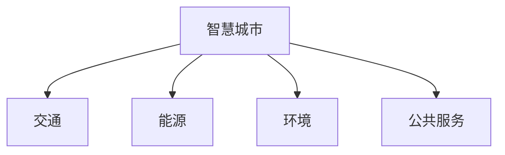

                 

**AI与人类计算：打造可持续发展的城市规划**

> 关键词：城市规划、人工智能、可持续发展、智慧城市、数据驱动、算法、数学模型、项目实践

## 1. 背景介绍

当前，世界正面临着快速城市化的挑战。联合国预计，到2050年，全球将有68%的人口生活在城市地区。如何打造可持续发展的城市，是当今世界面临的重大挑战之一。人工智能（AI）和数据驱动的决策正在改变城市规划的方式，为我们提供了新的工具和方法来应对这些挑战。

## 2. 核心概念与联系

### 2.1 智慧城市

智慧城市是指利用信息和通信技术（ICT）来改善城市运作和生活质量的城市。它涉及多个领域，包括交通、能源、环境、公共服务等。



### 2.2 数据驱动的决策

数据驱动的决策是指使用数据和分析来指导决策过程。在城市规划中，这意味着使用来自各种来源的数据（如传感器、社交媒体、公共数据集）来指导决策。

## 3. 核心算法原理 & 具体操作步骤

### 3.1 算法原理概述

在城市规划中，常用的算法包括回归算法、聚类算法、预测算法等。这些算法可以帮助我们理解城市系统的复杂性，并预测未来的发展趋势。

### 3.2 算法步骤详解

以预测算法为例，其步骤通常包括：

1. 数据收集：收集与城市相关的数据，如人口、交通、环境等。
2. 数据预处理：清洗数据，处理缺失值，进行特征工程。
3. 模型选择：选择合适的预测模型，如线性回归、决策树、神经网络等。
4. 模型训练：使用历史数据训练模型。
5. 模型评估：评估模型的性能，如准确率、精确度、召回率等。
6. 预测：使用训练好的模型预测未来的发展趋势。

### 3.3 算法优缺点

优点：可以帮助我们理解复杂系统，预测未来趋势，支持数据驱动的决策。

缺点：可能会受到数据质量的影响，模型的复杂性可能会导致解释性降低。

### 3.4 算法应用领域

算法在城市规划中的应用领域包括交通管理、能源优化、环境监测、公共服务优化等。

## 4. 数学模型和公式 & 详细讲解 & 举例说明

### 4.1 数学模型构建

在城市规划中，常用的数学模型包括交通流模型、能源模型、环境模型等。这些模型可以帮助我们理解城市系统的复杂性，并预测未来的发展趋势。

### 4.2 公式推导过程

以交通流模型为例，其公式推导过程如下：

1. 定义交通流密度 $\rho(x,t)$ 为单位长度内的车辆数量。
2. 定义车速 $v(x,t)$ 为车辆的平均速度。
3. 定义交通流 $q(x,t)$ 为单位时间内通过位置 $x$ 的车辆数量。
4. 根据定义，我们有 $q(x,t) = \rho(x,t) \cdot v(x,t)$。
5. 根据保守法则，我们有 $\frac{\partial \rho}{\partial t} + \frac{\partial q}{\partial x} = 0$。
6. 将上述公式组合，我们得到 $q(x,t) = \rho(x,t) \cdot v(x,t) = \rho(x,t) \cdot \left(1 - \frac{\rho(x,t)}{\rho_{\text{max}}(x)}\right) v_{\text{max}}(x)$，其中 $\rho_{\text{max}}(x)$ 是位置 $x$ 的最大交通流密度， $v_{\text{max}}(x)$ 是位置 $x$ 的最大车速。

### 4.3 案例分析与讲解

例如，我们可以使用交通流模型来预测交通拥堵的情况。通过输入当前的交通流密度和车速，我们可以预测未来的交通流密度和车速。如果预测的交通流密度接近最大交通流密度，则可能会出现交通拥堵。

## 5. 项目实践：代码实例和详细解释说明

### 5.1 开发环境搭建

在开始项目实践之前，我们需要搭建开发环境。推荐使用Python作为编程语言，并安装必要的库，如NumPy、Pandas、Matplotlib、Scikit-learn等。

### 5.2 源代码详细实现

以下是使用Scikit-learn实现线性回归预测交通流密度的示例代码：

```python
import numpy as np
import pandas as pd
from sklearn.model_selection import train_test_split
from sklearn.linear_model import LinearRegression
from sklearn.metrics import mean_squared_error

# 加载数据
data = pd.read_csv('traffic_data.csv')

# 定义特征和目标变量
X = data[['temperature', 'humidity', 'wind_speed']]
y = data['traffic_density']

# 分割数据集
X_train, X_test, y_train, y_test = train_test_split(X, y, test_size=0.2, random_state=42)

# 创建并训练模型
model = LinearRegression()
model.fit(X_train, y_train)

# 预测交通流密度
y_pred = model.predict(X_test)

# 评估模型
mse = mean_squared_error(y_test, y_pred)
print(f'Mean Squared Error: {mse}')
```

### 5.3 代码解读与分析

在上述代码中，我们首先加载交通数据集，然后定义特征和目标变量。我们使用线性回归模型来预测交通流密度，并评估模型的性能。

### 5.4 运行结果展示

运行上述代码后，我们可以看到模型的均方误差（Mean Squared Error，MSE）。MSE越小，模型的性能越好。

## 6. 实际应用场景

### 6.1 城市交通管理

在城市交通管理中，我们可以使用预测算法来预测交通拥堵的情况，并提供实时路线导航服务。我们还可以使用交通流模型来优化交通信号灯的时长，减少交通拥堵。

### 6.2 能源优化

在能源优化中，我们可以使用预测算法来预测能源需求，并优化能源供应。我们还可以使用能源模型来优化能源系统的布局，减少能源损耗。

### 6.3 环境监测

在环境监测中，我们可以使用预测算法来预测空气质量，并提供实时空气质量信息。我们还可以使用环境模型来优化环境系统的布局，减少环境污染。

### 6.4 未来应用展望

未来，AI和数据驱动的决策将继续改变城市规划的方式。我们可以期待更先进的算法和模型，更丰富的数据来源，更智能的城市系统。

## 7. 工具和资源推荐

### 7.1 学习资源推荐

推荐阅读以下书籍和论文：

* 书籍：《智慧城市：数据驱动的城市规划》作者：Anthony M. Townsend
* 论文：《数据驱动的城市规划：挑战和机遇》作者：Stephen Marshall, et al.

### 7.2 开发工具推荐

推荐使用以下开发工具：

* Python：一个强大的编程语言，广泛用于数据分析和机器学习。
* Jupyter Notebook：一个交互式计算环境，支持Python和其他编程语言。
* QGIS：一个开源的地理信息系统软件，用于处理和分析地理数据。

### 7.3 相关论文推荐

推荐阅读以下论文：

* 《使用机器学习预测交通拥堵》作者：Yanfeng Ouyang, et al.
* 《数据驱动的能源系统优化》作者：Jingjing Zhang, et al.
* 《使用机器学习预测空气质量》作者：Xiaohua Tong, et al.

## 8. 总结：未来发展趋势与挑战

### 8.1 研究成果总结

本文介绍了AI和数据驱动的决策在城市规划中的应用。我们讨论了智慧城市的概念，数据驱动的决策的原理，常用的算法和模型，项目实践，实际应用场景，工具和资源推荐。

### 8.2 未来发展趋势

未来，AI和数据驱动的决策将继续改变城市规划的方式。我们可以期待更先进的算法和模型，更丰富的数据来源，更智能的城市系统。

### 8.3 面临的挑战

然而，我们也面临着挑战。数据质量是一个关键问题，如果数据不准确或不完整，则模型的性能会受到影响。隐私保护也是一个关键问题，我们需要确保数据的使用不会侵犯个人隐私。

### 8.4 研究展望

未来的研究方向包括：

* 更先进的算法和模型，如深度学习、强化学习等。
* 更丰富的数据来源，如物联网、社交媒体等。
* 更智能的城市系统，如自动驾驶汽车、智能能源系统等。

## 9. 附录：常见问题与解答

**Q1：什么是智慧城市？**

A1：智慧城市是指利用信息和通信技术（ICT）来改善城市运作和生活质量的城市。

**Q2：数据驱动的决策是什么意思？**

A2：数据驱动的决策是指使用数据和分析来指导决策过程。

**Q3：什么是预测算法？**

A3：预测算法是一种用于预测未来趋势的算法。

**Q4：什么是交通流模型？**

A4：交通流模型是一种用于描述和预测交通流的数学模型。

**Q5：什么是均方误差（MSE）？**

A5：均方误差（Mean Squared Error，MSE）是一种评估模型性能的指标，它衡量预测值和实际值之间的差异。

## 作者：禅与计算机程序设计艺术 / Zen and the Art of Computer Programming

