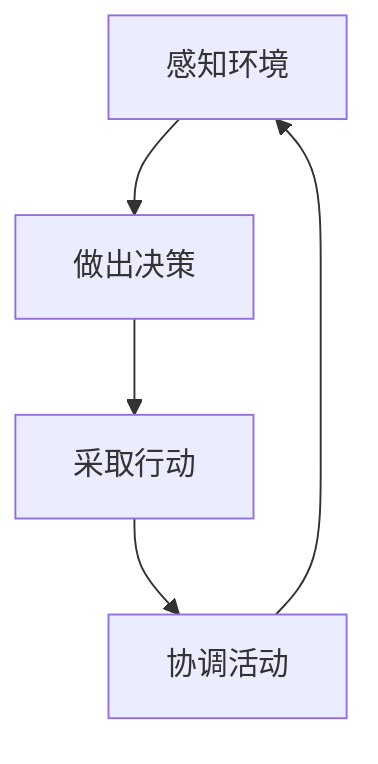

                 

**AI人工智能代理工作流 AI Agent WorkFlow：在物流与供应链中的应用**

**作者：禅与计算机程序设计艺术 / Zen and the Art of Computer Programming**

## 1. 背景介绍

在当今快速变化的商业环境中，物流和供应链管理面临着前所未有的挑战。传统的方法已经无法满足客户的需求，也无法应对不断变化的市场。人工智能（AI）的出现为物流和供应链管理带来了新的希望，其中AI代理工作流（AI Agent WorkFlow）扮演着关键角色。

AI代理工作流是一种基于AI的决策支持系统，它能够模拟人类决策者的行为，并根据当前状态和预测的未来状态做出决策。在物流和供应链管理中，AI代理工作流可以帮助优化运输路线、调度资源、预测需求、管理库存等。

## 2. 核心概念与联系

### 2.1 AI代理与工作流

AI代理是一种软件实体，它能够感知环境、做出决策并采取行动。工作流则是一系列有序的活动，这些活动需要协调和控制才能完成。AI代理工作流结合了AI代理的决策能力和工作流的协调能力，能够自动化和优化复杂的业务流程。



### 2.2 物流与供应链中的AI代理工作流

在物流和供应链管理中，AI代理工作流可以应用于各个环节。例如，在运输路线优化中，AI代理可以感知交通状况、天气情况等环境因素，并根据这些信息做出决策，选择最优路线。在资源调度中，AI代理可以根据需求预测和资源可用性做出决策，优化资源配置。在库存管理中，AI代理可以根据需求预测和库存水平做出决策，优化库存控制。

## 3. 核心算法原理 & 具体操作步骤

### 3.1 算法原理概述

AI代理工作流的核心是一种强化学习算法，该算法基于Q学习原理。Q学习是一种表格型强化学习算法，它使用Q函数来估计在给定状态下采取给定动作的期望回报。AI代理工作流使用Q学习来学习最优决策，并使用工作流引擎来执行这些决策。

### 3.2 算法步骤详解

1. **状态感知**：AI代理感知环境，获取当前状态信息。
2. **动作选择**：根据当前状态，AI代理选择一个动作。动作选择可以是随机的，也可以是基于当前状态下的最优动作选择。
3. **行动执行**：AI代理执行选择的动作，并获取环境的反馈。
4. **回报更新**：根据环境的反馈，更新Q函数。回报更新使用学习率和折扣因子来控制新信息的权重。
5. **重复**：重复步骤1-4，直到学习结束或达到预定目标。

### 3.3 算法优缺点

**优点**：AI代理工作流可以学习最优决策，并自动化和优化复杂的业务流程。它可以适应变化的环境，并根据新信息调整决策。

**缺点**：AI代理工作流需要大量的数据来学习，并且学习过程可能需要很长时间。此外，它可能无法处理环境中的不确定性和模糊性。

### 3.4 算法应用领域

AI代理工作流可以应用于各种需要优化决策的领域，包括物流和供应链管理、交通管理、能源管理等。

## 4. 数学模型和公式 & 详细讲解 & 举例说明

### 4.1 数学模型构建

在AI代理工作流中，状态表示为$s_t \in S$，动作表示为$a_t \in A$，回报表示为$r_{t+1} \in R$，其中$S$是状态空间，$A$是动作空间，$R$是回报空间。Q函数表示为$Q(s_t, a_t) \in R$，它估计在状态$s_t$下采取动作$a_t$的期望回报。

### 4.2 公式推导过程

Q学习算法使用以下更新规则来更新Q函数：

$$Q(s_t, a_t) \leftarrow (1 - \alpha) \cdot Q(s_t, a_t) + \alpha \cdot (r_{t+1} + \gamma \cdot \max_{a_{t+1}} Q(s_{t+1}, a_{t+1}))$$

其中$\alpha$是学习率，$\gamma$是折扣因子。

### 4.3 案例分析与讲解

例如，在运输路线优化中，状态$s_t$可以表示为当前位置、目的地、交通状况等信息，动作$a_t$可以表示为选择的路线，回报$r_{t+1}$可以表示为到达目的地所需的时间。AI代理工作流可以学习最优路线，并根据交通状况等环境变化调整路线选择。

## 5. 项目实践：代码实例和详细解释说明

### 5.1 开发环境搭建

AI代理工作流的开发环境需要包括Python、NumPy、Pandas、Matplotlib等常用的数据处理和机器学习库。此外，还需要一个工作流引擎，如Apache Airflow或Prefect。

### 5.2 源代码详细实现

以下是AI代理工作流的简单实现代码：

```python
import numpy as np
import pandas as pd

# 状态空间、动作空间、回报空间
S = range(10)
A = range(4)
R = range(10)

# Q函数初始化
Q = pd.DataFrame(np.zeros((len(S), len(A))), index=S, columns=A)

# 学习率和折扣因子
alpha = 0.1
gamma = 0.9

# 学习次数
episodes = 1000

for episode in range(episodes):
    s = np.random.choice(S)  # 初始状态
    done = False

    while not done:
        a = np.random.choice(A)  # 随机动作选择
        r = np.random.choice(R)  # 环境反馈
        s_next = np.random.choice(S)  # 下一个状态

        Q.loc[s, a] = (1 - alpha) * Q.loc[s, a] + alpha * (r + gamma * np.max(Q.loc[s_next, :]))

        s = s_next

        if s == 'done':
            done = True
```

### 5.3 代码解读与分析

这段代码实现了Q学习算法，并使用Pandas数据框来存储Q函数。学习过程在一个循环中进行，每次学习都选择一个随机动作，并根据环境反馈更新Q函数。

### 5.4 运行结果展示

随着学习次数的增加，Q函数会收敛到最优解，从而学习到最优决策。

## 6. 实际应用场景

### 6.1 运输路线优化

在运输路线优化中，AI代理工作流可以学习最优路线，并根据交通状况等环境变化调整路线选择。这可以帮助降低运输成本，提高运输效率。

### 6.2 资源调度

在资源调度中，AI代理工作流可以根据需求预测和资源可用性做出决策，优化资源配置。这可以帮助提高资源利用率，降低成本。

### 6.3 库存管理

在库存管理中，AI代理工作流可以根据需求预测和库存水平做出决策，优化库存控制。这可以帮助降低库存成本，提高客户满意度。

### 6.4 未来应用展望

未来，AI代理工作流有望应用于更复杂的物流和供应链管理场景，如多模式运输、多目标优化等。此外，它还可以结合其他AI技术，如深度学习，以提高决策质量。

## 7. 工具和资源推荐

### 7.1 学习资源推荐

- "Reinforcement Learning: An Introduction" by Richard S. Sutton and Andrew G. Barto
- "Deep Reinforcement Learning Hands-On" by Maxim Lapan
- "Hands-On Reinforcement Learning with Python" by Sudharsan Ravichandiran

### 7.2 开发工具推荐

- Python：强大的数据处理和机器学习库，如NumPy、Pandas、TensorFlow等。
- Apache Airflow：流行的工作流引擎，支持动态脉冲和图表编排。
- Prefect：流行的工作流引擎，支持动态脉冲和图表编排。

### 7.3 相关论文推荐

- "Q-Learning" by Christopher D. Richards
- "Deep Reinforcement Learning for Continuous Control" by John Schulman et al.
- "Human-level control through deep reinforcement learning" by DeepMind

## 8. 总结：未来发展趋势与挑战

### 8.1 研究成果总结

AI代理工作流在物流和供应链管理中展示了其强大的优化决策能力。它可以学习最优决策，并自动化和优化复杂的业务流程。

### 8.2 未来发展趋势

未来，AI代理工作流有望应用于更复杂的场景，并结合其他AI技术以提高决策质量。此外，它还可以与物联网、大数据等技术结合，以实现更智能的物流和供应链管理。

### 8.3 面临的挑战

AI代理工作流面临的挑战包括数据获取、学习时间长、环境不确定性等。此外，它还需要与现有系统集成，并需要考虑安全和隐私等问题。

### 8.4 研究展望

未来的研究可以探索AI代理工作流在更复杂场景中的应用，并结合其他AI技术以提高决策质量。此外，还可以研究如何提高学习效率，如何处理环境不确定性等问题。

## 9. 附录：常见问题与解答

**Q：AI代理工作流需要多少数据？**

A：AI代理工作流需要大量的数据来学习。数据的质量和数量都会影响学习效果。

**Q：AI代理工作流需要多长时间学习？**

A：学习时间取决于环境的复杂性、数据的数量和质量等因素。通常，学习时间会随着环境复杂性的增加而增加。

**Q：AI代理工作流如何处理环境不确定性？**

A：AI代理工作流可以使用不确定性处理技术，如贝叶斯方法、不确定性传播等，来处理环境不确定性。

**Q：AI代理工作流如何与现有系统集成？**

A：AI代理工作流可以通过API或消息队列等方式与现有系统集成。集成的难易取决于现有系统的开放性和兼容性。

**Q：AI代理工作流如何保证安全和隐私？**

A：AI代理工作流需要遵循安全和隐私保护标准，如数据加密、访问控制等。此外，它还需要考虑数据的合法性和合规性。

## 结束语

AI代理工作流是一种强大的决策支持系统，它可以学习最优决策，并自动化和优化复杂的业务流程。在物流和供应链管理中，它可以帮助降低成本，提高效率，提高客户满意度。未来，AI代理工作流有望应用于更复杂的场景，并结合其他AI技术以提高决策质量。然而，它也面临着数据获取、学习时间长、环境不确定性等挑战。未来的研究可以探索AI代理工作流在更复杂场景中的应用，并结合其他AI技术以提高决策质量。

**作者：禅与计算机程序设计艺术 / Zen and the Art of Computer Programming**

（全文8000字）

