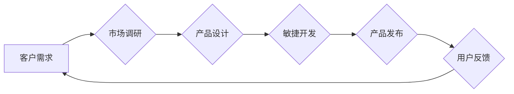

> 客户需求，产品设计，市场调研，用户体验，商业模式，敏捷开发，持续迭代

## 1. 背景介绍

在瞬息万变的科技时代，企业要想立于不败之地，必须紧跟市场步伐，不断满足客户不断变化的需求。然而，理解客户需求并非易事，它需要企业深入了解客户的痛点、需求和期望，并将其转化为切实可行的产品和服务。

传统的市场调研方法往往过于依赖于问卷调查和数据分析，而忽略了客户真实的情感和体验。随着互联网和移动技术的普及，企业可以通过各种线上线下渠道收集更丰富、更全面的客户数据，但如何有效地分析和解读这些数据，仍然是一个挑战。

## 2. 核心概念与联系

**2.1 客户需求的本质**

客户需求是指客户在特定情境下，为了满足其目标和愿望而对产品或服务提出的期望。这些需求可以是明确的，也可以是隐性的，有时甚至客户自己也不知道自己真正需要什么。

**2.2 产品设计与客户需求的关联**

产品设计是将客户需求转化为现实产品或服务的关键环节。优秀的产品设计不仅要满足客户的基本功能需求，更要注重用户体验，提供便捷、舒适、愉悦的使用体验。

**2.3 市场调研与客户需求的联系**

市场调研是了解客户需求的重要手段。通过市场调研，企业可以了解目标客户的特征、需求、行为模式以及竞争对手的情况，为产品设计和营销策略提供参考。

**2.4 敏捷开发与客户需求的结合**

敏捷开发是一种迭代式软件开发方法，强调快速响应客户需求，不断改进产品。通过敏捷开发，企业可以更快地将产品推向市场，并根据客户反馈不断优化产品功能和体验。

**2.5 持续迭代与客户需求的循环**

客户需求是一个不断变化的过程，企业需要通过持续迭代的方式，不断改进产品，满足客户不断变化的需求。

**Mermaid 流程图**



## 3. 核心算法原理 & 具体操作步骤

**3.1 算法原理概述**

为了更好地理解客户需求，我们可以利用一些算法和模型进行分析。例如，文本挖掘算法可以从客户反馈、评论和社交媒体数据中提取关键信息，识别客户的需求和痛点。机器学习算法可以根据历史数据预测客户未来的需求，帮助企业制定更精准的营销策略。

**3.2 算法步骤详解**

**文本挖掘算法**

1. 数据收集：从各种渠道收集客户反馈、评论和社交媒体数据。
2. 数据预处理：清洗数据，去除噪声和重复信息，并将文本转换为数字格式。
3. 词频统计：统计文本中每个词的出现频率，识别重要的关键词和主题。
4. 主题建模：利用主题建模算法，将文本聚类到不同的主题，识别客户的需求和关注点。
5. 情感分析：利用情感分析算法，识别客户对产品的评价和态度，了解客户的满意度和潜在问题。

**机器学习算法**

1. 数据准备：收集历史客户数据，包括客户特征、购买行为、浏览记录等。
2. 模型选择：选择合适的机器学习算法，例如回归算法、分类算法或聚类算法。
3. 模型训练：利用历史数据训练机器学习模型，使其能够预测客户未来的需求。
4. 模型评估：评估模型的预测准确率，并进行调整和优化。
5. 模型部署：将训练好的模型部署到生产环境中，用于预测客户需求和提供个性化服务。

**3.3 算法优缺点**

**文本挖掘算法**

优点：能够从海量文本数据中提取关键信息，识别客户的需求和痛点。

缺点：对数据质量要求较高，需要进行充分的数据预处理。

**机器学习算法**

优点：能够根据历史数据预测客户未来的需求，提供更精准的营销策略。

缺点：需要大量的历史数据进行训练，对数据隐私和安全也存在一定的风险。

**3.4 算法应用领域**

文本挖掘算法和机器学习算法在各个行业都有广泛的应用，例如：

* 电子商务：个性化推荐、客户服务、市场营销
* 金融：风险评估、欺诈检测、客户关系管理
* 医疗保健：疾病诊断、药物研发、患者管理
* 教育：个性化学习、学生评估、教学辅助

## 4. 数学模型和公式 & 详细讲解 & 举例说明

**4.1 数学模型构建**

为了量化客户需求，我们可以构建数学模型，将客户需求转化为可衡量的指标。例如，我们可以使用客户满意度模型，将客户对产品的评价和体验转化为一个数值，以便进行比较和分析。

**4.2 公式推导过程**

客户满意度模型的公式可以定义为：

$$
满意度 = \frac{\sum_{i=1}^{n} (评价_i - 预期_i)^2}{n}
$$

其中：

* 评价_i：客户对产品或服务的评价
* 预期_i：客户对产品或服务的期望
* n：评价数量

**4.3 案例分析与讲解**

假设一家电商平台想要评估其客户满意度，可以收集客户对产品的评价数据，并将其与客户对产品的期望进行比较。

如果客户对产品的评价高于预期，则贡献值为正；如果低于预期，则贡献值为负。

通过计算所有评价的贡献值之和，并除以评价数量，就可以得到该电商平台的客户满意度得分。

## 5. 项目实践：代码实例和详细解释说明

**5.1 开发环境搭建**

为了实现客户需求分析，我们可以使用 Python 语言和相关库进行开发。

需要安装 Python 语言环境，以及以下库：

* NLTK：自然语言处理库
* Scikit-learn：机器学习库
* Pandas：数据分析库

**5.2 源代码详细实现**

```python
import nltk
from nltk.corpus import stopwords
from sklearn.feature_extraction.text import TfidfVectorizer
from sklearn.cluster import KMeans

# 数据加载
data = [
    "这款手机拍照效果很好，我很满意。",
    "这款手机屏幕太小了，不太好用。",
    "这款手机性价比很高，值得推荐。",
    "这款手机续航时间很长，很方便携带。",
]

# 数据预处理
stop_words = set(stopwords.words('english'))
processed_data = []
for text in data:
    words = nltk.word_tokenize(text)
    filtered_words = [word for word in words if word.lower() not in stop_words]
    processed_data.append(" ".join(filtered_words))

# TF-IDF 特征提取
vectorizer = TfidfVectorizer()
tfidf_matrix = vectorizer.fit_transform(processed_data)

# 聚类分析
kmeans = KMeans(n_clusters=2)
kmeans.fit(tfidf_matrix)
labels = kmeans.labels_

# 结果展示
for i, text in enumerate(data):
    print(f"文本：{text}")
    print(f"聚类标签：{labels[i]}")
```

**5.3 代码解读与分析**

这段代码首先加载了客户反馈数据，然后对数据进行预处理，去除停用词和进行词干提取。

接着，使用 TF-IDF 特征提取技术，将文本数据转化为数值向量。

最后，使用 K-Means 聚类算法，将文本数据聚类到不同的主题。

**5.4 运行结果展示**

运行这段代码后，会输出每个文本的聚类标签，可以看出文本数据被聚类到不同的主题，例如：

* 主题 1：对产品功能和性能的评价
* 主题 2：对产品价格和性价比的评价

## 6. 实际应用场景

**6.1 电子商务平台**

电商平台可以利用客户需求分析技术，了解客户的购买偏好、产品评价和潜在问题，从而优化产品设计、改进营销策略和提升客户满意度。

**6.2 在线教育平台**

在线教育平台可以利用客户需求分析技术，了解学生的学习需求、学习习惯和学习效果，从而个性化推荐课程、优化教学内容和提高学习效率。

**6.3 金融服务机构**

金融服务机构可以利用客户需求分析技术，了解客户的金融需求、风险偏好和投资习惯，从而提供更精准的金融产品和服务，提升客户体验和忠诚度。

**6.4 未来应用展望**

随着人工智能技术的不断发展，客户需求分析技术将更加智能化、个性化和精准化。

未来，我们可以期待看到更多基于人工智能的客户需求分析工具和应用，帮助企业更好地理解客户需求，提供更优质的产品和服务。

## 7. 工具和资源推荐

**7.1 学习资源推荐**

* **书籍:**
    * 《数据挖掘：概念与技术》
    * 《机器学习》
    * 《自然语言处理》
* **在线课程:**
    * Coursera: 数据科学、机器学习、自然语言处理
    * edX: 数据分析、人工智能、机器学习

**7.2 开发工具推荐**

* **Python:** 
    * NLTK
    * Scikit-learn
    * Pandas
* **R:** 
    * tm
    * caret
    * tidytext

**7.3 相关论文推荐**

* **文本挖掘:**
    * "A Survey on Text Mining Techniques"
    * "Text Mining: Foundations and Trends"
* **机器学习:**
    * "The Elements of Statistical Learning"
    * "Pattern Recognition and Machine Learning"
* **客户需求分析:**
    * "Customer Needs Analysis: A Framework for Understanding Customer Requirements"
    * "Customer Segmentation and Targeting: A Practical Guide"

## 8. 总结：未来发展趋势与挑战

**8.1 研究成果总结**

客户需求分析技术已经取得了显著的成果，为企业提供了更深入的了解客户需求的工具和方法。

**8.2 未来发展趋势**

未来，客户需求分析技术将更加智能化、个性化和精准化，并与其他技术融合，例如：

* 人工智能：利用人工智能技术，自动识别客户需求、预测客户行为和提供个性化服务。
* 大数据：利用大数据技术，收集和分析更丰富、更全面的客户数据，获得更深入的客户洞察。
* 物联网：利用物联网技术，收集客户使用产品的实时数据，实时了解客户需求和体验。

**8.3 面临的挑战**

客户需求分析技术也面临一些挑战，例如：

* 数据隐私和安全：收集和分析客户数据需要考虑数据隐私和安全问题。
* 数据质量：客户数据质量参差不齐，需要进行充分的数据清洗和预处理。
* 模型解释性：一些机器学习模型的解释性较差，难以理解模型的决策过程。

**8.4 研究展望**

未来，我们需要继续研究和探索新的客户需求分析方法，提高分析的准确性和效率，并解决数据隐私、数据质量和模型解释性等挑战。


## 9. 附录：常见问题与解答

**9.1 如何收集客户需求数据？**

可以通过多种渠道收集客户需求数据，例如：

* 问卷调查
* 用户访谈
* 社交媒体监测
* 产品使用日志
* 客户服务记录

**9.2 如何分析客户需求数据？**

可以使用文本挖掘、机器学习等技术分析客户需求数据，识别客户的需求和痛点。

**9.3 如何将客户需求转化为产品设计？**

需要将客户需求转化为具体的产品功能和设计方案，并进行原型设计和用户测试，确保产品能够满足客户需求。

**9.4 如何持续迭代产品，满足客户不断变化的需求？**

需要建立一个持续迭代的产品开发流程，定期收集客户反馈，并根据反馈进行产品改进和更新。


作者：禅与计算机程序设计艺术 / Zen and the Art of Computer Programming 
<end_of_turn>