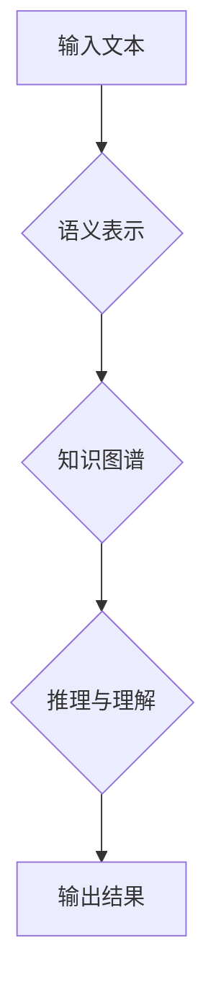

> 零样本学习，通用语言理解，评估指标，自然语言处理，人工智能

## 1. 背景介绍

近年来，深度学习在自然语言处理 (NLP) 领域取得了显著进展，例如机器翻译、文本摘要和问答系统等任务都取得了突破性进展。然而，这些模型通常需要大量的标注数据进行训练，这在现实世界中往往难以获得。零样本学习 (Zero-Shot Learning) 作为一种新兴的学习范式，旨在让模型能够在没有见过特定任务样本的情况下，直接进行预测。

零样本条件下的通用语言理解 (Zero-Shot General Language Understanding) 旨在构建能够理解和生成人类语言的模型，即使这些模型从未见过特定任务的训练数据。这对于推动人工智能的通用性发展具有重要意义。

## 2. 核心概念与联系

**2.1 零样本学习 (Zero-Shot Learning)**

零样本学习是指模型在没有见过特定任务样本的情况下，能够直接进行预测。它依赖于模型对知识的抽象表示和泛化能力。

**2.2 通用语言理解 (General Language Understanding)**

通用语言理解是指模型能够理解和生成人类语言的复杂结构和语义，并能够在各种不同的语言任务中进行有效地应用。

**2.3 核心概念联系**

零样本学习和通用语言理解是相互关联的。通过零样本学习，我们可以构建能够理解和生成人类语言的模型，即使这些模型从未见过特定任务的训练数据。这对于实现通用语言理解具有重要意义。

**2.4 Mermaid 流程图**



## 3. 核心算法原理 & 具体操作步骤

**3.1 算法原理概述**

零样本条件下的通用语言理解通常依赖于以下核心算法：

* **嵌入式表示学习:** 将文本转换为向量表示，捕捉文本的语义信息。
* **知识图谱:** 建立一个包含实体、关系和属性的知识图谱，用于存储和推理知识。
* **迁移学习:** 利用预训练模型的知识，迁移到新的任务中。

**3.2 算法步骤详解**

1. **文本预处理:** 对输入文本进行清洗、分词、词性标注等预处理操作。
2. **嵌入式表示学习:** 使用预训练语言模型 (例如 BERT、GPT-3) 将文本转换为向量表示。
3. **知识图谱构建:** 利用文本信息构建知识图谱，包含实体、关系和属性。
4. **推理与理解:** 利用知识图谱和嵌入式表示，进行推理和理解，生成最终结果。

**3.3 算法优缺点**

* **优点:**
    * 不需要大量标注数据。
    * 能够泛化到新的任务和领域。
* **缺点:**
    * 依赖于高质量的知识图谱和预训练模型。
    * 对于复杂的任务，理解能力可能有限。

**3.4 算法应用领域**

* **问答系统:** 回答用户提出的问题，即使问题从未见过。
* **文本分类:** 将文本分类到不同的类别，即使类别从未见过。
* **文本摘要:** 生成文本的简洁摘要，即使摘要内容从未见过。

## 4. 数学模型和公式 & 详细讲解 & 举例说明

**4.1 数学模型构建**

零样本条件下的通用语言理解模型通常基于 Transformer 架构，其核心是注意力机制。注意力机制允许模型关注输入文本中与当前任务相关的部分，从而提高理解能力。

**4.2 公式推导过程**

注意力机制的计算公式如下：

$$
Attention(Q, K, V) = softmax(\frac{QK^T}{\sqrt{d_k}})V
$$

其中：

* $Q$：查询矩阵
* $K$：键矩阵
* $V$：值矩阵
* $d_k$：键向量的维度
* $softmax$：softmax 函数

**4.3 案例分析与讲解**

例如，在问答系统中，输入文本为问题和上下文，查询矩阵 $Q$ 为问题向量，键矩阵 $K$ 为上下文向量，值矩阵 $V$ 为上下文信息。注意力机制会计算每个上下文向量与问题向量的相关性，并根据相关性权重加权求和，得到最终的上下文表示。

## 5. 项目实践：代码实例和详细解释说明

**5.1 开发环境搭建**

* Python 3.7+
* PyTorch 1.7+
* Transformers 4.0+

**5.2 源代码详细实现**

```python
from transformers import AutoModelForQuestionAnswering, AutoTokenizer

# 加载预训练模型和分词器
model_name = "bert-base-uncased"
model = AutoModelForQuestionAnswering.from_pretrained(model_name)
tokenizer = AutoTokenizer.from_pretrained(model_name)

# 输入文本
question = "What is the capital of France?"
context = "France is a country in Europe. Its capital is Paris."

# 将文本转换为模型输入格式
inputs = tokenizer(question, context, return_tensors="pt")

# 进行推理
outputs = model(**inputs)

# 获取答案
answer_start = outputs.start_logits.argmax().item()
answer_end = outputs.end_logits.argmax().item()
answer = tokenizer.decode(inputs["input_ids"][0][answer_start:answer_end+1])

# 打印答案
print(f"Answer: {answer}")
```

**5.3 代码解读与分析**

* 代码首先加载预训练的 BERT 模型和分词器。
* 然后将问题和上下文文本转换为模型输入格式。
* 模型进行推理，并输出答案的起始和结束位置。
* 最后，使用分词器将答案从模型输出的 token 序列解码成文本。

**5.4 运行结果展示**

```
Answer: Paris
```

## 6. 实际应用场景

零样本条件下的通用语言理解在以下场景中具有广泛的应用前景：

* **智能客服:** 能够理解用户的问题，并提供准确的答案，即使问题从未见过。
* **个性化教育:** 根据学生的学习情况，提供个性化的学习内容和建议。
* **医疗诊断:** 辅助医生进行诊断，并提供相关信息。

**6.4 未来应用展望**

随着人工智能技术的不断发展，零样本条件下的通用语言理解将更加成熟，并应用于更多领域，例如：

* **跨语言理解:** 能够理解不同语言的文本，促进跨文化交流。
* **情感分析:** 能够识别文本中的情感，用于市场营销和用户体验分析。
* **代码生成:** 能够根据自然语言描述生成代码，提高软件开发效率。

## 7. 工具和资源推荐

**7.1 学习资源推荐**

* **书籍:**
    * 《深度学习》
    * 《自然语言处理》
* **在线课程:**
    * Coursera: 自然语言处理
    * edX: 深度学习

**7.2 开发工具推荐**

* **PyTorch:** 深度学习框架
* **Transformers:** 预训练模型库
* **HuggingFace:** 预训练模型平台

**7.3 相关论文推荐**

* **BERT: Pre-training of Deep Bidirectional Transformers for Language Understanding**
* **GPT-3: Language Models are Few-Shot Learners**
* **Zero-Shot Learning with Language Models**

## 8. 总结：未来发展趋势与挑战

**8.1 研究成果总结**

零样本条件下的通用语言理解取得了显著进展，但仍然面临着许多挑战。

**8.2 未来发展趋势**

* **模型规模和能力的提升:** 构建更强大、更通用的语言模型。
* **知识图谱的完善:** 建立更丰富、更准确的知识图谱。
* **多模态理解:** 将文本理解与其他模态 (例如图像、音频) 的理解结合起来。

**8.3 面临的挑战**

* **数据稀缺性:** 零样本学习需要大量的标注数据，而现实世界中数据往往稀缺。
* **模型解释性:** 现有的语言模型难以解释其决策过程，这限制了其在安全和可靠性要求高的领域中的应用。
* **伦理问题:** 语言模型可能被用于生成虚假信息或进行恶意攻击，需要关注其伦理问题。

**8.4 研究展望**

未来，零样本条件下的通用语言理解将继续是一个重要的研究方向，需要探索新的算法、模型和数据资源，以构建更强大、更安全、更可靠的语言模型。

## 9. 附录：常见问题与解答

**9.1 什么是零样本学习？**

零样本学习是指模型在没有见过特定任务样本的情况下，能够直接进行预测。

**9.2 零样本条件下的通用语言理解有什么应用场景？**

零样本条件下的通用语言理解在智能客服、个性化教育、医疗诊断等场景中具有广泛的应用前景。

**9.3 如何构建零样本条件下的通用语言理解模型？**

构建零样本条件下的通用语言理解模型通常依赖于嵌入式表示学习、知识图谱和迁移学习等技术。

作者：禅与计算机程序设计艺术 / Zen and the Art of Computer Programming


<end_of_turn>