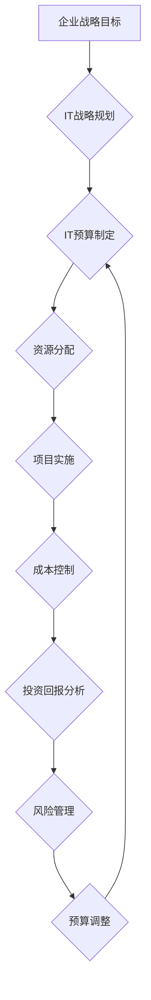

> IT预算，资源分配，成本控制，投资回报，风险管理，财务规划，IT战略

## 1. 背景介绍

在当今数字化时代，信息技术 (IT) 已成为企业核心竞争力的关键驱动力。IT系统和解决方案的不断发展和演进，为企业带来了前所未有的机遇和挑战。然而，IT投资的规模不断扩大，如何有效地管理IT预算，确保资源得到高效分配，并最终将IT投资转化为企业价值，成为企业管理者面临的重大课题。

传统的IT预算管理方式往往过于僵化和被动，难以适应快速变化的市场环境和业务需求。随着云计算、大数据、人工智能等新兴技术的兴起，IT预算管理面临着新的挑战和机遇。企业需要采用更加灵活、智能、数据驱动的IT预算管理方法，以更好地应对未来发展挑战。

## 2. 核心概念与联系

IT预算管理的核心概念包括：

* **IT预算:** 指企业在特定时间段内用于IT系统、软件、硬件、人员等方面的资金计划。
* **资源分配:** 指根据企业战略目标和业务需求，合理分配IT资源，包括资金、人员、技术等。
* **成本控制:** 指通过制定预算、监控支出、优化资源配置等措施，有效控制IT成本。
* **投资回报:** 指IT投资带来的经济效益和非经济效益的衡量指标。
* **风险管理:** 指识别、评估和控制IT投资带来的潜在风险。

IT预算管理是一个系统工程，涉及到多个方面，需要各个部门和人员的协作和配合。

**Mermaid 流程图:**



## 3. 核心算法原理 & 具体操作步骤

IT预算管理中，并没有特定的算法，而是需要结合多种方法和工具，进行分析、预测和决策。

### 3.1  算法原理概述

IT预算管理的核心在于：

* **数据驱动:** 基于历史数据、市场趋势和业务需求，进行科学的预算预测和分析。
* **成本效益分析:** 评估不同IT投资方案的成本效益，选择最优的投资方案。
* **风险管理:** 识别和控制IT投资带来的潜在风险，确保投资的安全性。

### 3.2  算法步骤详解

IT预算管理的具体步骤包括：

1. **需求分析:** 了解企业战略目标、业务需求和IT现状，明确IT预算的范围和目标。
2. **数据收集:** 收集历史IT支出数据、市场价格信息、业务发展趋势等数据。
3. **预算预测:** 利用数据分析和预测模型，预测未来IT支出需求。
4. **资源分配:** 根据预算预测和业务需求，合理分配IT资源，包括资金、人员、技术等。
5. **项目实施:** 实施IT项目，并进行成本监控和进度跟踪。
6. **成本控制:** 通过优化资源配置、控制支出、提高效率等措施，有效控制IT成本。
7. **投资回报分析:** 评估IT投资带来的经济效益和非经济效益，并进行投资回报率 (ROI) 计算。
8. **风险管理:** 识别和控制IT投资带来的潜在风险，制定风险应对计划。
9. **预算调整:** 根据实际情况和预算执行情况，及时调整预算，确保预算的有效性。

### 3.3  算法优缺点

IT预算管理方法的优缺点取决于具体的实施方案和企业情况。

**优点:**

* 数据驱动，决策更加科学和合理。
* 提高资源利用效率，降低IT成本。
* 增强IT投资的效益，提高企业竞争力。

**缺点:**

* 需要收集和分析大量数据，工作量较大。
* 预算预测存在一定的误差，需要不断调整和优化。
* 需要企业内部各部门的协作和配合，才能有效实施。

### 3.4  算法应用领域

IT预算管理方法广泛应用于各个行业和规模的企业，例如：

* **金融行业:** 管理银行、保险、证券等金融机构的IT预算。
* **制造业:** 管理制造企业的生产管理系统、供应链管理系统等IT预算。
* **零售业:** 管理零售企业的电子商务平台、会员管理系统等IT预算。
* **政府机构:** 管理政府部门的公共服务平台、行政管理系统等IT预算。

## 4. 数学模型和公式 & 详细讲解 & 举例说明

IT预算管理中，可以使用一些数学模型和公式来进行预算预测、成本分析和投资回报率计算。

### 4.1  数学模型构建

**1. 线性回归模型:** 用于预测未来IT支出，根据历史数据建立支出与时间的关系模型。

**公式:**

$$
y = a + bx
$$

其中：

* $y$ 为预测的未来IT支出
* $x$ 为时间变量
* $a$ 为截距
* $b$ 为斜率

**2. 指数增长模型:** 用于预测未来IT支出，假设IT支出以指数增长。

**公式:**

$$
y = a * e^{bx}
$$

其中：

* $y$ 为预测的未来IT支出
* $x$ 为时间变量
* $a$ 为初始支出
* $b$ 为增长率

**3. 投资回报率 (ROI) 模型:** 用于评估IT投资的效益。

**公式:**

$$
ROI = \frac{Net Profit}{Investment} * 100\%
$$

其中：

* $ROI$ 为投资回报率
* $Net Profit$ 为IT投资带来的净利润
* $Investment$ 为IT投资的总成本

### 4.2  公式推导过程

以上公式的推导过程可以参考相关数学和统计学书籍。

### 4.3  案例分析与讲解

**案例:** 假设一家公司计划投资一个新的CRM系统，总成本为100万元，预计每年可以节省5万元的运营成本，并带来10万元的新业务收入。

**ROI 计算:**

$$
ROI = \frac{100,000 - 50,000}{1,000,000} * 100\% = 5\%
$$

该案例表明，该CRM系统的投资回报率为5%，这是一个相对较低的回报率，需要进一步分析和评估。

## 5. 项目实践：代码实例和详细解释说明

IT预算管理的具体实施需要使用各种工具和软件，例如：

* **预算管理软件:** 用于制定、执行和监控IT预算。
* **成本控制软件:** 用于跟踪IT支出，识别成本浪费，并进行成本优化。
* **数据分析工具:** 用于收集和分析IT数据，进行预算预测和成本分析。

**代码实例:**

以下是一个简单的Python代码示例，用于计算IT投资的ROI：

```python
investment = 1000000  # IT投资总成本
annual_savings = 50000  # 预计每年节省的成本
annual_revenue = 100000  # 预计每年带来的新业务收入
years = 5  # 投资周期

net_profit = (annual_savings + annual_revenue) * years
roi = (net_profit / investment) * 100

print(f"投资回报率 (ROI): {roi:.2f}%")
```

**代码解读:**

该代码首先定义了IT投资的总成本、每年节省的成本、每年带来的新业务收入和投资周期。然后，计算了净利润和投资回报率。最后，打印出投资回报率。

## 6. 实际应用场景

IT预算管理在实际应用中，可以应用于以下场景：

* **IT项目投资决策:** 通过成本效益分析，评估不同IT项目投资的风险和回报，选择最优的投资方案。
* **IT资源分配:** 根据业务需求和预算限制，合理分配IT资源，确保资源得到有效利用。
* **成本控制:** 通过监控IT支出、优化资源配置等措施，有效控制IT成本。
* **风险管理:** 识别和控制IT投资带来的潜在风险，确保投资的安全性。

### 6.4  未来应用展望

随着人工智能、云计算等技术的不断发展，IT预算管理将更加智能化、自动化和数据驱动。未来，IT预算管理将更加注重：

* **预测分析:** 利用人工智能和机器学习技术，对未来IT支出进行更精准的预测。
* **自动化管理:** 利用自动化工具，简化预算管理流程，提高效率。
* **数据可视化:** 利用数据可视化技术，直观展示IT预算情况，方便决策。

## 7. 工具和资源推荐

### 7.1  学习资源推荐

* **书籍:**
    * 《IT预算管理》
    * 《IT投资决策》
    * 《成本管理》
* **在线课程:**
    * Coursera: IT预算管理
    * Udemy: IT成本控制
* **网站:**
    * Gartner: IT预算趋势
    * Forrester: IT成本优化

### 7.2  开发工具推荐

* **预算管理软件:**
    * Oracle Hyperion Planning
    * SAP Business Planning and Consolidation
    * Microsoft Excel
* **成本控制软件:**
    * NetSuite
    * QuickBooks
    * Zoho Books
* **数据分析工具:**
    * Tableau
    * Power BI
    * Python

### 7.3  相关论文推荐

* **IT预算管理的最新研究趋势**
* **人工智能在IT预算管理中的应用**
* **云计算对IT预算管理的影响**

## 8. 总结：未来发展趋势与挑战

IT预算管理是一个不断发展的领域，未来将面临新的机遇和挑战。

### 8.1  研究成果总结

近年来，IT预算管理的研究取得了显著进展，主要体现在以下方面：

* **数据驱动:** IT预算管理越来越注重数据分析和预测，利用数据驱动决策。
* **自动化:** 自动化工具和技术被广泛应用于IT预算管理，提高了效率和准确性。
* **智能化:** 人工智能和机器学习技术被应用于IT预算管理，实现更智能化的预算预测和风险管理。

### 8.2  未来发展趋势

未来，IT预算管理将朝着以下方向发展：

* **更加智能化:** 利用人工智能和机器学习技术，实现更精准的预算预测、更智能的风险管理和更自动化的预算执行。
* **更加个性化:** 根据企业的具体情况和需求，定制化IT预算管理方案。
* **更加协同化:** 促进IT预算管理与其他企业管理流程的协同，实现企业资源的优化配置。

### 8.3  面临的挑战

IT预算管理也面临着一些挑战：

* **数据质量:** IT预算管理需要依赖高质量的数据，而数据质量往往难以保证。
* **技术复杂性:** 新兴技术的应用，例如云计算和人工智能，增加了IT预算管理的复杂性。
* **组织文化:** 企业内部的文化和制度，也可能影响IT预算管理的实施效果。

### 8.4  研究展望

未来，IT预算管理的研究将重点关注以下方面：

* **数据质量提升:** 研究如何提高IT预算管理数据质量，确保数据准确性和可靠性。
* **新技术应用:** 研究如何将人工智能、云计算等新技术应用于IT预算管理，提高效率和智能化水平。
* **组织文化建设:** 研究如何构建有利于IT预算管理的组织文化，促进IT预算管理的有效实施。

## 9. 附录：常见问题与解答

**常见问题:**

* 如何制定IT预算？
* 如何控制IT成本？
* 如何评估IT投资的回报？
* 如何应对IT预算管理的挑战？

**解答:**

* IT预算的制定需要根据企业的战略目标、业务需求和IT现状进行分析和预测。
* IT成本控制可以通过优化资源配置