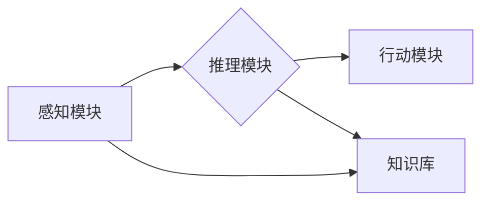

> AI Agent, 自然语言交互, 图形用户界面, 知识图谱, 进化算法, 人机交互

## 1. 背景介绍

人工智能（AI）技术近年来取得了飞速发展，从语音识别、图像识别到自然语言处理，AI已经渗透到我们生活的方方面面。然而，现有的AI应用大多依赖于文本或代码输入，缺乏直观、易用的交互方式。随着图形用户界面（GUI）的成熟，以及自然语言处理（NLP）技术的不断进步，AI Agent 应运而生，它将图形用户界面和自然语言交互相结合，为用户提供更加直观、便捷、人性化的AI体验。

AI Agent 是一种能够理解和响应用户指令的智能代理，它可以学习用户行为模式，并根据上下文提供个性化的服务。AI Agent 可以应用于各种场景，例如：

* **智能客服:** AI Agent 可以自动回答用户常见问题，并引导用户解决问题。
* **个性化推荐:** AI Agent 可以根据用户的兴趣爱好，推荐个性化的商品、服务或内容。
* **智能家居:** AI Agent 可以控制智能家居设备，例如灯光、空调、电视等。
* **教育辅助:** AI Agent 可以为学生提供个性化的学习辅导，并帮助他们理解复杂的知识点。

## 2. 核心概念与联系

AI Agent 的核心概念包括：

* **代理:** AI Agent 作为用户的代理，代表用户完成任务。
* **感知:** AI Agent 通过传感器或数据接口感知周围环境和用户的指令。
* **推理:** AI Agent 利用知识库和算法进行推理，分析用户意图并做出决策。
* **行动:** AI Agent 通过执行指令或控制设备来完成任务。

AI Agent 的架构通常包括以下几个模块：



* **感知模块:** 收集用户输入，例如文本、语音、图像等。
* **推理模块:** 分析用户输入，理解用户意图，并做出决策。
* **行动模块:** 执行用户指令，例如控制设备、提供信息等。
* **知识库:** 存储AI Agent 的知识和规则，用于推理和决策。

## 3. 核心算法原理 & 具体操作步骤

### 3.1  算法原理概述

AI Agent 的核心算法包括：

* **自然语言处理 (NLP):** 用于理解和处理用户自然语言输入。
* **机器学习 (ML):** 用于训练AI Agent，使其能够学习用户行为模式和知识。
* **深度学习 (DL):** 用于构建更复杂的AI模型，提高AI Agent 的性能。

### 3.2  算法步骤详解

1. **数据收集:** 收集用户行为数据、文本数据、图像数据等。
2. **数据预处理:** 对数据进行清洗、格式化、标注等处理。
3. **模型训练:** 使用机器学习算法训练AI Agent 模型。
4. **模型评估:** 使用测试数据评估模型性能，并进行调优。
5. **部署上线:** 将训练好的模型部署到生产环境中。

### 3.3  算法优缺点

**优点:**

* **智能化:** AI Agent 可以自动理解用户意图，并提供个性化的服务。
* **便捷性:** 用户可以通过自然语言交互与AI Agent 进行沟通。
* **效率:** AI Agent 可以自动完成重复性任务，提高工作效率。

**缺点:**

* **复杂性:** 开发AI Agent 需要复杂的算法和技术。
* **数据依赖:** AI Agent 的性能依赖于训练数据的质量。
* **安全风险:** AI Agent 可能存在安全漏洞，被恶意攻击。

### 3.4  算法应用领域

AI Agent 的应用领域非常广泛，包括：

* **客服:** 智能客服机器人可以自动回答用户常见问题，并引导用户解决问题。
* **电商:** AI Agent 可以为用户提供个性化的商品推荐，并协助用户完成购物流程。
* **教育:** AI Agent 可以为学生提供个性化的学习辅导，并帮助他们理解复杂的知识点。
* **医疗:** AI Agent 可以辅助医生诊断疾病，并提供患者个性化的治疗方案。

## 4. 数学模型和公式 & 详细讲解 & 举例说明

### 4.1  数学模型构建

AI Agent 的行为可以抽象为一个马尔可夫决策过程 (MDP)，其中：

* **状态 (S):** AI Agent 当前的状态，例如用户输入的文本、对话历史等。
* **动作 (A):** AI Agent 可以执行的动作，例如回复文本、控制设备等。
* **奖励 (R):** AI Agent 执行动作后获得的奖励，例如用户满意度、任务完成度等。
* **转移概率 (P):** 从一个状态执行一个动作后转移到另一个状态的概率。

### 4.2  公式推导过程

AI Agent 的目标是最大化累积奖励，可以使用动态规划算法或强化学习算法来求解。

* **动态规划:** 
    * Bellman 方程: $V(s) = \max_a \left[ R(s,a) + \gamma \sum_{s'} P(s'|s,a) V(s') \right]$
    * 其中，$V(s)$ 是状态 $s$ 的价值函数，$R(s,a)$ 是执行动作 $a$ 在状态 $s$ 后获得的奖励，$\gamma$ 是折扣因子，$P(s'|s,a)$ 是从状态 $s$ 执行动作 $a$ 后转移到状态 $s'$ 的概率。

* **强化学习:** 
    * Q-学习算法: $Q(s,a) = Q(s,a) + \alpha \left[ R(s,a) + \gamma \max_{a'} Q(s',a') - Q(s,a) \right]$
    * 其中，$Q(s,a)$ 是状态 $s$ 执行动作 $a$ 后获得的期望奖励，$\alpha$ 是学习率。

### 4.3  案例分析与讲解

例如，在智能客服场景中，AI Agent 可以使用动态规划算法来学习最佳的回复策略。

* 状态: 用户输入的文本、对话历史等。
* 动作: 回复文本、提供链接等。
* 奖励: 用户满意度、问题解决率等。

通过训练，AI Agent 可以学习到不同状态下执行不同动作的期望奖励，从而选择最优的回复策略。

## 5. 项目实践：代码实例和详细解释说明

### 5.1  开发环境搭建

* Python 3.x
* TensorFlow 或 PyTorch
* NLTK 或 SpaCy

### 5.2  源代码详细实现

```python
import nltk
from nltk.chat.util import Chat, reflections

pairs = [
    [
        r"我的名字是什么？",
        ["你的名字是什么？",]
    ],
    [
        r"你好",
        ["你好！", "嗨！", "元気？"]
    ],
    [
        r"再见",
        ["再见！", "再会！", "下次见！"]
    ],
]

chatbot = Chat(pairs, reflections)
print("聊天机器人启动成功！")

while True:
    user_input = input("你: ")
    if user_input.lower() == "exit":
        break
    response = chatbot.respond(user_input)
    print("机器人: ", response)
```

### 5.3  代码解读与分析

* 该代码实现了一个简单的聊天机器人，使用NLTK库进行自然语言处理。
* `pairs`列表定义了聊天机器人的对话规则，每个规则是一个列表，包含一个正则表达式和一个可能的回复列表。
* `reflections`字典定义了聊天机器人的反射规则，例如将“你”替换为“我”。
* `Chat`类用于创建聊天机器人实例，`respond`方法用于处理用户输入并返回回复。

### 5.4  运行结果展示

```
聊天机器人启动成功！
你: 你好
机器人:  嗨！
你: 你是谁？
机器人:  我是一个简单的聊天机器人。
你: 再见
机器人:  下次见！
```

## 6. 实际应用场景

### 6.1  智能客服

AI Agent 可以作为智能客服机器人，自动回答用户常见问题，并引导用户解决问题。例如，用户可以向AI Agent询问产品信息、订单状态、退换货政策等。

### 6.2  个性化推荐

AI Agent 可以根据用户的兴趣爱好，推荐个性化的商品、服务或内容。例如，电商平台可以利用AI Agent 为用户推荐相关的商品，新闻平台可以利用AI Agent 为用户推荐感兴趣的新闻。

### 6.3  智能家居

AI Agent 可以控制智能家居设备，例如灯光、空调、电视等。用户可以通过自然语言与AI Agent 交互，例如“打开客厅灯”，“调低空调温度”，“播放电影”。

### 6.4  未来应用展望

AI Agent 的应用场景还在不断扩展，未来可能会应用于：

* **医疗保健:** AI Agent 可以辅助医生诊断疾病，并提供患者个性化的治疗方案。
* **教育:** AI Agent 可以为学生提供个性化的学习辅导，并帮助他们理解复杂的知识点。
* **金融:** AI Agent 可以帮助用户管理财务，并提供理财建议。

## 7. 工具和资源推荐

### 7.1  学习资源推荐

* **书籍:**
    * 《深度学习》
    * 《机器学习实战》
    * 《自然语言处理入门》
* **在线课程:**
    * Coursera: 深度学习
    * Udacity: 机器学习工程师
    * edX: 自然语言处理

### 7.2  开发工具推荐

* **Python:** 
    * TensorFlow
    * PyTorch
    * NLTK
    * SpaCy
* **GUI 工具:**
    * Tkinter
    * PyQt
    * Kivy

### 7.3  相关论文推荐

* **《Attention Is All You Need》**
* **《BERT: Pre-training of Deep Bidirectional Transformers for Language Understanding》**
* **《Generative Pre-trained Transformer 3》**

## 8. 总结：未来发展趋势与挑战

### 8.1  研究成果总结

AI Agent 技术近年来取得了显著进展，在自然语言理解、对话系统、知识图谱构建等方面取得了突破。

### 8.2  未来发展趋势

* **更强大的自然语言理解能力:** AI Agent 将能够理解更复杂的语言，并进行更精细的对话。
* **更个性化的服务:** AI Agent 将能够根据用户的个人喜好和需求提供更个性化的服务。
* **更广泛的应用场景:** AI Agent 将应用于更多领域，例如医疗保健、教育、金融等。

### 8.3  面临的挑战

* **数据安全和隐私保护:** AI Agent 需要大量的数据进行训练，如何保证数据的安全和隐私是一个重要的挑战。
* **算法可解释性:** AI Agent 的决策过程往往是复杂的，如何提高算法的可解释性是一个重要的研究方向。
* **伦理问题:** AI Agent 的应用可能会带来一些伦理问题，例如算法偏见、责任归属等，需要进行深入的探讨和研究。

### 8.4  研究展望

未来，AI Agent 技术将继续发展，并对我们的生活产生更深远的影响。我们需要加强对AI Agent技术的研发和应用，并积极应对其带来的挑战，确保AI技术能够造福人类。

## 9. 附录：常见问题与解答

**Q1: AI Agent 和聊天机器人有什么区别？**

**A1:** 聊天机器人通常是基于规则驱动的，而AI Agent 则更智能，能够理解自然语言，并根据上下文进行推理和决策。

**Q2: 如何训练一个AI Agent？**

**A2:** 训练AI Agent 需要大量的训练数据和算法模型。可以使用机器学习算法或深度学习算法进行训练。

**Q3: AI Agent 是否会取代人类工作？**

**A3:** AI Agent 可以自动化一些重复性任务，但它并不会完全取代人类工作。人类