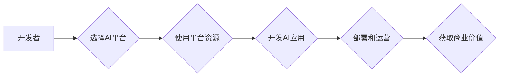

> AI大模型，平台优势，创业机会，商业模式，技术应用，未来趋势

## 1. 背景介绍

近年来，人工智能（AI）技术取得了飞速发展，特别是大模型的涌现，为各行各业带来了前所未有的机遇。大模型是指参数规模庞大、训练数据海量的人工智能模型，具备强大的泛化能力和学习能力，能够在自然语言处理、计算机视觉、语音识别等领域取得突破性进展。

然而，大模型的开发和应用也面临着诸多挑战，例如高昂的训练成本、海量数据需求、模型部署和维护的复杂性等。因此，如何有效利用平台优势，降低开发门槛，促进大模型的商业化应用，成为当前AI创业者面临的重要课题。

## 2. 核心概念与联系

**2.1 平台优势**

AI平台是指为开发者提供AI工具、资源和服务的综合性平台，其核心优势包括：

* **算力资源:** 提供强大的计算资源，支持大模型的训练和推理。
* **数据资源:** 提供海量数据，用于模型训练和测试。
* **算法模型:** 提供预训练模型和算法库，降低开发门槛。
* **工具和服务:** 提供开发工具、部署服务、监控管理等，简化开发流程。

**2.2 平台与大模型的关系**

AI平台为大模型的开发和应用提供了基础设施和工具支持，两者相互促进，共同推动AI产业发展。

* **平台为大模型提供基础:** 平台提供算力、数据和算法模型，降低大模型开发成本和难度。
* **大模型丰富平台功能:** 大模型的强大能力可以赋能平台，提供更智能化的服务和功能。

**2.3 平台优势的商业化应用**

AI平台可以采用多种商业模式，例如：

* **订阅制:** 用户按月或年订阅平台服务。
* **按需付费:** 用户根据实际使用情况付费。
* **开源社区:** 提供开源平台，通过社区贡献和商业服务盈利。

**2.4 Mermaid 流程图**



## 3. 核心算法原理 & 具体操作步骤

**3.1 算法原理概述**

大模型的训练主要基于深度学习算法，例如Transformer模型。Transformer模型通过自注意力机制，能够捕捉文本序列中的长距离依赖关系，从而实现更准确的理解和生成文本。

**3.2 算法步骤详解**

1. **数据预处理:** 将原始文本数据进行清洗、分词、标记等预处理操作，使其适合模型训练。
2. **模型构建:** 根据预设的网络结构，搭建Transformer模型。
3. **模型训练:** 使用训练数据，通过反向传播算法，调整模型参数，使其能够准确预测目标输出。
4. **模型评估:** 使用测试数据，评估模型的性能，例如准确率、召回率等。
5. **模型调优:** 根据评估结果，调整模型参数和训练策略，提高模型性能。
6. **模型部署:** 将训练好的模型部署到生产环境，用于实际应用。

**3.3 算法优缺点**

* **优点:** 强大的泛化能力、学习能力、处理长距离依赖关系的能力。
* **缺点:** 训练成本高、数据需求大、模型复杂度高。

**3.4 算法应用领域**

* 自然语言处理: 文本分类、情感分析、机器翻译、文本摘要等。
* 计算机视觉: 图像识别、目标检测、图像分割等。
* 语音识别: 语音转文本、语音合成等。

## 4. 数学模型和公式 & 详细讲解 & 举例说明

**4.1 数学模型构建**

Transformer模型的核心是自注意力机制，其数学模型可以表示为：

$$
Attention(Q, K, V) = softmax(\frac{QK^T}{\sqrt{d_k}})V
$$

其中：

* $Q$：查询矩阵
* $K$：键矩阵
* $V$：值矩阵
* $d_k$：键向量的维度
* $softmax$：softmax函数

**4.2 公式推导过程**

自注意力机制通过计算查询向量与键向量的相似度，来确定每个值向量的权重，从而实现对文本序列的加权求和。

* 首先，计算查询向量与每个键向量的点积，得到一个得分矩阵。
* 然后，对得分矩阵进行softmax归一化，得到每个值向量的权重。
* 最后，将权重与值向量相乘，得到最终的输出。

**4.3 案例分析与讲解**

假设我们有一个文本序列 "我爱学习编程"，其对应的查询向量、键向量和值向量分别为：

* $Q = [q_1, q_2, q_3, q_4, q_5]$
* $K = [k_1, k_2, k_3, k_4, k_5]$
* $V = [v_1, v_2, v_3, v_4, v_5]$

通过计算 $QK^T$，得到一个得分矩阵，然后对其进行softmax归一化，得到每个值向量的权重。最后，将权重与值向量相乘，得到最终的输出，即对文本序列的加权求和。

## 5. 项目实践：代码实例和详细解释说明

**5.1 开发环境搭建**

* 操作系统: Ubuntu 20.04
* Python 版本: 3.8
* 框架: TensorFlow 2.x

**5.2 源代码详细实现**

```python
import tensorflow as tf

# 定义Transformer模型
class Transformer(tf.keras.Model):
    def __init__(self, vocab_size, embedding_dim, num_heads, num_layers):
        super(Transformer, self).__init__()
        self.embedding = tf.keras.layers.Embedding(vocab_size, embedding_dim)
        self.transformer_layers = tf.keras.layers.StackedRNNCells([
            tf.keras.layers.MultiHeadAttention(num_heads=num_heads, key_dim=embedding_dim)
            for _ in range(num_layers)
        ])

    def call(self, inputs):
        # Embedding
        embedded = self.embedding(inputs)
        # Transformer layers
        output = self.transformer_layers(embedded)
        return output

# 实例化模型
model = Transformer(vocab_size=10000, embedding_dim=128, num_heads=8, num_layers=6)

# 编译模型
model.compile(optimizer='adam', loss='mse')

# 训练模型
model.fit(x_train, y_train, epochs=10)
```

**5.3 代码解读与分析**

* 代码定义了一个Transformer模型，包含嵌入层、多头注意力层和堆叠的RNN单元。
* 嵌入层将输入词语转换为向量表示。
* 多头注意力层捕捉文本序列中的长距离依赖关系。
* 堆叠的RNN单元进一步处理注意力输出，生成最终的预测结果。

**5.4 运行结果展示**

训练完成后，可以将模型应用于实际场景，例如文本分类、机器翻译等。

## 6. 实际应用场景

**6.1 自然语言处理**

* **文本分类:** 将文本分类到预定义的类别，例如情感分析、主题分类等。
* **机器翻译:** 将文本从一种语言翻译成另一种语言。
* **文本摘要:** 生成文本的简短摘要。

**6.2 计算机视觉**

* **图像识别:** 将图像分类到预定义的类别，例如物体识别、场景识别等。
* **目标检测:** 在图像中检测到特定目标，并标注其位置和类别。
* **图像分割:** 将图像分割成不同的区域，例如人、车、建筑物等。

**6.3 语音识别**

* **语音转文本:** 将语音信号转换为文本。
* **语音合成:** 将文本转换为语音信号。

**6.4 未来应用展望**

* **个性化推荐:** 根据用户的兴趣和行为，推荐个性化的商品、服务和内容。
* **智能客服:** 利用大模型构建智能客服系统，自动回答用户问题，提高服务效率。
* **自动写作:** 利用大模型辅助写作，生成新闻报道、小说、诗歌等。

## 7. 工具和资源推荐

**7.1 学习资源推荐**

* **书籍:**
    * 《深度学习》
    * 《自然语言处理》
    * 《机器学习》
* **在线课程:**
    * Coursera
    * edX
    * Udacity

**7.2 开发工具推荐**

* **TensorFlow:** 开源深度学习框架
* **PyTorch:** 开源深度学习框架
* **HuggingFace:** 提供预训练模型和开发工具

**7.3 相关论文推荐**

* 《Attention Is All You Need》
* 《BERT: Pre-training of Deep Bidirectional Transformers for Language Understanding》
* 《GPT-3: Language Models are Few-Shot Learners》

## 8. 总结：未来发展趋势与挑战

**8.1 研究成果总结**

近年来，大模型在自然语言处理、计算机视觉、语音识别等领域取得了突破性进展，为人工智能的商业化应用提供了强大的工具和技术支持。

**8.2 未来发展趋势**

* **模型规模进一步扩大:** 随着算力资源的不断提升，大模型的规模将继续扩大，模型能力将进一步增强。
* **多模态学习:** 大模型将融合文本、图像、音频等多模态数据，实现更全面的理解和生成能力。
* **边缘计算:** 大模型将部署到边缘设备，实现更低延迟、更高效率的应用。

**8.3 面临的挑战**

* **数据安全和隐私:** 大模型的训练和应用需要海量数据，如何保障数据安全和隐私是一个重要挑战。
* **模型可解释性:** 大模型的决策过程往往难以理解，如何提高模型的可解释性是一个关键问题。
* **伦理问题:** 大模型的应用可能带来伦理问题，例如算法偏见、信息操纵等，需要引起重视和探讨。

**8.4 研究展望**

未来，大模型研究将继续深入，探索更强大的模型架构、更有效的训练方法、更广泛的应用场景，为人工智能的未来发展做出更大的贡献。

## 9. 附录：常见问题与解答

**9.1 如何选择合适的AI平台？**

选择AI平台需要根据自身需求和资源情况进行综合考虑，例如平台提供的算力资源、数据资源、算法模型、工具和服务等。

**9.2 如何降低大模型的训练成本？**

可以采用模型压缩、知识蒸馏等技术，降低模型参数量和训练时间，从而降低训练成本。

**9.3 如何保证大模型的安全性？**

需要采取数据加密、模型安全评估等措施，保障大模型的安全性。


作者：禅与计算机程序设计艺术 / Zen and the Art of Computer Programming 
<end_of_turn>