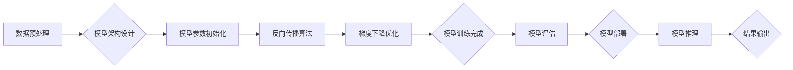

> AI大模型，应用最佳实践，模型训练，模型部署，模型优化，可解释性，伦理问题

## 1. 背景介绍

近年来，人工智能（AI）技术取得了飞速发展，其中，大规模语言模型（LLM）作为AI领域的重要突破，展现出强大的文本生成、理解和翻译能力。这些模型通过学习海量文本数据，能够模拟人类语言的复杂性和多样性，在自然语言处理、机器翻译、文本摘要、对话系统等领域展现出巨大的应用潜力。

然而，将这些强大的AI大模型应用于实际场景并非易事。需要考虑模型的训练、部署、优化、可解释性和伦理问题等多个方面。本文将探讨AI大模型应用的最佳实践，帮助开发者更好地理解和利用这些强大的工具。

## 2. 核心概念与联系

**2.1  AI大模型概述**

AI大模型是指参数规模庞大、训练数据海量的人工智能模型。这些模型通常基于深度学习架构，例如Transformer，能够学习复杂的语言模式和语义关系。

**2.2  模型训练**

模型训练是AI大模型的核心环节，通过使用大量的文本数据，让模型学习语言的规律和知识。训练过程通常包括以下步骤：

* **数据预处理:** 清洗、格式化和转换文本数据，使其适合模型训练。
* **模型架构设计:** 选择合适的深度学习架构，例如Transformer，并根据任务需求进行调整。
* **模型参数初始化:** 为模型参数赋予初始值，通常使用随机初始化。
* **反向传播算法:** 使用反向传播算法，计算模型预测结果与真实值的误差，并根据误差调整模型参数。
* **梯度下降优化:** 使用梯度下降算法，不断更新模型参数，使模型预测结果越来越接近真实值。

**2.3  模型部署**

模型部署是指将训练好的AI大模型部署到实际应用环境中，以便进行预测或推理。常见的部署方式包括：

* **云端部署:** 将模型部署到云计算平台，例如AWS、Azure、Google Cloud，方便访问和扩展。
* **边缘部署:** 将模型部署到边缘设备，例如手机、物联网设备，实现本地化推理。
* **容器化部署:** 使用容器技术，例如Docker，将模型和依赖环境打包在一起，方便部署和管理。

**2.4  模型优化**

模型优化是指通过各种技术手段，提高模型的性能、效率和鲁棒性。常见的优化方法包括：

* **模型压缩:** 减少模型参数量，降低模型大小和计算成本。
* **模型剪枝:** 删除模型中不重要的参数，提高模型效率。
* **模型量化:** 将模型参数的精度降低，减少内存占用和计算量。
* **模型加速:** 使用硬件加速器，例如GPU，提高模型训练和推理速度。

**2.5  可解释性**

可解释性是指能够理解AI模型的决策过程和推理机制。对于一些重要的应用场景，例如医疗诊断、金融风险评估，模型的可解释性至关重要。常见的可解释性方法包括：

* **特征重要性分析:** 识别模型中哪些特征对预测结果影响最大。
* **局部解释:** 对单个预测结果进行解释，说明模型是如何做出该预测的。
* **模型蒸馏:** 将大型模型的知识迁移到小型模型，提高模型的可解释性和效率。

**2.6  伦理问题**

AI大模型的应用也面临着一些伦理问题，例如：

* **数据隐私:** 模型训练需要使用大量数据，需要确保数据的隐私和安全。
* **算法偏见:** 模型可能存在算法偏见，导致不公平的结果。
* **责任归属:** 当模型导致错误或损害时，责任应该归属谁？

需要认真思考这些问题，并制定相应的伦理规范和监管机制。

**2.7  Mermaid 流程图**



## 3. 核心算法原理 & 具体操作步骤

### 3.1  算法原理概述

Transformer模型是一种基于注意力机制的深度学习架构，能够有效地处理序列数据，例如文本。其核心思想是通过注意力机制，学习不同词语之间的关系，从而更好地理解文本的语义。

### 3.2  算法步骤详解

1. **词嵌入:** 将每个词语映射到一个低维向量空间，表示词语的语义信息。
2. **多头注意力:** 使用多个注意力头，分别关注不同类型的词语关系，并融合注意力结果。
3. **前馈神经网络:** 对每个词语的嵌入向量进行非线性变换，提取更深层的语义特征。
4. **位置编码:** 为每个词语添加位置信息，使模型能够理解词语在句子中的顺序关系。
5. **堆叠层:** 将多个Transformer编码器和解码器层堆叠在一起，形成深层网络，提高模型的表达能力。

### 3.3  算法优缺点

**优点:**

* **强大的文本理解能力:** Transformer模型能够有效地捕捉文本中的长距离依赖关系，理解复杂的语义结构。
* **并行训练效率高:** 注意力机制使得Transformer模型能够并行训练，提高训练效率。
* **可扩展性强:** Transformer模型可以轻松扩展到更大的规模，处理更长的文本序列。

**缺点:**

* **训练成本高:** Transformer模型参数量庞大，训练成本较高。
* **可解释性差:** Transformer模型的内部机制复杂，难以解释其决策过程。

### 3.4  算法应用领域

Transformer模型在自然语言处理领域有着广泛的应用，例如：

* **机器翻译:** 将文本从一种语言翻译成另一种语言。
* **文本摘要:** 自动生成文本的简短摘要。
* **对话系统:** 开发能够与人类进行自然对话的聊天机器人。
* **文本生成:** 生成高质量的文本内容，例如文章、故事、诗歌等。

## 4. 数学模型和公式 & 详细讲解 & 举例说明

### 4.1  数学模型构建

Transformer模型的核心是注意力机制，其数学模型可以表示为：

$$
Attention(Q, K, V) = softmax(\frac{QK^T}{\sqrt{d_k}})V
$$

其中：

* $Q$：查询矩阵
* $K$：键矩阵
* $V$：值矩阵
* $d_k$：键向量的维度
* $softmax$：softmax函数

### 4.2  公式推导过程

注意力机制的目的是计算每个词语与其他词语之间的相关性，并根据相关性加权求和，得到每个词语的上下文表示。

1. 计算查询矩阵 $Q$ 与键矩阵 $K$ 的点积，并除以 $\sqrt{d_k}$，得到一个得分矩阵。
2. 对得分矩阵应用softmax函数，得到每个词语与其他词语之间的相关性分数。
3. 将相关性分数与值矩阵 $V$ 乘积，得到每个词语的上下文表示。

### 4.3  案例分析与讲解

例如，在翻译句子“The cat sat on the mat”时，注意力机制可以计算每个词语与其他词语之间的相关性，例如，“cat”与“sat”的相关性较高，因为它们描述了同一个动作。

## 5. 项目实践：代码实例和详细解释说明

### 5.1  开发环境搭建

* Python 3.7+
* PyTorch 1.7+
* CUDA 10.2+ (如果使用GPU加速)

### 5.2  源代码详细实现

```python
import torch
import torch.nn as nn

class Transformer(nn.Module):
    def __init__(self, vocab_size, embedding_dim, num_heads, num_layers):
        super(Transformer, self).__init__()
        self.embedding = nn.Embedding(vocab_size, embedding_dim)
        self.encoder_layers = nn.ModuleList([EncoderLayer(embedding_dim, num_heads) for _ in range(num_layers)])
        self.decoder_layers = nn.ModuleList([DecoderLayer(embedding_dim, num_heads) for _ in range(num_layers)])

    def forward(self, src, tgt):
        src = self.embedding(src)
        tgt = self.embedding(tgt)
        # ... (encoder and decoder layers)
        return output

class EncoderLayer(nn.Module):
    # ... (implementation of encoder layer)

class DecoderLayer(nn.Module):
    # ... (implementation of decoder layer)
```

### 5.3  代码解读与分析

* `Transformer`类定义了整个Transformer模型的结构。
* `embedding`层将词语映射到低维向量空间。
* `encoder_layers`和`decoder_layers`分别包含多个`EncoderLayer`和`DecoderLayer`，用于编码和解码文本序列。
* `forward`方法定义了模型的输入和输出。

### 5.4  运行结果展示

训练好的Transformer模型可以用于各种自然语言处理任务，例如机器翻译、文本摘要等。

## 6. 实际应用场景

### 6.1  机器翻译

Transformer模型在机器翻译领域取得了显著的成果，例如Google Translate使用Transformer模型实现的机器翻译质量大幅提升。

### 6.2  文本摘要

Transformer模型可以自动生成文本的简短摘要，例如用于新闻报道、学术论文等。

### 6.3  对话系统

Transformer模型可以用于开发能够与人类进行自然对话的聊天机器人，例如用于客服、教育、娱乐等场景。

### 6.4  未来应用展望

AI大模型的应用前景广阔，未来将应用于更多领域，例如：

* **代码生成:** 自动生成代码，提高开发效率。
* **药物研发:** 预测药物的活性，加速药物研发过程。
* **个性化教育:** 提供个性化的学习方案，提高学习效果。

## 7. 工具和资源推荐

### 7.1  学习资源推荐

* **论文:**
    * Attention Is All You Need (Vaswani et al., 2017)
    * BERT: Pre-training of Deep Bidirectional Transformers for Language Understanding (Devlin et al., 2018)
    * GPT-3: Language Models are Few-Shot Learners (Brown et al., 2020)
* **书籍:**
    * Deep Learning (Goodfellow et al., 2016)
    * Natural Language Processing with PyTorch (Bird et al., 2019)

### 7.2  开发工具推荐

* **PyTorch:** 深度学习框架，支持GPU加速。
* **TensorFlow:** 深度学习框架，支持GPU加速。
* **Hugging Face Transformers:** 提供预训练的Transformer模型和工具。

### 7.3  相关论文推荐

* **BERT:** https://arxiv.org/abs/1810.04805
* **GPT-3:** https://arxiv.org/abs/2005.14165
* **T5:** https://arxiv.org/abs/1910.10683

## 8. 总结：未来发展趋势与挑战

### 8.1  研究成果总结

近年来，AI大模型取得了显著的进展，在自然语言处理、计算机视觉等领域展现出强大的应用潜力。

### 8.2  未来发展趋势

* **模型规模更大:** 模型参数规模将继续扩大，提升模型的表达能力和泛化能力。
* **多模态学习:** 将文本、图像、音频等多种模态数据融合在一起，构建更全面的模型。
* **可解释性增强:** 研究更有效的可解释性方法，提高模型的透明度和可信度。

### 8.3  面临的挑战

* **训练成本高:** 大规模模型的训练成本很高，需要强大的计算资源和数据支持。
* **数据安全和隐私:** 模型训练需要使用大量