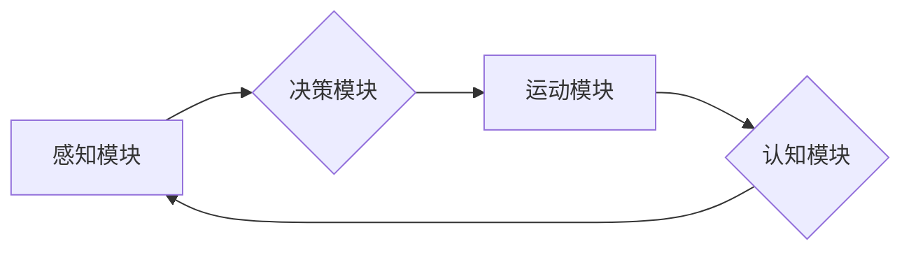

> AI, 具身智能, 机器学习, 深度学习, 自然语言处理, 计算机视觉, 产业应用, 未来趋势

## 1. 背景介绍

人工智能（AI）技术近年来发展迅速，取得了令人瞩目的成就。从语音识别、图像识别到自然语言处理，AI已经渗透到我们生活的方方面面。然而，传统的AI模型大多基于文本或图像数据，缺乏与物理世界直接交互的能力。

具身智能（Embodied Intelligence）作为AI发展的新方向，旨在赋予机器实体感知、运动和交互的能力，使其能够在真实世界中感知环境、理解上下文、做出决策并与人类进行自然互动。

## 2. 核心概念与联系

**2.1 具身智能的定义**

具身智能是指将人工智能技术与物理实体相结合，使机器能够感知、理解和操作物理世界的能力。它强调机器的感知、运动和交互能力，以及其与环境的动态交互。

**2.2 AI与具身智能的联系**

AI是具身智能的基础，提供机器学习、深度学习等算法，使机器能够从数据中学习和推理。而具身智能则将AI技术应用于物理世界，赋予机器感知、运动和交互的能力，使其能够更好地理解和应对现实世界。

**2.3 具身智能的架构**

具身智能系统通常由以下几个部分组成：

* **感知模块:** 用于收集环境信息，例如视觉、听觉、触觉等。
* **决策模块:** 基于感知信息，做出决策并规划行动。
* **运动模块:** 控制机器的运动，例如行走、抓取、 Manipulation 等。
* **认知模块:** 处理感知信息，理解上下文，并与人类进行交互。

**Mermaid 流程图**



## 3. 核心算法原理 & 具体操作步骤

**3.1 算法原理概述**

具身智能的核心算法包括机器学习、深度学习、强化学习等。

* **机器学习:** 通过训练模型，使机器能够从数据中学习规律，并对新数据进行预测或分类。
* **深度学习:** 使用多层神经网络，模拟人类大脑的学习过程，能够处理更复杂的数据，例如图像、语音等。
* **强化学习:** 通过奖励和惩罚机制，训练机器学习最优策略，使其能够在环境中做出最有利的决策。

**3.2 算法步骤详解**

**3.2.1 机器学习算法步骤**

1. **数据收集:** 收集与目标任务相关的训练数据。
2. **数据预处理:** 对数据进行清洗、转换、特征提取等操作。
3. **模型选择:** 选择合适的机器学习模型，例如线性回归、决策树、支持向量机等。
4. **模型训练:** 使用训练数据训练模型，调整模型参数。
5. **模型评估:** 使用测试数据评估模型性能，例如准确率、召回率等。
6. **模型部署:** 将训练好的模型部署到实际应用场景中。

**3.2.2 深度学习算法步骤**

1. **数据收集:** 收集大量图像、语音、文本等数据。
2. **数据预处理:** 对数据进行预处理，例如图像增强、文本编码等。
3. **网络结构设计:** 设计深度神经网络的结构，例如卷积神经网络、循环神经网络等。
4. **模型训练:** 使用训练数据训练深度神经网络，调整网络参数。
5. **模型评估:** 使用测试数据评估模型性能，例如识别准确率、分类精度等。
6. **模型部署:** 将训练好的深度神经网络部署到实际应用场景中。

**3.2.3 强化学习算法步骤**

1. **环境定义:** 定义强化学习环境，包括状态空间、动作空间、奖励函数等。
2. **代理设计:** 设计强化学习代理，例如机器人、游戏角色等。
3. **策略学习:** 使用强化学习算法，例如Q学习、SARSA等，训练代理学习最优策略。
4. **环境交互:** 代理与环境交互，根据策略选择动作，并获得奖励。
5. **策略更新:** 根据奖励信息，更新代理的策略，使其能够获得更高的奖励。
6. **策略评估:** 使用测试环境评估代理的策略性能。

**3.3 算法优缺点**

* **机器学习:** 优点：易于实现，适用范围广；缺点：对数据依赖性强，难以处理复杂数据。
* **深度学习:** 优点：能够处理复杂数据，性能优异；缺点：训练成本高，需要大量数据。
* **强化学习:** 优点：能够学习最优策略，适应性强；缺点：训练过程复杂，收敛速度慢。

**3.4 算法应用领域**

* **机器人:** 机器人控制、导航、目标识别等。
* **自动驾驶:** 车辆感知、决策、控制等。
* **医疗保健:** 疾病诊断、药物研发、手术辅助等。
* **金融:** 风险管理、欺诈检测、投资决策等。

## 4. 数学模型和公式 & 详细讲解 & 举例说明

**4.1 数学模型构建**

具身智能系统可以建模为一个马尔可夫决策过程（MDP）。

* **状态空间:** 机器人的位置、姿态、感知信息等。
* **动作空间:** 机器人可以执行的动作，例如移动、抓取、说话等。
* **转移概率:** 从一个状态到另一个状态的概率。
* **奖励函数:** 根据机器人的动作和状态，给予奖励或惩罚。

**4.2 公式推导过程**

MDP的目标是找到一个最优策略，使得机器人在整个过程中获得最大的总奖励。最优策略可以使用动态规划算法或强化学习算法来求解。

**Bellman方程:**

$$
V^*(s) = \max_a \left[ R(s,a) + \gamma \sum_{s'} P(s'|s,a) V^*(s') \right]
$$

其中：

* $V^*(s)$ 是状态 $s$ 的最优价值函数。
* $R(s,a)$ 是在状态 $s$ 执行动作 $a$ 得到的奖励。
* $\gamma$ 是折扣因子，控制未来奖励的权重。
* $P(s'|s,a)$ 是从状态 $s$ 执行动作 $a$ 到状态 $s'$ 的转移概率。

**4.3 案例分析与讲解**

例如，训练一个机器人学会在迷宫中导航。

* 状态空间：机器人位置。
* 动作空间：向前、向后、左转、右转。
* 转移概率：根据迷宫地图和机器人的运动方式确定。
* 奖励函数：到达终点获得最大奖励，撞墙或迷路获得惩罚。

使用Bellman方程或强化学习算法，可以训练机器人学习最优导航策略，使其能够高效地到达终点。

## 5. 项目实践：代码实例和详细解释说明

**5.1 开发环境搭建**

* 操作系统：Ubuntu 20.04
* Python 版本：3.8
* 库依赖：OpenCV、NumPy、PyTorch

**5.2 源代码详细实现**

```python
import cv2
import numpy as np
import torch

# 定义神经网络模型
class CNN(torch.nn.Module):
    def __init__(self):
        super(CNN, self).__init__()
        # ...

    def forward(self, x):
        # ...

# 实例化模型
model = CNN()

# 加载预训练模型权重
model.load_state_dict(torch.load('model_weights.pth'))

# 摄像头捕获图像
cap = cv2.VideoCapture(0)
while True:
    ret, frame = cap.read()
    # ...
    # 将图像预处理并输入模型
    # ...
    # 获取模型输出
    # ...
    # 根据模型输出进行决策
    # ...
    cv2.imshow('Frame', frame)
    if cv2.waitKey(1) & 0xFF == ord('q'):
        break

cap.release()
cv2.destroyAllWindows()
```

**5.3 代码解读与分析**

* 代码首先定义了一个CNN模型，并实例化模型。
* 然后加载预训练模型权重。
* 使用摄像头捕获图像，并进行预处理。
* 将预处理后的图像输入模型，获取模型输出。
* 根据模型输出进行决策，例如控制机器人的运动。

**5.4 运行结果展示**

运行代码后，可以观察到摄像头捕获的图像实时被处理，并根据模型输出进行决策，例如控制机器人移动。

## 6. 实际应用场景

**6.1 机器人服务**

* **家政机器人:** 清洁、烹饪、陪伴等。
* **医疗机器人:** 协助医生手术、送药、陪伴病人等。
* **工业机器人:** 自动化生产、物流配送等。

**6.2 自动驾驶**

* **自动驾驶汽车:** 自动驾驶技术可以提高道路安全性和交通效率。
* **无人机:** 无人机可以用于物流配送、监控、农业等领域。

**6.3 人机交互**

* **虚拟助手:** 例如Siri、Alexa等，可以理解自然语言，并执行用户的指令。
* **游戏角色:** 更逼真的游戏角色可以提供更沉浸式的游戏体验。

**6.4 未来应用展望**

* **个性化教育:** 根据学生的学习情况，提供个性化的学习方案。
* **远程医疗:** 通过远程医疗平台，提供医疗咨询和诊断服务。
* **智能城市:** 利用传感器和AI技术，提高城市管理效率和居民生活质量。

## 7. 工具和资源推荐

**7.1 学习资源推荐**

* **书籍:**
    * 《深度学习》
    * 《强化学习：原理、算法和应用》
* **在线课程:**
    * Coursera: 深度学习
    * Udacity: 自动驾驶工程师
* **开源项目:**
    * TensorFlow
    * PyTorch
    * OpenAI Gym

**7.2 开发工具推荐**

* **编程语言:** Python
* **深度学习框架:** TensorFlow, PyTorch
* **机器人平台:** ROS

**7.3 相关论文推荐**

* **AlphaGo:** DeepMind
* **GPT-3:** OpenAI
* **DALL-E:** OpenAI

## 8. 总结：未来发展趋势与挑战

**8.1 研究成果总结**

近年来，具身智能领域取得了显著进展，例如AlphaGo、GPT-3等模型的出现，证明了AI在复杂任务中的能力。

**8.2 未来发展趋势**

* **更强大的计算能力:** 更强大的计算能力将推动更复杂、更智能的具身智能系统的发展。
* **更丰富的传感器:** 更丰富的传感器将使机器能够更好地感知环境。
* **更先进的算法:** 更先进的算法将使机器能够更好地理解和应对复杂环境。
* **更安全的AI:** 安全性和可解释性是未来发展的重要方向。

**8.3 面临的挑战**

* **数据获取和标注:** 训练具身智能系统需要大量数据，而获取和标注这些数据非常困难。
* **模型复杂度:** 具身智能系统模型非常复杂，训练和部署成本高。
* **安全性和伦理问题:** 随着AI技术的进步，安全性和伦理问题日益突出。

**8.4 研究展望**

未来，具身智能将继续朝着更智能、更安全、更可解释的方向发展，并将广泛应用于各个领域，改变我们的生活方式。

## 9. 附录：常见问题与解答

**9.1 如何选择合适的具身智能算法？**

选择合适的具身智能算法取决于具体的应用场景和任务需求。例如，对于机器人导航任务，强化学习算法效果较好；对于图像识别任务，深度学习算法效果较好。

**9.2 如何解决数据获取和标注问题？**

可以利用模拟环境、数据增强技术等方法来解决数据获取和标注问题。

**9.3 如何保证具身智能系统的安全性和可靠性？**

可以通过