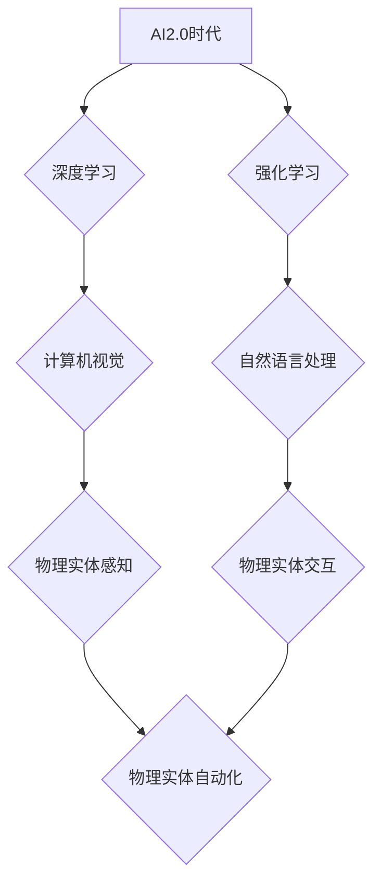

> AI2.0, 物理实体, 自动化, 机器学习, 深度强化学习, 计算机视觉, 自然语言处理, 协作机器人

## 1. 背景介绍

人工智能（AI）技术近年来取得了飞速发展，从语音识别、图像识别到自然语言处理等领域取得了突破性进展。然而，现有的AI技术主要集中在数字世界的应用，例如处理文本、图像和数据等。而物理世界则仍然面临着许多自动化挑战。

随着AI技术的不断进步，特别是深度学习和强化学习的突破，AI2.0时代正在到来。AI2.0时代，人工智能将不再局限于数字世界，而是能够理解、感知和交互于物理世界。物理实体的自动化将成为AI2.0时代的重要发展方向，并对我们的生活、工作和社会产生深远影响。

## 2. 核心概念与联系

**2.1  物理实体自动化**

物理实体自动化是指利用人工智能技术，使物理实体能够自主感知环境、做出决策并执行动作，从而实现自动化操作。

**2.2  AI2.0时代**

AI2.0时代是指人工智能技术进入第二阶段，其特点是：

* **从数据驱动到模型驱动:** AI2.0更加注重模型的泛化能力和解释性，而非仅仅依赖海量数据。
* **从单一任务到多任务学习:** AI2.0能够学习多种任务，并能够将不同任务之间的知识迁移。
* **从数字世界到物理世界:** AI2.0能够理解和交互于物理世界，并能够控制物理实体。

**2.3  核心概念联系**

物理实体的自动化是AI2.0时代的重要应用场景。AI2.0技术的进步为物理实体的自动化提供了技术基础，而物理实体的自动化又推动了AI2.0技术的进一步发展。



## 3. 核心算法原理 & 具体操作步骤

**3.1  算法原理概述**

物理实体的自动化通常需要结合多种AI算法，例如：

* **计算机视觉:** 用于感知物理环境，识别物体和场景。
* **自然语言处理:** 用于理解和响应人类指令。
* **深度强化学习:** 用于训练物理实体自主决策和执行动作。

**3.2  算法步骤详解**

1. **环境感知:** 利用传感器收集物理环境信息，例如图像、声音、距离等。
2. **数据预处理:** 对收集到的环境信息进行预处理，例如图像处理、语音识别等。
3. **特征提取:** 从预处理后的数据中提取关键特征，例如物体形状、颜色、位置等。
4. **决策制定:** 利用深度强化学习算法，根据环境信息和特征，制定最优动作策略。
5. **动作执行:** 将决策转化为物理动作，例如移动、抓取、操作等。
6. **反馈机制:** 收集动作执行后的反馈信息，并将其反馈到决策制定阶段，不断优化动作策略。

**3.3  算法优缺点**

* **优点:**

    * 自动化程度高，能够实现复杂的任务。
    * 适应性强，能够应对动态变化的环境。
    * 效率高，能够比人类更快地完成任务。

* **缺点:**

    * 算法复杂，需要大量的计算资源。
    * 数据依赖性强，需要大量的训练数据。
    * 安全性和可靠性需要进一步提高。

**3.4  算法应用领域**

* **工业自动化:** 机器人协作、智能制造、无人驾驶等。
* **服务业自动化:** 智能客服、自动驾驶汽车、智能家居等。
* **医疗保健自动化:** 机器人手术、智能诊断、药物研发等。

## 4. 数学模型和公式 & 详细讲解 & 举例说明

**4.1  数学模型构建**

物理实体的自动化可以建模为一个马尔可夫决策过程（MDP）。

* **状态空间:** 物理实体及其环境的状态集合。
* **动作空间:** 物理实体可以执行的动作集合。
* **转移概率:** 从一个状态到另一个状态的概率分布。
* **奖励函数:** 评估物理实体动作的优劣的函数。

**4.2  公式推导过程**

目标是找到一个策略π，使得在状态空间中采取动作序列的期望累积奖励最大化。

$$
\max_{\pi} \mathbb{E}_{\pi} \sum_{t=0}^{\infty} \gamma^t r_t
$$

其中：

* $\pi$ 是策略。
* $\mathbb{E}_{\pi}$ 是根据策略π的期望。
* $r_t$ 是在时间步t的奖励。
* $\gamma$ 是折扣因子，控制未来奖励的权重。

**4.3  案例分析与讲解**

例如，训练一个机器人抓取物体，可以将抓取过程建模为一个MDP。

* 状态空间：机器人手臂的位置、物体的位置、物体姿态等。
* 动作空间：机器人手臂的运动方向和速度等。
* 转移概率：根据机器人手臂的运动和物体的物理特性计算。
* 奖励函数：当机器人成功抓取物体时给予高奖励，否则给予低奖励。

通过深度强化学习算法，可以训练机器人找到最优的抓取策略，使得抓取成功率最大化。

## 5. 项目实践：代码实例和详细解释说明

**5.1  开发环境搭建**

* 操作系统：Ubuntu 20.04
* Python 版本：3.8
* 库依赖：TensorFlow、OpenCV、PyBullet等

**5.2  源代码详细实现**

```python
import tensorflow as tf
import cv2
import pybullet as p

# 定义神经网络模型
model = tf.keras.models.Sequential([
    tf.keras.layers.Conv2D(32, (3, 3), activation='relu', input_shape=(64, 64, 3)),
    tf.keras.layers.MaxPooling2D((2, 2)),
    tf.keras.layers.Conv2D(64, (3, 3), activation='relu'),
    tf.keras.layers.MaxPooling2D((2, 2)),
    tf.keras.layers.Flatten(),
    tf.keras.layers.Dense(10, activation='softmax')
])

# 定义奖励函数
def reward_function(state, action):
    # 根据状态和动作计算奖励
    pass

# 训练模型
for episode in range(1000):
    # 初始化环境
    env = p.connect(p.GUI)
    # 获取初始状态
    state = env.get_state()
    # 训练循环
    while True:
        # 选择动作
        action = model.predict(state)
        # 执行动作
        env.step(action)
        # 获取奖励
        reward = reward_function(state, action)
        # 更新状态
        state = env.get_state()
        # 结束条件
        if env.is_done():
            break

# 保存模型
model.save('robot_control_model.h5')
```

**5.3  代码解读与分析**

* 代码首先定义了神经网络模型，用于预测机器人动作。
* 然后定义了奖励函数，用于评估机器人动作的优劣。
* 训练循环中，机器人根据模型预测的动作执行动作，并根据奖励函数更新模型参数。
* 训练完成后，保存模型，以便后续使用。

**5.4  运行结果展示**

训练好的模型可以用于控制机器人执行抓取物体等任务。

## 6. 实际应用场景

**6.1  工业自动化**

* **机器人协作:** AI2.0技术可以使机器人能够协同人类工作，提高生产效率。
* **智能制造:** AI2.0技术可以实现智能工厂，自动规划生产流程，优化资源配置。
* **无人驾驶:** AI2.0技术可以实现无人驾驶汽车，提高交通安全和效率。

**6.2  服务业自动化**

* **智能客服:** AI2.0技术可以实现智能客服机器人，提供24小时在线服务。
* **自动驾驶汽车:** AI2.0技术可以实现自动驾驶汽车，提高交通安全和效率。
* **智能家居:** AI2.0技术可以实现智能家居，自动控制灯光、温度、安全等。

**6.3  医疗保健自动化**

* **机器人手术:** AI2.0技术可以使机器人能够辅助医生进行手术，提高手术精度和安全性。
* **智能诊断:** AI2.0技术可以帮助医生进行疾病诊断，提高诊断准确率。
* **药物研发:** AI2.0技术可以加速药物研发过程，降低研发成本。

**6.4  未来应用展望**

AI2.0技术将进一步推动物理实体的自动化，应用场景将更加广泛，例如：

* **个性化医疗:** AI2.0技术可以根据患者的个体特征提供个性化的医疗服务。
* **智慧城市:** AI2.0技术可以实现智慧城市，提高城市管理效率和居民生活质量。
* **太空探索:** AI2.0技术可以帮助人类探索太空，实现人类的太空梦想。

## 7. 工具和资源推荐

**7.1  学习资源推荐**

* **书籍:**
    * 深度学习
    * 强化学习
    * 人工智能：一个现代方法
* **在线课程:**
    * Coursera: 深度学习
    * Udacity: 强化学习
    * edX: 人工智能

**7.2  开发工具推荐**

* **TensorFlow:** 深度学习框架
* **PyTorch:** 深度学习框架
* **OpenCV:** 图像处理库
* **PyBullet:** 物理仿真库

**7.3  相关论文推荐**

* **Deep Reinforcement Learning for Robotics**
* **End-to-End Learning for Robotics**
* **Learning to Grasp with Deep Reinforcement Learning**

## 8. 总结：未来发展趋势与挑战

**8.1  研究成果总结**

AI2.0时代，物理实体的自动化取得了显著进展，例如机器人抓取、自动驾驶等。深度学习和强化学习算法为物理实体的自动化提供了技术基础。

**8.2  未来发展趋势**

* **更智能的物理实体:** 未来物理实体将更加智能，能够自主学习、适应和决策。
* **更广泛的应用场景:** AI2.0技术将应用于更多领域，例如医疗保健、教育、娱乐等。
* **更安全的物理实体:** 安全性和可靠性将成为物理实体自动化的关键挑战。

**8.3  面临的挑战**

* **算法复杂性:** 物理实体的自动化算法复杂，需要大量的计算资源和训练数据。
* **安全性和可靠性:** 物理实体的自动化需要保证安全性和可靠性，避免意外事故发生。
* **伦理问题:** 物理实体的自动化可能带来伦理问题，例如工作岗位替代、隐私泄露等。

**8.4  研究展望**

未来研究方向包括：

* **开发更鲁棒、更安全的物理实体自动化算法。**
* **探索新的物理实体自动化应用场景。**
* **解决物理实体自动化带来的伦理问题。**

## 9. 附录：常见问题与解答

**9.1  物理实体自动化与传统自动化有什么区别？**

传统自动化通常依赖于预先编程的规则，而物理实体的自动化则利用人工智能技术，能够自主学习和适应环境变化。

**9.2  物理实体的自动化有哪些应用场景？**

物理实体的自动化应用场景非常广泛，例如工业自动化、服务业自动化、医疗保健自动化等。

**9.3  物理实体的自动化有哪些挑战？**

物理实体的自动化面临着算法复杂性、安全性和可靠性、伦理问题等挑战。

**9.4  未来物理实体的自动化会带来哪些机遇？**

物理实体的自动化将带来许多