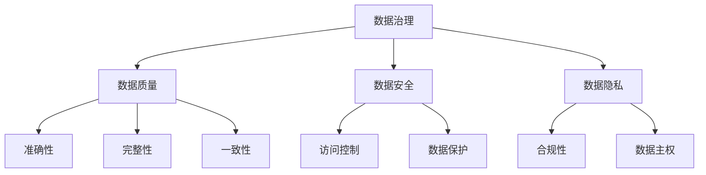

                 

**AI创业：数据管理的创新方法分享**

> 关键词：数据管理、AI创业、数据治理、数据质量、数据安全、数据隐私、数据价值挖掘

## 1. 背景介绍

在当今数据爆炸式增长的时代，数据已成为企业最宝贵的资产之一。然而，如何有效管理和利用这些数据，以获取商业价值，是企业面临的重大挑战。本文将分享一些创新的数据管理方法，帮助AI创业者更好地处理数据，从而提高业务效率，创造新的商机。

## 2. 核心概念与联系

### 2.1 数据治理

数据治理是指建立、实施和维护数据管理政策、过程和系统，以确保数据的准确性、完整性、一致性、可用性和安全性。数据治理是数据管理的关键，它确保数据的质量和可信度，从而支持企业的决策和业务流程。



### 2.2 数据质量

数据质量是指数据的准确性、完整性、一致性、时效性、有效性和可用性。高质量的数据是企业决策的基础，它有助于提高业务效率，降低成本，并创造新的商机。

### 2.3 数据安全

数据安全是指保护数据免受未经授权访问、泄露、篡改或删除的威胁。数据安全是数据管理的关键，它确保数据的完整性和可信度，并防止数据泄露导致的法律和声誉风险。

### 2.4 数据隐私

数据隐私是指个人数据的保护，以防止数据被滥用或泄露。数据隐私是数据管理的关键，它确保个人数据的安全和隐私，并防止数据滥用导致的法律和声誉风险。

## 3. 核心算法原理 & 具体操作步骤

### 3.1 数据质量评估算法原理

数据质量评估是确保数据质量的关键步骤。数据质量评估算法的原理是基于一套预定义的规则和标准，对数据进行评分，以衡量数据的质量。常用的数据质量评估指标包括准确性、完整性、一致性、时效性、有效性和可用性。

### 3.2 数据质量评估步骤

1. 定义数据质量评估标准：根据业务需求和数据特性，定义数据质量评估标准。
2. 数据清洗：使用数据清洗工具和技术，清除数据中的错误、重复和不一致的记录。
3. 数据评分：根据预定义的规则和标准，对数据进行评分，以衡量数据的质量。
4. 数据改进：根据评分结果，改进数据质量，以提高数据的准确性、完整性、一致性、时效性、有效性和可用性。

### 3.3 数据质量评估优缺点

优点：

* 提高数据质量，从而提高业务效率和决策质量。
* 降低数据错误和不一致导致的成本和风险。
* 为数据治理提供基础。

缺点：

* 数据质量评估是一个复杂的过程，需要大量的人力和时间。
* 数据质量评估标准的定义可能会受到主观因素的影响。
* 数据质量评估结果可能会受到数据样本的影响。

### 3.4 数据质量评估应用领域

数据质量评估在各个行业都有广泛的应用，例如：

* 金融行业：评估客户数据的准确性和完整性，以防止欺诈和洗钱。
* 电信行业：评估客户数据的准确性和完整性，以改进客户服务和营销活动。
* 健康医疗行业：评估患者数据的准确性和完整性，以改进诊断和治疗。

## 4. 数学模型和公式 & 详细讲解 & 举例说明

### 4.1 数据质量评估模型构建

数据质量评估模型的构建需要考虑多种因素，包括数据的特性、业务需求和数据质量评估标准。常用的数据质量评估模型包括：

* 因子分析模型：将数据质量评估指标分为多个因子，并使用因子分析技术对数据进行评分。
* 回归模型：使用回归技术，将数据质量评估指标作为自变量，业务指标作为因变量，建立数据质量评估模型。
* 神经网络模型：使用神经网络技术，将数据质量评估指标作为输入，业务指标作为输出，建立数据质量评估模型。

### 4.2 公式推导过程

以因子分析模型为例，其公式推导过程如下：

1. 定义数据质量评估指标集合：$Q = \{q_1, q_2,..., q_n\}$
2. 定义业务指标集合：$B = \{b_1, b_2,..., b_m\}$
3. 定义因子集合：$F = \{f_1, f_2,..., f_k\}$
4. 使用主成分分析技术，将数据质量评估指标集合$Q$转换为因子集合$F$：
$$F = Q \cdot A$$
其中，$A$是转换矩阵。
5. 使用回归技术，将因子集合$F$转换为业务指标集合$B$：
$$B = F \cdot B$$
其中，$B$是回归系数矩阵。
6. 使用上述公式，对数据进行评分，以衡量数据的质量。

### 4.3 案例分析与讲解

例如，在电信行业，数据质量评估指标集合$Q$可以定义为：

* 客户数据准确性：$q_1$
* 客户数据完整性：$q_2$
* 客户数据一致性：$q_3$
* 客户数据时效性：$q_4$

业务指标集合$B$可以定义为：

* 客户流失率：$b_1$
* 客户满意度：$b_2$
* 客户营销响应率：$b_3$

使用因子分析模型，可以将数据质量评估指标集合$Q$转换为两个因子：

* 数据准确性因子：$f_1 = 0.5q_1 + 0.5q_3$
* 数据完整性因子：$f_2 = 0.5q_2 + 0.5q_4$

然后，使用回归技术，可以将因子集合$F$转换为业务指标集合$B$：

* 客户流失率：$b_1 = 0.6f_1 + 0.4f_2$
* 客户满意度：$b_2 = 0.4f_1 + 0.6f_2$
* 客户营销响应率：$b_3 = 0.5f_1 + 0.5f_2$

使用上述公式，可以对数据进行评分，以衡量数据的质量，从而改进客户服务和营销活动。

## 5. 项目实践：代码实例和详细解释说明

### 5.1 开发环境搭建

本项目使用Python作为编程语言，并使用以下库：

* Pandas：数据处理和分析库。
* NumPy：数值计算库。
* Scikit-learn：机器学习库。
* Matplotlib：数据可视化库。

### 5.2 源代码详细实现

以下是使用因子分析模型对数据质量进行评估的Python代码示例：

```python
import pandas as pd
import numpy as np
from sklearn.decomposition import FactorAnalysis
from sklearn.linear_model import LinearRegression

# 加载数据
data = pd.read_csv('data.csv')

# 定义数据质量评估指标集合
Q = data[['q1', 'q2', 'q3', 'q4']]

# 定义业务指标集合
B = data[['b1', 'b2', 'b3']]

# 使用因子分析技术，将数据质量评估指标集合Q转换为因子集合F
fa = FactorAnalysis(n_components=2)
F = fa.fit_transform(Q)

# 使用回归技术，将因子集合F转换为业务指标集合B
lr = LinearRegression()
B_pred = lr.fit(F, B).predict(F)

# 打印预测结果
print(B_pred)
```

### 5.3 代码解读与分析

* 使用Pandas库加载数据。
* 定义数据质量评估指标集合$Q$和业务指标集合$B$。
* 使用因子分析技术，将数据质量评估指标集合$Q$转换为因子集合$F$。
* 使用回归技术，将因子集合$F$转换为业务指标集合$B$。
* 打印预测结果。

### 5.4 运行结果展示

运行上述代码后，可以得到业务指标集合$B$的预测结果，从而衡量数据的质量。

## 6. 实际应用场景

### 6.1 数据治理

数据治理是数据管理的关键，它确保数据的质量和可信度。数据治理需要涉及数据质量评估、数据安全和数据隐私等多个方面。数据治理的目标是建立一个完善的数据管理体系，以支持企业的决策和业务流程。

### 6.2 数据质量评估

数据质量评估是确保数据质量的关键步骤。数据质量评估需要涉及数据清洗、数据评分和数据改进等多个方面。数据质量评估的目标是提高数据的准确性、完整性、一致性、时效性、有效性和可用性。

### 6.3 数据安全

数据安全是数据管理的关键，它确保数据的完整性和可信度，并防止数据泄露导致的法律和声誉风险。数据安全需要涉及数据加密、访问控制和数据保护等多个方面。数据安全的目标是保护数据免受未经授权访问、泄露、篡改或删除的威胁。

### 6.4 未来应用展望

未来，数据管理将会面临更多的挑战，包括数据爆炸式增长、数据多样性和数据隐私保护等。为此，企业需要不断创新数据管理方法，以适应不断变化的业务需求和技术环境。例如，区块链技术可以提供一种新的数据管理方法，它可以提高数据的安全性和可信度，并改善数据的共享和交易。

## 7. 工具和资源推荐

### 7.1 学习资源推荐

* "数据治理：原理与实践"（Data Governance: Principles and Practice）是一本权威的数据治理指南，它提供了数据治理的原理和实践方法。
* "数据质量：原理与实践"（Data Quality: Principles and Practice）是一本权威的数据质量指南，它提供了数据质量的原理和实践方法。
* "数据安全：原理与实践"（Data Security: Principles and Practice）是一本权威的数据安全指南，它提供了数据安全的原理和实践方法。

### 7.2 开发工具推荐

* Talend：是一款开源的数据集成和数据治理平台，它提供了数据清洗、数据转换和数据集成等功能。
* Pentaho：是一款开源的商业智能和数据集成平台，它提供了数据清洗、数据转换和数据集成等功能。
* Apache Kafka：是一款开源的实时数据处理平台，它提供了高吞吐量和低延迟的数据处理功能。

### 7.3 相关论文推荐

* "A Survey of Data Quality Research"是一篇综述论文，它回顾了数据质量研究的最新进展。
* "Data Governance: A Systematic Literature Review"是一篇综述论文，它回顾了数据治理研究的最新进展。
* "Data Security: A Systematic Literature Review"是一篇综述论文，它回顾了数据安全研究的最新进展。

## 8. 总结：未来发展趋势与挑战

### 8.1 研究成果总结

本文分享了创新的数据管理方法，包括数据治理、数据质量评估、数据安全和数据隐私等。这些方法可以帮助AI创业者更好地处理数据，从而提高业务效率，创造新的商机。

### 8.2 未来发展趋势

未来，数据管理将会面临更多的挑战，包括数据爆炸式增长、数据多样性和数据隐私保护等。为此，企业需要不断创新数据管理方法，以适应不断变化的业务需求和技术环境。例如，区块链技术可以提供一种新的数据管理方法，它可以提高数据的安全性和可信度，并改善数据的共享和交易。

### 8.3 面临的挑战

未来，数据管理面临的挑战包括：

* 数据爆炸式增长：数据量的急剧增加，给数据管理带来了巨大的挑战。
* 数据多样性：数据来源的多样性，给数据管理带来了巨大的挑战。
* 数据隐私保护：数据隐私保护是数据管理的关键挑战，需要平衡数据共享和数据隐私保护之间的关系。

### 8.4 研究展望

未来，数据管理研究的方向包括：

* 数据治理：研究数据治理的原理和实践方法，以提高数据的质量和可信度。
* 数据质量评估：研究数据质量评估的原理和实践方法，以提高数据的准确性、完整性、一致性、时效性、有效性和可用性。
* 数据安全：研究数据安全的原理和实践方法，以保护数据免受未经授权访问、泄露、篡改或删除的威胁。
* 数据隐私保护：研究数据隐私保护的原理和实践方法，以平衡数据共享和数据隐私保护之间的关系。

## 9. 附录：常见问题与解答

**Q1：数据治理和数据质量评估有什么区别？**

A1：数据治理是指建立、实施和维护数据管理政策、过程和系统，以确保数据的准确性、完整性、一致性、可用性和安全性。数据治理是数据管理的关键，它确保数据的质量和可信度，从而支持企业的决策和业务流程。数据质量评估是确保数据质量的关键步骤，它涉及数据清洗、数据评分和数据改进等多个方面。数据质量评估的目标是提高数据的准确性、完整性、一致性、时效性、有效性和可用性。

**Q2：数据安全和数据隐私有什么区别？**

A2：数据安全是指保护数据免受未经授权访问、泄露、篡改或删除的威胁。数据安全是数据管理的关键，它确保数据的完整性和可信度，并防止数据泄露导致的法律和声誉风险。数据隐私是指个人数据的保护，以防止数据被滥用或泄露。数据隐私是数据管理的关键，它确保个人数据的安全和隐私，并防止数据滥用导致的法律和声誉风险。

**Q3：如何评估数据质量？**

A3：数据质量评估是确保数据质量的关键步骤。数据质量评估需要涉及数据清洗、数据评分和数据改进等多个方面。数据质量评估的目标是提高数据的准确性、完整性、一致性、时效性、有效性和可用性。常用的数据质量评估指标包括准确性、完整性、一致性、时效性、有效性和可用性。

**Q4：如何保护数据安全？**

A4：数据安全是数据管理的关键，它确保数据的完整性和可信度，并防止数据泄露导致的法律和声誉风险。数据安全需要涉及数据加密、访问控制和数据保护等多个方面。数据安全的目标是保护数据免受未经授权访问、泄露、篡改或删除的威胁。

**Q5：如何保护数据隐私？**

A5：数据隐私是数据管理的关键，它确保个人数据的安全和隐私，并防止数据滥用导致的法律和声誉风险。数据隐私需要涉及数据匿名化、数据脱敏和数据访问控制等多个方面。数据隐私的目标是平衡数据共享和数据隐私保护之间的关系。

## 作者署名

作者：禅与计算机程序设计艺术 / Zen and the Art of Computer Programming

