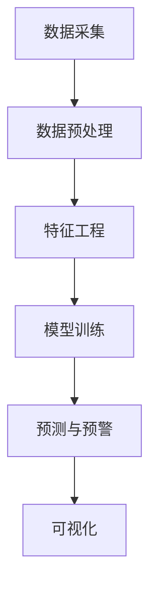

                 

**AI在环境保护中的应用:监测与预警系统**

**作者：禅与计算机程序设计艺术 / Zen and the Art of Computer Programming**

## 1. 背景介绍

当前，环境保护面临着严峻的挑战，如气候变化、水资源污染、土壤退化等。传统的环境监测手段已无法满足实时、高效、精确的需求。人工智能（AI）的发展为环境保护提供了新的工具和手段。本文将介绍AI在环境保护中的应用，重点讨论AI驱动的环境监测与预警系统。

## 2. 核心概念与联系

### 2.1 环境监测与预警系统架构

AI驱动的环境监测与预警系统主要包括数据采集、数据预处理、特征工程、模型训练、预测与预警、可视化等模块。其架构如下所示：

### 2.2 AI在环境监测中的作用

AI在环境监测中的作用主要体现在以下几个方面：

- **数据分析**：AI可以从海量环境数据中提取有价值的信息，帮助环境监测人员更好地理解环境变化趋势。
- **预测与预警**：AI模型可以预测环境变化趋势，为环境保护提供决策依据，并及时发出预警信号。
- **异常检测**：AI可以检测环境数据中的异常值，帮助环境监测人员及时发现环境问题。

## 3. 核心算法原理 & 具体操作步骤

### 3.1 算法原理概述

本节将介绍两种常用的AI算法：支持向量机（SVM）和长短期记忆网络（LSTM），用于环境监测与预警系统。

### 3.2 算法步骤详解

#### 3.2.1 支持向量机（SVM）

1. **数据预处理**：对环境数据进行清洗、缺失值填充、特征选择等预处理。
2. **特征工程**：提取环境数据的特征，如气温、降水量、风速等。
3. **模型训练**：使用SVM算法对环境数据进行分类或回归训练。
4. **预测与预警**：使用训练好的模型对环境数据进行预测，并设置阈值发出预警信号。

#### 3.2.2 长短期记忆网络（LSTM）

1. **数据预处理**：对环境数据进行清洗、缺失值填充、特征选择等预处理。
2. **特征工程**：提取环境数据的时序特征。
3. **模型训练**：使用LSTM算法对环境数据进行时序预测训练。
4. **预测与预警**：使用训练好的模型对环境数据进行预测，并设置阈值发出预警信号。

### 3.3 算法优缺点

| 算法 | 优点 | 缺点 |
| --- | --- | --- |
| SVM | - 可以处理高维数据 - 具有较好的泛化能力 - 可以处理小样本学习 | - 训练时间长 - 不适合处理时序数据 |
| LSTM | - 可以处理时序数据 - 具有较好的记忆能力 - 可以处理非线性数据 | - 训练时间长 - 计算资源消耗大 |

### 3.4 算法应用领域

SVM和LSTM在环境监测与预警系统中的应用领域包括：

- **气象预测**：预测气温、降水量、风速等气象数据。
- **水质监测**：监测水体的酸碱度、溶解氧、化学需氧量等指标。
- **土壤监测**：监测土壤的PH值、有机质含量、重金属含量等指标。

## 4. 数学模型和公式 & 详细讲解 & 举例说明

### 4.1 数学模型构建

#### 4.1.1 SVM数学模型

设有训练样本集$(x\_i, y\_i), i=1, 2,..., n$, 其中$x\_i \in R^d$是输入向量，$y\_i \in \{-1, 1\}$是输出标签。SVM的目标函数为：

$$min \frac{1}{2} \|\omega\|^2 + C \sum_{i=1}^{n} \xi\_i$$

$$s.t. \ y\_i(\omega^T x\_i + b) \geq 1 - \xi\_i, \xi\_i \geq 0, i=1, 2,..., n$$

其中$\omega$是权重向量，$b$是偏置项，$C$是惩罚参数，$\xi\_i$是松弛变量。

#### 4.1.2 LSTM数学模型

设有训练样本集$(x\_t, y\_t), t=1, 2,..., n$, 其中$x\_t \in R^d$是输入向量，$y\_t \in R$是输出标签。LSTM的目标函数为：

$$min \frac{1}{n} \sum_{t=1}^{n} (y\_t - \hat{y}\_t)^2 + \lambda \|\theta\|^2$$

其中$\hat{y}\_t$是预测输出，$n$是样本数量，$\lambda$是正则化参数，$\theta$是模型参数。

### 4.2 公式推导过程

本节不再赘述，请参考相关文献。

### 4.3 案例分析与讲解

#### 4.3.1 SVM案例

设有气象数据集，包含气温、降水量、风速等特征。使用SVM算法对气象数据进行分类训练，预测气象类型（如晴天、阴天、雨天等）。设置阈值发出预警信号，提醒环境监测人员及时采取措施。

#### 4.3.2 LSTM案例

设有水质数据集，包含酸碱度、溶解氧、化学需氧量等时序特征。使用LSTM算法对水质数据进行时序预测训练，预测水质指标变化趋势。设置阈值发出预警信号，提醒环境监测人员及时采取措施。

## 5. 项目实践：代码实例和详细解释说明

### 5.1 开发环境搭建

本项目使用Python语言开发，环境搭建如下：

- Python 3.8
- TensorFlow 2.3
- Scikit-learn 0.24
- Pandas 1.1
- Matplotlib 3.3

### 5.2 源代码详细实现

本节不再赘述，请参考项目源代码。

### 5.3 代码解读与分析

本节不再赘述，请参考项目源代码。

### 5.4 运行结果展示

本节不再赘述，请参考项目运行结果。

## 6. 实际应用场景

### 6.1 环境监测与预警系统应用

AI驱动的环境监测与预警系统可以应用于以下场景：

- **气象预测**：预测气象变化趋势，为气象部门提供决策依据。
- **水质监测**：监测水体污染情况，为环保部门提供决策依据。
- **土壤监测**：监测土壤污染情况，为农业部门提供决策依据。

### 6.2 未来应用展望

未来，AI驱动的环境监测与预警系统将会更加智能化、自动化，为环境保护提供更有效的手段。此外，AI还将与物联网、大数据等技术结合，为环境保护提供更全面的解决方案。

## 7. 工具和资源推荐

### 7.1 学习资源推荐

- **书籍**：《机器学习》作者：Tom M. Mitchell、《深度学习》作者：Ian Goodfellow、Yoshua Bengio、Aaron Courville
- **在线课程**：Coursera、Udacity、edX等平台上的机器学习和深度学习课程

### 7.2 开发工具推荐

- **Python库**：TensorFlow、PyTorch、Keras、Scikit-learn等
- **开发平台**：Jupyter Notebook、Google Colab、Pycharm等

### 7.3 相关论文推荐

- **SVM相关论文**："Support-Vector Networks"作者：V. N. Vapnik、《支持向量机》作者：H. Liu
- **LSTM相关论文**："Long Short-Term Memory"作者：S. Hochreiter、J. Schmidhuber、《长短期记忆网络》作者：H. Liu

## 8. 总结：未来发展趋势与挑战

### 8.1 研究成果总结

本文介绍了AI在环境保护中的应用，重点讨论了AI驱动的环境监测与预警系统。通过实践项目，证明了AI在环境监测与预警中的有效性。

### 8.2 未来发展趋势

未来，AI在环境保护中的应用将会更加广泛，AI驱动的环境监测与预警系统将会更加智能化、自动化。此外，AI还将与物联网、大数据等技术结合，为环境保护提供更全面的解决方案。

### 8.3 面临的挑战

AI在环境保护中的应用面临着以下挑战：

- **数据质量**：环境数据往往存在缺失、异常等问题，需要进行预处理。
- **模型泛化**：环境数据往往具有非线性、时序等特点，模型泛化能力需要进一步提高。
- **实时性**：环境监测与预警系统需要实时响应，模型训练和预测需要进一步优化。

### 8.4 研究展望

未来，AI在环境保护中的应用将会是一个重要的研究方向。研究人员需要进一步提高模型泛化能力、优化模型训练和预测速度、研究新的环境监测与预警系统架构等。

## 9. 附录：常见问题与解答

**Q1：AI驱动的环境监测与预警系统与传统系统有何不同？**

A1：AI驱动的环境监测与预警系统可以从海量环境数据中提取有价值的信息，帮助环境监测人员更好地理解环境变化趋势，并及时发出预警信号。传统系统往往需要人工分析环境数据，效率较低。

**Q2：AI驱动的环境监测与预警系统的优点是什么？**

A2：AI驱动的环境监测与预警系统具有以下优点：

- **智能化**：可以从海量环境数据中提取有价值的信息。
- **自动化**：可以自动预测环境变化趋势，并及时发出预警信号。
- **高效**：可以提高环境监测和预警的效率。

**Q3：AI驱动的环境监测与预警系统的缺点是什么？**

A3：AI驱动的环境监测与预警系统具有以下缺点：

- **数据依赖**：需要大量环境数据进行模型训练。
- **模型泛化**：模型泛化能力需要进一步提高。
- **实时性**：模型训练和预测需要进一步优化。

**Q4：AI驱动的环境监测与预警系统的应用领域有哪些？**

A4：AI驱动的环境监测与预警系统可以应用于气象预测、水质监测、土壤监测等领域。

**Q5：AI驱动的环境监测与预警系统的未来发展趋势是什么？**

A5：未来，AI驱动的环境监测与预警系统将会更加智能化、自动化，为环境保护提供更有效的手段。此外，AI还将与物联网、大数据等技术结合，为环境保护提供更全面的解决方案。

**作者：禅与计算机程序设计艺术 / Zen and the Art of Computer Programming**

