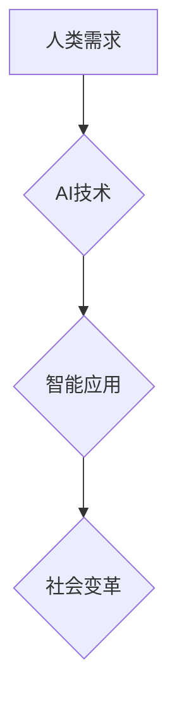

> 人工智能，深度学习，自然语言处理，计算机视觉，机器学习，伦理，社会影响

## 1. 背景介绍

人工智能（AI）正以惊人的速度发展，从简单的规则系统演变为能够学习、推理和解决复杂问题的智能系统。深度学习的兴起，特别是卷积神经网络和循环神经网络的突破，为AI带来了前所未有的能力，使其在图像识别、语音识别、自然语言处理等领域取得了令人瞩目的成就。

AI技术的快速发展对人类社会产生了深远的影响，它正在改变着我们的生活方式、工作模式和社会结构。AI驱动的自动化正在改变着生产方式，AI辅助的决策正在影响着我们的生活，AI赋能的创新正在催生着新的产业和商业模式。

然而，AI技术的发展也带来了新的挑战和风险。例如，AI算法的偏见问题、数据隐私安全问题、AI技术带来的失业问题等都需要我们认真思考和解决。

## 2. 核心概念与联系

**2.1  人工智能（AI）**

人工智能是指模拟人类智能行为的计算机系统。它涵盖了广泛的领域，包括机器学习、深度学习、自然语言处理、计算机视觉等。

**2.2  机器学习（ML）**

机器学习是人工智能的一个子领域，它使计算机能够从数据中学习，无需明确编程。机器学习算法可以根据训练数据识别模式、做出预测和决策。

**2.3  深度学习（DL）**

深度学习是机器学习的一个子领域，它使用多层神经网络来模拟人类大脑的学习过程。深度学习算法能够处理海量数据，并从中提取出复杂的特征，从而实现更准确的预测和决策。

**2.4  自然语言处理（NLP）**

自然语言处理是指使计算机能够理解、处理和生成人类语言的技术。NLP应用广泛，例如机器翻译、文本摘要、聊天机器人等。

**2.5  计算机视觉（CV）**

计算机视觉是指使计算机能够“看”和理解图像的技术。计算机视觉应用广泛，例如图像识别、物体检测、人脸识别等。

**2.6  AI与人类社会的联系**

AI技术正在深刻地改变着人类社会，它正在改变着我们的生活方式、工作模式和社会结构。

* **生活方式:** AI驱动的智能家居、智能交通、智能医疗等应用正在改变着我们的生活方式，使我们的生活更加便捷、舒适和安全。
* **工作模式:** AI驱动的自动化正在改变着我们的工作模式，一些重复性劳动将被自动化取代，而人类将更多地关注创造性工作和高层次的决策。
* **社会结构:** AI技术的发展可能会导致新的职业和产业的出现，同时也可能导致一些传统职业的消失，这将对社会结构产生深远的影响。

**Mermaid 流程图**



## 3. 核心算法原理 & 具体操作步骤

### 3.1  算法原理概述

深度学习算法的核心是多层神经网络。神经网络由多个层组成，每层包含多个神经元。神经元之间通过连接进行信息传递，每个连接都有一个权重。通过训练，神经网络可以学习到这些权重的最佳值，从而实现对数据的学习和预测。

### 3.2  算法步骤详解

1. **数据预处理:** 将原始数据转换为深度学习算法可以理解的格式，例如归一化、编码等。
2. **网络结构设计:** 根据任务需求设计神经网络的结构，包括层数、神经元数量、激活函数等。
3. **参数初始化:** 为神经网络的参数（权重和偏置）进行随机初始化。
4. **前向传播:** 将输入数据通过神经网络进行前向传播，得到输出结果。
5. **损失函数计算:** 计算输出结果与真实值的差异，即损失函数的值。
6. **反向传播:** 根据损失函数的梯度，反向传播误差，更新神经网络的参数。
7. **迭代训练:** 重复步骤4-6，直到损失函数达到预设的阈值。

### 3.3  算法优缺点

**优点:**

* 能够处理海量数据，并从中提取出复杂的特征。
* 能够实现高精度预测和决策。
* 能够不断学习和改进。

**缺点:**

* 需要大量的训练数据。
* 训练过程耗时和耗能。
* 算法的解释性和可解释性较差。

### 3.4  算法应用领域

深度学习算法应用广泛，例如：

* **图像识别:** 人脸识别、物体检测、图像分类等。
* **语音识别:** 语音转文本、语音助手等。
* **自然语言处理:** 机器翻译、文本摘要、聊天机器人等。
* **推荐系统:** 商品推荐、内容推荐等。
* **医疗诊断:** 疾病诊断、影像分析等。

## 4. 数学模型和公式 & 详细讲解 & 举例说明

### 4.1  数学模型构建

深度学习算法的核心是神经网络，神经网络可以看作是一个复杂的数学模型。神经网络的数学模型可以表示为：

$$
y = f(W x + b)
$$

其中：

* $y$ 是输出结果。
* $x$ 是输入数据。
* $W$ 是权重矩阵。
* $b$ 是偏置向量。
* $f$ 是激活函数。

### 4.2  公式推导过程

深度学习算法的训练过程是通过优化权重矩阵 $W$ 和偏置向量 $b$ 来实现的。常用的优化算法包括梯度下降法、动量法、Adam 算法等。

梯度下降法的核心思想是通过计算损失函数的梯度，不断更新权重和偏置，使得损失函数的值逐渐减小。

梯度下降法的公式如下：

$$
W = W - \alpha \frac{\partial L}{\partial W}
$$

$$
b = b - \alpha \frac{\partial L}{\partial b}
$$

其中：

* $\alpha$ 是学习率。
* $\frac{\partial L}{\partial W}$ 和 $\frac{\partial L}{\partial b}$ 是损失函数对权重和偏置的梯度。

### 4.3  案例分析与讲解

例如，在图像分类任务中，我们可以使用卷积神经网络（CNN）作为深度学习模型。CNN 可以学习图像的特征，并将其分类到不同的类别。

在训练 CNN 时，我们会使用大量的图像数据，并计算损失函数的值。然后，通过梯度下降法，不断更新 CNN 的权重和偏置，使得模型的预测精度逐渐提高。

## 5. 项目实践：代码实例和详细解释说明

### 5.1  开发环境搭建

为了实现深度学习项目，我们需要搭建一个合适的开发环境。常用的开发环境包括：

* **Python:** Python 是深度学习领域最常用的编程语言。
* **TensorFlow:** TensorFlow 是 Google 开发的开源深度学习框架。
* **PyTorch:** PyTorch 是 Facebook 开发的开源深度学习框架。
* **CUDA:** CUDA 是 NVIDIA 开发的并行计算平台，可以加速深度学习模型的训练。

### 5.2  源代码详细实现

以下是一个使用 TensorFlow 实现图像分类的简单代码示例：

```python
import tensorflow as tf

# 定义模型结构
model = tf.keras.models.Sequential([
    tf.keras.layers.Conv2D(32, (3, 3), activation='relu', input_shape=(28, 28, 1)),
    tf.keras.layers.MaxPooling2D((2, 2)),
    tf.keras.layers.Conv2D(64, (3, 3), activation='relu'),
    tf.keras.layers.MaxPooling2D((2, 2)),
    tf.keras.layers.Flatten(),
    tf.keras.layers.Dense(10, activation='softmax')
])

# 编译模型
model.compile(optimizer='adam',
              loss='sparse_categorical_crossentropy',
              metrics=['accuracy'])

# 训练模型
model.fit(x_train, y_train, epochs=5)

# 评估模型
loss, accuracy = model.evaluate(x_test, y_test)
print('Test loss:', loss)
print('Test accuracy:', accuracy)
```

### 5.3  代码解读与分析

这段代码定义了一个简单的卷积神经网络模型，用于图像分类任务。

* `tf.keras.models.Sequential` 创建了一个顺序模型，即层级结构。
* `tf.keras.layers.Conv2D` 定义了一个卷积层，用于提取图像特征。
* `tf.keras.layers.MaxPooling2D` 定义了一个最大池化层，用于降低特征图的大小。
* `tf.keras.layers.Flatten` 将多维特征图转换为一维向量。
* `tf.keras.layers.Dense` 定义了一个全连接层，用于分类。
* `model.compile` 编译模型，指定优化器、损失函数和评价指标。
* `model.fit` 训练模型，使用训练数据进行训练。
* `model.evaluate` 评估模型，使用测试数据进行评估。

### 5.4  运行结果展示

训练完成后，我们可以使用测试数据评估模型的性能。

## 6. 实际应用场景

### 6.1  医疗诊断

AI技术在医疗诊断领域有着广泛的应用，例如：

* **疾病诊断:** AI算法可以分析患者的病历、影像数据等信息，辅助医生诊断疾病。
* **影像分析:** AI算法可以分析医学影像，例如X光片、CT扫描、MRI等，辅助医生发现病灶。
* **药物研发:** AI算法可以加速药物研发过程，例如预测药物的疗效和安全性。

### 6.2  金融服务

AI技术在金融服务领域有着广泛的应用，例如：

* **欺诈检测:** AI算法可以分析交易数据，识别异常交易，防止欺诈行为。
* **风险管理:** AI算法可以分析客户数据，评估客户的信用风险，帮助金融机构进行风险管理。
* **个性化服务:** AI算法可以根据客户的个人信息和行为数据，提供个性化的金融服务。

### 6.3  智能制造

AI技术在智能制造领域有着广泛的应用，例如：

* **预测性维护:** AI算法可以分析设备运行数据，预测设备故障，进行提前维护。
* **质量控制:** AI算法可以分析产品质量数据，识别产品缺陷，提高产品质量。
* **生产优化:** AI算法可以优化生产流程，提高生产效率。

### 6.4  未来应用展望

AI技术的应用场景还在不断扩展，未来AI技术将应用于更多领域，例如：

* **教育:** AI可以个性化教学，提高学习效率。
* **交通:** AI可以实现自动驾驶，提高交通安全和效率。
* **环境保护:** AI可以监测环境污染，帮助保护环境。

## 7. 工具和资源推荐

### 7.1  学习资源推荐

* **在线课程:** Coursera、edX、Udacity 等平台提供丰富的深度学习课程。
* **书籍:** 《深度学习》、《动手学深度学习》等书籍是深度学习学习的经典教材。
* **博客:** TensorFlow、PyTorch 等框架的官方博客提供最新的技术资讯和教程。

### 7.2  开发工具推荐

* **TensorFlow:** Google 开发的开源深度学习框架，功能强大，应用广泛。
* **PyTorch:** Facebook 开发的开源深度学习框架，灵活易用，适合研究和开发。
* **Keras:** TensorFlow 的高层API，简化了深度学习模型的构建。

### 7.3  相关论文推荐

* **《ImageNet Classification with Deep Convolutional Neural Networks》:** AlexNet 的论文，标志着深度学习在图像识别领域的突破。
* **《Deep Residual Learning for Image Recognition》:** ResNet 的论文，提出了残差网络结构，解决了深度网络训练的梯度消失问题。
* **《Attention Is All You Need》:** Transformer 的论文，提出了注意力机制，在自然语言处理领域取得了突破性进展。

## 8. 总结：未来发展趋势与挑战

### 8.1  研究成果总结

近年来，深度学习技术取得了令人瞩目的