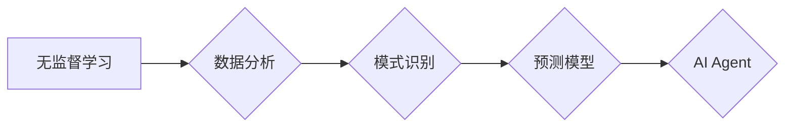

> 无监督学习，预测模型，人工智能Agent，数据分析，机器学习，异常检测，聚类分析

## 1. 背景介绍

在当今数据爆炸的时代，从海量数据中提取有价值的信息变得至关重要。人工智能（AI）作为一种强大的工具，能够帮助我们实现这一目标。其中，无监督学习作为一种重要的机器学习范式，在数据分析、模式识别和预测等领域展现出巨大的潜力。

无监督学习是指在没有明确标签的数据集上训练模型，让模型自己发现数据中的隐藏结构和规律。与监督学习不同，无监督学习不需要预先定义的输入输出关系，而是通过探索数据本身的特性来学习。

本文将深入探讨如何使用无监督学习构建预测模型，并介绍一些常见的算法和应用场景。

## 2. 核心概念与联系

### 2.1 无监督学习

无监督学习的目标是通过分析未标记的数据集，发现数据中的潜在模式、结构和关系。常见的无监督学习算法包括：

* **聚类分析:** 将数据点根据相似性分组，例如将客户根据消费习惯进行分类。
* **降维:** 将高维数据映射到低维空间，例如将图像特征压缩到更小的维度。
* **异常检测:** 识别与大多数数据点显著不同的数据点，例如检测网络攻击或欺诈行为。

### 2.2 预测模型

预测模型旨在根据历史数据预测未来事件或趋势。无监督学习可以用于构建预测模型，例如：

* **时间序列预测:** 使用历史数据预测未来时间点的值，例如预测股票价格或天气状况。
* **关联规则挖掘:** 发现数据中频繁出现的事件或模式，例如预测顾客购买哪些商品。

### 2.3 AI Agent

AI Agent是一种能够感知环境、做出决策并与环境交互的智能体。无监督学习可以用于训练AI Agent，使其能够自主学习和适应环境。

**Mermaid 流程图**



## 3. 核心算法原理 & 具体操作步骤

### 3.1 算法原理概述

本文将重点介绍一种常用的无监督学习算法——**k-means聚类算法**，用于构建预测模型。

k-means算法是一种迭代算法，其目标是将数据点划分为k个簇，每个簇包含相似的点。算法的基本步骤如下：

1. **随机选择k个初始中心点。**
2. **将每个数据点分配到最近的中心点所属的簇。**
3. **重新计算每个簇的中心点。**
4. **重复步骤2和3，直到中心点不再移动或达到最大迭代次数。**

### 3.2 算法步骤详解

1. **初始化:** 随机选择k个数据点作为初始中心点。
2. **分配:** 计算每个数据点到所有中心点的距离，并将每个数据点分配到距离最近的中心点所属的簇。
3. **更新:** 计算每个簇的中心点，即所有数据点在该簇中的平均值。
4. **迭代:** 重复步骤2和3，直到中心点不再移动或达到最大迭代次数。

### 3.3 算法优缺点

**优点:**

* 简单易懂，易于实现。
* 运行速度快，适合处理大规模数据。

**缺点:**

* 需要事先指定簇数k，选择合适的k值可能比较困难。
* 对初始中心点的选择敏感，不同的初始中心点可能导致不同的聚类结果。
* 难以处理非球形簇。

### 3.4 算法应用领域

k-means算法广泛应用于以下领域：

* **客户细分:** 将客户根据消费习惯、购买历史等特征进行分类。
* **图像压缩:** 将图像分割成多个区域，并用较少的特征表示每个区域。
* **异常检测:** 将异常数据点从正常数据集中分离出来。

## 4. 数学模型和公式 & 详细讲解 & 举例说明

### 4.1 数学模型构建

k-means算法的目标是找到一个簇划分，使得每个数据点到其所属簇中心的距离最小。

**数学模型:**

* **距离度量:** 通常使用欧氏距离作为距离度量。
* **目标函数:** 簇内平方和 (Within-cluster sum of squares, WCSS)

$$WCSS = \sum_{i=1}^{k} \sum_{x \in C_i} ||x - \mu_i||^2$$

其中:

* $k$ 是簇数。
* $C_i$ 是第i个簇。
* $x$ 是数据点。
* $\mu_i$ 是第i个簇的中心点。

### 4.2 公式推导过程

k-means算法通过迭代优化目标函数WCSS来找到最优的簇划分。

1. **初始化:** 随机选择k个数据点作为初始中心点。
2. **分配:** 计算每个数据点到所有中心点的距离，并将每个数据点分配到距离最近的中心点所属的簇。
3. **更新:** 计算每个簇的中心点，即所有数据点在该簇中的平均值。
4. **迭代:** 重复步骤2和3，直到中心点不再移动或达到最大迭代次数。

### 4.3 案例分析与讲解

假设我们有以下数据点:

```
(1, 2), (1.5, 1.8), (5, 8), (8, 8), (1, 0.6), (9, 11)
```

我们想要将这些数据点分成两个簇。

1. **初始化:** 随机选择两个数据点作为初始中心点，例如(1, 2)和(8, 8)。
2. **分配:** 计算每个数据点到两个中心点的距离，并将每个数据点分配到距离最近的中心点所属的簇。
3. **更新:** 计算每个簇的中心点，例如第一个簇的中心点为(1, 1.8)，第二个簇的中心点为(8, 8.5)。
4. **迭代:** 重复步骤2和3，直到中心点不再移动。

最终，我们得到以下两个簇:

* 簇1: (1, 2), (1.5, 1.8), (1, 0.6)
* 簇2: (5, 8), (8, 8), (9, 11)

## 5. 项目实践：代码实例和详细解释说明

### 5.1 开发环境搭建

本项目使用Python语言进行开发，需要安装以下库:

* scikit-learn: 用于机器学习算法的实现。
* matplotlib: 用于数据可视化。

可以使用以下命令安装这些库:

```bash
pip install scikit-learn matplotlib
```

### 5.2 源代码详细实现

```python
import numpy as np
from sklearn.cluster import KMeans
import matplotlib.pyplot as plt

# 生成示例数据
X = np.array([[1, 2], [1.5, 1.8], [5, 8], [8, 8], [1, 0.6], [9, 11]])

# 使用KMeans算法进行聚类
kmeans = KMeans(n_clusters=2, random_state=0)
kmeans.fit(X)

# 获取聚类结果
labels = kmeans.labels_
centroids = kmeans.cluster_centers_

# 可视化聚类结果
plt.scatter(X[:, 0], X[:, 1], c=labels, s=50, cmap='viridis')
plt.scatter(centroids[:, 0], centroids[:, 1], marker='x', s=200, c='red')
plt.title('K-Means Clustering')
plt.xlabel('Feature 1')
plt.ylabel('Feature 2')
plt.show()
```

### 5.3 代码解读与分析

1. **数据生成:** 使用NumPy生成示例数据。
2. **KMeans算法实例化:** 使用`KMeans`类实例化聚类模型，设置簇数为2，随机种子为0。
3. **模型训练:** 使用`fit()`方法训练模型，将数据点分配到不同的簇。
4. **获取聚类结果:** 使用`labels_`属性获取每个数据点的簇标签，使用`cluster_centers_`属性获取每个簇的中心点。
5. **可视化结果:** 使用Matplotlib绘制散点图，将数据点根据簇标签进行颜色区分，并标记每个簇的中心点。

### 5.4 运行结果展示

运行代码后，将生成一个散点图，将数据点根据聚类结果进行颜色区分，并标记每个簇的中心点。

## 6. 实际应用场景

### 6.1 客户细分

使用k-means算法将客户根据消费习惯、购买历史等特征进行分类，可以帮助企业制定更精准的营销策略。

### 6.2 图像压缩

将图像分割成多个区域，并用较少的特征表示每个区域，可以有效压缩图像大小。

### 6.3 异常检测

将异常数据点从正常数据集中分离出来，可以帮助企业检测欺诈行为、网络攻击等异常事件。

### 6.4 未来应用展望

随着数据量的不断增长，无监督学习在预测模型构建中的应用前景更加广阔。未来，我们可以期待看到更多基于无监督学习的预测模型，应用于更广泛的领域，例如医疗诊断、金融风险评估、交通流量预测等。

## 7. 工具和资源推荐

### 7.1 学习资源推荐

* **书籍:**
    * "Hands-On Machine Learning with Scikit-Learn, Keras & TensorFlow" by Aurélien Géron
    * "Pattern Recognition and Machine Learning" by Christopher M. Bishop
* **在线课程:**
    * Coursera: Machine Learning by Andrew Ng
    * edX: Artificial Intelligence by Columbia University

### 7.2 开发工具推荐

* **Python:** 广泛使用的编程语言，拥有丰富的机器学习库。
* **scikit-learn:** Python机器学习库，提供各种算法实现。
* **TensorFlow:** 开源深度学习框架。
* **Keras:** 高级深度学习API，易于使用。

### 7.3 相关论文推荐

* "K-Means Clustering" by Stuart Lloyd (1982)
* "A Tutorial on Principal Component Analysis" by Jolliffe (2002)

## 8. 总结：未来发展趋势与挑战

### 8.1 研究成果总结

本文介绍了无监督学习在预测模型构建中的应用，重点介绍了k-means算法及其原理、步骤和应用场景。

### 8.2 未来发展趋势

* **深度学习:** 将深度学习技术应用于无监督学习，例如使用自编码器进行降维或异常检测。
* **迁移学习:** 利用预训练模型进行无监督学习，提高模型性能和效率。
* **联邦学习:** 在保护数据隐私的前提下进行无监督学习，例如在医疗领域进行疾病诊断。

### 8.3 面临的挑战

* **数据质量:** 无监督学习算法对数据质量要求较高，需要处理缺失值、噪声等问题。
* **簇数选择:** 需要事先指定簇数，选择合适的k值可能比较困难。
* **解释性:** 无监督学习模型的解释性较差，难以理解模型的决策过程。

### 8.4 研究展望

未来，我们将继续探索无监督学习在预测模型构建中的应用，并致力于解决上述挑战，推动无监督学习技术的发展。

## 9. 附录：常见问题与解答

### 9.1 如何选择合适的k值？

可以使用肘部法则或Silhouette score等方法来选择合适的k值。

### 9.2 k-means算法对初始中心点的选择敏感吗？

是的，k-means算法对初始中心点的选择敏感。可以使用不同的随机种子或k-means++算法来选择更好的初始中心点。

### 9.3 无监督学习模型的解释性如何？

无监督学习模型的解释性