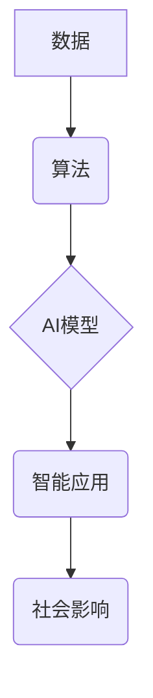

> 人工智能，奇点，大爆炸，深度学习，机器学习，自然语言处理，计算机视觉，伦理

## 1. 背景介绍

人工智能（AI）正以惊人的速度发展，从简单的规则系统到复杂的深度学习模型，AI已经渗透到我们生活的方方面面。从智能手机的语音助手到自动驾驶汽车，从医疗诊断到金融交易，AI正在改变着世界。然而，随着AI技术的不断进步，一个令人兴奋又充满挑战的未来正在向我们逼近：人工智能的“奇点”。

“奇点”这个概念最早由物理学家弗雷德·霍金提出，指的是人工智能发展到一个超越人类智能的地步，人类无法预测和控制AI的发展轨迹。这个时刻将标志着人类文明进入一个全新的时代，充满了机遇和挑战。

## 2. 核心概念与联系

**2.1 奇点概念**

奇点是一个理论上的拐点，指人工智能发展到一个超越人类智能的地步，人类无法预测和控制AI的发展轨迹。

**2.2 奇点条件**

* **指数级增长:** AI技术发展速度呈指数级增长，计算能力、数据量和算法复杂度都在不断提升。
* **自我改进:** AI系统能够自我学习和改进，不断提高自身性能，甚至能够设计出更强大的AI算法。
* **通用人工智能:**  AI系统能够像人类一样学习和解决各种问题，而不是局限于特定的任务。

**2.3 奇点影响**

* **技术飞跃:**  AI将推动科技的飞跃发展，解决人类面临的重大挑战，例如疾病、能源危机和气候变化。
* **社会变革:** AI将深刻改变社会结构和经济模式，带来新的职业和生活方式。
* **伦理困境:** AI的强大能力也带来伦理困境，例如AI的责任、隐私和控制问题。

**2.4 奇点架构**



## 3. 核心算法原理 & 具体操作步骤

**3.1 算法原理概述**

深度学习是人工智能领域最热门的技术之一，它利用多层神经网络来模拟人类大脑的学习过程。深度学习算法能够从海量数据中自动提取特征，并学习复杂的模式和关系。

**3.2 算法步骤详解**

1. **数据预处理:**  收集和清洗数据，将其转换为深度学习模型可以理解的格式。
2. **网络结构设计:**  根据任务需求设计神经网络的结构，包括层数、节点数和激活函数等。
3. **参数初始化:**  为神经网络中的参数赋予初始值。
4. **前向传播:**  将输入数据通过神经网络传递，计算输出结果。
5. **反向传播:**  计算输出结果与真实值的误差，并根据误差调整神经网络的参数。
6. **迭代训练:**  重复前向传播和反向传播的过程，直到模型性能达到预期的水平。

**3.3 算法优缺点**

* **优点:**  能够学习复杂的模式和关系，性能优于传统机器学习算法。
* **缺点:**  需要大量的训练数据，训练时间长，参数调整复杂。

**3.4 算法应用领域**

* **计算机视觉:**  图像识别、物体检测、图像分割等。
* **自然语言处理:**  文本分类、机器翻译、语音识别等。
* **推荐系统:**  根据用户行为推荐商品或内容。
* **医疗诊断:**  辅助医生诊断疾病，预测患者风险。

## 4. 数学模型和公式 & 详细讲解 & 举例说明

**4.1 数学模型构建**

深度学习模型的核心是神经网络，它由多个层组成，每层包含多个神经元。每个神经元接收来自上一层的输入信号，并通过激活函数进行处理，输出到下一层。

**4.2 公式推导过程**

* **激活函数:**  激活函数将神经元的输入信号转换为输出信号，常用的激活函数包括 sigmoid 函数、ReLU 函数等。

* **损失函数:**  损失函数衡量模型预测结果与真实值的差异，常用的损失函数包括均方误差、交叉熵等。

* **梯度下降:**  梯度下降算法用于优化模型参数，通过计算损失函数的梯度，不断调整参数，使损失函数最小化。

**4.3 案例分析与讲解**

假设我们有一个简单的线性回归模型，用于预测房价。模型输入特征包括房屋面积和房间数，输出为房价。

* **损失函数:**  均方误差

$$
L = \frac{1}{n} \sum_{i=1}^{n} (y_i - \hat{y}_i)^2
$$

其中，$y_i$ 是真实房价，$\hat{y}_i$ 是模型预测的房价，$n$ 是样本数量。

* **梯度下降:**  通过计算损失函数对模型参数的梯度，更新参数值。

$$
\theta = \theta - \alpha \nabla L(\theta)
$$

其中，$\theta$ 是模型参数，$\alpha$ 是学习率，$\nabla L(\theta)$ 是损失函数对参数的梯度。

## 5. 项目实践：代码实例和详细解释说明

**5.1 开发环境搭建**

* **操作系统:**  Linux 或 macOS
* **编程语言:**  Python
* **深度学习框架:**  TensorFlow 或 PyTorch

**5.2 源代码详细实现**

```python
import tensorflow as tf

# 定义模型
model = tf.keras.models.Sequential([
    tf.keras.layers.Dense(64, activation='relu', input_shape=(2,)),
    tf.keras.layers.Dense(1)
])

# 编译模型
model.compile(optimizer='adam', loss='mse')

# 训练模型
model.fit(X_train, y_train, epochs=10)

# 评估模型
loss = model.evaluate(X_test, y_test)
```

**5.3 代码解读与分析**

* **模型定义:**  使用 Keras 库定义一个简单的多层感知机模型，包含两层全连接层。
* **模型编译:**  使用 Adam 优化器和均方误差损失函数编译模型。
* **模型训练:**  使用训练数据训练模型，训练 epochs 次。
* **模型评估:**  使用测试数据评估模型性能，计算损失值。

**5.4 运行结果展示**

训练完成后，可以将模型应用于新的数据进行预测。

## 6. 实际应用场景

**6.1 医疗诊断**

* **疾病预测:**  利用深度学习模型分析患者的医疗影像和病历数据，预测疾病风险。
* **辅助诊断:**  帮助医生识别疾病，提高诊断准确率。

**6.2 金融交易**

* **欺诈检测:**  识别异常交易行为，防止金融欺诈。
* **风险评估:**  评估投资风险，帮助投资者做出决策。

**6.3 自动驾驶**

* **物体检测:**  识别道路上的车辆、行人和其他物体。
* **路径规划:**  规划车辆行驶路线，避免碰撞。

**6.4 未来应用展望**

* **个性化教育:**  根据学生的学习情况提供个性化的学习方案。
* **智能客服:**  提供24小时在线客服服务，解决客户问题。
* **科学研究:**  加速科学研究，解决复杂科学问题。

## 7. 工具和资源推荐

**7.1 学习资源推荐**

* **书籍:**  《深度学习》
* **在线课程:**  Coursera、edX、Udacity

**7.2 开发工具推荐**

* **深度学习框架:**  TensorFlow、PyTorch
* **编程语言:**  Python

**7.3 相关论文推荐**

* **ImageNet Classification with Deep Convolutional Neural Networks**
* **Attention Is All You Need**

## 8. 总结：未来发展趋势与挑战

**8.1 研究成果总结**

近年来，人工智能领域取得了显著进展，深度学习算法在多个领域取得了突破性成果。

**8.2 未来发展趋势**

* **更强大的模型:**  开发更强大的深度学习模型，能够解决更复杂的问题。
* **更广泛的应用:**  将人工智能技术应用到更多领域，例如医疗、教育、金融等。
* **更安全的AI:**  研究如何确保人工智能技术安全可靠，避免潜在的风险。

**8.3 面临的挑战**

* **数据获取和隐私问题:**  深度学习算法需要大量的训练数据，如何获取高质量数据并保护用户隐私是一个挑战。
* **算法解释性和可解释性:**  深度学习模型的决策过程往往难以理解，如何提高算法的解释性和可解释性是一个重要问题。
* **伦理和社会影响:**  人工智能技术的快速发展带来伦理和社会问题，需要认真思考和应对。

**8.4 研究展望**

未来，人工智能研究将继续朝着更强大、更安全、更可解释的方向发展。我们需要加强跨学科合作，探索人工智能技术的潜在应用，并制定相应的政策和法规，引导人工智能技术健康发展。

## 9. 附录：常见问题与解答

**9.1 什么是深度学习？**

深度学习是一种机器学习的子领域，它利用多层神经网络来模拟人类大脑的学习过程。

**9.2 深度学习有什么优势？**

深度学习能够学习复杂的模式和关系，性能优于传统机器学习算法。

**9.3 如何学习深度学习？**

可以通过阅读书籍、参加在线课程、参与开源项目等方式学习深度学习。

**9.4 深度学习有哪些应用场景？**

深度学习应用广泛，例如计算机视觉、自然语言处理、推荐系统等。


作者：禅与计算机程序设计艺术 / Zen and the Art of Computer Programming 
<end_of_turn>