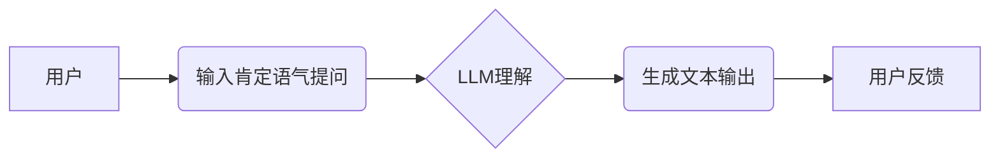

> AI大模型,Prompt提示词,肯定语气,提问技巧,自然语言处理,文本生成

## 1. 背景介绍

近年来，大语言模型（LLM）的蓬勃发展，如GPT-3、LaMDA、BERT等，为自然语言处理（NLP）领域带来了革命性的变革。这些模型凭借其强大的文本生成、理解和翻译能力，在聊天机器人、文本摘要、机器翻译等领域展现出巨大的应用潜力。然而，LLM的性能很大程度上取决于输入的Prompt提示词的质量。

Prompt提示词是与LLM交互的关键环节，它引导模型生成期望的输出。一个精心设计的Prompt提示词可以显著提升模型的准确率、流畅度和创造力。反之，一个模糊、不清晰的Prompt提示词则会导致模型输出偏差、不完整甚至毫无意义。

## 2. 核心概念与联系

**2.1 Prompt提示词的定义**

Prompt提示词是指用户向LLM输入的一系列文本，用于引导模型完成特定任务。它可以包含任务描述、上下文信息、示例数据等。

**2.2 肯定语气提问的优势**

肯定语气提问是指以肯定的语气表述问题，例如“请生成一首关于春天的诗歌”而不是“你能生成一首关于春天的诗歌吗？”。

使用肯定语气提问可以带来以下优势：

* **更明确的指令:** 肯定语气提问直接表明了用户的期望，减少了模型的理解偏差。
* **提升模型自信:** 肯定语气提问暗示了模型的能力，可以增强模型的自信心，使其更积极地完成任务。
* **促进更流畅的对话:** 肯定语气提问更自然、更流畅，可以促进与模型之间的更自然的交互。

**2.3 核心概念架构**



## 3. 核心算法原理 & 具体操作步骤

**3.1 算法原理概述**

LLM的训练基于深度学习算法，特别是Transformer模型架构。这些模型通过学习大量的文本数据，掌握了语言的语法、语义和上下文关系。

当用户输入肯定语气提问时，LLM会首先将文本进行词嵌入，将每个词转换为向量表示。然后，LLM会利用Transformer模型的注意力机制，分析输入文本的上下文关系，并根据训练数据中的知识和模式，生成符合用户期望的文本输出。

**3.2 算法步骤详解**

1. **词嵌入:** 将输入文本中的每个词转换为向量表示。
2. **编码:** 利用Transformer模型的编码器，将词向量序列编码成上下文表示。
3. **解码:** 利用Transformer模型的解码器，根据编码后的上下文表示，生成目标文本序列。
4. **输出:** 将生成的文本序列解码成可读文本。

**3.3 算法优缺点**

**优点:**

* 强大的文本生成能力
* 能够理解和处理复杂的语言结构
* 可迁移学习，在不同任务上表现出色

**缺点:**

* 训练成本高
* 容易受到训练数据偏差的影响
* 对长文本处理能力有限

**3.4 算法应用领域**

* 聊天机器人
* 文本摘要
* 机器翻译
* 代码生成
* 内容创作

## 4. 数学模型和公式 & 详细讲解 & 举例说明

**4.1 数学模型构建**

LLM的训练基于最大似然估计（MLE）的目标函数，旨在最大化模型在训练数据上生成的文本概率。

**4.2 公式推导过程**

假设训练数据为{(x1, y1), (x2, y2), ..., (xn, yn)}，其中xi为输入文本序列，yi为目标文本序列。

LLM的目标函数为：

$$
\mathcal{L} = \prod_{i=1}^{n} P(y_i | x_i)
$$

其中，P(yi | xi)为模型在给定输入xi的情况下生成目标文本yi的概率。

**4.3 案例分析与讲解**

例如，训练一个生成诗歌的LLM，我们可以使用大量的诗歌作为训练数据。模型通过学习这些诗歌的语法、韵律和主题，最终能够生成符合诗歌风格的新诗。

## 5. 项目实践：代码实例和详细解释说明

**5.1 开发环境搭建**

可以使用Python语言和相关的深度学习框架，例如TensorFlow或PyTorch，搭建LLM的开发环境。

**5.2 源代码详细实现**

```python
# 使用TensorFlow搭建LLM模型
import tensorflow as tf

# 定义模型架构
model = tf.keras.Sequential([
    # ...
])

# 编译模型
model.compile(optimizer='adam', loss='sparse_categorical_crossentropy', metrics=['accuracy'])

# 训练模型
model.fit(x_train, y_train, epochs=10)

# 生成文本
text = model.predict(input_text)
```

**5.3 代码解读与分析**

这段代码展示了使用TensorFlow搭建LLM模型的基本流程。

* 首先，定义了模型架构，包括多个神经网络层。
* 然后，编译模型，指定优化器、损失函数和评估指标。
* 最后，训练模型，并使用训练好的模型生成文本。

**5.4 运行结果展示**

训练好的LLM模型可以用于生成各种文本，例如诗歌、故事、文章等。

## 6. 实际应用场景

**6.1 聊天机器人**

LLM可以用于构建更智能、更自然的聊天机器人，能够理解用户的意图，并提供更精准、更人性化的回复。

**6.2 文本摘要**

LLM可以自动生成文本摘要，提取文本的关键信息，节省用户阅读时间。

**6.3 机器翻译**

LLM可以实现跨语言的文本翻译，提高跨文化交流的效率。

**6.4 未来应用展望**

LLM在未来将有更广泛的应用场景，例如：

* 个性化教育
* 自动写作
* 代码生成
* 医疗诊断

## 7. 工具和资源推荐

**7.1 学习资源推荐**

* **书籍:**
    * 《深度学习》
    * 《自然语言处理》
* **在线课程:**
    * Coursera
    * edX

**7.2 开发工具推荐**

* **TensorFlow:** https://www.tensorflow.org/
* **PyTorch:** https://pytorch.org/

**7.3 相关论文推荐**

* **Attention Is All You Need:** https://arxiv.org/abs/1706.03762
* **BERT: Pre-training of Deep Bidirectional Transformers for Language Understanding:** https://arxiv.org/abs/1810.04805

## 8. 总结：未来发展趋势与挑战

**8.1 研究成果总结**

近年来，LLM取得了显著的进展，在文本生成、理解和翻译等任务上表现出色。

**8.2 未来发展趋势**

* **模型规模更大:** 随着计算能力的提升，LLM的规模将进一步扩大，性能将得到进一步提升。
* **多模态学习:** LLM将与其他模态数据，例如图像、音频、视频等进行融合，实现更全面的理解和生成。
* **可解释性增强:** 研究者将致力于提高LLM的可解释性，使模型的决策过程更加透明。

**8.3 面临的挑战**

* **数据偏见:** LLM容易受到训练数据中的偏见影响，需要开发更有效的去偏见方法。
* **安全风险:** LLM可能被用于生成虚假信息、恶意代码等，需要加强安全防护。
* **伦理问题:** LLM的应用引发了伦理问题，例如版权问题、隐私问题等，需要进行深入探讨和规范。

**8.4 研究展望**

未来，LLM将继续朝着更强大、更安全、更可解释的方向发展，为人类社会带来更多福祉。

## 9. 附录：常见问题与解答

**9.1 如何选择合适的Prompt提示词？**

* 明确任务目标
* 提供充足的上下文信息
* 使用简洁、准确的语言
* 避免歧义和模糊性

**9.2 如何解决LLM生成的文本质量问题？**

* 优化训练数据
* 调整模型参数
* 使用文本生成技巧


作者：禅与计算机程序设计艺术 / Zen and the Art of Computer Programming 
<end_of_turn>