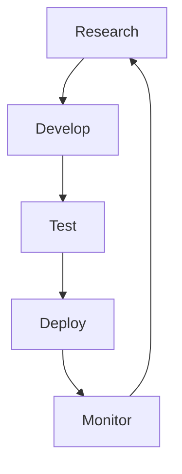

                 

**ChatGPT背后的推手——OpenAI**

## 1. 背景介绍

OpenAI 是一家非营利人工智能研究机构，于2015年由伊隆·马斯克、彼得·蒂尔、雷·库兹韦尔等人共同创立。其目标是“确保人工智能的益处遍及全人类”，并开发出安全、有益的人工智能。OpenAI 的贡献之一就是创造了ChatGPT，一个强大的对话式人工智能模型，引领了当今人工智能领域的发展。

## 2. 核心概念与联系

OpenAI 的核心概念之一是“指数级别的技术进步”，他们认为人工智能的发展将会以指数级速度加快。OpenAI 的研究重点是开发通用人工智能（AGI），一种可以理解、学习和应用任何智能任务的系统。

### 2.1 核心架构

OpenAI 的核心架构可以用下面的 Mermaid 流程图表示：



### 2.2 核心算法

OpenAI 使用各种算法，包括深度学习、强化学习和无监督学习等，来训练和改进其模型。其中，transformer 模型是 OpenAI 许多先进模型的基础，包括 ChatGPT。

## 3. 核心算法原理 & 具体操作步骤

### 3.1 算法原理概述

ChatGPT 是基于 transformer 模型的，它使用自注意力机制（self-attention mechanism）来处理输入序列。自注意力机制允许模型在处理序列时考虑到序列中每个位置的上下文。

### 3.2 算法步骤详解

1. **预处理**：将输入文本转换为模型可以理解的表示形式，通常是 tokenization（分词）和 embedding（嵌入）。
2. **编码**：使用 transformer 编码器将输入序列转换为上下文相关的表示。
3. **解码**：使用 transformer 解码器生成输出序列，每个时间步骤生成一个 token。
4. **训练**：使用监督学习的方法，模型学习预测下一个 token 的分布。
5. **微调**：在特定任务上进一步训练模型，以改进其性能。

### 3.3 算法优缺点

**优点**：transformer 模型可以处理长序列，并考虑到序列中每个位置的上下文。这使得它非常适合于自然语言处理任务。

**缺点**：transformer 模型计算复杂度高，需要大量的计算资源。此外，它可能会受到过拟合和泄漏问题的影响。

### 3.4 算法应用领域

ChatGPT 等 transformer 模型在自然语言处理领域有着广泛的应用，包括文本生成、翻译、问答系统等。它们还可以应用于其他领域，如图像和视频理解。

## 4. 数学模型和公式 & 详细讲解 & 举例说明

### 4.1 数学模型构建

transformer 模型的数学模型可以表示为：

$$h_i = \text{Attention}(Q_i, K, V) + \text{FFN}(h_i)$$

其中，$h_i$ 是第 $i$ 个位置的表示，$Q_i$, $K$, $V$ 是查询、键和值向量，$Attention$ 是自注意力函数，$FFN$ 是前馈网络。

### 4.2 公式推导过程

自注意力函数可以表示为：

$$\text{Attention}(Q, K, V) = \text{softmax}\left(\frac{QK^T}{\sqrt{d_k}}\right)V$$

其中，$d_k$ 是键向量的维度。

### 4.3 案例分析与讲解

例如，在文本生成任务中，模型需要预测下一个 token。给定输入序列 $x = [x_1, x_2,..., x_n]$，模型首先生成查询、键和值向量，然后使用自注意力函数生成上下文相关的表示，最后使用前馈网络生成下一个 token 的分布。

## 5. 项目实践：代码实例和详细解释说明

### 5.1 开发环境搭建

要训练 transformer 模型，您需要一个支持 GPU 加速的 Python 环境，并安装相关的库，如 PyTorch、Transformers、Datasets 等。

### 5.2 源代码详细实现

以下是一个简单的 transformer 模型的 Python 实现：

```python
import torch
from torch import nn

class Transformer(nn.Module):
    def __init__(self, d_model, n_head, ff_dim, dropout=0.1):
        super(Transformer, self).__init__()
        self.att = nn.MultiheadAttention(d_model, n_head)
        self.ffn = nn.Sequential(
            nn.Linear(d_model, ff_dim),
            nn.ReLU(),
            nn.Linear(ff_dim, d_model)
        )
        self.dropout = nn.Dropout(dropout)
        self.norm1 = nn.LayerNorm(d_model)
        self.norm2 = nn.LayerNorm(d_model)

    def forward(self, x):
        x = self.norm1(x)
        x = self.att(x, x, x)[0] + x
        x = self.norm2(x)
        x = self.ffn(x) + x
        return x
```

### 5.3 代码解读与分析

这个模型包含一个自注意力层和一个前馈网络。自注意力层使用多头注意力机制，前馈网络使用 ReLU 激活函数。模型使用 LayerNorm 进行标准化。

### 5.4 运行结果展示

在训练 transformer 模型后，您可以使用它来生成文本。例如：

```python
model = Transformer(d_model=512, n_head=8, ff_dim=2048)
model.load_state_dict(torch.load('transformer_model.pt'))
model.eval()

input_text = "Once upon a time, there was a"
input_ids = tokenizer.encode(input_text, return_tensors="pt")
output_ids = model.generate(input_ids, max_length=50)
output_text = tokenizer.decode(output_ids[0], skip_special_tokens=True)
print(output_text)
```

这将生成一个基于输入文本的文本片段。

## 6. 实际应用场景

### 6.1 当前应用

ChatGPT 等 transformer 模型已经在各种应用中得到广泛使用，包括搜索引擎、虚拟助手、文本编辑器等。

### 6.2 未来应用展望

未来，transformer 模型可能会应用于更复杂的任务，如自动驾驶、医疗诊断等。它们还可能会被用于开发更先进的人工智能系统，如通用人工智能。

## 7. 工具和资源推荐

### 7.1 学习资源推荐

- "Attention is All You Need" 论文：<https://arxiv.org/abs/1706.03762>
- "The Illustrated Transformer" 博客：<https://jalammar.github.io/illustrated-transformer/>
- "Hugging Face Transformers" 文档：<https://huggingface.co/transformers/>

### 7.2 开发工具推荐

- PyTorch：<https://pytorch.org/>
- Transformers 库：<https://huggingface.co/transformers/>
- Datasets 库：<https://huggingface.co/datasets/>

### 7.3 相关论文推荐

- "Language Models are Few-Shot Learners"：<https://arxiv.org/abs/2005.14165>
- "Emergent Abilities of Large Language Models"：<https://arxiv.org/abs/2206.11763>

## 8. 总结：未来发展趋势与挑战

### 8.1 研究成果总结

OpenAI 的研究成果，包括 ChatGPT，展示了 transformer 模型在自然语言处理领域的强大能力。

### 8.2 未来发展趋势

未来，人工智能研究将继续关注通用人工智能的开发，并寻求改进模型的安全性和可解释性。

### 8.3 面临的挑战

人工智能面临的挑战包括计算资源的限制、模型的可解释性、安全性和偏见等问题。

### 8.4 研究展望

未来的研究将关注开发更先进的模型架构，改进模型的训练方法，并开发新的评估指标。

## 9. 附录：常见问题与解答

**Q：ChatGPT 是如何工作的？**

A：ChatGPT 是基于 transformer 模型的，它使用自注意力机制来处理输入序列，并生成输出序列。

**Q：如何训练 transformer 模型？**

A：训练 transformer 模型需要大量的数据和计算资源。您需要收集数据，预处理数据，构建模型，并使用反向传播算法训练模型。

**Q：transformer 模型有什么优缺点？**

A：transformer 模型的优点是可以处理长序列，并考虑到序列中每个位置的上下文。其缺点是计算复杂度高，需要大量的计算资源。

**作者：禅与计算机程序设计艺术 / Zen and the Art of Computer Programming**

