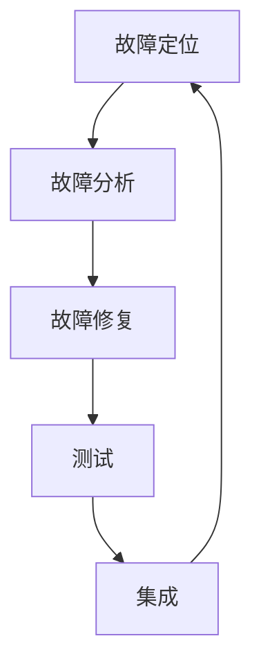

                 

**大型语言模型（LLM）对传统软件维护方法的挑战与改进**

## 1. 背景介绍

在软件开发领域，维护现有代码是一项持续的任务，需要不断地修复 bug、添加新功能、优化性能，以确保软件的可靠性和竞争力。然而，随着软件系统的复杂性不断增加，传统的软件维护方法面临着越来越多的挑战。大型语言模型（LLM）的出现为传统软件维护方法带来了颠覆性的变化，本文将探讨 LLMs 对传统软件维护方法的挑战和改进。

## 2. 核心概念与联系

### 2.1 大型语言模型（LLM）

大型语言模型是一种深度学习模型，通过处理大量文本数据来学习语言的结构和语义。LLMs 可以生成人类语言、翻译、总结、回答问题，甚至编写代码。它们的能力源于其庞大的参数量和训练数据量。

### 2.2 传统软件维护方法

传统软件维护方法主要包括以下几个步骤：

1. **故障定位**：识别和定位软件中的错误。
2. **故障分析**：理解错误的原因和影响。
3. **故障修复**：修改代码以解决错误。
4. **测试**：验证修复后的代码是否有效。
5. **集成**：将修复后的代码集成到主代码库中。

### 2.3 Mermaid 流程图



## 3. 核心算法原理 & 具体操作步骤

### 3.1 算法原理概述

LLMs 可以应用于软件维护的各个阶段。在故障定位和故障分析阶段，LLMs 可以帮助开发人员理解代码的意图，并生成可能的故障原因。在故障修复阶段，LLMs 可以生成修复代码。在测试阶段，LLMs 可以生成测试用例。在集成阶段，LLMs 可以帮助开发人员理解代码的变化，并生成相应的集成策略。

### 3.2 算法步骤详解

1. **故障定位和故障分析**：LLMs 可以接受错误消息和代码作为输入，并生成可能的故障原因。开发人员可以根据 LLMs 的输出进行进一步的调查。
2. **故障修复**：LLMs 可以接受错误代码和修复意图作为输入，并生成修复代码。开发人员可以审查 LLMs 的输出，并进行必要的修改。
3. **测试**：LLMs 可以接受代码和测试意图作为输入，并生成测试用例。开发人员可以运行 LLMs 生成的测试用例，并根据结果进行调整。
4. **集成**：LLMs 可以接受代码变化和集成意图作为输入，并生成相应的集成策略。开发人员可以根据 LLMs 的输出进行集成。

### 3.3 算法优缺点

**优点**：

* LLMs 可以帮助开发人员节省时间和精力。
* LLMs 可以提供新的视角和见解。
* LLMs 可以帮助开发人员学习和理解代码。

**缺点**：

* LLMs 的输出需要开发人员进行审查和修改。
* LLMs 的性能取决于其训练数据和参数量。
* LLMs 可能会生成不正确或不合理的输出。

### 3.4 算法应用领域

LLMs 可以应用于各种软件维护任务，包括 bug 修复、代码重构、代码生成、测试用例生成等。它们可以帮助开发人员提高工作效率，并改善软件的质量。

## 4. 数学模型和公式 & 详细讲解 & 举例说明

### 4.1 数学模型构建

LLMs 的数学模型通常是基于Transformer架构的深度学习模型。Transformer模型使用自注意力机制来处理输入序列，并生成输出序列。LLMs 的数学模型可以表示为：

$$LLM = f_{\theta}(x)$$

其中，$f_{\theta}$ 是参数化的Transformer模型，$x$ 是输入序列，$LLM$ 是输出序列。

### 4.2 公式推导过程

LLMs 的训练过程涉及到最大似然估计（MLE）和反向传播（BP）算法。在训练过程中，LLMs 学习最大化输出序列的概率分布。具体地说，LLMs 的训练目标是最小化交叉熵损失函数：

$$L(\theta) = -\frac{1}{N}\sum_{i=1}^{N}\sum_{j=1}^{T}\log P(y_{i,j}|y_{i,<j},\theta)$$

其中，$N$ 是训练样本的数量，$T$ 是输出序列的长度，$y_{i,j}$ 是输出序列的第$i$个样本的第$j$个 token，$P(y_{i,j}|y_{i,<j},\theta)$ 是条件概率分布。

### 4.3 案例分析与讲解

例如，假设我们想要使用 LLM 来修复一个 bug。我们可以将错误代码和修复意图作为输入提供给 LLM：

输入：
```
错误代码：def divide(x, y): return x / y
修复意图：添加异常处理以避免除以零
```

输出：
```
def divide(x, y):
    if y == 0:
        raise ValueError("Cannot divide by zero")
    return x / y
```

在本例中，LLM 生成的代码添加了异常处理，以避免除以零的错误。

## 5. 项目实践：代码实例和详细解释说明

### 5.1 开发环境搭建

要使用 LLM 进行软件维护，我们需要一个支持 Python 的开发环境，并安装必要的库，如 Transformers、Torch、Numpy 等。我们还需要训练或下载一个预训练的 LLM。

### 5.2 源代码详细实现

以下是一个简单的 Python 脚本，演示如何使用 LLM 来修复 bug：

```python
from transformers import AutoTokenizer, AutoModelForSeq2SeqLM

# 加载预训练的 LLM
tokenizer = AutoTokenizer.from_pretrained("bigscience/bloom")
model = AutoModelForSeq2SeqLM.from_pretrained("bigscience/bloom")

# 准备输入
input_text = "错误代码：def divide(x, y): return x / y\n修复意图：添加异常处理以避免除以零"

# 编码输入
input_ids = tokenizer.encode(input_text, return_tensors="pt")

# 生成输出
output_ids = model.generate(input_ids, max_length=512, num_beams=5, early_stopping=True)
output_text = tokenizer.decode(output_ids[0], skip_special_tokens=True)

# 打印输出
print(output_text)
```

### 5.3 代码解读与分析

在本例中，我们使用 Hugging Face Transformers 库加载预训练的 LLM。我们准备一个输入字符串，包含错误代码和修复意图。我们使用 tokenizer 将输入字符串编码为输入 IDs，然后使用 model.generate() 方法生成输出 IDs。最后，我们使用 tokenizer 解码输出 IDs，并打印输出文本。

### 5.4 运行结果展示

当我们运行上述脚本时，LLM 生成的输出应该类似于：

```
def divide(x, y):
    if y == 0:
        raise ValueError("Cannot divide by zero")
    return x / y
```

## 6. 实际应用场景

LLMs 可以应用于各种软件维护任务，包括 bug 修复、代码重构、代码生成、测试用例生成等。它们可以帮助开发人员提高工作效率，并改善软件的质量。

### 6.1 当前应用

当前，LLMs 已经被应用于各种软件维护任务。例如，GitHub Copilot 是一个基于 LLM 的代码生成工具，可以帮助开发人员编写代码。另一个例子是 DeepCode，它是一个基于 LLM 的代码审查工具，可以帮助开发人员发现 bug 和安全漏洞。

### 6.2 未来应用展望

随着 LLM 技术的不断发展，我们可以期待 LLMs 在软件维护领域发挥更大的作用。未来，LLMs 可能会帮助开发人员自动修复 bug、重构代码、生成测试用例，甚至自动编写代码。它们还可以帮助开发人员理解代码的意图，并提供更好的代码建议。

## 7. 工具和资源推荐

### 7.1 学习资源推荐

* "Attention is All You Need" - 论文：<https://arxiv.org/abs/1706.03762>
* "Language Models are Few-Shot Learners" - 论文：<https://arxiv.org/abs/2005.14165>
* "BigScience: A Collaborative Open Science Laboratory for Emergent AI" - 网站：<https://bigscience.huggingface.co/>

### 7.2 开发工具推荐

* Hugging Face Transformers - 库：<https://huggingface.co/transformers/>
* Jupyter Notebook - 工具：<https://jupyter.org/>
* GitHub Copilot - 工具：<https://copilot.github.com/>

### 7.3 相关论文推荐

* "CodeX: Generating Code via Large Language Models" - 论文：<https://arxiv.org/abs/2107.03246>
* "DeepCode: Intelligent Code Review via Deep Learning" - 论文：<https://arxiv.org/abs/1703.03914>

## 8. 总结：未来发展趋势与挑战

### 8.1 研究成果总结

本文介绍了 LLMs 在软件维护领域的应用，并讨论了 LLMs 对传统软件维护方法的挑战和改进。我们展示了 LLMs 可以帮助开发人员节省时间和精力，并改善软件的质量。我们还讨论了 LLMs 的数学模型、训练过程和应用场景。

### 8.2 未来发展趋势

LLMs 的发展正在改变软件维护的方式。未来，LLMs 可能会帮助开发人员自动修复 bug、重构代码、生成测试用例，甚至自动编写代码。它们还可以帮助开发人员理解代码的意图，并提供更好的代码建议。

### 8.3 面临的挑战

然而，LLMs 也面临着挑战。首先，LLMs 的性能取决于其训练数据和参数量。其次，LLMs 的输出需要开发人员进行审查和修改。最后，LLMs 可能会生成不正确或不合理的输出。

### 8.4 研究展望

未来的研究应该关注如何改进 LLMs 的性能和可靠性。此外，研究还应该关注如何将 LLMs 与其他软件维护工具集成，以提供更好的用户体验。最后，研究还应该关注如何使用 LLMs 来改善软件的安全性和可靠性。

## 9. 附录：常见问题与解答

**Q：LLMs 可以自动修复所有 bug 吗？**

A：不，LLMs 无法自动修复所有 bug。它们需要开发人员进行审查和修改。

**Q：LLMs 可以帮助我理解代码吗？**

A：是的，LLMs 可以帮助开发人员理解代码。它们可以生成代码的解释和建议。

**Q：LLMs 可以帮助我编写代码吗？**

A：是的，LLMs 可以帮助开发人员编写代码。它们可以生成代码片段和建议。

**Q：LLMs 可以帮助我测试代码吗？**

A：是的，LLMs 可以帮助开发人员测试代码。它们可以生成测试用例和建议。

**Q：LLMs 可以帮助我重构代码吗？**

A：是的，LLMs 可以帮助开发人员重构代码。它们可以生成重构建议和代码片段。

## 作者：禅与计算机程序设计艺术 / Zen and the Art of Computer Programming

**版权声明**：本文版权归作者所有，未经许可不得转载。

