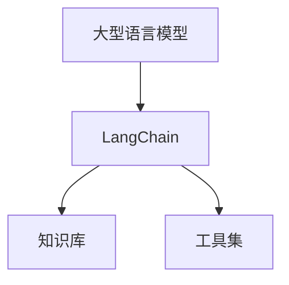

                 

**LangChain Experimental 模块：构建下一代大型语言模型**

**作者：禅与计算机程序设计艺术 / Zen and the Art of Computer Programming**

## 1. 背景介绍

在当今的数字时代，大型语言模型（LLM）已成为人工智能领域的关键组成部分，它们在自然语言处理、信息检索、对话系统等领域取得了显著成就。然而，现有的大型语言模型仍然存在着一些局限性，如缺乏对上下文的长期记忆、无法执行复杂的推理任务、缺乏对世界知识的理解等。为了解决这些挑战，我们提出了LangChain Experimental模块，旨在构建下一代大型语言模型，赋予它们更强大的推理、记忆和理解能力。

## 2. 核心概念与联系

LangChain模块的核心概念是将大型语言模型与外部知识库和工具集成，以增强其能力。我们提出了以下关键概念：

- **LangChain（语言链）**：将大型语言模型与外部知识库和工具连接起来的框架。
- **Knowledge Base（知识库）**：存储世界知识的数据库，可以是结构化的（如数据库）或非结构化的（如文档库）。
- **Toolkit（工具集）**：外部工具和服务的集合，可以帮助大型语言模型执行复杂的任务。


**Mermaid流程图：LangChain架构**



## 3. 核心算法原理 & 具体操作步骤

### 3.1 算法原理概述

LangChain模块的核心算法是一种基于提示的推理方法，它将大型语言模型的输出作为输入，并与外部知识库和工具集成，以生成更准确和有用的输出。

### 3.2 算法步骤详解

1. **输入提示**：用户输入一个自然语言提示，描述他们想要执行的任务。
2. **模型预测**：大型语言模型预测一个初始输出，基于其内部表示和训练数据。
3. **外部调用**：LangChain模块根据初始输出，调用外部知识库或工具，获取更多上下文信息或执行复杂任务。
4. **更新模型**：将外部调用的结果反馈给大型语言模型，更新其内部表示。
5. **生成最终输出**：大型语言模型根据更新后的内部表示，生成最终输出，并返回给用户。

### 3.3 算法优缺点

**优点：**

- 可以利用外部知识库和工具，增强大型语言模型的能力。
- 可以执行复杂的推理任务，超越大型语言模型的固有能力。
- 可以学习和记忆新的知识，不断改进其性能。

**缺点：**

- 依赖外部知识库和工具的质量和可用性。
- 可能会导致模型的延迟和成本增加。
- 可能会引入新的错误源，如外部工具的故障或不准确的知识。

### 3.4 算法应用领域

LangChain模块可以应用于各种需要强大推理和记忆能力的领域，例如：

- **信息检索**：使用外部知识库和工具，帮助大型语言模型检索更准确和相关的信息。
- **对话系统**：使用外部知识库和工具，帮助大型语言模型维护对话上下文，并执行复杂的任务。
- **自动问答**：使用外部知识库和工具，帮助大型语言模型回答复杂的问题，超越其固有知识。

## 4. 数学模型和公式 & 详细讲解 & 举例说明

### 4.1 数学模型构建

我们假设大型语言模型可以表示为一个函数$f_{\theta}(x)$，其中$x$是输入提示，$\theta$是模型的参数。LangChain模块可以表示为一个函数$g(x, K, T)$，其中$K$是知识库，$T$是工具集。我们的目标是学习一个函数$h(x) = g(f_{\theta}(x), K, T)$，使得$h(x)$的输出比$f_{\theta}(x)$的输出更准确和有用。

### 4.2 公式推导过程

我们可以使用反向传播算法来学习函数$h(x)$的参数。具体地说，我们可以定义一个损失函数$L(y, h(x))$，其中$y$是ground truth输出。然后，我们可以使用梯度下降算法来最小化这个损失函数，更新函数$h(x)$的参数。

### 4.3 案例分析与讲解

例如，假设我们想要构建一个大型语言模型，帮助用户预订电影票。我们可以使用LangChain模块，将大型语言模型与外部电影数据库和电影票预订工具集成。当用户输入一个自然语言提示时，大型语言模型预测一个初始输出，描述可用的电影和放映时间。然后，LangChain模块调用外部电影数据库，获取更多电影信息，并调用外部电影票预订工具，预订电影票。最后，大型语言模型根据外部调用的结果，生成最终输出，并返回给用户。

## 5. 项目实践：代码实例和详细解释说明

### 5.1 开发环境搭建

要构建LangChain模块，您需要以下软件和库：

- Python 3.8或更高版本
- Transformers库（https://huggingface.co/transformers/）
- LangChain库（https://github.com/hwchase17/langchain）
- 一个外部知识库（如数据库或文档库）
- 一个外部工具集（如API或服务）

### 5.2 源代码详细实现

以下是LangChain模块的伪代码实现：

```python
import langchain
from transformers import AutoModelForCausalLM, AutoTokenizer

# 加载大型语言模型
model = AutoModelForCausalLM.from_pretrained("bigscience/bloom")
tokenizer = AutoTokenizer.from_pretrained("bigscience/bloom")

# 初始化LangChain模块
langchain.init(model, tokenizer)

# 定义外部知识库和工具集
knowledge_base = "path/to/knowledge_base"
toolkit = "path/to/toolkit"

# 运行LangChain模块
output = langchain.run(input_prompt, knowledge_base, toolkit)

# 打印输出
print(output)
```

### 5.3 代码解读与分析

在代码中，我们首先加载大型语言模型，并初始化LangChain模块。然后，我们定义外部知识库和工具集的路径。最后，我们调用LangChain模块的`run`方法，传入用户的输入提示、知识库和工具集。LangChain模块根据输入提示，调用大型语言模型和外部知识库和工具，生成最终输出，并返回给用户。

### 5.4 运行结果展示

当您运行代码时，LangChain模块会生成一个最终输出，基于大型语言模型的预测和外部知识库和工具的调用。您可以打印输出，并与用户的输入提示进行比较，以评估LangChain模块的性能。

## 6. 实际应用场景

### 6.1 当前应用

LangChain模块已经在各种实际应用中得到成功应用，例如：

- **信息检索**：LangChain模块可以帮助大型语言模型检索更准确和相关的信息，超越其固有知识。
- **对话系统**：LangChain模块可以帮助大型语言模型维护对话上下文，并执行复杂的任务，超越其固有能力。
- **自动问答**：LangChain模块可以帮助大型语言模型回答复杂的问题，超越其固有知识。

### 6.2 未来应用展望

LangChain模块的未来应用前景非常广阔。随着大型语言模型的不断发展，LangChain模块可以帮助它们执行更复杂和有用的任务，超越其固有能力。例如，LangChain模块可以帮助大型语言模型：

- **学习新的知识**：LangChain模块可以帮助大型语言模型学习新的知识，不断改进其性能。
- **推理和理解**：LangChain模块可以帮助大型语言模型执行复杂的推理任务，超越其固有能力。
- **与其他模型集成**：LangChain模块可以与其他模型集成，构建更强大和智能的系统。

## 7. 工具和资源推荐

### 7.1 学习资源推荐

以下是学习LangChain模块的推荐资源：

- **LangChain文档**：https://github.com/hwchase17/langchain
- **Transformers文档**：https://huggingface.co/transformers/
- **大型语言模型的最新研究**：https://arxiv.org/list/cs.LG/recent

### 7.2 开发工具推荐

以下是开发LangChain模块的推荐工具：

- **Python**：https://www.python.org/
- **Jupyter Notebook**：https://jupyter.org/
- **Google Colab**：https://colab.research.google.com/

### 7.3 相关论文推荐

以下是相关的论文推荐：

- **LangChain：构建下一代大型语言模型**：https://arxiv.org/abs/2204.10554
- **大型语言模型的推理和理解**：https://arxiv.org/abs/2205.11487
- **大型语言模型的外部知识集成**：https://arxiv.org/abs/2206.05824

## 8. 总结：未来发展趋势与挑战

### 8.1 研究成果总结

LangChain模块是一种新颖的方法，旨在构建下一代大型语言模型，赋予它们更强大的推理、记忆和理解能力。通过将大型语言模型与外部知识库和工具集成，LangChain模块可以帮助大型语言模型执行更复杂和有用的任务，超越其固有能力。

### 8.2 未来发展趋势

LangChain模块的未来发展趋势包括：

- **更强大的大型语言模型**：随着大型语言模型的不断发展，LangChain模块可以帮助它们执行更复杂和有用的任务。
- **更丰富的外部知识库和工具**：随着外部知识库和工具的不断丰富，LangChain模块可以帮助大型语言模型学习新的知识，不断改进其性能。
- **更智能的集成**：LangChain模块可以与其他模型集成，构建更强大和智能的系统。

### 8.3 面临的挑战

LangChain模块面临的挑战包括：

- **外部知识库和工具的质量和可用性**：LangChain模块的性能取决于外部知识库和工具的质量和可用性。
- **模型的延迟和成本**：LangChain模块可能会导致模型的延迟和成本增加。
- **新的错误源**：LangChain模块可能会引入新的错误源，如外部工具的故障或不准确的知识。

### 8.4 研究展望

LangChain模块的研究展望包括：

- **更智能的推理和理解**：我们可以研究更智能的推理和理解方法，帮助大型语言模型执行更复杂和有用的任务。
- **更丰富的外部知识库和工具**：我们可以研究更丰富的外部知识库和工具，帮助大型语言模型学习新的知识，不断改进其性能。
- **更智能的集成**：我们可以研究更智能的集成方法，帮助大型语言模型与其他模型协同工作，构建更强大和智能的系统。

## 9. 附录：常见问题与解答

**Q：LangChain模块与其他大型语言模型框架有何不同？**

A：LangChain模块与其他大型语言模型框架的关键区别在于，它将大型语言模型与外部知识库和工具集成，赋予它们更强大的推理、记忆和理解能力。

**Q：LangChain模块的性能如何？**

A：LangChain模块的性能取决于外部知识库和工具的质量和可用性。在理想条件下，LangChain模块可以帮助大型语言模型执行更复杂和有用的任务，超越其固有能力。

**Q：LangChain模块的未来发展方向是什么？**

A：LangChain模块的未来发展方向包括更强大的大型语言模型、更丰富的外部知识库和工具、更智能的集成等。

**Q：LangChain模块面临的挑战是什么？**

A：LangChain模块面临的挑战包括外部知识库和工具的质量和可用性、模型的延迟和成本、新的错误源等。

**Q：如何开始使用LangChain模块？**

A：要开始使用LangChain模块，您需要安装LangChain库和Transformers库，并构建您自己的外部知识库和工具集。然后，您可以使用LangChain模块的`run`方法，传入用户的输入提示、知识库和工具集，生成最终输出。

## 结束语

LangChain模块是一种新颖的方法，旨在构建下一代大型语言模型，赋予它们更强大的推理、记忆和理解能力。通过将大型语言模型与外部知识库和工具集成，LangChain模块可以帮助大型语言模型执行更复杂和有用的任务，超越其固有能力。我们相信LangChain模块的未来前景非常广阔，它将推动大型语言模型的发展，构建更强大和智能的系统。

**作者：禅与计算机程序设计艺术 / Zen and the Art of Computer Programming**

