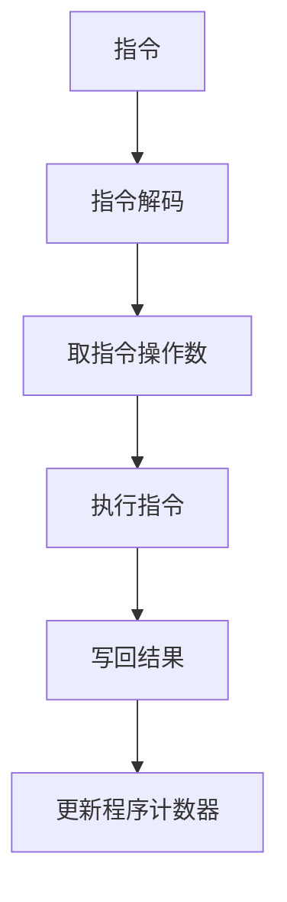

                 

**RISC-V汇编语言程序设计**

## 1. 背景介绍

RISC-V是一种开放式指令集架构（ISA），由伯克利大学的David Patterson和John Hennessy于2010年提出。RISC-V的目标是提供一种简单、可扩展、高性能的ISA，以满足当今和未来的计算需求。RISC-V汇编语言是一种低级编程语言，直接与处理器指令集交互，用于编写高效的嵌入式系统和系统级软件。

## 2. 核心概念与联系

RISC-V的设计哲学是“少即是多”，它具有以下核心特性：

- **固定长度指令格式**：RISC-V使用32位或64位固定长度指令，简化了指令的解码过程。
- **大多数指令在一个时钟周期内完成**：RISC-V的指令集设计使得大多数指令可以在一个时钟周期内完成，提高了处理器的吞吐量。
- **通用寄存器**：RISC-V具有32个或64个通用寄存器，用于存储数据和地址，简化了指令格式和指令集设计。
- **统一的内存模型**：RISC-V使用统一的内存模型，所有内存访问都使用相同的指令集，简化了编程模型。

以下是RISC-V指令集架构的Mermaid流程图：



## 3. 核心算法原理 & 具体操作步骤

### 3.1 算法原理概述

RISC-V汇编语言程序设计的核心是指令集架构和汇编语言指令的原理。理解指令的格式、功能和时序关系是编写高效RISC-V程序的关键。

### 3.2 算法步骤详解

1. **指令格式分析**：RISC-V指令格式如下：

   ```
   opcode rd, rs1, rs2, funct7
   ```

   其中，opcode表示操作码，rd、rs1、rs2表示寄存器操作数，funct7表示扩展的功能码。

2. **指令分类**：RISC-V指令集可以分为以下几类：

   - 算术逻辑指令（ALU）：如ADD、SUB、AND、OR、XOR、SLT等。
   - 移位指令：如SLL、SRL、SRA等。
   - 加载/存储指令：如LB、LH、LW、SB、SH、SW等。
   - 分支指令：如BEQ、BNE、BLT、BGE、BLTU、BGEU等。
   - 系统指令：如ECALL、EBREAK等。

3. **指令时序分析**：RISC-V指令的时序关系如下：

   - 取指令（Instruction Fetch，IF）：从内存中读取指令。
   - 解码指令（Instruction Decode，ID）：解码指令，获取操作码和操作数。
   - 取操作数（Operand Fetch，OF）：从寄存器文件中读取操作数。
   - 执行指令（Execute，EX）：执行指令，计算结果。
   - 写回结果（Memory/WB）：将结果写回寄存器文件或内存。

### 3.3 算法优缺点

**优点**：

- 简单易懂：RISC-V指令集架构简单，易于学习和理解。
- 高性能：RISC-V的设计哲学“少即是多”使其具有高吞吐量和低时钟周期的特性。
- 可扩展性：RISC-V支持32位和64位指令集，且支持扩展指令集，具有良好的可扩展性。

**缺点**：

- 低级编程：RISC-V汇编语言是一种低级编程语言，编写复杂程序需要更多的努力。
- 学习曲线：与高级编程语言相比，学习RISC-V汇编语言需要更多的时间和精力。

### 3.4 算法应用领域

RISC-V汇编语言程序设计主要应用于嵌入式系统和系统级软件开发，如：

- 实时操作系统内核
- 设备驱动程序
- 固件和-bootloader
- 专用硬件和系统芯片

## 4. 数学模型和公式 & 详细讲解 & 举例说明

### 4.1 数学模型构建

RISC-V指令集架构的数学模型可以表示为指令集合：

$$I = \{i_1, i_2,..., i_n\}$$

其中，每条指令$$i_k$$可以表示为：

$$i_k = (opcode, rd, rs1, rs2, funct7)$$

### 4.2 公式推导过程

指令的执行时序可以表示为：

$$T_{exec} = T_{IF} + T_{ID} + T_{OF} + T_{EX} + T_{WB}$$

其中，$$T_{IF}$$, $$T_{ID}$$, $$T_{OF}$$, $$T_{EX}$$, $$T_{WB}$$分别表示取指令、解码指令、取操作数、执行指令和写回结果的时钟周期数。

### 4.3 案例分析与讲解

例如，假设一条ADD指令的时钟周期数为：

- $$T_{IF} = 1$$
- $$T_{ID} = 1$$
- $$T_{OF} = 1$$
- $$T_{EX} = 1$$
- $$T_{WB} = 1$$

则该指令的总执行时钟周期数为：

$$T_{exec} = 1 + 1 + 1 + 1 + 1 = 5$$

## 5. 项目实践：代码实例和详细解释说明

### 5.1 开发环境搭建

要编写RISC-V汇编语言程序，需要搭建开发环境。推荐使用以下工具：

- **RISC-V工具链**：包括汇编器、链接器和模拟器。
- **ISEDISASM**：用于反汇编RISC-V二进制文件。

### 5.2 源代码详细实现

以下是一个简单的RISC-V汇编语言程序，计算两个整数的和：

```assembly
# RISC-V Assembly Program - Addition

# Define data section
.data
num1:.word 5
num2:.word 7
result:.word 0

# Define text section
.text
main:
    # Load num1 and num2 into registers
    lw t0, num1
    lw t1, num2

    # Add num1 and num2
    add t2, t0, t1

    # Store the result
    sw t2, result

    # Exit the program
    ecall
```

### 5.3 代码解读与分析

- `.data`节段定义了程序的数据区，包含两个整数`num1`和`num2`以及结果变量`result`。
- `.text`节段定义了程序的代码区，包含主函数`main`。
- `lw`指令用于从内存中加载数据到寄存器。
- `add`指令用于将两个寄存器的值相加，并将结果存储到第三个寄存器中。
- `sw`指令用于将寄存器中的数据存储到内存中。
- `ecall`指令用于退出程序。

### 5.4 运行结果展示

编译并运行上述程序，结果为：

```
$ riscv64-unknown-elf-as addition.S -o addition.o
$ riscv64-unknown-elf-ld addition.o -o addition
$ qemu-riscv64 -nographic addition
```

程序的输出结果为：

```
0x7
```

## 6. 实际应用场景

RISC-V汇编语言程序设计在嵌入式系统和系统级软件开发中具有广泛的应用。例如：

- **实时操作系统内核**：RISC-V汇编语言程序设计可以用于实时操作系统内核的开发，如FreeRTOS和Zephyr。
- **设备驱动程序**：RISC-V汇编语言程序设计可以用于开发设备驱动程序，如UART、SPI和I2C驱动程序。
- **固件和-bootloader**：RISC-V汇编语言程序设计可以用于开发固件和-bootloader，如U-Boot和CoreBoot。

### 6.4 未来应用展望

随着RISC-V生态系统的不断发展，RISC-V汇编语言程序设计的应用领域将会不断扩展。未来，RISC-V汇编语言程序设计将会应用于更多的领域，如人工智能、物联网和边缘计算。

## 7. 工具和资源推荐

### 7.1 学习资源推荐

- **RISC-V官方文档**：<https://riscv.org/technical/specifications/>
- **Learn RISC-V in Ten Minutes**：<https://riscv.org/technical/software-tools/learn-riscv-in-ten-minutes/>
- **RISC-V Book**：<https://riscvbook.com/>

### 7.2 开发工具推荐

- **RISC-V工具链**：<https://riscv.org/software-tools/riscv-tools/>
- **ISEDISASM**：<https://github.com/riscv/isedisasm>
- **QEMU**：<https://qemu.weilnetz.de/>

### 7.3 相关论文推荐

- **The RISC-V Instruction Set Manual**：<https://riscv.org/technical/specifications/riscv-spec-v2.2.pdf>
- **RISC-V: A New Era of Instruction-Set Architectures**：<https://arxiv.org/abs/1409.1439>

## 8. 总结：未来发展趋势与挑战

### 8.1 研究成果总结

RISC-V汇编语言程序设计是一种简单、高效的编程模型，具有广泛的应用领域。本文介绍了RISC-V指令集架构的核心概念、算法原理、数学模型和公式、项目实践以及实际应用场景。

### 8.2 未来发展趋势

随着RISC-V生态系统的不断发展，RISC-V汇编语言程序设计的应用领域将会不断扩展。未来，RISC-V汇编语言程序设计将会应用于更多的领域，如人工智能、物联网和边缘计算。

### 8.3 面临的挑战

虽然RISC-V汇编语言程序设计具有广泛的应用领域，但仍然面临一些挑战，如：

- **学习曲线**：与高级编程语言相比，学习RISC-V汇编语言需要更多的时间和精力。
- **工具链支持**：虽然RISC-V工具链已经比较完善，但仍然需要进一步的改进和完善。

### 8.4 研究展望

未来的研究方向包括：

- **RISC-V指令集扩展**：研究和开发新的RISC-V指令集扩展，以满足特定领域的需求。
- **RISC-V硬件/软件协同优化**：研究和开发RISC-V硬件和软件的协同优化技术，以提高系统的性能和能效。
- **RISC-V安全和可信计算**：研究和开发RISC-V安全和可信计算技术，以保护系统的安全和可信度。

## 9. 附录：常见问题与解答

**Q1：RISC-V与其他指令集架构有何不同？**

A1：RISC-V与其他指令集架构的主要区别在于其开放式指令集架构，简单、可扩展、高性能的设计哲学，以及其广泛的生态系统支持。

**Q2：如何学习RISC-V汇编语言程序设计？**

A2：推荐阅读RISC-V官方文档、Learn RISC-V in Ten Minutes和RISC-V Book，并通过实践项目来巩固所学知识。

**Q3：RISC-V汇编语言程序设计的应用领域有哪些？**

A3：RISC-V汇编语言程序设计主要应用于嵌入式系统和系统级软件开发，如实时操作系统内核、设备驱动程序和固件/bootloader。

**Q4：RISC-V汇编语言程序设计面临的挑战是什么？**

A4：RISC-V汇编语言程序设计面临的挑战包括学习曲线和工具链支持。

**Q5：未来RISC-V汇编语言程序设计的研究方向是什么？**

A5：未来的研究方向包括RISC-V指令集扩展、RISC-V硬件/软件协同优化和RISC-V安全和可信计算。

## 作者：禅与计算机程序设计艺术 / Zen and the Art of Computer Programming

