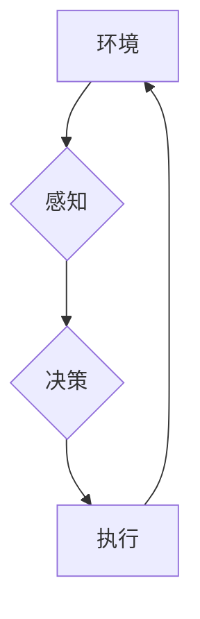

> 代理技术，智能体，多智能体系统，机器学习，强化学习，决策理论，应用实例

## 1. 背景介绍

在现代信息化社会，智能化系统和自动化决策日益重要。代理技术作为一种重要的智能化技术，在解决复杂问题、实现智能化决策方面发挥着越来越重要的作用。代理技术的核心思想是将智能体（Agent）作为系统中的基本单元，赋予其感知环境、做出决策、执行动作的能力，从而实现系统自主学习、适应和优化。

代理技术在各个领域都有广泛的应用，例如：

* **机器人领域:** 机器人可以通过代理技术感知环境、规划路径、避障、与人类交互等。
* **游戏领域:** 游戏中的非玩家角色（NPC）可以通过代理技术实现智能行为，例如决策、策略制定、与玩家交互等。
* **金融领域:** 代理技术可以用于金融风险管理、投资决策、欺诈检测等。
* **医疗领域:** 代理技术可以用于辅助诊断、个性化治疗、药物研发等。

## 2. 核心概念与联系

**2.1 代理的概念**

代理是一个能够感知环境、做出决策并执行动作的智能体。代理可以是软件程序、机器人、甚至人类。代理的目标通常是最大化其自身利益或完成特定的任务。

**2.2 环境的概念**

环境是指代理所处的外界世界，包括代理可以感知到的信息和代理可以执行的动作。环境可以是物理世界，也可以是虚拟世界。

**2.3 代理与环境的交互**

代理与环境之间通过感知和动作进行交互。代理通过感知环境信息来了解当前状态，并根据环境信息做出决策，执行相应的动作。环境会根据代理的动作做出相应的反馈，从而改变环境状态。

**2.4 代理的类型**

代理可以根据不同的分类标准进行分类，例如：

* **根据代理的感知能力:** 感知代理、有限感知代理、完全感知代理
* **根据代理的决策能力:** 简单代理、模型化代理、学习代理
* **根据代理的行动能力:** 确定性代理、随机代理

**2.5 代理技术的架构**

代理技术的架构通常包括以下几个部分：

* **感知模块:** 用于感知环境信息。
* **决策模块:** 用于根据环境信息做出决策。
* **执行模块:** 用于执行决策。
* **知识库:** 用于存储代理的知识和经验。

**2.6 Mermaid 流程图**



## 3. 核心算法原理 & 具体操作步骤

**3.1 算法原理概述**

代理技术的核心算法包括：

* **决策理论:** 用于帮助代理在不确定环境下做出最优决策。
* **强化学习:** 用于帮助代理通过与环境交互学习最优策略。
* **机器学习:** 用于帮助代理从数据中学习知识和规律。

**3.2 算法步骤详解**

**3.2.1 决策理论**

决策理论的基本步骤包括：

1. **定义状态空间:** 确定代理可以处于的所有状态。
2. **定义动作空间:** 确定代理可以执行的所有动作。
3. **定义奖励函数:** 确定代理在不同状态下执行不同动作的奖励。
4. **选择决策策略:** 根据奖励函数和状态空间、动作空间，选择最优的决策策略。

**3.2.2 强化学习**

强化学习的基本步骤包括：

1. **初始化策略:** 随机初始化代理的策略。
2. **与环境交互:** 代理根据策略与环境交互，获得奖励和状态反馈。
3. **更新策略:** 根据奖励和状态反馈，更新代理的策略，使其朝着最优策略的方向发展。
4. **重复步骤2-3:** 直到代理的策略收敛或达到预设的目标。

**3.2.3 机器学习**

机器学习的基本步骤包括：

1. **数据收集:** 收集代理需要学习的数据。
2. **数据预处理:** 对数据进行清洗、转换和特征提取。
3. **模型选择:** 选择合适的机器学习模型。
4. **模型训练:** 使用训练数据训练机器学习模型。
5. **模型评估:** 使用测试数据评估模型的性能。
6. **模型部署:** 将训练好的模型部署到实际应用场景中。

**3.3 算法优缺点**

**3.3.1 决策理论**

* **优点:** 能够在已知环境模型的情况下，找到最优决策策略。
* **缺点:** 需要精确的环境模型，难以应用于复杂、不确定环境。

**3.3.2 强化学习**

* **优点:** 可以学习复杂、不确定环境下的最优策略。
* **缺点:** 学习过程可能很慢，需要大量的训练数据和计算资源。

**3.3.3 机器学习**

* **优点:** 可以从数据中学习知识和规律，提高代理的智能化水平。
* **缺点:** 需要大量的训练数据，对数据质量要求高。

**3.4 算法应用领域**

* **决策理论:** 经济学、金融学、博弈论等领域。
* **强化学习:** 机器人控制、游戏人工智能、自动驾驶等领域。
* **机器学习:** 图像识别、自然语言处理、推荐系统等领域。

## 4. 数学模型和公式 & 详细讲解 & 举例说明

**4.1 数学模型构建**

代理技术可以抽象为一个马尔可夫决策过程 (MDP)，其中：

* **状态空间 (S):** 代理可以处于的所有状态。
* **动作空间 (A):** 代理可以执行的所有动作。
* **转移概率 (P):** 从一个状态执行一个动作后转移到另一个状态的概率。
* **奖励函数 (R):** 代理在某个状态执行某个动作后获得的奖励。

**4.2 公式推导过程**

代理的目标是找到一个最优策略 π，使得其在所有状态下执行的动作能够最大化其累积奖励。最优策略可以利用贝尔曼方程进行计算：

$$
V^{\pi}(s) = \max_{a \in A} \left[ R(s, a) + \gamma \sum_{s' \in S} P(s' | s, a) V^{\pi}(s') \right]
$$

其中：

* $V^{\pi}(s)$ 是代理在状态 $s$ 下按照策略 $\pi$ 的价值函数。
* $R(s, a)$ 是代理在状态 $s$ 执行动作 $a$ 后获得的奖励。
* $\gamma$ 是折扣因子，表示未来奖励的权重。

**4.3 案例分析与讲解**

例如，一个机器人需要在迷宫中找到出口。我们可以将迷宫视为状态空间，机器人可以执行的行动包括向上、向下、向左、向右。机器人到达出口时获得奖励，迷宫中其他位置没有奖励。

利用贝尔曼方程，我们可以计算出机器人按照不同策略在每个位置的价值函数，从而找到最优策略，引导机器人找到出口。

## 5. 项目实践：代码实例和详细解释说明

**5.1 开发环境搭建**

* 操作系统: Ubuntu 20.04
* Python 版本: 3.8
* 库依赖: numpy, pandas, matplotlib, gym

**5.2 源代码详细实现**

```python
import gym
import numpy as np

# 定义环境
env = gym.make('CartPole-v1')

# 定义策略
def policy(state):
    # 根据状态选择动作
    return 0 if state[0] < 0 else 1

# 训练循环
for episode in range(100):
    state = env.reset()
    done = False
    total_reward = 0

    while not done:
        # 选择动作
        action = policy(state)

        # 执行动作
        next_state, reward, done, _ = env.step(action)

        # 更新状态
        state = next_state

        # 计算总奖励
        total_reward += reward

    print(f"Episode {episode+1}, Total Reward: {total_reward}")

# 关闭环境
env.close()
```

**5.3 代码解读与分析**

* 代码首先定义了环境，并使用 CartPole-v1 环境作为示例。
* 然后定义了一个简单的策略，根据状态选择动作。
* 训练循环中，代理与环境交互，执行动作，获得奖励和状态反馈。
* 训练结束后，打印每个episode的总奖励。

**5.4 运行结果展示**

运行代码后，会输出每个episode的总奖励，随着训练的进行，总奖励会逐渐增加，表明代理的策略逐渐优化。

## 6. 实际应用场景

**6.1 智能机器人**

代理技术可以用于控制智能机器人，使其能够感知环境、规划路径、避障、与人类交互等。例如，在物流行业，代理技术可以用于控制无人搬运车，自动完成货物搬运任务。

**6.2 游戏人工智能**

代理技术可以用于开发游戏中的非玩家角色（NPC），使其能够实现智能行为，例如决策、策略制定、与玩家交互等。例如，在策略游戏《星际争霸》中，代理技术可以用于控制AI对手，使其能够做出更智能的决策。

**6.3 金融风险管理**

代理技术可以用于金融风险管理，例如识别欺诈交易、预测市场波动、优化投资组合等。例如，代理技术可以用于分析股票市场数据，预测股票价格走势，帮助投资者做出更明智的投资决策。

**6.4 未来应用展望**

随着人工智能技术的不断发展，代理技术将在更多领域得到应用，例如：

* **自动驾驶:** 代理技术可以用于控制自动驾驶汽车，使其能够感知环境、规划路径、避障、与其他车辆交互等。
* **医疗诊断:** 代理技术可以用于辅助医生诊断疾病，例如分析患者的病历、影像数据等，提供诊断建议。
* **个性化教育:** 代理技术可以用于提供个性化的教育服务，根据学生的学习情况，定制学习计划和内容。

## 7. 工具和资源推荐

**7.1 学习资源推荐**

* **书籍:**
    * 《Reinforcement Learning: An Introduction》 by Richard S. Sutton and Andrew G. Barto
    * 《Artificial Intelligence: A Modern Approach》 by Stuart Russell and Peter Norvig
* **在线课程:**
    * Coursera: Reinforcement Learning Specialization
    * Udacity: Artificial Intelligence Nanodegree

**7.2 开发工具推荐**

* **Python:** 广泛用于人工智能开发，拥有丰富的库和工具。
* **TensorFlow:** 深度学习框架，用于训练和部署机器学习模型。
* **PyTorch:** 深度学习框架，灵活易用，适合研究和开发。

**7.3 相关论文推荐**

* **Deep Reinforcement Learning](https://arxiv.org/abs/1602.09477)**
* **AlphaGo](https://arxiv.org/abs/1607.02883)**
* **DQN](https://arxiv.org/abs/1312.5602)**

## 8. 总结：未来发展趋势与挑战

**8.1 研究成果总结**

近年来，代理技术取得了显著进展，例如：

* 强化学习算法取得了突破性进展，能够解决更复杂的任务。
* 深度学习技术与代理技术相结合，提升了代理的智能化水平。
* 多智能体系统研究取得进展，探索了代理在多智能体环境下的合作与竞争。

**8.2 未来发展趋势**

* **更强大的学习能力:** 研究更强大的学习算法，使代理能够从更少的数据中学习，并更快地适应变化的环境。
* **更强的解释性:** 研究更可解释的代理模型，使人类能够更好地理解代理的决策过程。
* **更安全的代理:** 研究更安全的代理技术，防止代理被恶意攻击或滥用。

**8.3 面临的挑战**

* **数据获取和标注:** 代理技术需要大量的训练数据，获取和标注高质量数据仍然是一个挑战。
* **模型复杂度:** 代理模型的复杂度不断提高，训练和部署这些模型需要强大的计算资源。
* **伦理问题:** 代理