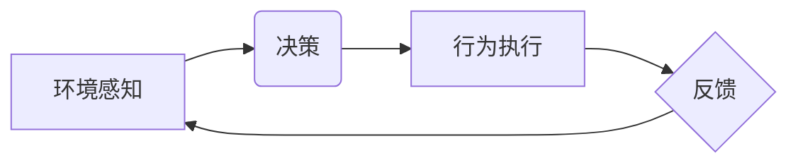

> 智能终端，智能座舱，Agent，人工智能，机器学习，自然语言处理，对话系统，场景感知，行为规划

## 1. 背景介绍

随着人工智能技术的飞速发展，智能终端和智能座舱已成为现代生活的重要组成部分。智能终端，如智能手机、智能手表等，通过传感器和网络连接，为用户提供个性化服务和便捷体验。智能座舱，如智能汽车、智能家居等，则通过感知环境、理解用户需求，实现智能控制和协同操作。

在这些智能系统中，Agent作为一种重要的软件实体，扮演着关键角色。Agent是一种具有自主性和学习能力的软件程序，能够感知环境、做出决策并执行行动。它可以独立完成任务，也可以与其他Agent协同工作，实现更复杂的功能。

## 2. 核心概念与联系

**2.1 智能终端和智能座舱的定义**

* **智能终端:** 指能够通过网络连接和传感器感知环境，并提供个性化服务和便捷体验的电子设备。例如智能手机、智能手表、智能音箱等。
* **智能座舱:** 指通过感知环境、理解用户需求，实现智能控制和协同操作的封闭系统。例如智能汽车、智能家居、智能办公室等。

**2.2 Agent的定义和特性**

* **定义:** Agent是一种具有自主性和学习能力的软件程序，能够感知环境、做出决策并执行行动。
* **特性:**
    * **自主性:** Agent能够独立完成任务，无需人工干预。
    * **学习能力:** Agent能够从经验中学习，不断改进自己的行为。
    * **感知能力:** Agent能够感知环境信息，例如传感器数据、网络数据等。
    * **决策能力:** Agent能够根据环境信息和自身目标，做出最佳决策。
    * **行动能力:** Agent能够执行行动，例如控制设备、发送信息等。

**2.3 Agent在智能终端和智能座舱中的应用场景**

* **智能终端:**
    * **个性化推荐:** 基于用户行为和偏好，推荐个性化内容和服务。
    * **智能助手:** 帮助用户完成日常任务，例如设置提醒、发送邮件、查询信息等。
    * **语音控制:** 通过语音识别技术，实现对设备的控制和操作。
* **智能座舱:**
    * **自动驾驶:** 负责车辆的感知、决策和控制，实现自动驾驶功能。
    * **智能家居:** 控制家居设备，实现场景联动和智能家居体验。
    * **车载娱乐:** 提供个性化娱乐服务，例如音乐播放、视频观看等。

**2.4  Agent架构图**



## 3. 核心算法原理 & 具体操作步骤

**3.1 算法原理概述**

Agent的智能行为实现依赖于多种算法，包括机器学习、自然语言处理、行为规划等。

* **机器学习:** 用于训练Agent从数据中学习，提高其决策和行为能力。例如，使用监督学习训练Agent识别图像、使用强化学习训练Agent玩游戏。
* **自然语言处理:** 用于理解和生成自然语言，使Agent能够与人类进行自然对话。例如，使用词嵌入技术训练Agent理解文本语义，使用语言模型训练Agent生成自然语言文本。
* **行为规划:** 用于规划Agent的行动序列，使其能够实现目标。例如，使用路径规划算法规划Agent在环境中的移动路径，使用状态空间搜索算法规划Agent完成任务的行动序列。

**3.2 算法步骤详解**

1. **环境感知:** Agent通过传感器收集环境信息，例如图像、声音、文本等。
2. **信息处理:** Agent对收集到的环境信息进行处理，例如图像识别、语音识别、文本分析等。
3. **状态估计:** Agent根据处理后的环境信息，估计当前的系统状态。
4. **目标设定:** Agent根据自身目标和环境信息，设定当前的目标。
5. **决策:** Agent根据目标和状态估计，选择最佳行动。
6. **行为执行:** Agent执行选择的行动，并观察行动的结果。
7. **反馈:** Agent接收行动的结果作为反馈，并更新状态估计和目标设定。

**3.3 算法优缺点**

* **优点:**
    * **自主性:** Agent能够独立完成任务，无需人工干预。
    * **学习能力:** Agent能够从经验中学习，不断改进自己的行为。
    * **适应性:** Agent能够适应不断变化的环境。
* **缺点:**
    * **复杂性:** 设计和实现Agent系统非常复杂。
    * **数据依赖:** 许多机器学习算法依赖于大量数据训练。
    * **安全性:** Agent的自主性也带来安全风险，需要确保Agent的行为安全可靠。

**3.4 算法应用领域**

* **机器人:** 控制机器人运动、感知环境、完成任务。
* **游戏:** 训练游戏AI，实现游戏中的智能对手。
* **金融:** 进行风险评估、预测市场趋势、提供个性化金融服务。
* **医疗:** 辅助医生诊断疾病、制定治疗方案、提供个性化医疗服务。

## 4. 数学模型和公式 & 详细讲解 & 举例说明

**4.1 数学模型构建**

Agent的行为可以建模为一个马尔可夫决策过程 (MDP)。

* **状态空间 (S):** 所有可能的系统状态。
* **动作空间 (A):** Agent可以执行的所有动作。
* **转移概率 (P):** 从一个状态执行一个动作后转移到另一个状态的概率。
* **奖励函数 (R):** Agent在某个状态执行某个动作后获得的奖励。

**4.2 公式推导过程**

目标是找到一个策略 $\pi$，使得Agent在MDP中获得最大的累积奖励。

Bellman方程：

$$
V^{\pi}(s) = \max_{a \in A} \left[ R(s, a) + \gamma \sum_{s' \in S} P(s' | s, a) V^{\pi}(s') \right]
$$

其中：

* $V^{\pi}(s)$ 是策略 $\pi$ 下状态 $s$ 的价值函数。
* $R(s, a)$ 是状态 $s$ 执行动作 $a$ 后获得的奖励。
* $\gamma$ 是折扣因子，控制未来奖励的权重。

**4.3 案例分析与讲解**

例如，训练一个Agent玩游戏，我们可以将游戏状态作为状态空间，游戏动作作为动作空间，游戏奖励作为奖励函数。通过Bellman方程，我们可以训练Agent学习一个策略，使得它在游戏中获得最大的分数。

## 5. 项目实践：代码实例和详细解释说明

**5.1 开发环境搭建**

* Python 3.x
* TensorFlow 或 PyTorch
* OpenAI Gym

**5.2 源代码详细实现**

```python
import gym
import tensorflow as tf

# 定义Agent类
class Agent:
    def __init__(self, state_size, action_size):
        # 初始化神经网络模型
        self.model = tf.keras.models.Sequential([
            tf.keras.layers.Dense(64, activation='relu', input_shape=(state_size,)),
            tf.keras.layers.Dense(action_size)
        ])
        self.model.compile(loss='mse', optimizer='adam')

    # 选择动作
    def choose_action(self, state):
        # 使用神经网络预测动作概率
        probs = self.model.predict(state.reshape(1, -1))
        # 根据概率选择动作
        action = tf.random.categorical(tf.math.log(probs), num_samples=1)[0].numpy()
        return action

    # 更新模型
    def update(self, state, action, reward, next_state, done):
        # 使用Bellman方程更新模型参数
        with tf.GradientTape() as tape:
            target = reward + gamma * tf.reduce_max(self.model.predict(next_state.reshape(1, -1))) if not done else reward
            loss = tf.keras.losses.MSE(target, self.model.predict(state.reshape(1, -1))[0, action])
        gradients = tape.gradient(loss, self.model.trainable_variables)
        self.optimizer.apply_gradients(zip(gradients, self.model.trainable_variables))

# 创建环境
env = gym.make('CartPole-v1')

# 创建Agent
agent = Agent(state_size=env.observation_space.shape[0], action_size=env.action_space.n)

# 训练Agent
for episode in range(1000):
    state = env.reset()
    done = False
    total_reward = 0
    while not done:
        action = agent.choose_action(state)
        next_state, reward, done, _ = env.step(action)
        agent.update(state, action, reward, next_state, done)
        state = next_state
        total_reward += reward
    print(f'Episode {episode+1}: Total Reward = {total_reward}')

# 测试Agent
state = env.reset()
while True:
    env.render()
    action = agent.choose_action(state)
    next_state, reward, done, _ = env.step(action)
    state = next_state
    if done:
        break
env.close()
```

**5.3 代码解读与分析**

* **Agent类:** 定义了Agent的结构和行为。
* **choose_action()方法:** 根据当前状态选择动作。
* **update()方法:** 使用Bellman方程更新模型参数。
* **训练循环:** 训练Agent，并记录每轮的奖励。
* **测试循环:** 使用训练好的Agent进行测试。

**5.4 运行结果展示**

运行代码后，Agent将学习如何控制CartPole，使其保持平衡。

## 6. 实际应用场景

**6.1 智能终端应用场景**

* **个性化推荐:** 基于用户行为和偏好，推荐个性化内容和服务，例如音乐、电影、新闻等。
* **智能助手:** 帮助用户完成日常任务，例如设置提醒、发送邮件、查询信息等。
* **语音控制:** 通过语音识别技术，实现对设备的控制和操作，例如控制智能音箱、智能手机等。

**6.2 智能座舱应用场景**

* **自动驾驶:** 负责车辆的感知、决策和控制，实现自动驾驶功能。
* **智能家居:** 控制家居设备，实现场景联动和智能家居体验。
* **车载娱乐:** 提供个性化娱乐服务，例如音乐播放、视频观看等。

**6.3 未来应用展望**

* **更智能的交互:** 通过自然语言处理和情感识别技术，实现更智能、更自然的交互体验。
* **更个性化的服务:** 通过深度学习和用户行为分析，提供更个性化的服务和体验。
* **更安全的系统:** 通过强化学习和安全机制，确保Agent的行为安全可靠。

## 7. 工具和资源推荐

**7.1 学习资源推荐**

* **书籍:**
    * 《Reinforcement Learning: An Introduction》
    * 《Deep Learning》
    * 《Artificial Intelligence: A Modern Approach》
* **在线课程:**
    * Coursera: Reinforcement Learning Specialization
    * Udacity: Deep Learning Nanodegree
    * edX: Artificial Intelligence

**7.2 开发工具推荐**

* **Python:** 广泛用于人工智能开发，拥有丰富的库和工具。
* **TensorFlow:** 开源深度学习框架，支持多种硬件平台。
* **PyTorch:** 开源深度学习框架，以其灵活性和易用性而闻名。
* **OpenAI Gym:** 用于训练强化学习Agent的开源环境库。

**7.3 相关论文推荐**

* **Deep Reinforcement Learning with Double Q-learning**
* **Proximal Policy Optimization Algorithms**
* **Attention Is All You Need**

## 8. 总结：未来发展趋势与挑战

**8.1 研究成果总结**

近年来，Agent