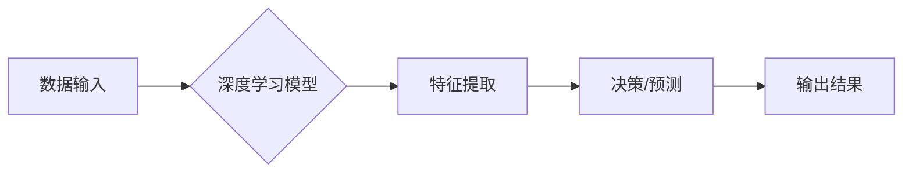

> 人工智能，深度学习，计算机视觉，自然语言处理，强化学习，伦理问题，可解释性，未来趋势

## 1. 背景介绍

人工智能（AI）近年来发展迅速，取得了令人瞩目的成就。从语音识别到图像识别，从自动驾驶到医疗诊断，AI技术正在深刻地改变着我们的生活。Andrej Karpathy，一位享誉全球的人工智能专家，在推动AI发展方面做出了卓越贡献。他曾担任特斯拉自动驾驶团队负责人，现任OpenAI研究员，并以其对深度学习和计算机视觉的深刻理解而闻名。

Karpathy在多次演讲和文章中，对人工智能的未来发展提出了许多重要的思考和挑战。本文将围绕他的观点，探讨人工智能的未来发展趋势和面临的挑战。

## 2. 核心概念与联系

人工智能的核心概念是模拟人类智能的行为。这包括学习、推理、决策、感知和语言理解等能力。深度学习作为人工智能的重要分支，通过构建多层神经网络，模拟大脑的结构和功能，从而实现对复杂数据的学习和分析。

**Mermaid 流程图：**

## 3. 核心算法原理 & 具体操作步骤

### 3.1  算法原理概述

深度学习算法的核心是神经网络。神经网络由多个层组成，每层包含多个神经元。每个神经元接收来自上一层的输入信号，并通过权重进行加权求和，然后经过激活函数处理，输出到下一层。通过训练神经网络，可以调整每个神经元的权重，使网络能够学习数据中的模式和规律。

### 3.2  算法步骤详解

1. **数据预处理:** 将原始数据转换为深度学习模型可以理解的格式，例如归一化、编码等。
2. **网络结构设计:** 根据任务需求，选择合适的网络结构，例如卷积神经网络（CNN）用于图像识别，循环神经网络（RNN）用于自然语言处理。
3. **参数初始化:** 为网络中的每个参数赋予初始值。
4. **前向传播:** 将输入数据通过网络层层传递，计算输出结果。
5. **损失函数计算:** 计算输出结果与真实值的差异，即损失值。
6. **反向传播:** 根据损失值，反向传播误差信号，更新网络参数。
7. **迭代训练:** 重复前向传播、损失函数计算和反向传播的过程，直到损失值达到预设阈值。

### 3.3  算法优缺点

**优点:**

* 能够学习复杂数据模式
* 自动特征提取
* 性能优异

**缺点:**

* 训练数据量大
* 计算资源消耗高
* 可解释性差

### 3.4  算法应用领域

深度学习算法广泛应用于图像识别、自然语言处理、语音识别、机器翻译、自动驾驶等领域。

## 4. 数学模型和公式 & 详细讲解 & 举例说明

### 4.1  数学模型构建

深度学习模型的核心是神经网络，其数学模型可以表示为多层感知机（MLP）。

**MLP模型:**

$$
y = f(W_L \cdot a_{L-1} + b_L)
$$

其中：

* $y$：输出
* $f$：激活函数
* $W_L$：第L层的权重矩阵
* $a_{L-1}$：第L-1层的激活值
* $b_L$：第L层的偏置

### 4.2  公式推导过程

通过反向传播算法，可以计算出每个参数的梯度，并根据梯度更新参数值。

**梯度下降算法:**

$$
\theta = \theta - \alpha \nabla J(\theta)
$$

其中：

* $\theta$：参数
* $\alpha$：学习率
* $\nabla J(\theta)$：损失函数的梯度

### 4.3  案例分析与讲解

例如，在图像分类任务中，可以使用CNN模型，其结构包含卷积层、池化层和全连接层。卷积层提取图像特征，池化层降低特征维度，全连接层进行分类。

## 5. 项目实践：代码实例和详细解释说明

### 5.1  开发环境搭建

使用Python语言和深度学习框架TensorFlow或PyTorch搭建开发环境。

### 5.2  源代码详细实现

使用TensorFlow或PyTorch框架，实现一个简单的图像分类模型。

### 5.3  代码解读与分析

解释代码中的关键部分，例如网络结构、损失函数、优化算法等。

### 5.4  运行结果展示

展示模型的训练过程和测试结果，例如准确率、损失值等。

## 6. 实际应用场景

### 6.1  医疗诊断

利用深度学习算法分析医学影像，辅助医生诊断疾病。

### 6.2  金融风险控制

识别金融交易中的异常行为，降低风险。

### 6.3  智能客服

使用自然语言处理技术，构建智能客服系统，提供快速高效的客户服务。

### 6.4  未来应用展望

人工智能技术将继续发展，在更多领域得到应用，例如自动驾驶、个性化教育、智能家居等。

## 7. 工具和资源推荐

### 7.1  学习资源推荐

* 深度学习书籍：
    * 《深度学习》
    * 《动手学深度学习》
* 在线课程：
    * Coursera深度学习课程
    * Udacity深度学习课程

### 7.2  开发工具推荐

* 深度学习框架：
    * TensorFlow
    * PyTorch
* 数据处理工具：
    * Pandas
    * NumPy

### 7.3  相关论文推荐

* 《ImageNet Classification with Deep Convolutional Neural Networks》
* 《Attention Is All You Need》

## 8. 总结：未来发展趋势与挑战

### 8.1  研究成果总结

人工智能技术取得了显著进展，但仍面临许多挑战。

### 8.2  未来发展趋势

* 模型规模和复杂度不断提高
* 跨模态学习和多任务学习
* 增强人工智能的可解释性和安全性

### 8.3  面临的挑战

* 数据获取和隐私保护
* 计算资源消耗
* 算法偏见和伦理问题

### 8.4  研究展望

未来研究将重点关注解决上述挑战，推动人工智能技术朝着更安全、更可靠、更普惠的方向发展。

## 9. 附录：常见问题与解答

### 9.1  深度学习模型训练需要多少数据？

深度学习模型训练的数据量取决于任务复杂度和模型规模。一般来说，需要大量的训练数据才能获得良好的性能。

### 9.2  如何评估深度学习模型的性能？

常用的评估指标包括准确率、召回率、F1-score等。

### 9.3  如何解决深度学习模型的过拟合问题？

常用的方法包括正则化、数据增强、Dropout等。

作者：禅与计算机程序设计艺术 / Zen and the Art of Computer Programming

<end_of_turn>