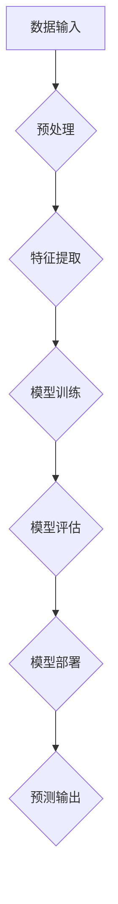

> 人工智能 (AI)
> 深度学习 (Deep Learning)
> 机器学习 (Machine Learning)
> 自然语言处理 (NLP)
> 计算机视觉 (Computer Vision)
> 算法
> 模型

## 1. 背景介绍

人工智能 (Artificial Intelligence，简称 AI) 作为一项前沿科技，近年来发展迅速，并已渗透到我们生活的方方面面。从智能手机的语音助手到自动驾驶汽车，从医疗诊断到金融风险评估，AI 正在改变着我们的世界。

AI 的本质是让机器能够像人类一样思考、学习和解决问题。这涉及到许多复杂的领域，包括计算机科学、数学、心理学和哲学。

## 2. 核心概念与联系

**2.1 机器学习 (Machine Learning)**

机器学习是 AI 的一个重要分支，它让机器能够从数据中学习，并根据学习到的知识进行预测或决策。机器学习算法可以分为监督学习、无监督学习和强化学习三大类。

* **监督学习:**  在训练数据中，每个样本都带有标签，算法的目标是学习出能够将新的样本与对应的标签关联起来的映射关系。例如，图像分类就是一种监督学习任务，训练数据包含了已标记的图像和对应的类别标签。
* **无监督学习:**  训练数据没有标签，算法的目标是发现数据中的潜在结构或模式。例如，聚类算法可以将数据点分组到不同的类别中，而降维算法可以将高维数据映射到低维空间。
* **强化学习:**  算法通过与环境交互，并根据环境的反馈来学习最优的策略。例如，游戏 AI 可以通过玩游戏来学习如何获得更高的分数。

**2.2 深度学习 (Deep Learning)**

深度学习是机器学习的一个子领域，它使用多层神经网络来模拟人类大脑的学习过程。深度学习算法能够学习到更复杂的特征表示，从而在图像识别、语音识别、自然语言处理等领域取得了突破性的进展。

**2.3 自然语言处理 (NLP)**

自然语言处理是让计算机能够理解和处理人类语言的任务。NLP 涉及到许多技术，例如文本分类、情感分析、机器翻译和对话系统。

**2.4 计算机视觉 (Computer Vision)**

计算机视觉是让计算机能够“看”和理解图像的任务。计算机视觉技术广泛应用于图像识别、物体检测、场景理解和视频分析等领域。

**2.5 算法与模型**

在 AI 系统中，算法和模型是核心组成部分。算法是指解决特定问题的步骤或规则，而模型则是算法在训练数据上的结果，它能够对新的数据进行预测或决策。

**Mermaid 流程图**



## 3. 核心算法原理 & 具体操作步骤

### 3.1 算法原理概述

**3.1.1 监督学习算法原理**

监督学习算法的核心思想是通过学习训练数据中的输入输出关系，建立一个映射函数，将新的输入映射到相应的输出。

**3.1.2 无监督学习算法原理**

无监督学习算法的目标是发现数据中的潜在结构或模式，而不依赖于标签信息。常见的无监督学习算法包括聚类算法和降维算法。

**3.1.3 强化学习算法原理**

强化学习算法通过与环境交互，并根据环境的反馈来学习最优的策略。强化学习算法的核心概念是奖励和惩罚，算法的目标是最大化累积的奖励。

### 3.2 算法步骤详解

**3.2.1 监督学习算法步骤**

1. **数据收集和预处理:** 收集训练数据，并进行清洗、转换和特征工程等预处理步骤。
2. **模型选择:** 根据任务需求选择合适的监督学习算法，例如线性回归、逻辑回归、决策树、支持向量机等。
3. **模型训练:** 使用训练数据训练模型，调整模型参数，使模型能够准确地预测输出。
4. **模型评估:** 使用测试数据评估模型的性能，例如准确率、召回率、F1-score等。
5. **模型部署:** 将训练好的模型部署到实际应用场景中，用于进行预测或决策。

**3.2.2 无监督学习算法步骤**

1. **数据收集和预处理:** 收集数据，并进行清洗、转换等预处理步骤。
2. **算法选择:** 根据任务需求选择合适的无监督学习算法，例如k-means聚类、主成分分析等。
3. **模型训练:** 使用算法对数据进行聚类或降维，发现数据中的潜在结构或模式。
4. **结果分析:** 分析聚类结果或降维后的数据，并进行可视化展示。

**3.2.3 强化学习算法步骤**

1. **环境定义:** 定义强化学习环境，包括状态空间、动作空间和奖励函数。
2. **代理设计:** 设计强化学习代理，它能够与环境交互，并根据环境的反馈采取行动。
3. **策略学习:** 使用强化学习算法，例如Q-learning或SARSA，学习最优的策略，使代理能够最大化累积的奖励。
4. **策略评估:** 使用测试环境评估学习到的策略的性能。

### 3.3 算法优缺点

**3.3.1 监督学习算法**

* **优点:** 准确率高，能够学习到复杂的非线性关系。
* **缺点:** 需要大量的标注数据，对数据质量要求高。

**3.3.2 无监督学习算法**

* **优点:** 不需要标注数据，能够发现数据中的潜在结构。
* **缺点:** 难以评估模型性能，结果解释性较差。

**3.3.3 强化学习算法**

* **优点:** 可以学习到复杂的策略，能够适应动态变化的环境。
* **缺点:** 训练时间长，需要大量的试错过程。

### 3.4 算法应用领域

* **监督学习:** 图像识别、语音识别、自然语言处理、医疗诊断、金融风险评估等。
* **无监督学习:** 数据聚类、异常检测、降维、推荐系统等。
* **强化学习:** 游戏 AI、机器人控制、自动驾驶等。

## 4. 数学模型和公式 & 详细讲解 & 举例说明

### 4.1 数学模型构建

**4.1.1 线性回归模型**

线性回归模型假设输入特征和输出变量之间存在线性关系。模型的数学表达式为：

$$y = w_0 + w_1x_1 + w_2x_2 + ... + w_nx_n + \epsilon$$

其中：

* $y$ 是输出变量
* $x_1, x_2, ..., x_n$ 是输入特征
* $w_0, w_1, w_2, ..., w_n$ 是模型参数
* $\epsilon$ 是误差项

**4.1.2 逻辑回归模型**

逻辑回归模型用于二分类问题，它将线性回归模型的输出映射到0到1之间的概率值。模型的数学表达式为：

$$p(y=1|x) = \frac{1}{1 + e^{-(w_0 + w_1x_1 + w_2x_2 + ... + w_nx_n)}}$$

其中：

* $p(y=1|x)$ 是给定输入特征 $x$ 时，输出变量 $y$ 为1的概率
* $w_0, w_1, w_2, ..., w_n$ 是模型参数

### 4.2 公式推导过程

**4.2.1 线性回归模型参数估计**

线性回归模型的参数估计可以使用最小二乘法。最小二乘法的目标是找到模型参数，使得模型预测值与实际值之间的误差平方和最小。

**4.2.2 逻辑回归模型参数估计**

逻辑回归模型的参数估计可以使用最大似然估计法。最大似然估计法的目标是找到模型参数，使得模型能够最大化观测数据的似然概率。

### 4.3 案例分析与讲解

**4.3.1 线性回归模型案例**

假设我们想要预测房屋价格，输入特征包括房屋面积、房间数、楼层等。我们可以使用线性回归模型来建立房屋价格预测模型。

**4.3.2 逻辑回归模型案例**

假设我们想要预测客户是否会点击广告，输入特征包括客户年龄、性别、浏览历史等。我们可以使用逻辑回归模型来建立客户点击广告预测模型。

## 5. 项目实践：代码实例和详细解释说明

### 5.1 开发环境搭建

* **操作系统:** Ubuntu 20.04
* **编程语言:** Python 3.8
* **深度学习框架:** TensorFlow 2.0

### 5.2 源代码详细实现

```python
import tensorflow as tf

# 定义模型
model = tf.keras.models.Sequential([
    tf.keras.layers.Dense(64, activation='relu', input_shape=(784,)),
    tf.keras.layers.Dense(10, activation='softmax')
])

# 编译模型
model.compile(optimizer='adam',
              loss='sparse_categorical_crossentropy',
              metrics=['accuracy'])

# 训练模型
model.fit(x_train, y_train, epochs=10)

# 评估模型
loss, accuracy = model.evaluate(x_test, y_test)
print('Test loss:', loss)
print('Test accuracy:', accuracy)
```

### 5.3 代码解读与分析

* **模型定义:** 使用 `tf.keras.models.Sequential` 创建一个顺序模型，包含两层全连接层。第一层有 64 个神经元，使用 ReLU 激活函数，输入形状为 (784,)，表示输入数据为 784 维向量。第二层有 10 个神经元，使用 softmax 激活函数，用于分类任务。
* **模型编译:** 使用 `model.compile` 方法编译模型，指定优化器、损失函数和评估指标。
* **模型训练:** 使用 `model.fit` 方法训练模型，输入训练数据和标签，训练 10 个 epochs。
* **模型评估:** 使用 `model.evaluate` 方法评估模型在测试数据上的性能，输出测试损失和准确率。

### 5.4 运行结果展示

训练完成后，可以查看模型在测试数据上的准确率，以及训练过程中的损失曲线。

## 6. 实际应用场景

**6.1 医疗诊断**

AI 可以帮助医生更快、更准确地诊断疾病，例如癌症、心血管疾病等。

**6.2 金融风险评估**

AI 可以帮助金融机构识别欺诈交易、评估客户信用风险等。

**6.3 自动驾驶**

AI 可以帮助汽车感知周围环境、做出驾驶决策，实现自动驾驶功能。

**6.4 个性化推荐**

AI 可以根据用户的行为数据，推荐个性化的商品、服务和内容。

### 6.4 未来应用展望

AI 的应用场景还在不断扩展，未来将应用于更多领域，例如教育、娱乐、制造业等。

## 7. 工具和资源推荐

### 7.1 学习资源推荐

* **在线课程:** Coursera、edX、Udacity 等平台提供丰富的 AI 课程。
* **书籍:** 《深度学习》、《机器学习》、《人工智能》等经典书籍。
* **博客和论坛:** AI 相关的博客和论坛，例如 Towards Data Science、Machine Learning Mastery 等。

### 7.2 开发工具推荐

* **深度学习框架:** TensorFlow、PyTorch、Keras 等。
* **数据处理工具:** Pandas、NumPy 等。
* **可视化工具:** Matplotlib、Seaborn 等。

### 7.3 相关论文推荐

* **《ImageNet Classification with Deep Convolutional Neural Networks》**
* **《Attention Is All You Need》**
* **《Deep Reinforcement Learning》**

## 8. 总结：未来发展趋势与挑战

### 8.1 研究成果总结

近年来，AI 取得了显著的进展，在图像