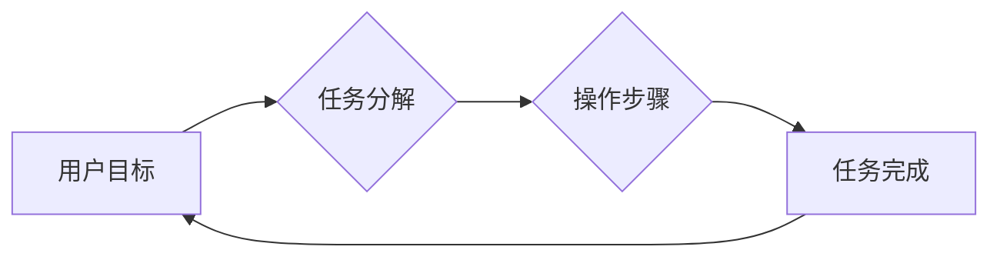

> CUI, 用户目标, 任务实现, 人机交互, 用户体验, 界面设计, 认知心理学, 信息架构

## 1. 背景介绍

随着科技的飞速发展，计算机用户界面 (UI) 的设计日益受到重视。传统的图形用户界面 (GUI) 已经无法满足用户日益复杂的交互需求。命令行界面 (CLI) 虽然简洁高效，但学习成本较高，操作体验较差。因此，一种新的用户界面类型——文本用户界面 (CUI) 应运而生。CUI 结合了 CLI 的简洁性和 GUI 的直观性，在许多领域得到了广泛应用，例如：

* **嵌入式系统:** 由于资源限制，嵌入式系统通常采用 CUI 进行交互。
* **服务器管理:** 系统管理员经常使用 CUI 进行服务器的配置和管理。
* **数据分析:** 数据分析师使用 CUI 进行数据处理和分析。
* **编程开发:** 程序员使用 CUI 进行代码编写和调试。

CUI 的优势在于：

* **轻量级:** CUI 的资源占用量较小，适合资源有限的设备。
* **高效:** CUI 的交互速度快，操作效率高。
* **可定制性强:** CUI 可以根据用户的需求进行定制化配置。

然而，CUI 的设计也面临着一些挑战：

* **用户体验:** CUI 的交互方式相对抽象，用户需要一定的学习成本。
* **信息架构:** 如何有效地组织和呈现信息，使用户能够快速找到所需的信息，是 CUI 设计的关键问题。
* **可访问性:** CUI 需要考虑不同用户群体的需求，例如视障用户。

## 2. 核心概念与联系

CUI 的设计需要考虑用户目标和任务实现。用户目标是指用户使用 CUI 希望达成的最终目的，而任务实现是指用户通过一系列操作来实现用户目标的过程。

**用户目标与任务实现的关系可以用以下流程图表示:**



**核心概念:**

* **用户目标:** 用户使用 CUI 的最终目的，例如查找信息、执行操作、创建内容等。
* **任务分解:** 将用户目标分解成一系列更小的、可实现的任务。
* **操作步骤:** 用户执行的任务步骤，例如输入命令、选择选项、确认操作等。
* **任务完成:** 用户成功完成目标任务。

**CUI 设计原则:**

* **以用户为中心:** CUI 的设计应该以用户的需求和行为为中心。
* **简洁明了:** CUI 的界面应该简洁明了，易于理解和使用。
* **一致性:** CUI 的界面元素和操作方式应该保持一致性，方便用户记忆和使用。
* **可定制性:** CUI 应该提供一定的定制化选项，满足不同用户的需求。

## 3. 核心算法原理 & 具体操作步骤

### 3.1  算法原理概述

CUI 中的许多操作都依赖于特定的算法来实现。例如，命令解析算法用于将用户输入的命令分解成可执行的指令，并将其传递给相应的程序执行。

**命令解析算法的原理:**

1. **词法分析:** 将用户输入的命令字符串分解成一个个独立的词语或符号。
2. **语法分析:** 分析词语之间的关系，判断命令的语法是否正确。
3. **语义分析:** 理解命令的含义，确定需要执行的操作。

### 3.2  算法步骤详解

**命令解析算法的具体步骤:**

1. **输入:** 用户输入一个命令字符串。
2. **词法分析:** 使用词法分析器将命令字符串分解成一个个词语或符号。
3. **语法分析:** 使用语法分析器判断词语之间的关系，确定命令的语法结构。
4. **语义分析:** 使用语义分析器理解命令的含义，确定需要执行的操作。
5. **执行:** 将解析后的命令传递给相应的程序执行。

### 3.3  算法优缺点

**命令解析算法的优点:**

* **高效:** 命令解析算法可以快速地解析用户输入的命令。
* **灵活:** 命令解析算法可以支持多种类型的命令和参数。

**命令解析算法的缺点:**

* **复杂:** 命令解析算法的实现比较复杂，需要对语言语法和语义有深入的理解。
* **易出错:** 如果命令解析算法的实现不完善，可能会导致命令解析错误。

### 3.4  算法应用领域

命令解析算法广泛应用于各种软件系统中，例如：

* **操作系统:** 操作系统使用命令解析算法来解析用户输入的命令，并执行相应的操作。
* **编程语言:** 编程语言使用命令解析算法来解析用户输入的代码，并将其编译或解释执行。
* **数据库管理系统:** 数据库管理系统使用命令解析算法来解析用户输入的查询语句，并返回相应的查询结果。

## 4. 数学模型和公式 & 详细讲解 & 举例说明

### 4.1  数学模型构建

CUI 的设计可以利用数学模型来进行分析和优化。例如，可以使用信息论来衡量用户界面信息的清晰度和可理解性。

**信息熵:**

$$H(X) = - \sum_{i=1}^{n} p(x_i) \log_2 p(x_i)$$

其中：

* $X$ 是一个随机变量，代表用户界面中的信息。
* $p(x_i)$ 是 $x_i$ 的概率。
* $n$ 是信息可能的取值个数。

信息熵越大，信息的不确定性越大，用户界面越难以理解。

### 4.2  公式推导过程

信息熵的公式推导过程如下：

1. 首先，定义信息量为：

$$I(x_i) = -\log_2 p(x_i)$$

2. 然后，信息熵的定义为所有信息量的加权平均值：

$$H(X) = \sum_{i=1}^{n} p(x_i) I(x_i)$$

3. 将信息量公式代入，得到信息熵的最终公式：

$$H(X) = - \sum_{i=1}^{n} p(x_i) \log_2 p(x_i)$$

### 4.3  案例分析与讲解

假设有一个用户界面，包含三个按钮，分别代表“确定”、“取消”和“帮助”。每个按钮的点击概率分别为 0.6、0.3 和 0.1。

使用信息熵公式计算该用户界面信息的熵值：

$$H(X) = - (0.6 \log_2 0.6 + 0.3 \log_2 0.3 + 0.1 \log_2 0.1) \approx 1.47$$

该用户界面信息的熵值较高，说明用户界面信息的不确定性较大，用户可能难以理解该界面。

## 5. 项目实践：代码实例和详细解释说明

### 5.1  开发环境搭建

CUI 的开发环境搭建相对简单，可以使用任何支持文本处理的编程语言，例如 Python、C++、Java 等。

### 5.2  源代码详细实现

以下是一个使用 Python 实现简单的 CUI 命令解析器的代码示例：

```python
def parse_command(command):
    """解析用户输入的命令"""
    words = command.split()
    if words[0] == "help":
        print("可用命令: help, exit")
    elif words[0] == "exit":
        exit()
    else:
        print("无效命令")

while True:
    command = input("> ")
    parse_command(command)
```

### 5.3  代码解读与分析

该代码首先定义了一个 `parse_command` 函数，用于解析用户输入的命令。该函数将命令字符串分解成一个个词语，然后根据第一个词语判断命令类型。

如果第一个词语是 "help"，则打印可用命令列表；如果第一个词语是 "exit"，则退出程序；否则，打印 "无效命令"。

主循环不断获取用户输入，并调用 `parse_command` 函数进行解析。

### 5.4  运行结果展示

当用户运行该程序时，会看到一个类似于命令行的界面，用户可以输入命令并执行。例如：

```
> help
可用命令: help, exit
> exit
```

## 6. 实际应用场景

### 6.1  嵌入式系统

在嵌入式系统中，由于资源限制，CUI 是最常用的用户界面类型。例如，智能家居设备、工业控制系统等。

### 6.2  服务器管理

系统管理员经常使用 CUI 来管理服务器，例如配置网络参数、启动和停止服务等。

### 6.3  数据分析

数据分析师使用 CUI 来执行数据处理和分析操作，例如查询数据库、生成报表等。

### 6.4  未来应用展望

随着人工智能和自然语言处理技术的进步，CUI 的应用场景将会更加广泛。例如，可以开发出基于语音识别的 CUI，使用户能够通过语音进行交互。

## 7. 工具和资源推荐

### 7.1  学习资源推荐

* **书籍:**
    * "The Design of Everyday Things" by Don Norman
    * "Don't Make Me Think" by Steve Krug
* **在线课程:**
    * Coursera: "Human-Computer Interaction"
    * edX: "Introduction to User Experience Design"

### 7.2  开发工具推荐

* **Python:**
    * `prompt_toolkit`: 提供丰富的 CUI 开发工具。
    * `rich`: 用于创建交互式文本界面。
* **C++:**
    * `ncurses`: 用于创建基于终端的 CUI。
    * `readline`: 提供命令行编辑和历史记录功能。

### 7.3  相关论文推荐

* "The Role of User Interface Design in Human-Computer Interaction"
* "A Survey of Command-Line Interfaces"

## 8. 总结：未来发展趋势与挑战

### 8.1  研究成果总结

CUI 的设计需要考虑用户目标和任务实现，并利用数学模型进行分析和优化。CUI 的应用场景广泛，在嵌入式系统、服务器管理、数据分析等领域得到了广泛应用。

### 8.2  未来发展趋势

未来，CUI 的发展趋势包括：

* **更智能的 CUI:** 利用人工智能和自然语言处理技术，开发出更智能的 CUI，能够理解用户的意图并提供更个性化的服务。
* **更丰富的交互方式:** 除了文本输入，CUI 可以支持语音、手势等多种交互方式，使用户体验更加丰富。
* **更强大的功能:** CUI 可以集成更多功能，例如数据可视化、协作编辑等，满足用户更加复杂的交互需求。

### 8.3  面临的挑战

CUI 的发展也面临一些挑战：

* **用户体验:** CUI 的交互方式相对抽象，需要用户进行一定的学习和适应。
* **信息架构:** 如何有效地组织和呈现信息，使用户能够快速找到所需的信息，是 CUI 设计的关键问题。
* **可访问性:** CUI 需要考虑不同用户群体的需求，例如视障用户。

### 8.4  研究展望

未来，需要进一步研究 CUI 的用户体验、信息架构和可访问性等方面，开发出更加人性化、高效、易用的 CUI。

## 9. 附录：常见问题与解答

### 9.1  常见问题

* **CUI 和 GUI 的区别是什么？**
* **如何设计一个好的 CUI？**
* **CUI 的应用场景有哪些？**

### 9.2  解答

* **CUI 和 GUI 的区别:** CUI 是文本用户界面，使用文本命令进行交互，而 GUI 是图形用户界面，使用图形元素和鼠标进行交互。
* **如何设计一个好的 CUI:** 需要考虑用户目标和任务实现，并利用数学模型进行分析和优化。
* **CUI 的应用场景:** 嵌入式系统、服务器管理、数据分析等。


作者：禅与计算机程序设计艺术 / Zen and the Art of Computer Programming 
<end_of_turn>