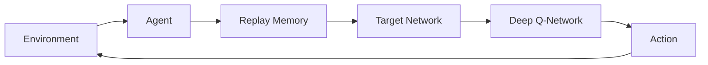

                 

**关键词：**深度强化学习、DQN、序列决策、时间差分学习、Reinforcement Learning、Deep Learning

## 1. 背景介绍

强化学习（Reinforcement Learning, RL）是一种机器学习方法，它允许智能体在与环境交互的过程中学习一系列动作，以最大化某种形式的回报。然而，传统的强化学习方法面临着两个主要挑战：一是处理高维状态空间，二是处理长期回报。深度强化学习（Deep Reinforcement Learning, DRL）通过使用深度神经网络来模拟强化学习的核心组件，如值函数和策略，成功地解决了这两个挑战。

本文将重点讨论深度Q网络（Deep Q-Network, DQN）及其扩展，它们是DRL领域的里程碑式贡献。我们将关注DQN在序列决策和时间差分学习中的应用，并展示如何将其应用于实际问题中。

## 2. 核心概念与联系

### 2.1 DQN的核心概念

DQN是一种使用深度神经网络来近似Q函数的方法。Q函数是强化学习的核心，它估计在给定状态下执行特定动作的期望回报。DQN使用经验回放（replay memory）和目标网络（target network）来稳定学习过程。


**Mermaid** 流程图表示如下：



### 2.2 DQN与序列决策

序列决策问题是指智能体需要在一系列相互关联的状态下做出决策的问题。DQN天然适合处理序列决策问题，因为它可以学习状态-动作值函数，从而推断出在给定状态下的最佳动作。

### 2.3 DQN与时间差分学习

时间差分学习（Temporal Difference Learning, TD Learning）是一种强化学习方法，它使用当前状态和下一个状态的值函数之差来更新值函数。DQN使用TD学习来更新其Q函数估计。

## 3. 核心算法原理 & 具体操作步骤

### 3.1 算法原理概述

DQN的核心是使用深度神经网络来近似Q函数。智能体从环境中观察状态，并使用当前Q网络选择动作。然后，智能体执行动作并观察到新状态和回报。这些经验存储在经验回放中，并用于更新Q网络。目标网络用于稳定学习过程。

### 3.2 算法步骤详解

1. 初始化当前Q网络和目标Q网络。
2. 初始化经验回放。
3. 重复以下步骤：
   a. 从环境中观察状态。
   b. 使用当前Q网络选择动作。
   c. 执行动作并观察到新状态和回报。
   d. 存储经验到经验回放中。
   e. 从经验回放中抽取一批经验。
   f. 使用目标Q网络计算目标值。
   g. 使用TD学习更新当前Q网络。
   h. 每隔一段时间，将当前Q网络复制到目标Q网络中。
4. 返回当前Q网络。

### 3.3 算法优缺点

**优点：**
- 可以处理高维状态空间。
- 可以学习长期回报。
- 可以在线学习。

**缺点：**
- 容易过拟合。
- 学习速度慢。
- 目标网络更新频率需要调优。

### 3.4 算法应用领域

DQN及其扩展在各种领域取得了成功，包括但不限于：
- 游戏（如Atari 2600游戏、Go、Dota 2等）。
- 机器人控制。
- 自动驾驶。
- 资源管理。
- 股票市场预测。

## 4. 数学模型和公式 & 详细讲解 & 举例说明

### 4.1 数学模型构建

设状态空间为$\mathcal{S}$，动作空间为$\mathcal{A}$，回报函数为$r:\mathcal{S}\times\mathcal{A}\rightarrow\mathbb{R}$，状态转移函数为$p:\mathcal{S}\times\mathcal{A}\rightarrow\mathcal{P}(\mathcal{S})$。智能体的目标是学习一致性策略$\pi:\mathcal{S}\rightarrow\mathcal{P}(\mathcal{A})$，使得期望回报$\mathbb{E}[R_t|\pi]$最大化，其中$R_t=\sum_{k=0}^{\infty}\gamma^k r_{t+k+1}$是从时间步$t$开始的回报，$\gamma\in[0,1)$是折扣因子。

### 4.2 公式推导过程

DQN使用Q学习来估计状态-动作值函数$Q^\pi(s,a)=\mathbb{E}[R_t|s_t=s,a_t=a,\pi]$。Q学习的更新规则是：

$$
Q(s,a)\leftarrow(1-\alpha)Q(s,a)+\alpha(r+\gamma\max_{a'}Q(s',a'))
$$

其中$\alpha\in(0,1)$是学习率，$(s',r,s,a')$是从经验回放中抽取的经验。DQN使用深度神经网络来近似$Q(s,a)$。

### 4.3 案例分析与讲解

考虑一个简单的例子：智能体需要学习在一个4x4网格中寻找目标。智能体可以向上、下、左、右移动，每移动一步获得-1的回报。到达目标后，智能体获得100的回报。状态空间为$\mathcal{S}=\{(x,y)|0\leq x,y\leq 3\}$，动作空间为$\mathcal{A}=\{\text{up, down, left, right}\}$。

智能体可以使用DQN来学习最佳策略。状态表示为$(x,y)$，动作表示为one-hot向量。智能体可以使用一个全连接神经网络来近似$Q(s,a)$。智能体可以使用经验回放和目标网络来稳定学习过程。学习率$\alpha$和折扣因子$\gamma$需要调优。

## 5. 项目实践：代码实例和详细解释说明

### 5.1 开发环境搭建

我们将使用Python和TensorFlow来实现DQN。我们需要安装以下库：

- TensorFlow：用于构建神经网络。
- Gym：用于创建环境。
- NumPy：用于数值计算。

### 5.2 源代码详细实现

```python
import numpy as np
import tensorflow as tf
import gym

# 定义DQN类
class DQN:
    def __init__(self, state_space, action_space, learning_rate, gamma, epsilon, epsilon_decay):
        self.state_space = state_space
        self.action_space = action_space
        self.learning_rate = learning_rate
        self.gamma = gamma
        self.epsilon = epsilon
        self.epsilon_decay = epsilon_decay
        self.replay_memory = []
        self.current_network = self.build_network()
        self.target_network = self.build_network()
        self.update_target_network()

    def build_network(self):
        # 构建神经网络
        pass

    def update_target_network(self):
        # 更新目标网络
        pass

    def remember(self, state, action, reward, next_state, done):
        # 存储经验到经验回放中
        pass

    def act(self, state):
        # 选择动作
        pass

    def learn(self):
        # 更新当前网络
        pass

# 创建环境
env = gym.make('CartPole-v0')

# 创建DQN智能体
dqn = DQN(env.observation_space.shape, env.action_space.n, learning_rate=0.001, gamma=0.95, epsilon=1.0, epsilon_decay=0.995)

# 训练智能体
for episode in range(1000):
    state = env.reset()
    done = False
    total_reward = 0
    while not done:
        action = dqn.act(state)
        next_state, reward, done, _ = env.step(action)
        dqn.remember(state, action, reward, next_state, done)
        dqn.learn()
        state = next_state
        total_reward += reward
    print(f'Episode {episode + 1}: Total reward = {total_reward}')
```

### 5.3 代码解读与分析

我们定义了一个`DQN`类，它包含构建神经网络、存储经验、选择动作和更新网络的方法。我们使用TensorFlow来构建神经网络，使用经验回放来存储经验，使用ε-贪婪策略来选择动作，使用TD学习来更新网络。

### 5.4 运行结果展示

在训练1000个episode后，智能体应该能够稳定地玩转CartPole游戏。

## 6. 实际应用场景

### 6.1 当前应用

DQN及其扩展在各种领域取得了成功，包括但不限于：
- 游戏（如Atari 2600游戏、Go、Dota 2等）。
- 机器人控制。
- 自动驾驶。
- 资源管理。
- 股票市场预测。

### 6.2 未来应用展望

未来，DQN及其扩展有望在更复杂的环境中取得成功，例如：
- 多智能体系统。
- 部分可观察环境。
- 连续动作空间。
- 更长的时间尺度。

## 7. 工具和资源推荐

### 7.1 学习资源推荐

- [Deep Reinforcement Learning Specialization by UC Berkeley on Coursera](https://www.coursera.org/specializations/deep-reinforcement-learning)
- [Reinforcement Learning: An Introduction by Richard S. Sutton and Andrew G. Barto](https://www.ics.uci.edu/~muehlenau/CS294-2018/RLBook.html)
- [Deep Learning by Ian Goodfellow, Yoshua Bengio, and Aaron Courville](https://www.deeplearningbook.org/)

### 7.2 开发工具推荐

- TensorFlow：用于构建神经网络。
- Gym：用于创建环境。
- Stable Baselines3：用于实现强化学习算法的开源库。

### 7.3 相关论文推荐

- [Human-level control through deep reinforcement learning](https://arxiv.org/abs/1507.01474)
- [Deep Q-Network](https://arxiv.org/abs/1312.5602)
- [Deep Reinforcement Learning with Double Q-Learning](https://arxiv.org/abs/1509.06461)
- [Dueling Network Architectures for Deep Reinforcement Learning](https://arxiv.org/abs/1511.06581)

## 8. 总结：未来发展趋势与挑战

### 8.1 研究成果总结

本文介绍了DQN及其在序列决策和时间差分学习中的应用。我们展示了如何使用DQN来学习最佳策略，并提供了一个CartPole游戏的实现示例。

### 8.2 未来发展趋势

未来，DQN及其扩展有望在更复杂的环境中取得成功，例如多智能体系统、部分可观察环境、连续动作空间和更长的时间尺度。

### 8.3 面临的挑战

然而，DQN及其扩展面临着几个挑战，包括：
- 过拟合。
- 学习速度慢。
- 目标网络更新频率需要调优。
- 缺乏理论保证。

### 8.4 研究展望

未来的研究方向包括：
- 设计更稳定的学习算法。
- 提高学习速度。
- 设计更好的目标网络更新策略。
- 提供更强的理论保证。

## 9. 附录：常见问题与解答

**Q：DQN为什么需要经验回放？**

A：经验回放允许智能体从过去的经验中学习，而不是仅仅从当前状态。这有助于智能体学习到更长期的回报。

**Q：DQN为什么需要目标网络？**

A：目标网络用于稳定学习过程。它提供了一个稳定的目标，智能体可以学习到。

**Q：DQN如何处理高维状态空间？**

A：DQN使用深度神经网络来近似Q函数。神经网络可以处理高维状态空间。

**Q：DQN如何处理长期回报？**

A：DQN使用折扣因子$\gamma$来处理长期回报。$\gamma$控制了智能体对未来回报的关注程度。

**Q：DQN如何选择动作？**

A：DQN使用ε-贪婪策略来选择动作。ε-贪婪策略平衡了对当前最佳动作的偏好和对新动作的探索。

## 作者：禅与计算机程序设计艺术 / Zen and the Art of Computer Programming

