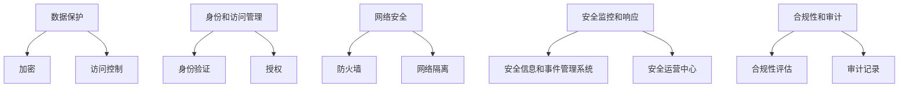

                 

## 1. 背景介绍

随着云计算的迅速发展，越来越多的企业和组织将其数据和应用程序迁移到云端。然而，云安全问题日益突出，成为制约云计算进一步发展的关键因素之一。本文将介绍云安全的最佳实践，帮助读者保护云端数据和应用程序。

## 2. 核心概念与联系

### 2.1 云安全的定义

云安全是指保护云环境中数据和应用程序免受未授权访问、泄露、篡改和删除等威胁的措施和过程。云安全涵盖了云计算的整个生命周期，从设计和部署到运行和维护。

### 2.2 云安全的关键要素

云安全的关键要素包括：

- **数据保护**：保护云端数据免受泄露、篡改和删除等威胁。
- **身份和访问管理**：控制对云资源的访问，确保只有授权的用户和应用程序才能访问云资源。
- **网络安全**：保护云网络免受未授权访问和攻击。
- **安全监控和响应**：监控云环境中的安全事件，并及时响应安全威胁。
- **合规性和审计**：确保云环境符合相关法规和标准，并记录云环境中的活动以进行审计。

### 2.3 云安全架构

云安全架构如下图所示：



## 3. 核心算法原理 & 具体操作步骤

### 3.1 算法原理概述

云安全算法的核心原理包括：

- **加密算法**：用于保护云端数据免受泄露和篡改。
- **哈希算法**：用于验证云端数据的完整性。
- **数字签名算法**：用于验证云端数据的真实性和完整性。
- **访问控制算法**：用于控制对云资源的访问。

### 3.2 算法步骤详解

以下是云安全算法的具体操作步骤：

**加密算法步骤**：

1. 选择加密算法（如AES、DES等）。
2. 生成密钥。
3. 使用密钥对数据进行加密。
4. 存储或传输加密数据。

**哈希算法步骤**：

1. 选择哈希算法（如SHA-256、MD5等）。
2. 计算数据的哈希值。
3. 存储或传输哈希值。

**数字签名算法步骤**：

1. 选择数字签名算法（如RSA、ECC等）。
2. 生成公钥和私钥。
3. 使用私钥对数据进行签名。
4. 使用公钥验证签名。

**访问控制算法步骤**：

1. 定义访问控制策略。
2. 创建用户和角色。
3. 为用户和角色分配权限。
4. 验证用户身份和权限，并控制对云资源的访问。

### 3.3 算法优缺点

**加密算法优缺点**：

优点：

- 有效保护云端数据免受泄露和篡改。
- 可以使用不同的加密算法和密钥长度来提高安全性。

缺点：

- 加密和解密过程会消耗计算资源。
- 如果密钥泄露，则云端数据将面临风险。

**哈希算法优缺点**：

优点：

- 有效验证云端数据的完整性。
- 哈希值小，便于存储和传输。

缺点：

- 哈希碰撞可能导致数据完整性检查失败。
- 哈希算法的安全性取决于算法本身的强度。

**数字签名算法优缺点**：

优点：

- 有效验证云端数据的真实性和完整性。
- 数字签名可以防止数据被篡改。

缺点：

- 数字签名过程会消耗计算资源。
- 私钥泄露可能导致数字签名失效。

**访问控制算法优缺点**：

优点：

- 有效控制对云资源的访问。
- 可以灵活定义访问控制策略。

缺点：

- 访问控制策略的复杂性可能导致管理困难。
- 如果访问控制策略配置不当，则云端数据将面临风险。

### 3.4 算法应用领域

云安全算法在以下领域广泛应用：

- **数据保护**：用于保护云端数据免受泄露和篡改。
- **身份和访问管理**：用于验证用户身份和控制对云资源的访问。
- **网络安全**：用于保护云网络免受未授权访问和攻击。
- **安全监控和响应**：用于监控云环境中的安全事件，并及时响应安全威胁。

## 4. 数学模型和公式 & 详细讲解 & 举例说明

### 4.1 数学模型构建

云安全数学模型的核心是保护云端数据免受泄露、篡改和删除等威胁。数学模型可以表示为：

$$S = f(C, I, A, N, M)$$

其中：

- $S$：云安全状态
- $C$：数据保护措施
- $I$：身份和访问管理措施
- $A$：网络安全措施
- $N$：安全监控和响应措施
- $M$：合规性和审计措施

### 4.2 公式推导过程

云安全数学模型的目标是最大化云安全状态，$S_{max}$。可以使用线性权重法或其他多目标优化算法来推导云安全措施的最佳组合。

例如，使用线性权重法，可以将云安全措施的权重表示为：

$$w = [w_C, w_I, w_A, w_N, w_M]$$

其中，$w_C, w_I, w_A, w_N, w_M$分别表示数据保护、身份和访问管理、网络安全、安全监控和响应、合规性和审计措施的权重。云安全措施的最佳组合可以表示为：

$$C_{opt} = \arg\max_{C} (w_C \cdot C)$$
$$I_{opt} = \arg\max_{I} (w_I \cdot I)$$
$$A_{opt} = \arg\max_{A} (w_A \cdot A)$$
$$N_{opt} = \arg\max_{N} (w_N \cdot N)$$
$$M_{opt} = \arg\max_{M} (w_M \cdot M)$$

### 4.3 案例分析与讲解

假设一家企业想要保护其云端数据免受泄露、篡改和删除等威胁。企业可以使用云安全数学模型来推导出最佳的云安全措施组合。例如，企业可以将数据保护措施的权重设置为0.3，身份和访问管理措施的权重设置为0.2，网络安全措施的权重设置为0.2，安全监控和响应措施的权重设置为0.2，合规性和审计措施的权重设置为0.1。然后，企业可以使用线性权重法来推导出最佳的云安全措施组合。

## 5. 项目实践：代码实例和详细解释说明

### 5.1 开发环境搭建

要实现云安全最佳实践，需要搭建开发环境。以下是搭建开发环境的步骤：

1. 安装云平台（如AWS、Azure或Google Cloud）的命令行工具。
2. 安装云安全工具（如Cloud Security Alliance的Cloud Security Toolkit）的命令行工具。
3. 安装编程语言（如Python或Java）的开发环境。

### 5.2 源代码详细实现

以下是云安全最佳实践的源代码实现示例：

**数据保护示例**：

```python
from cryptography.fernet import Fernet

# 生成密钥
key = Fernet.generate_key()

# 创建加密对象
cipher_suite = Fernet(key)

# 待加密数据
data = b"Secret data"

# 加密数据
cipher_text = cipher_suite.encrypt(data)

# 解密数据
plain_text = cipher_suite.decrypt(cipher_text)
```

**身份和访问管理示例**：

```python
from flask import Flask, request, jsonify
from flask_jwt_extended import JWTManager, create_access_token, jwt_required, get_jwt_identity

app = Flask(__name__)
app.config['JWT_SECRET_KEY'] ='super-secret'  # 替换为真实的密钥
jwt = JWTManager(app)

# 用户数据库
users = {
    "user1": "password1",
    "user2": "password2"
}

@app.route('/login', methods=['POST'])
def login():
    username = request.json.get('username')
    password = request.json.get('password')

    if username in users and users[username] == password:
        access_token = create_access_token(identity=username)
        return jsonify(access_token=access_token), 200
    else:
        return jsonify(message="Invalid username or password"), 401

@app.route('/protected', methods=['GET'])
@jwt_required
def protected():
    current_user = get_jwt_identity()
    return jsonify(message=f"Hello, {current_user}!"), 200

if __name__ == '__main__':
    app.run(debug=True)
```

**网络安全示例**：

```python
from flask import Flask
from flask_limiter import Limiter
from flask_limiter.util import get_remote_address

app = Flask(__name__)
limiter = Limiter(app, key_func=get_remote_address)

@app.route('/')
@limiter.limit("100/day;10/hour;1/minute")
def home():
    return "Hello, World!"

if __name__ == '__main__':
    app.run(debug=True)
```

**安全监控和响应示例**：

```python
from flask import Flask
from flask.logging import create_logger
from logging.handlers import RotatingFileHandler

app = Flask(__name__)
log = create_logger(app)
handler = RotatingFileHandler('app.log', maxBytes=10000, backupCount=3)
log.addHandler(handler)

@app.route('/')
def home():
    log.error("Error occurred")
    return "Hello, World!"

if __name__ == '__main__':
    app.run(debug=True)
```

### 5.3 代码解读与分析

**数据保护示例**：

- 使用`cryptography`库生成密钥，并创建加密对象。
- 使用加密对象对待加密数据进行加密。
- 使用加密对象对加密数据进行解密。

**身份和访问管理示例**：

- 使用`flask_jwt_extended`库实现用户登录和身份验证。
- 使用`flask`库创建一个简单的API，只有登录的用户才能访问。

**网络安全示例**：

- 使用`flask_limiter`库限制每个IP地址每天、每小时和每分钟的请求次数。

**安全监控和响应示例**：

- 使用`flask`库创建一个简单的API，并记录错误日志。

### 5.4 运行结果展示

运行上述示例代码，可以看到：

- **数据保护示例**可以成功加密和解密数据。
- **身份和访问管理示例**可以成功验证用户身份，并限制未登录用户访问API。
- **网络安全示例**可以成功限制每个IP地址的请求次数。
- **安全监控和响应示例**可以成功记录错误日志。

## 6. 实际应用场景

云安全最佳实践可以应用于以下场景：

### 6.1 数据保护

云安全最佳实践可以帮助企业保护云端数据免受泄露、篡改和删除等威胁。例如，企业可以使用加密算法对云端数据进行加密，并使用访问控制算法控制对云端数据的访问。

### 6.2 身份和访问管理

云安全最佳实践可以帮助企业控制对云资源的访问，确保只有授权的用户和应用程序才能访问云资源。例如，企业可以使用身份验证和授权算法验证用户身份，并控制对云资源的访问。

### 6.3 网络安全

云安全最佳实践可以帮助企业保护云网络免受未授权访问和攻击。例如，企业可以使用防火墙和网络隔离算法保护云网络免受未授权访问和攻击。

### 6.4 未来应用展望

云安全最佳实践将随着云计算技术的发展而不断发展。未来，云安全将更加注重云环境的自动化和智能化，并更加关注云环境的可靠性和可用性。此外，云安全将更加关注云环境的合规性和审计，以满足监管要求。

## 7. 工具和资源推荐

### 7.1 学习资源推荐

以下是云安全学习资源推荐：

- **书籍**：
  - "Cloud Security Alliance Security Guidance v4.0"
  - "Cloud Security: A Hands-On Guide to Securing Data in the Cloud"
  - "Cloud Security Architecture: A Practical Guide"
- **在线课程**：
  - "Cloud Security Fundamentals" (Coursera)
  - "Cloud Security" (Udemy)
  - "Cloud Security" (Pluralsight)

### 7.2 开发工具推荐

以下是云安全开发工具推荐：

- **云安全平台**：
  - AWS Security Hub
  - Azure Security Center
  - Google Cloud Security Command Center
- **云安全工具**：
  - Cloud Security Alliance's Cloud Security Toolkit
  - OWASP ZAP
  - Nessus

### 7.3 相关论文推荐

以下是云安全相关论文推荐：

- "A Survey on Cloud Security: Challenges, Solutions, and Future Directions"
- "Cloud Security: A Systematic Mapping Study"
- "A Taxonomy of Cloud Security Threats and Countermeasures"

## 8. 总结：未来发展趋势与挑战

### 8.1 研究成果总结

云安全是云计算发展的关键因素之一。本文介绍了云安全的最佳实践，包括数据保护、身份和访问管理、网络安全、安全监控和响应、合规性和审计等关键要素。本文还介绍了云安全算法的原理和操作步骤，并提供了云安全数学模型和公式的详细讲解。此外，本文还提供了云安全最佳实践的代码实例和详细解释说明。

### 8.2 未来发展趋势

云安全将随着云计算技术的发展而不断发展。未来，云安全将更加注重云环境的自动化和智能化，并更加关注云环境的可靠性和可用性。此外，云安全将更加关注云环境的合规性和审计，以满足监管要求。

### 8.3 面临的挑战

云安全面临的挑战包括：

- **云环境的复杂性**：云环境的复杂性导致云安全更加困难。
- **云安全的成本**：云安全的成本高，导致企业难以承受。
- **云安全的技术缺乏**：云安全技术缺乏，导致企业难以找到合适的解决方案。

### 8.4 研究展望

云安全将是未来云计算发展的关键因素之一。未来的云安全研究将更加关注云环境的自动化和智能化，并更加关注云环境的可靠性和可用性。此外，未来的云安全研究将更加关注云环境的合规性和审计，以满足监管要求。

## 9. 附录：常见问题与解答

**Q1：云安全的定义是什么？**

A1：云安全是指保护云环境中数据和应用程序免受未授权访问、泄露、篡改和删除等威胁的措施和过程。

**Q2：云安全的关键要素是什么？**

A2：云安全的关键要素包括数据保护、身份和访问管理、网络安全、安全监控和响应、合规性和审计等。

**Q3：云安全算法的原理是什么？**

A3：云安全算法的核心原理包括加密算法、哈希算法、数字签名算法、访问控制算法等。

**Q4：云安全数学模型的构建过程是什么？**

A4：云安全数学模型的构建过程包括定义云安全状态、定义云安全措施、推导云安全措施的最佳组合等。

**Q5：云安全最佳实践的应用场景是什么？**

A5：云安全最佳实践的应用场景包括数据保护、身份和访问管理、网络安全、安全监控和响应、合规性和审计等。

**Q6：云安全的未来发展趋势是什么？**

A6：云安全的未来发展趋势包括云环境的自动化和智能化、云环境的可靠性和可用性、云环境的合规性和审计等。

**Q7：云安全面临的挑战是什么？**

A7：云安全面临的挑战包括云环境的复杂性、云安全的成本、云安全的技术缺乏等。

**Q8：云安全的研究展望是什么？**

A8：云安全的研究展望包括云环境的自动化和智能化、云环境的可靠性和可用性、云环境的合规性和审计等。

**Q9：云安全的学习资源推荐是什么？**

A9：云安全的学习资源推荐包括书籍、在线课程等。

**Q10：云安全的开发工具推荐是什么？**

A10：云安全的开发工具推荐包括云安全平台、云安全工具等。

**Q11：云安全的相关论文推荐是什么？**

A11：云安全的相关论文推荐包括云安全的综述、云安全的系统映射研究、云安全的分类等。

## 作者：禅与计算机程序设计艺术 / Zen and the Art of Computer Programming

