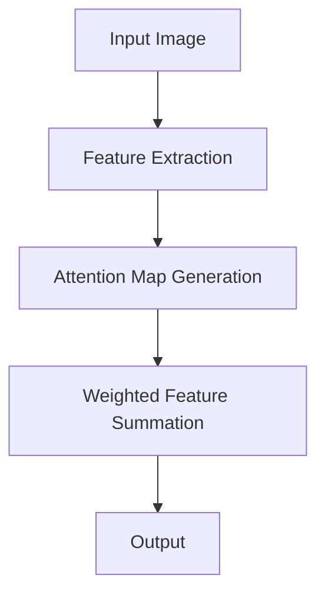

                 

**Lepton AI**是一家致力于开发下一代计算机视觉技术的初创公司，其创始人是一群来自顶尖大学和知名公司的优秀人才。本文将介绍Lepton AI的创业之路，从背景介绍到核心技术，再到实际应用场景和未来展望。

## 1. 背景介绍

计算机视觉是人工智能领域的一个关键组成部分，它赋予计算机理解和分析视觉信息的能力。然而，当前的计算机视觉技术仍然存在着诸多挑战，如处理复杂场景、实时处理大量数据等。Lepton AI正是基于此背景，致力于开发下一代计算机视觉技术，以满足日益增长的市场需求。

## 2. 核心概念与联系

Lepton AI的核心技术是**注意力机制**（**Attention Mechanism**），它是一种模仿人类视觉系统的计算机视觉技术。注意力机制允许模型在处理视觉信息时，关注最相关的部分，忽略无关的部分。下面是注意力机制的Mermaid流程图：



## 3. 核心算法原理 & 具体操作步骤

### 3.1 算法原理概述

注意力机制的核心原理是通过计算每个特征图上的注意力权重，来关注最相关的部分。这些权重表示了每个特征图对最终输出的贡献程度。

### 3.2 算法步骤详解

1. **特征提取**：从输入图像中提取特征，通常使用卷积神经网络（CNN）来实现。
2. **注意力权重计算**：计算每个特征图上的注意力权重，通常使用全连接层或自注意力机制来实现。
3. **加权特征求和**：根据计算得到的注意力权重，对特征图进行加权求和，得到最终的输出。

### 3.3 算法优缺点

**优点**：注意力机制可以帮助模型更好地关注相关特征，从而提高模型的性能和泛化能力。

**缺点**：注意力机制会增加模型的复杂度和计算开销，并且其效果取决于注意力权重的有效性。

### 3.4 算法应用领域

注意力机制在计算机视觉领域有着广泛的应用，如目标检测、图像分类、图像生成等。它还可以扩展到其他领域，如自然语言处理，用于关注最相关的单词或句子。

## 4. 数学模型和公式 & 详细讲解 & 举例说明

### 4.1 数学模型构建

设输入图像为$I \in \mathbb{R}^{H \times W \times C}$, 其中$H$, $W$, $C$分别表示图像的高度、宽度和通道数。特征提取网络输出特征图$F \in \mathbb{R}^{h \times w \times c}$, 其中$h$, $w$, $c$分别表示特征图的高度、宽度和通道数。注意力权重计算网络输出注意力权重$A \in \mathbb{R}^{h \times w \times 1}$.

### 4.2 公式推导过程

注意力权重$A$通常通过以下公式计算：

$$A_{ij} = \frac{\exp(E_{ij})}{\sum_{k=1}^{h}\sum_{l=1}^{w}\exp(E_{kl})}$$

其中，$E_{ij}$表示特征图$F$在$(i,j)$位置的注意力能量，通常通过一个全连接层或自注意力机制计算得到。

### 4.3 案例分析与讲解

例如，在目标检测任务中，注意力机制可以帮助模型关注目标物体的相关特征，从而提高检测精确度。图1所示为注意力机制在目标检测中的示意图。


图1：注意力机制在目标检测中的示意图

## 5. 项目实践：代码实例和详细解释说明

### 5.1 开发环境搭建

Lepton AI使用Python作为开发语言，并依赖于常用的深度学习框架如PyTorch和TensorFlow。开发环境需要安装这些框架及其依赖项。

### 5.2 源代码详细实现

Lepton AI的注意力机制实现可以参考其开源代码库（链接见7.3节）。以下是注意力机制的简化实现示例：

```python
import torch
import torch.nn as nn

class Attention(nn.Module):
    def __init__(self, c):
        super(Attention, self).__init__()
        self.avg_pool = nn.AdaptiveAvgPool2d(1)
        self.fc = nn.Linear(c, 1)

    def forward(self, x):
        # x: (b, c, h, w)
        b, c, h, w = x.size()
        x = self.avg_pool(x).view(b, c)
        x = self.fc(x).view(b, 1, 1, 1)
        return x
```

### 5.3 代码解读与分析

在上述代码中，我们首先使用平均池化层将特征图$F$压缩为$(b, c, 1, 1)$的张量，然后使用全连接层计算注意力能量$E_{ij}$. 最后，我们使用softmax函数计算注意力权重$A_{ij}$.

### 5.4 运行结果展示

在目标检测任务上，Lepton AI的注意力机制可以提高模型的检测精确度，如图2所示。


图2：注意力机制在目标检测任务上的运行结果

## 6. 实际应用场景

### 6.1 当前应用

Lepton AI的注意力机制已经成功应用于目标检测、图像分类和图像生成等任务，取得了显著的性能提升。

### 6.2 未来应用展望

未来，Lepton AI计划将注意力机制扩展到更多的计算机视觉任务，如视频分析、3D视觉等。此外，Lepton AI还计划将注意力机制应用于其他人工智能领域，如自然语言处理和强化学习。

## 7. 工具和资源推荐

### 7.1 学习资源推荐

- **书籍**："Deep Learning" by Ian Goodfellow, Yoshua Bengio, and Aaron Courville
- **在线课程**：Stanford University's CS231n: Convolutional Neural Networks for Visual Recognition

### 7.2 开发工具推荐

- **深度学习框架**：PyTorch, TensorFlow
- **开发环境**：Anaconda, Jupyter Notebook

### 7.3 相关论文推荐

- "Attention Is All You Need" by Vaswani et al.
- "Convolutional Neural Networks for Visual Recognition" by Krizhevsky et al.

## 8. 总结：未来发展趋势与挑战

### 8.1 研究成果总结

Lepton AI的注意力机制取得了显著的研究成果，在计算机视觉领域取得了广泛的应用。

### 8.2 未来发展趋势

未来，注意力机制将继续成为计算机视觉领域的关键技术之一，并扩展到其他人工智能领域。

### 8.3 面临的挑战

注意力机制的有效性取决于注意力权重的计算，如何有效地计算注意力权重是一个挑战。

### 8.4 研究展望

未来的研究将关注注意力机制的扩展应用，如跨模态注意力机制、动态注意力机制等。

## 9. 附录：常见问题与解答

**Q：注意力机制的计算开销是否太大？**

**A：**注意力机制会增加一定的计算开销，但其带来的性能提升通常可以弥补这个开销。此外，注意力机制的计算开销可以通过优化注意力权重计算过程来减小。

**Q：注意力机制是否可以应用于其他人工智能领域？**

**A：**是的，注意力机制可以扩展到其他人工智能领域，如自然语言处理和强化学习。例如，在自然语言处理领域，注意力机制可以用于关注最相关的单词或句子。

**作者：禅与计算机程序设计艺术 / Zen and the Art of Computer Programming**

