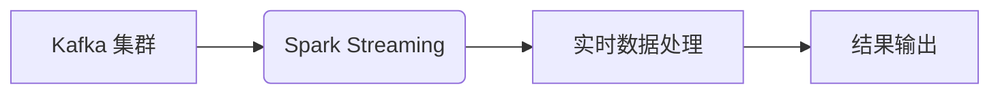

> Kafka, Spark Streaming, 流式处理, 实时数据分析, 微服务架构

## 1. 背景介绍

在当今数据爆炸的时代，海量数据实时生成和流动已成为常态。如何高效地采集、处理和分析这些实时数据，成为了企业数字化转型和智能决策的关键。Kafka 和 Spark Streaming 作为业界领先的开源工具，分别在消息队列和流式数据处理领域占据着重要地位。将它们结合起来，可以构建强大的实时数据处理系统，满足各种实时数据分析、告警预警、业务监控等需求。

## 2. 核心概念与联系

### 2.1 Kafka

Kafka 是一个高性能、分布式、可扩展的消息队列系统，它可以可靠地存储和传输海量数据流。Kafka 的核心组件包括：

* **主题 (Topic):** 用于组织和分类消息的逻辑容器。
* **分区 (Partition):** 主题被划分为多个分区，每个分区是一个独立的数据存储单元。
* **生产者 (Producer):** 向 Kafka 集群发送消息的应用程序。
* **消费者 (Consumer):** 从 Kafka 集群订阅主题并消费消息的应用程序。

### 2.2 Spark Streaming

Spark Streaming 是 Apache Spark 的流式数据处理引擎，它可以处理实时数据流，并执行各种数据处理操作，例如：

* 数据窗口化
* 数据聚合
* 数据转换
* 数据过滤

Spark Streaming 的核心概念包括：

* **微批处理 (Micro-batching):** 将实时数据流划分为小的批次，并对每个批次进行处理。
* **DStream:** 代表一个连续的数据流，它可以被操作和转换。
* **RDD:** 代表一个静态的数据集，它可以被 Spark 进行并行处理。

### 2.3 Kafka-Spark Streaming 集成

将 Kafka 和 Spark Streaming 集成，可以实现实时数据从 Kafka 集群到 Spark Streaming 的传输，并对数据进行实时处理。

**架构图:**



## 3. 核心算法原理 & 具体操作步骤

### 3.1 算法原理概述

Kafka-Spark Streaming 集成的核心算法原理是微批处理。Spark Streaming 将实时数据流划分为小的批次，每个批次的大小和时间间隔可以根据实际需求进行配置。每个批次的数据会被消费到 Spark Streaming 中，并进行处理。

### 3.2 算法步骤详解

1. **数据采集:** Spark Streaming 使用 Kafka 的消费者 API 从 Kafka 集群中消费数据。
2. **数据转换:** Spark Streaming 可以对数据进行各种转换操作，例如：数据清洗、数据格式转换、数据聚合等。
3. **数据处理:** Spark Streaming 可以对数据进行各种处理操作，例如：数据分析、数据挖掘、数据可视化等。
4. **结果输出:** Spark Streaming 可以将处理结果输出到各种目标系统，例如：数据库、文件系统、消息队列等。

### 3.3 算法优缺点

**优点:**

* **高性能:** Spark Streaming 可以利用 Spark 的并行处理能力，对数据进行高效的处理。
* **实时性:** Spark Streaming 的微批处理机制可以实现近实时的数据处理。
* **易用性:** Spark Streaming 提供了丰富的 API 和工具，方便开发者进行开发和调试。

**缺点:**

* **延迟:** 微批处理机制会导致一定的延迟，无法实现真正的实时处理。
* **资源消耗:** Spark Streaming 需要消耗一定的资源，例如：CPU、内存、磁盘空间等。

### 3.4 算法应用领域

Kafka-Spark Streaming 集成可以应用于各种场景，例如：

* **实时数据分析:** 对实时数据进行分析，例如：用户行为分析、市场趋势分析等。
* **告警预警:** 对实时数据进行监控，并进行告警预警，例如：系统异常告警、业务异常告警等。
* **业务监控:** 对业务数据进行监控，例如：订单处理时间、用户访问量等。

## 4. 数学模型和公式 & 详细讲解 & 举例说明

### 4.1 数学模型构建

Spark Streaming 的微批处理机制可以抽象为一个数学模型，其中：

* **T:** 时间间隔
* **B:** 批次大小
* **D(t):** 在时间 t 到时间 t+T 的数据流
* **B(t):** 在时间 t 到时间 t+T 的数据批次

则可以表示为：

$$
D(t) = \bigcup_{i=0}^{B-1} B(t+iT)
$$

### 4.2 公式推导过程

微批处理的延迟可以表示为：

$$
Delay = T/2
$$

其中，T/2 是每个批次处理完成所需的时间的一半。

### 4.3 案例分析与讲解

假设数据流的频率为每秒 100 条数据，批次大小为 100 条数据，时间间隔为 1 秒。则：

* 延迟为 0.5 秒。
* 每个批次包含 100 条数据。

## 5. 项目实践：代码实例和详细解释说明

### 5.1 开发环境搭建

* Java 8 或更高版本
* Scala 2.11 或更高版本
* Apache Spark 2.4 或更高版本
* Apache Kafka 2.1 或更高版本

### 5.2 源代码详细实现

```scala
import org.apache.spark.streaming.kafka010._
import org.apache.spark.streaming.{Seconds, StreamingContext}

object KafkaSparkStreamingExample {
  def main(args: Array[String]): Unit = {
    val sparkConf = new SparkConf().setAppName("KafkaSparkStreamingExample")
    val ssc = new StreamingContext(sparkConf, Seconds(1))

    // Kafka 参数配置
    val kafkaParams = Map[String, Object](
      "bootstrap.servers" -> "localhost:9092",
      "group.id" -> "my-group",
      "key.deserializer" -> "org.apache.kafka.common.serialization.StringDeserializer",
      "value.deserializer" -> "org.apache.kafka.common.serialization.StringDeserializer",
      "auto.offset.reset" -> "latest",
      "enable.auto.commit" -> (false: java.lang.Boolean)
    )

    // Kafka 主题配置
    val topics = Array("my-topic")

    // 创建 Kafka 数据流
    val kafkaStream = KafkaUtils.createDirectStream[String, String](
      ssc,
      LocationStrategies.PreferConsistent,
      ConsumerStrategies.Subscribe[String, String](topics, kafkaParams)
    )

    // 对数据流进行处理
    kafkaStream.foreachRDD { rdd =>
      println(s"Received ${rdd.count()} messages at time ${System.currentTimeMillis()}")
    }

    // 启动 Spark Streaming
    ssc.start()
    ssc.awaitTermination()
  }
}
```

### 5.3 代码解读与分析

* 代码首先定义了 SparkConf 和 StreamingContext 对象，用于配置 Spark Streaming 的运行环境。
* 然后定义了 Kafka 参数配置和主题配置，用于连接 Kafka 集群。
* 使用 KafkaUtils.createDirectStream 方法创建 Kafka 数据流，并指定数据消费策略和主题列表。
* 对数据流进行 foreachRDD 操作，对每个批次的数据进行处理，并打印消息数量和时间戳。
* 最后启动 Spark Streaming 并等待其终止。

### 5.4 运行结果展示

当代码运行时，会从 Kafka 集群中消费数据，并打印每个批次的消息数量和时间戳。

## 6. 实际应用场景

### 6.1 实时用户行为分析

将用户行为数据实时采集到 Kafka，并使用 Spark Streaming 进行分析，可以实时了解用户行为趋势，例如：

* 热门商品分析
* 用户画像分析
* 用户留存分析

### 6.2 实时告警预警

将系统监控数据实时采集到 Kafka，并使用 Spark Streaming 进行分析，可以实时监控系统状态，并进行告警预警，例如：

* CPU 使用率告警
* 内存使用率告警
* 网络流量告警

### 6.3 实时业务监控

将业务数据实时采集到 Kafka，并使用 Spark Streaming 进行分析，可以实时监控业务状态，例如：

* 订单处理时间
* 用户访问量
* 交易金额

### 6.4 未来应用展望

随着数据量的不断增长和实时数据处理需求的不断增加，Kafka-Spark Streaming 集成将有更广泛的应用场景，例如：

* 实时推荐系统
* 实时欺诈检测
* 实时风险控制

## 7. 工具和资源推荐

### 7.1 学习资源推荐

* Apache Kafka 官方文档: https://kafka.apache.org/documentation/
* Apache Spark 官方文档: https://spark.apache.org/docs/latest/
* Kafka-Spark Streaming 官方文档: https://spark.apache.org/docs/latest/streaming-kafka-0-10-integration.html

### 7.2 开发工具推荐

* Apache Kafka: https://kafka.apache.org/downloads
* Apache Spark: https://spark.apache.org/downloads.html
* IntelliJ IDEA: https://www.jetbrains.com/idea/

### 7.3 相关论文推荐

* Kafka: A Distributed Streaming Platform
* Spark Streaming: Leveraging in-memory computing for real-time data analytics

## 8. 总结：未来发展趋势与挑战

### 8.1 研究成果总结

Kafka-Spark Streaming 集成是一种高效的实时数据处理方案，它可以满足各种实时数据分析、告警预警、业务监控等需求。

### 8.2 未来发展趋势

* **更低延迟:** 研究更低延迟的实时数据处理算法和技术。
* **更强大的处理能力:** 研究更强大的数据处理引擎和架构，以满足海量数据处理需求。
* **更丰富的应用场景:** 开发更多基于 Kafka-Spark Streaming 的应用场景，例如：实时推荐系统、实时欺诈检测等。

### 8.3 面临的挑战

* **数据一致性:** 确保实时数据处理过程中的数据一致性。
* **数据可靠性:** 确保实时数据处理过程中的数据可靠性。
* **系统复杂性:** Kafka-Spark Streaming 集成的系统复杂度较高，需要专业的技术人员进行维护和管理。

### 8.4 研究展望

未来，我们将继续研究 Kafka-Spark Streaming 集成的技术，以提高其性能、可靠性和安全性，并将其应用于更多领域。

## 9. 附录：常见问题与解答

### 9.1 如何配置 Kafka 集群？

Kafka 集群的配置需要根据实际需求进行调整，例如：

* 节点数量
* 分区数量
* 主题配置

### 9.2 如何连接 Kafka 集群？

可以使用 Kafka 的消费者 API 连接 Kafka 集群，例如：

```scala
val kafkaParams = Map[String, Object](
  "bootstrap.servers" -> "localhost:9092",
  "group.id" -> "my-group",
  // ...
)
```

### 9.3 如何处理数据流？

可以使用 Spark Streaming 的 foreachRDD 操作对数据流进行处理，例如：

```scala
kafkaStream.foreachRDD { rdd =>
  // 对数据进行处理
}
```


作者：禅与计算机程序设计艺术 / Zen and the Art of Computer Programming 
<end_of_turn>