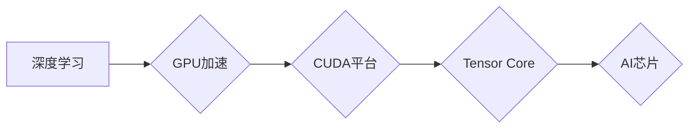

> Nvidia, GPU, 深度学习, AI芯片, CUDA, Tensor Core, Transformer, 

## 1. 背景介绍

人工智能（AI）正以惊人的速度发展，其应用领域不断扩展，从自动驾驶到医疗诊断，再到自然语言处理，AI正在改变着我们的世界。在这个快速发展的领域中，Nvidia 凭借其强大的GPU技术和对AI的深刻理解，成为了AI领域的领导者。

Nvidia的GPU（图形处理单元）最初被设计用于处理图形渲染，但其并行计算能力使其也成为了深度学习训练的理想平台。深度学习是AI领域的核心技术之一，它利用多层神经网络来模拟人类大脑的学习过程，从而能够处理复杂的数据模式。

## 2. 核心概念与联系

**2.1 GPU加速深度学习**

传统CPU（中央处理器）虽然在处理顺序计算方面表现出色，但在处理大量并行计算时效率较低。而GPU拥有数千个并行处理单元，能够同时处理大量数据，使其在深度学习训练中具有显著优势。

**2.2 CUDA平台**

Nvidia开发了CUDA（Compute Unified Device Architecture）平台，它允许程序员将代码移植到GPU上进行加速计算。CUDA提供了丰富的编程工具和库，使得开发人员能够轻松地利用GPU的强大计算能力。

**2.3 Tensor Core**

为了进一步提升深度学习的性能，Nvidia在最新的GPU架构中引入了Tensor Core。Tensor Core是专门为深度学习运算设计的硬件加速单元，它能够以更高的精度和速度执行矩阵乘法和累加等深度学习运算。

**2.4  AI芯片架构**

Nvidia不仅在GPU领域领先，还开发了专门用于AI的芯片，例如Xavier和Orin。这些芯片集成了GPU、CPU、内存和高速互连技术，能够提供更强大的AI计算能力和更低的功耗。

**Mermaid 流程图**



## 3. 核心算法原理 & 具体操作步骤

**3.1 算法原理概述**

深度学习算法的核心是多层神经网络。神经网络由多个层组成，每层包含多个神经元。每个神经元接收来自上一层的输入信号，并通过激活函数进行处理，然后将处理后的信号传递到下一层。通过训练神经网络，可以调整每个神经元的权重，使得网络能够学习数据中的模式。

**3.2 算法步骤详解**

1. **数据预处理:** 将原始数据转换为深度学习算法可以理解的格式，例如归一化、编码等。
2. **网络结构设计:** 根据任务需求设计神经网络的结构，包括层数、神经元数量、激活函数等。
3. **参数初始化:** 为神经网络中的权重和偏置赋予初始值。
4. **前向传播:** 将输入数据通过神经网络进行一次计算，得到输出结果。
5. **损失函数计算:** 计算输出结果与真实值的差异，即损失值。
6. **反向传播:** 根据损失值，反向计算每个神经元的梯度，即权重更新方向。
7. **参数更新:** 使用梯度下降算法等优化算法，更新神经网络的权重和偏置。
8. **重复步骤4-7:** 迭代训练神经网络，直到损失值达到预设阈值或训练次数达到上限。

**3.3 算法优缺点**

**优点:**

* 能够学习复杂的数据模式。
* 性能优异，能够处理海量数据。
* 应用广泛，在图像识别、自然语言处理等领域取得了突破性进展。

**缺点:**

* 训练时间长，需要大量的计算资源。
* 对数据质量要求高，训练数据不足会导致模型性能下降。
* 模型解释性差，难以理解模型的决策过程。

**3.4 算法应用领域**

* **图像识别:** 人脸识别、物体检测、图像分类等。
* **自然语言处理:** 机器翻译、文本摘要、情感分析等。
* **语音识别:** 语音转文本、语音助手等。
* **自动驾驶:** 路线规划、物体检测、驾驶决策等。
* **医疗诊断:** 病理图像分析、疾病预测等。

## 4. 数学模型和公式 & 详细讲解 & 举例说明

**4.1 数学模型构建**

深度学习模型的核心是神经网络，其数学模型可以表示为一系列的矩阵运算和激活函数。

**4.2 公式推导过程**

* **前向传播:**

$$
y = f(W^L x^L + b^L)
$$

其中：

* $y$ 是输出结果。
* $f$ 是激活函数。
* $W^L$ 是第 $L$ 层的权重矩阵。
* $x^L$ 是第 $L$ 层的输入向量。
* $b^L$ 是第 $L$ 层的偏置向量。

* **损失函数:**

$$
L = \frac{1}{N} \sum_{i=1}^{N} \mathcal{L}(y_i, \hat{y}_i)
$$

其中：

* $L$ 是损失函数值。
* $N$ 是样本数量。
* $\mathcal{L}$ 是单个样本的损失函数。
* $y_i$ 是第 $i$ 个样本的真实值。
* $\hat{y}_i$ 是第 $i$ 个样本的预测值。

* **梯度下降:**

$$
\theta_{t+1} = \theta_t - \eta \nabla L(\theta_t)
$$

其中：

* $\theta$ 是模型参数。
* $\eta$ 是学习率。
* $\nabla L(\theta_t)$ 是损失函数对参数的梯度。

**4.3 案例分析与讲解**

以图像分类为例，假设我们有一个包含猫和狗的图像数据集。我们可以使用卷积神经网络（CNN）来训练一个图像分类模型。

CNN的结构包括多个卷积层、池化层和全连接层。卷积层负责提取图像特征，池化层负责降低特征维度，全连接层负责分类。

训练过程中，我们将图像数据输入到CNN中，并使用交叉熵损失函数计算模型的损失值。然后，使用梯度下降算法更新模型参数，使得模型能够准确地分类猫和狗的图像。

## 5. 项目实践：代码实例和详细解释说明

**5.1 开发环境搭建**

* 操作系统：Ubuntu 20.04
* CUDA版本：11.4
* cuDNN版本：8.1
* Python版本：3.8

**5.2 源代码详细实现**

```python
import tensorflow as tf

# 定义模型结构
model = tf.keras.models.Sequential([
    tf.keras.layers.Conv2D(32, (3, 3), activation='relu', input_shape=(28, 28, 1)),
    tf.keras.layers.MaxPooling2D((2, 2)),
    tf.keras.layers.Conv2D(64, (3, 3), activation='relu'),
    tf.keras.layers.MaxPooling2D((2, 2)),
    tf.keras.layers.Flatten(),
    tf.keras.layers.Dense(10, activation='softmax')
])

# 编译模型
model.compile(optimizer='adam',
              loss='sparse_categorical_crossentropy',
              metrics=['accuracy'])

# 加载数据
(x_train, y_train), (x_test, y_test) = tf.keras.datasets.mnist.load_data()

# 数据预处理
x_train = x_train.astype('float32') / 255.0
x_test = x_test.astype('float32') / 255.0
x_train = x_train.reshape((x_train.shape[0], 28, 28, 1))
x_test = x_test.reshape((x_test.shape[0], 28, 28, 1))

# 训练模型
model.fit(x_train, y_train, epochs=5)

# 评估模型
loss, accuracy = model.evaluate(x_test, y_test)
print('Test loss:', loss)
print('Test accuracy:', accuracy)
```

**5.3 代码解读与分析**

这段代码实现了使用TensorFlow框架训练一个简单的MNIST手写数字识别模型。

* 首先，定义了模型结构，包括卷积层、池化层和全连接层。
* 然后，编译了模型，指定了优化器、损失函数和评价指标。
* 接着，加载了MNIST数据集并进行了数据预处理。
* 最后，训练了模型并评估了模型性能。

**5.4 运行结果展示**

训练完成后，模型能够准确地识别MNIST数据集中的手写数字。

## 6. 实际应用场景

**6.1 图像识别**

* **人脸识别:** 用于解锁手机、验证身份、监控安全等。
* **物体检测:** 用于自动驾驶、安防监控、零售分析等。
* **图像分类:** 用于医疗诊断、产品识别、内容推荐等。

**6.2 自然语言处理**

* **机器翻译:** 将文本从一种语言翻译成另一种语言。
* **文本摘要:** 自动生成文本的简短摘要。
* **情感分析:** 分析文本中的情感倾向，用于市场调研、客户服务等。

**6.3 语音识别**

* **语音转文本:** 将语音转换为文本，用于语音助手、听写软件等。
* **语音合成:** 将文本转换为语音，用于语音导航、虚拟助手等。

**6.4 自动驾驶**

* **路径规划:** 规划车辆行驶路线。
* **物体检测:** 检测道路上的车辆、行人、交通信号灯等。
* **驾驶决策:** 根据感知到的环境信息，做出驾驶决策。

**6.5 医疗诊断**

* **病理图像分析:** 辅助医生诊断疾病。
* **疾病预测:** 根据患者的医疗记录和基因信息，预测疾病风险。

**6.6 未来应用展望**

AI技术的发展将继续推动各行各业的变革，例如：

* **个性化教育:** 根据学生的学习进度和特点，提供个性化的学习方案。
* **智能制造:** 利用AI技术提高生产效率和产品质量。
* **智慧城市:** 利用AI技术优化城市管理和服务。

## 7. 工具和资源推荐

**7.1 学习资源推荐**

* **深度学习课程:** Coursera、edX、Udacity等平台提供丰富的深度学习课程。
* **书籍:** 《深度学习》、《动手学深度学习》等书籍。
* **在线社区:** TensorFlow、PyTorch等框架的官方论坛和社区。

**7.2 开发工具推荐**

* **TensorFlow:** Google开发的开源深度学习框架。
* **PyTorch:** Facebook开发的开源深度学习框架。
* **Keras:** TensorFlow的高级API，简化了深度学习模型的开发。

**7.3 相关论文推荐**

* **AlexNet:** 《ImageNet Classification with Deep Convolutional Neural Networks》
* **VGGNet:** 《Very Deep Convolutional Networks for Large-Scale Image Recognition》
* **ResNet:** 《Deep Residual Learning for Image Recognition》

## 8. 总结：未来发展趋势与挑战

**8.1 研究成果总结**

近年来，深度学习取得了显著的进展，在图像识别、自然语言处理、语音识别等领域取得了突破性进展。Nvidia在GPU加速、AI芯片开发等方面做出了重要贡献，推动了深度学习的发展。

**8.2 未来发展趋势**

* **模型规模和复杂度提升:** 未来深度学习模型将更加庞大，包含更多参数和层数。
* **模型效率提升:** 研究人员将致力于开发更有效的深度学习算法和硬件架构，降低模型训练和推理的成本。
* **跨模态学习:** 将不同模态的数据（例如图像、文本、音频）融合在一起，训练更通用的模型。
* **联邦学习:** 在不共享原始数据的情况下，训练模型，