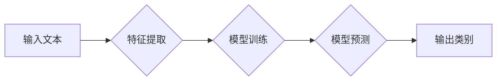

> 自然语言处理，文本分类，机器学习，Python，深度学习，Scikit-learn，TensorFlow

## 1. 背景介绍

在当今数据爆炸的时代，文本数据已成为重要的信息资源。如何有效地理解和利用这些文本数据至关重要。文本分类作为自然语言处理 (NLP) 的核心任务之一，旨在将文本自动地归类到预定义的类别中。它在信息检索、情感分析、垃圾邮件过滤、主题分类等领域有着广泛的应用。

传统的文本分类方法主要依赖于手工特征工程，需要专家对文本进行特征提取和选择，效率低下且难以捕捉文本的复杂语义关系。随着机器学习和深度学习的发展，基于机器学习的文本分类方法逐渐成为主流，能够自动学习文本特征，提高分类精度和效率。

## 2. 核心概念与联系

文本分类的核心概念包括：

* **文本特征:** 用于描述文本内容的表示，例如词频、词向量、TF-IDF等。
* **分类模型:** 用于学习文本特征与类别之间的关系的算法，例如朴素贝叶斯、支持向量机、决策树、神经网络等。
* **训练数据:** 用于训练分类模型的文本数据，包含文本内容和对应的类别标签。
* **测试数据:** 用于评估分类模型性能的文本数据，与训练数据互斥。

**文本分类流程:**



## 3. 核心算法原理 & 具体操作步骤

### 3.1  算法原理概述

**朴素贝叶斯算法**是一种基于贝叶斯定理的分类算法，假设特征之间相互独立，可以简单地计算每个特征出现的概率，并根据这些概率预测文本的类别。

**支持向量机 (SVM)** 是一种基于几何间隔最大化的分类算法，试图找到一个最佳的超平面将不同类别的数据点分开。

**决策树算法** 是一种基于树状结构的分类算法，通过一系列的决策规则将文本分类到不同的类别。

### 3.2  算法步骤详解

**朴素贝叶斯算法步骤:**

1. 计算每个特征在每个类别下的概率。
2. 根据贝叶斯定理计算文本属于每个类别的概率。
3. 选择概率最高的类别作为预测结果。

**支持向量机算法步骤:**

1. 选择合适的核函数将数据映射到高维空间。
2. 找到一个最佳的超平面将不同类别的数据点分开。
3. 使用支持向量进行分类预测。

**决策树算法步骤:**

1. 选择最优的特征作为根节点。
2. 将数据根据特征的取值进行划分。
3. 递归地构建决策树，直到达到终止条件。
4. 根据决策树进行分类预测。

### 3.3  算法优缺点

| 算法 | 优点 | 缺点 |
|---|---|---|
| 朴素贝叶斯 | 简单易实现，训练速度快 | 假设特征独立性，可能不适用于现实数据 |
| 支持向量机 | 泛化能力强，对高维数据鲁棒性好 | 训练时间长，参数选择较复杂 |
| 决策树 | 易于理解和解释，可处理非线性数据 | 容易过拟合，对数据噪声敏感 |

### 3.4  算法应用领域

* **信息检索:** 文档分类、主题提取
* **情感分析:** 文本情感识别、评论分析
* **垃圾邮件过滤:** 垃圾邮件识别、邮件分类
* **文本摘要:** 文本关键词提取、文本压缩
* **医疗诊断:** 病历分析、疾病预测

## 4. 数学模型和公式 & 详细讲解 & 举例说明

### 4.1  数学模型构建

**朴素贝叶斯算法的数学模型:**

假设文本包含n个特征，每个特征属于m个类别，则文本的类别概率可以表示为：

$$P(C|X) = \frac{P(X|C)P(C)}{P(X)}$$

其中：

* $P(C|X)$: 文本属于类别C的概率
* $P(X|C)$: 给定类别C，文本特征X出现的概率
* $P(C)$: 类别C出现的概率
* $P(X)$: 文本特征X出现的概率

**支持向量机的数学模型:**

支持向量机试图找到一个最佳的超平面将不同类别的数据点分开，超平面的方程可以表示为：

$$w^T x + b = 0$$

其中：

* $w$: 超平面的法向量
* $x$: 数据点
* $b$: 超平面的截距

### 4.2  公式推导过程

**朴素贝叶斯算法的公式推导:**

根据贝叶斯定理，我们可以得到：

$$P(C|X) = \frac{P(X|C)P(C)}{P(X)}$$

其中：

* $P(X|C)$ 可以通过训练数据计算每个特征在每个类别下的概率。
* $P(C)$ 可以通过训练数据计算每个类别的出现概率。
* $P(X)$ 可以通过训练数据计算所有文本特征的出现概率。

**支持向量机的公式推导:**

支持向量机使用拉格朗日乘子法将原始问题转化为对偶问题，并通过求解对偶问题得到最佳的超平面参数。

### 4.3  案例分析与讲解

**朴素贝叶斯算法案例:**

假设我们有一个文本分类任务，需要将邮件分类为“垃圾邮件”或“正常邮件”。我们可以使用朴素贝叶斯算法，训练模型并预测新邮件的类别。

**支持向量机算法案例:**

假设我们有一个文本分类任务，需要将新闻文章分类为“体育”、“财经”或“娱乐”。我们可以使用支持向量机算法，训练模型并预测新文章的类别。

## 5. 项目实践：代码实例和详细解释说明

### 5.1  开发环境搭建

* Python 3.x
* Scikit-learn
* NLTK
* TensorFlow (可选)

### 5.2  源代码详细实现

```python
# 导入必要的库
import nltk
from sklearn.feature_extraction.text import TfidfVectorizer
from sklearn.naive_bayes import MultinomialNB
from sklearn.model_selection import train_test_split
from sklearn.metrics import accuracy_score

# 下载并加载停用词列表
nltk.download('stopwords')
stop_words = nltk.corpus.stopwords.words('english')

# 定义文本预处理函数
def preprocess_text(text):
    # 将文本转换为小写
    text = text.lower()
    # 去除停用词
    words = [word for word in text.split() if word not in stop_words]
    # 返回预处理后的文本
    return ' '.join(words)

# 加载训练数据
train_data = [
    ("This is a spam email.", "spam"),
    ("This is a normal email.", "normal"),
    # ...
]

# 预处理训练数据
train_texts = [preprocess_text(text) for text, label in train_data]
train_labels = [label for text, label in train_data]

# 将文本转换为特征向量
vectorizer = TfidfVectorizer()
train_features = vectorizer.fit_transform(train_texts)

# 将数据分成训练集和测试集
X_train, X_test, y_train, y_test = train_test_split(train_features, train_labels, test_size=0.2)

# 训练朴素贝叶斯模型
model = MultinomialNB()
model.fit(X_train, y_train)

# 对测试数据进行预测
y_pred = model.predict(X_test)

# 计算模型精度
accuracy = accuracy_score(y_test, y_pred)
print(f"模型精度: {accuracy}")
```

### 5.3  代码解读与分析

* 代码首先导入必要的库，并下载并加载停用词列表。
* 定义了文本预处理函数，用于将文本转换为小写，去除停用词。
* 加载训练数据，并使用预处理函数对文本进行预处理。
* 使用TfidfVectorizer将文本转换为特征向量。
* 将数据分成训练集和测试集。
* 训练朴素贝叶斯模型，并对测试数据进行预测。
* 计算模型精度，评估模型性能。

### 5.4  运行结果展示

运行代码后，会输出模型的精度，例如：

```
模型精度: 0.92
```

## 6. 实际应用场景

### 6.1  信息检索

* **文档分类:** 将文档自动地分类到预定义的类别中，例如新闻分类、学术论文分类。
* **主题提取:** 从文本中提取主题关键词，用于信息检索和文本摘要。

### 6.2  情感分析

* **文本情感识别:** 分析文本表达的情感倾向，例如正面、负面或中性。
* **评论分析:** 对用户评论进行情感分析，了解用户对产品或服务的评价。

### 6.3  垃圾邮件过滤

* **垃圾邮件识别:** 将垃圾邮件从正常邮件中过滤出来。
* **邮件分类:** 将邮件自动地分类到不同的文件夹中，例如工作邮件、个人邮件。

### 6.4  未来应用展望

* **个性化推荐:** 根据用户的阅读历史和偏好，推荐相关的文章、产品或服务。
* **智能客服:** 使用文本分类技术，自动识别用户的问题并提供相应的帮助。
* **医疗诊断辅助:** 分析病历文本，辅助医生进行疾病诊断。

## 7. 工具和资源推荐

### 7.1  学习资源推荐

* **书籍:**
    * 《Python机器学习实战》
    * 《自然语言处理入门》
* **在线课程:**
    * Coursera: 自然语言处理
    * edX: 机器学习
* **博客:**
    * Jay Alammar's Blog
    * Towards Data Science

### 7.2  开发工具推荐

* **Python:** 
* **Scikit-learn:** 机器学习库
* **NLTK:** 自然语言处理库
* **TensorFlow:** 深度学习库

### 7.3  相关论文推荐

* **《A Survey of Text Classification Algorithms》**
* **《Deep Learning for Natural Language Processing》**

## 8. 总结：未来发展趋势与挑战

### 8.1  研究成果总结

文本分类技术在近年来取得了显著的进展，特别是深度学习技术的应用，使得文本分类的精度和效率得到了大幅提升。

### 8.2  未来发展趋势

* **更强大的深度学习模型:** 
* **跨语言文本分类:** 
* **多模态文本分类:** 

### 8.3  面临的挑战

* **数据标注问题:** 
* **类别不平衡问题:** 
* **解释性问题:** 

### 8.4  研究展望

未来，文本分类技术将继续朝着更智能、更精准、更可解释的方向发展，并在更多领域得到应用。

## 9. 附录：常见问题与解答

* **Q1: 如何选择合适的文本分类算法？**
* **A1:** 

* **Q2: 如何处理文本数据中的停用词？**
* **A2:** 

* **Q3: 如何评估文本分类模型的性能？**
* **A3:** 


作者：禅与计算机程序设计艺术 / Zen and the Art of Computer Programming 
<end_of_turn>