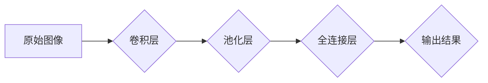

> 深度学习，计算机视觉，Python，TensorFlow，PyTorch，卷积神经网络，图像分类，目标检测，实例分割

## 1. 背景介绍

深度学习作为机器学习领域的一个重要分支，近年来取得了令人瞩目的成就，尤其是在计算机视觉领域。深度学习算法能够自动从海量数据中学习特征，从而实现图像识别、物体检测、图像分割等复杂任务。Python作为一种流行的编程语言，拥有丰富的深度学习库和工具，例如TensorFlow和PyTorch，使得深度学习的开发和应用更加便捷。

本篇文章将深入探讨深度学习与计算机视觉的结合，介绍核心概念、算法原理、代码实现以及实际应用场景。通过学习本篇文章，读者能够掌握深度学习在计算机视觉领域的应用基础，并能够利用Python和深度学习库进行实际项目开发。

## 2. 核心概念与联系

### 2.1 深度学习

深度学习是一种基于多层人工神经网络的机器学习方法。与传统机器学习方法相比，深度学习算法能够自动学习更复杂的特征表示，从而提高模型的性能。深度学习网络通常由多个卷积层、池化层、全连接层等组成，通过层层叠加，将原始数据逐步抽象成更高级的特征表示。

### 2.2 计算机视觉

计算机视觉是赋予计算机“看”的能力，使其能够理解和解释图像和视频信息。计算机视觉任务包括图像分类、物体检测、图像分割、人脸识别、场景理解等。深度学习算法在计算机视觉领域取得了突破性进展，例如AlexNet、VGGNet、ResNet等模型在图像分类任务上取得了state-of-the-art的性能。

### 2.3 深度学习与计算机视觉的结合

深度学习为计算机视觉提供了强大的工具，能够有效解决传统计算机视觉算法难以处理的复杂问题。深度学习算法能够自动学习图像特征，无需人工特征工程，从而提高了模型的效率和准确性。

**深度学习与计算机视觉的结合流程图:**



## 3. 核心算法原理 & 具体操作步骤

### 3.1 算法原理概述

卷积神经网络（Convolutional Neural Network，CNN）是深度学习中专门用于处理图像数据的网络结构。CNN的核心思想是利用卷积操作和池化操作来提取图像特征。卷积操作通过卷积核（filter）在图像上滑动，提取图像局部特征；池化操作则对卷积后的特征图进行降维，减少计算量并提高模型鲁棒性。

### 3.2 算法步骤详解

1. **输入图像预处理:** 将原始图像转换为适合CNN输入的格式，例如调整图像大小、归一化像素值等。
2. **卷积层:** 使用多个卷积核对图像进行卷积操作，提取图像局部特征。每个卷积核对应一个特征图，多个卷积核组合起来形成多层特征图。
3. **池化层:** 对卷积后的特征图进行池化操作，例如最大池化或平均池化，减少特征图尺寸，提高模型鲁棒性。
4. **全连接层:** 将池化后的特征图展平，连接到全连接层，进行分类或回归任务。
5. **输出层:** 根据任务类型，输出分类结果或回归值。

### 3.3 算法优缺点

**优点:**

* 自动学习图像特征，无需人工特征工程。
* 能够处理高维图像数据。
* 具有较高的准确率和鲁棒性。

**缺点:**

* 训练时间长，需要大量数据和计算资源。
* 模型参数量大，容易过拟合。

### 3.4 算法应用领域

CNN在计算机视觉领域广泛应用，例如：

* **图像分类:** 将图像分类到预定义的类别中，例如识别猫、狗、汽车等。
* **物体检测:** 在图像中检测到特定物体的位置和类别，例如检测道路上的车辆。
* **图像分割:** 将图像分割成不同的区域，例如分割图像中的前景和背景。
* **人脸识别:** 根据人脸特征识别个人身份。

## 4. 数学模型和公式 & 详细讲解 & 举例说明

### 4.1 数学模型构建

CNN的数学模型主要包括卷积操作、池化操作和激活函数。

**卷积操作:**

$$
y_{i,j} = \sum_{m=0}^{M-1} \sum_{n=0}^{N-1} x_{i+m,j+n} * w_{m,n} + b
$$

其中：

* $x_{i,j}$ 是输入图像的像素值。
* $w_{m,n}$ 是卷积核的权重值。
* $b$ 是卷积层的偏置值。
* $y_{i,j}$ 是卷积后的特征图的像素值。

**池化操作:**

池化操作通常使用最大池化或平均池化。最大池化选择特征图中最大值作为输出，平均池化则计算特征图中所有像素值的平均值作为输出。

**激活函数:**

激活函数用于引入非线性，提高模型的表达能力。常用的激活函数包括ReLU、Sigmoid和Tanh等。

### 4.2 公式推导过程

卷积操作的公式推导过程可以参考相关深度学习教材或论文。

### 4.3 案例分析与讲解

以图像分类为例，CNN模型可以将输入图像分类到预定义的类别中。模型的输出层通常使用softmax函数，将多维特征向量映射到概率分布，每个类别对应一个概率值。

## 5. 项目实践：代码实例和详细解释说明

### 5.1 开发环境搭建

使用Python3.x版本，安装必要的深度学习库，例如TensorFlow或PyTorch。

### 5.2 源代码详细实现

以下代码示例使用TensorFlow框架实现一个简单的图像分类模型：

```python
import tensorflow as tf

# 定义模型结构
model = tf.keras.models.Sequential([
    tf.keras.layers.Conv2D(32, (3, 3), activation='relu', input_shape=(28, 28, 1)),
    tf.keras.layers.MaxPooling2D((2, 2)),
    tf.keras.layers.Conv2D(64, (3, 3), activation='relu'),
    tf.keras.layers.MaxPooling2D((2, 2)),
    tf.keras.layers.Flatten(),
    tf.keras.layers.Dense(10, activation='softmax')
])

# 编译模型
model.compile(optimizer='adam',
              loss='sparse_categorical_crossentropy',
              metrics=['accuracy'])

# 训练模型
model.fit(x_train, y_train, epochs=5)

# 评估模型
loss, accuracy = model.evaluate(x_test, y_test)
print('Test loss:', loss)
print('Test accuracy:', accuracy)
```

### 5.3 代码解读与分析

代码首先定义了模型结构，包括卷积层、池化层和全连接层。然后编译模型，指定优化器、损失函数和评价指标。最后训练模型，并评估模型的性能。

### 5.4 运行结果展示

训练完成后，可以查看模型的训练和测试损失以及准确率。

## 6. 实际应用场景

### 6.1 图像分类

CNN在图像分类任务中取得了显著的成果，例如识别猫、狗、汽车等。

### 6.2 物体检测

CNN可以用于检测图像中特定物体的位置和类别，例如检测道路上的车辆。

### 6.3 图像分割

CNN可以将图像分割成不同的区域，例如分割图像中的前景和背景。

### 6.4 未来应用展望

深度学习与计算机视觉的结合将继续推动人工智能的发展，未来应用场景将更加广泛，例如：

* **自动驾驶:** 利用CNN识别道路上的车辆、行人、交通信号等，实现自动驾驶功能。
* **医疗诊断:** 利用CNN分析医学图像，辅助医生进行诊断。
* **安防监控:** 利用CNN识别异常行为，提高安防监控的效率。

## 7. 工具和资源推荐

### 7.1 学习资源推荐

* **书籍:**
    * 《深度学习》
    * 《Python深度学习》
* **在线课程:**
    * Coursera深度学习课程
    * Udacity深度学习课程

### 7.2 开发工具推荐

* **TensorFlow:** 开源深度学习框架，支持多种硬件平台。
* **PyTorch:** 开源深度学习框架，以其灵活性和易用性而闻名。
* **Keras:** 高级深度学习API，可以运行在TensorFlow或Theano之上。

### 7.3 相关论文推荐

* AlexNet: ImageNet Classification with Deep Convolutional Neural Networks
* VGGNet: Very Deep Convolutional Networks for Large-Scale Image Recognition
* ResNet: Deep Residual Learning for Image Recognition

## 8. 总结：未来发展趋势与挑战

### 8.1 研究成果总结

深度学习与计算机视觉的结合取得了令人瞩目的成果，例如图像分类、物体检测、图像分割等任务的性能大幅提升。

### 8.2 未来发展趋势

* **模型更深更广:** 研究更深层次、更广阔的网络结构，提高模型的表达能力和泛化能力。
* **数据更丰富更多样:** 收集和利用更多样化的图像数据，提高模型的鲁棒性和泛化能力。
* **算法更有效更高效:** 研究更有效的训练算法和优化方法，提高模型的训练效率和性能。
* **边缘计算:** 将深度学习模型部署到边缘设备，实现实时图像处理和分析。

### 8.3 面临的挑战

* **数据标注:** 深度学习模型需要大量标注数据，数据标注成本高昂且耗时。
* **模型解释性:** 深度学习模型的决策过程难以解释，缺乏透明度和可信度。
* **计算资源:** 训练大型深度学习模型需要大量的计算资源，成本高昂。

### 8.4 研究展望

未来，深度学习与计算机视觉的结合将继续推动人工智能的发展，解决更多现实世界的问题。

## 9. 附录：常见问题与解答

### 9.1 如何选择合适的深度学习框架？

TensorFlow和PyTorch是两种流行的深度学习框架，选择哪个框架取决于个人喜好和项目需求。TensorFlow更适合于生产环境，PyTorch更适合于研究和开发。

### 9.2 如何解决过拟合问题？

过拟合是指模型在训练数据上表现良好，但在测试数据上表现差。解决过拟合的方法包括：

* 增加训练数据量
* 使用正则化技术，例如L1正则化和L2正则化
* 使用Dropout技术，随机丢弃神经网络中的节点
* 使用早停策略，在模型性能不再提升时停止训练

### 9.3 如何评估深度学习模型的性能？

常用的评估指标包括准确率、召回率、F1-score等。选择合适的评估指标取决于具体的任务类型。

作者：禅与计算机程序设计艺术 / Zen and the Art of Computer Programming


<end_of_turn>