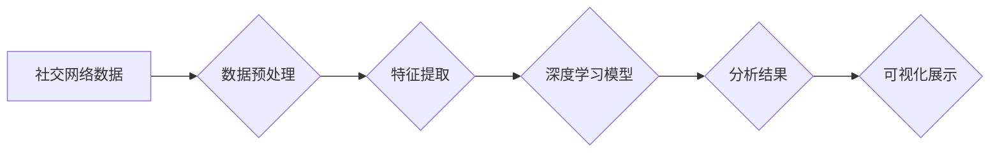

> 深度学习，社交网络分析，自然语言处理，图神经网络，推荐系统，情感分析

## 1. 背景介绍

社交网络已经成为现代社会不可或缺的一部分，它连接着数以亿计的用户，并产生了海量的数据。这些数据蕴含着丰富的社交关系、用户行为和情感信息，为深度学习算法提供了宝贵的训练素材。深度学习，作为机器学习领域的一项重要突破，能够从海量数据中自动提取特征，并学习复杂的模式，因此在社交网络分析中展现出巨大的潜力。

传统的社交网络分析方法主要依赖于手工特征工程和统计模型，难以捕捉到数据中的复杂非线性关系。而深度学习算法能够自动学习数据中的特征表示，并构建更复杂的模型，从而提升社交网络分析的准确性和效率。

## 2. 核心概念与联系

社交网络分析的核心是理解用户之间的关系和行为模式。深度学习在社交网络分析中主要应用于以下几个方面：

* **用户画像构建**: 通过分析用户的社交行为、兴趣爱好、语言风格等信息，构建用户画像，以便更好地理解用户的需求和行为特征。
* **关系预测**: 预测用户之间的潜在关系，例如朋友关系、合作关系、商业关系等。
* **内容推荐**: 根据用户的兴趣和行为历史，推荐相关的社交内容，例如帖子、视频、好友等。
* **情感分析**: 分析用户在社交网络上的情感表达，例如喜怒哀乐、正面负面评价等。

**社交网络分析与深度学习的架构**



## 3. 核心算法原理 & 具体操作步骤

### 3.1  算法原理概述

深度学习在社交网络分析中常用的算法包括：

* **循环神经网络 (RNN)**：RNN能够处理序列数据，例如文本和时间序列数据，因此在分析用户行为和情感表达方面表现出色。
* **卷积神经网络 (CNN)**：CNN擅长于提取图像和文本中的特征，可以用于分析用户头像、社交媒体帖子等视觉和文本数据。
* **图神经网络 (GNN)**：GNN能够处理图结构数据，例如社交网络关系图，可以用于预测用户关系、社区发现等任务。

### 3.2  算法步骤详解

以用户画像构建为例，使用深度学习算法构建用户画像的步骤如下：

1. **数据收集**: 收集用户的社交网络数据，例如用户基本信息、社交行为、兴趣爱好、语言风格等。
2. **数据预处理**: 对收集到的数据进行清洗、转换和格式化，例如去除重复数据、处理缺失值、将文本数据转换为数字向量等。
3. **特征提取**: 使用深度学习算法提取用户的特征表示，例如使用RNN提取用户的语言风格特征，使用CNN提取用户的头像特征等。
4. **模型训练**: 使用训练数据训练深度学习模型，例如使用RNN训练用户语言风格模型，使用CNN训练用户头像识别模型等。
5. **模型评估**: 使用测试数据评估模型的性能，例如使用准确率、召回率等指标评估模型的预测准确性。
6. **用户画像构建**: 将训练好的模型应用于新的用户数据，预测用户的特征表示，并构建用户画像。

### 3.3  算法优缺点

**深度学习算法在社交网络分析中的优势:**

* 能够自动学习数据中的特征表示，无需人工特征工程。
* 可以处理海量数据，并学习复杂的模式。
* 能够实现更高的准确性和效率。

**深度学习算法在社交网络分析中的挑战:**

* 需要大量的训练数据，否则模型性能会下降。
* 训练深度学习模型需要较高的计算资源和时间成本。
* 深度学习模型的解释性较差，难以理解模型的决策过程。

### 3.4  算法应用领域

深度学习算法在社交网络分析中的应用领域非常广泛，例如：

* **用户画像构建**: 构建用户画像，用于个性化推荐、精准营销等。
* **关系预测**: 预测用户之间的潜在关系，例如朋友关系、合作关系、商业关系等。
* **内容推荐**: 根据用户的兴趣和行为历史，推荐相关的社交内容。
* **情感分析**: 分析用户在社交网络上的情感表达，用于品牌监控、舆情分析等。
* **欺诈检测**: 检测社交网络中的欺诈行为，例如虚假账号、恶意评论等。

## 4. 数学模型和公式 & 详细讲解 & 举例说明

### 4.1  数学模型构建

在深度学习中，常用的数学模型包括神经网络、循环神经网络、卷积神经网络等。这些模型由多个层组成，每一层都包含多个神经元。神经元之间通过权重连接，并使用激活函数进行非线性变换。

**神经网络模型**

```latex
y = f(W_1 * x_1 + W_2 * x_2 + ... + W_n * x_n + b)
```

其中：

* $y$ 是模型的输出
* $x_1, x_2, ..., x_n$ 是输入特征
* $W_1, W_2, ..., W_n$ 是权重
* $b$ 是偏置
* $f$ 是激活函数

### 4.2  公式推导过程

深度学习模型的训练过程是通过优化模型参数来最小化损失函数的过程。损失函数衡量模型预测结果与真实结果之间的差异。常用的损失函数包括均方误差 (MSE)、交叉熵损失 (Cross-Entropy Loss) 等。

**均方误差 (MSE)**

```latex
MSE = \frac{1}{N} \sum_{i=1}^{N} (y_i - \hat{y}_i)^2
```

其中：

* $N$ 是样本数量
* $y_i$ 是真实值
* $\hat{y}_i$ 是模型预测值

### 4.3  案例分析与讲解

以用户情感分析为例，可以使用深度学习模型分析用户在社交媒体上的情感表达。

**案例分析:**

假设我们有一个社交媒体数据集，包含用户发布的帖子和对应的情感标签 (例如正面、负面、中性)。我们可以使用深度学习模型，例如循环神经网络 (RNN)，来训练一个情感分析模型。

**模型训练:**

1. 将文本数据转换为数字向量，例如使用词嵌入技术。
2. 使用RNN模型训练情感分析模型，并使用交叉熵损失函数作为损失函数。
3. 使用测试数据评估模型的性能，例如使用准确率、召回率等指标。

**模型应用:**

训练好的情感分析模型可以应用于以下场景:

* **品牌监控**: 分析用户对品牌的评价，了解用户对品牌的正面负面情绪。
* **舆情分析**: 分析用户对特定事件或话题的评价，了解舆情的走向。
* **客户服务**: 自动识别用户的情绪，并提供相应的服务。

## 5. 项目实践：代码实例和详细解释说明

### 5.1  开发环境搭建

* Python 3.6+
* TensorFlow 或 PyTorch 深度学习框架
* Numpy、Pandas 等数据处理库
* Matplotlib、Seaborn 等数据可视化库

### 5.2  源代码详细实现

```python
import tensorflow as tf

# 定义模型结构
model = tf.keras.Sequential([
    tf.keras.layers.Embedding(input_dim=10000, output_dim=128),
    tf.keras.layers.LSTM(units=64),
    tf.keras.layers.Dense(units=3, activation='softmax')
])

# 编译模型
model.compile(optimizer='adam',
              loss='sparse_categorical_crossentropy',
              metrics=['accuracy'])

# 训练模型
model.fit(x_train, y_train, epochs=10)

# 评估模型
loss, accuracy = model.evaluate(x_test, y_test)
print('Loss:', loss)
print('Accuracy:', accuracy)
```

### 5.3  代码解读与分析

* **Embedding层**: 将文本数据转换为数字向量，每个词语映射到一个低维向量空间。
* **LSTM层**: 循环神经网络，能够处理序列数据，例如文本数据。
* **Dense层**: 全连接层，将 LSTM 层的输出映射到情感类别。
* **softmax激活函数**: 将模型输出转换为概率分布，表示每个情感类别的概率。

### 5.4  运行结果展示

训练完成后，可以使用测试数据评估模型的性能，例如计算准确率、召回率等指标。

## 6. 实际应用场景

### 6.1  社交媒体营销

深度学习算法可以帮助企业更好地理解用户的兴趣和行为，从而进行更精准的社交媒体营销。例如，可以根据用户的兴趣爱好推荐相关的产品或服务，并根据用户的行为历史优化广告投放策略。

### 6.2  用户关系分析

深度学习算法可以帮助企业分析用户之间的关系，例如朋友关系、合作关系、商业关系等。这些信息可以帮助企业更好地了解用户的社交网络结构，并进行相应的营销和服务策略。

### 6.3  内容推荐

深度学习算法可以根据用户的兴趣和行为历史，推荐相关的社交内容，例如帖子、视频、好友等。这可以提高用户的活跃度和参与度，并为企业带来更多的商业机会。

### 6.4  未来应用展望

随着深度学习技术的不断发展，其在社交网络分析中的应用场景将会更加广泛。例如，可以利用深度学习算法进行更精准的用户画像构建，更有效的预测用户行为，更智能的内容推荐，以及更有效的社交网络安全防护。

## 7. 工具和资源推荐

### 7.1  学习资源推荐

* **书籍:**
    * 深度学习
    * Python深度学习
* **在线课程:**
    * Coursera 深度学习课程
    * Udacity 深度学习课程
* **博客:**
    * TensorFlow 官方博客
    * PyTorch 官方博客

### 7.2  开发工具推荐

* **深度学习框架:** TensorFlow, PyTorch
* **数据处理库:** Numpy, Pandas
* **数据可视化库:** Matplotlib, Seaborn

### 7.3  相关论文推荐

* **Attention Is All You Need**
* **Graph Convolutional Networks**
* **Recurrent Neural Networks for Sequence Learning**

## 8. 总结：未来发展趋势与挑战

### 8.1  研究成果总结

深度学习在社交网络分析领域取得了显著的成果，例如在用户画像构建、关系预测、内容推荐、情感分析等方面取得了更高的准确性和效率。

### 8.2  未来发展趋势

* **更强大的模型**: 研究更强大的深度学习模型，例如Transformer、Graph Neural Networks等，以更好地处理复杂的数据和任务。
* **更有效的训练方法**: 研究更有效的深度学习训练方法，例如迁移学习、联邦学习等，以降低训练成本和提高模型泛化能力。
* **更注重解释性**: 研究更具解释性的深度学习模型，以便更好地理解模型的决策过程。

### 8.3  面临的挑战

* **数据隐私**: 深度学习模型需要大量的训练数据，如何保护用户数据隐私是一个重要的挑战。
* **模型可解释性**: 深度学习模型的决策过程往往难以理解，如何提高模型的可解释性是一个重要的研究方向。
* **公平性与偏见**: 深度学习模型可能存在公平性问题和偏见问题，如何构建公平、公正的深度学习模型是一个重要的挑战。

### 8.4  研究展望

未来，深度学习在社交网络分析领域将继续发挥重要作用，并推动社交网络分析技术的发展。


## 9. 附录：常见问题与解答

**Q1: 深度学习模型需要多少数据才能训练？**

A1: 深度学习模型需要大量的训练数据，一般来说，需要至少几千条数据才能训练出一个基本的模型。

**Q2: 如何评估深度学习模型的性能？**

A2: 深度学习模型的性能可以使用准确率、召回率、F1-