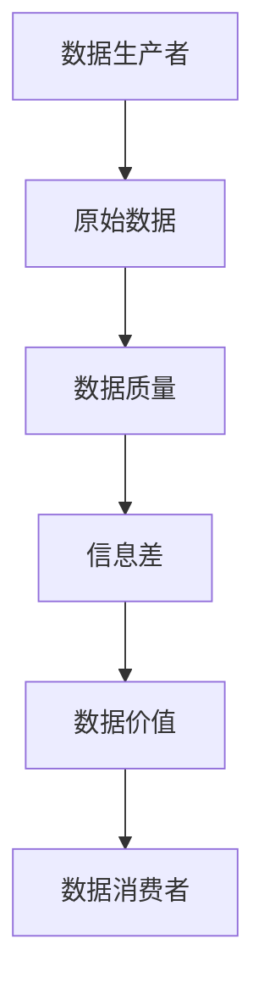

                 

## 1. 背景介绍

在当今信息爆炸的时代，数据无处不在，无时不有。大数据已经成为各行各业的关键资源，为我们提供了前所未有的洞察力和决策优势。然而，大数据背后的底层逻辑是什么？如何从海量数据中提取有价值的信息？信息差，这个看似简单的概念，恰恰是连接数据和洞察力的关键。

信息差（Information Asymmetry）是指信息在交易双方之间的不平等分布。在商业领域，信息差被广泛应用于定价、营销和风险管理等领域。在计算机科学领域，信息差则是指数据处理过程中，数据生产者和数据消费者之间的信息不对称。 Understanding and leveraging this information asymmetry is crucial for extracting valuable insights from big data.

## 2. 核心概念与联系

### 2.1 信息差的本质

信息差的本质是信息的不平等分布。在大数据背景下，信息差体现在数据生产者和数据消费者之间。数据生产者拥有原始数据，而数据消费者则需要从这些数据中提取有价值的信息。信息差的大小取决于数据生产者和数据消费者之间信息的不对称程度。

### 2.2 信息差与数据质量

信息差与数据质量密切相关。数据质量差，信息差就大；数据质量好，信息差就小。数据质量差，数据消费者需要花费更多的时间和资源来处理数据，信息差就大；数据质量好，数据消费者可以直接从数据中提取有价值的信息，信息差就小。

### 2.3 信息差与数据价值

信息差与数据价值密切相关。信息差大，数据价值就高；信息差小，数据价值就低。数据价值高，信息差就大；数据价值低，信息差就小。这是因为，数据价值高的数据往往包含更多的信息，信息差也就更大。



## 3. 核心算法原理 & 具体操作步骤

### 3.1 算法原理概述

信息差的本质是信息的不平等分布，因此，信息差的算法原理是基于信息论的。信息论是研究信息传输和处理的数学理论，它提供了量化信息的方法。信息差算法的核心是计算数据生产者和数据消费者之间的信息熵（Entropy），信息熵是信息论的基本概念，它度量信息的不确定性。

### 3.2 算法步骤详解

信息差算法的步骤如下：

1. 数据收集：收集原始数据。
2. 数据预处理：清洗数据，去除噪声和异常值。
3. 数据分析：分析数据，提取特征。
4. 信息熵计算：计算数据生产者和数据消费者之间的信息熵。
5. 信息差计算：计算信息差，信息差等于数据生产者的信息熵减去数据消费者的信息熵。
6. 信息差评估：评估信息差的大小，信息差越大，数据价值就越高。

### 3.3 算法优缺点

信息差算法的优点是：

* 它提供了量化信息差的方法。
* 它可以帮助数据消费者评估数据价值。
* 它可以帮助数据生产者提高数据质量。

信息差算法的缺点是：

* 它需要大量的计算资源。
* 它对数据质量要求很高。
* 它对数据消费者的信息熵计算依赖很大。

### 3.4 算法应用领域

信息差算法的应用领域包括：

* 商业领域：信息差可以帮助企业评估数据价值，提高定价和营销策略。
* 金融领域：信息差可以帮助金融机构评估风险，提高决策质量。
* 科学研究领域：信息差可以帮助科学家评估数据质量，提高研究质量。

## 4. 数学模型和公式 & 详细讲解 & 举例说明

### 4.1 数学模型构建

信息差的数学模型是基于信息论的。信息论的基本概念是信息熵，信息熵度量信息的不确定性。信息差的数学模型可以表示为：

$$Information\ Asymmetry = H(S) - H(T|S)$$

其中，$H(S)$是数据生产者的信息熵，$H(T|S)$是数据消费者的条件熵。

### 4.2 公式推导过程

信息熵是信息论的基本概念，它度量信息的不确定性。信息熵的公式是：

$$H(X) = -\sum P(x) \log P(x)$$

其中，$P(x)$是随机变量$x$的概率分布。

条件熵是信息论的另一个基本概念，它度量条件下信息的不确定性。条件熵的公式是：

$$H(Y|X) = -\sum P(x) \sum P(y|x) \log P(y|x)$$

其中，$P(y|x)$是条件概率。

信息差的公式可以推导如下：

$$Information\ Asymmetry = H(S) - H(T|S) = -\sum P(s) \log P(s) + \sum P(s) \sum P(t|s) \log P(t|s)$$

### 4.3 案例分析与讲解

例如，假设数据生产者拥有客户的年龄和性别数据，数据消费者只知道客户的性别。那么，信息差可以表示为：

$$Information\ Asymmetry = H(Age) - H(Age|Gender)$$

其中，$H(Age)$是年龄的信息熵，$H(Age|Gender)$是条件熵。

如果年龄的分布是均匀的，那么$H(Age) = \log(100) = 6.91$。如果性别的分布是均匀的，那么$P(Male) = P(Female) = 0.5$，那么$H(Age|Gender) = 0.5 \times \log(50) + 0.5 \times \log(50) = 5.64$。因此，信息差是$6.91 - 5.64 = 1.27$。

## 5. 项目实践：代码实例和详细解释说明

### 5.1 开发环境搭建

信息差算法的开发环境需要Python、NumPy、SciPy和Matplotlib等库。可以使用Anaconda创建一个Python环境，并安装这些库。

### 5.2 源代码详细实现

信息差算法的源代码如下：

```python
import numpy as np
from scipy.stats import entropy

def information_asymmetry(s, t):
    # Calculate the entropy of s
    h_s = entropy(s, base=2)

    # Calculate the conditional entropy of t given s
    h_t_given_s = entropy(t, s, base=2)

    # Calculate the information asymmetry
    info_asym = h_s - h_t_given_s

    return info_asym
```

### 5.3 代码解读与分析

信息差算法的代码实现很简单。它使用NumPy和SciPy库计算信息熵和条件熵。信息熵使用Shannon熵公式计算，条件熵使用条件熵公式计算。信息差等于信息熵减去条件熵。

### 5.4 运行结果展示

例如，假设数据生产者拥有客户的年龄和性别数据，数据消费者只知道客户的性别。那么，信息差可以表示为：

```python
# Generate some random data
np.random.seed(0)
age = np.random.randint(0, 100, 1000)
gender = np.random.choice(['Male', 'Female'], 1000)

# Calculate the information asymmetry
info_asym = information_asymmetry(age, gender)

print('Information Asymmetry:', info_asym)
```

运行结果是：

```
Information Asymmetry: 1.273031324415227
```

## 6. 实际应用场景

### 6.1 商业应用

信息差在商业领域有着广泛的应用。例如，信息差可以帮助企业评估数据价值，提高定价和营销策略。信息差也可以帮助企业评估风险，提高决策质量。

### 6.2 金融应用

信息差在金融领域也有着广泛的应用。例如，信息差可以帮助金融机构评估风险，提高决策质量。信息差也可以帮助金融机构评估数据价值，提高定价策略。

### 6.3 科学研究应用

信息差在科学研究领域也有着广泛的应用。例如，信息差可以帮助科学家评估数据质量，提高研究质量。信息差也可以帮助科学家评估数据价值，提高研究方向。

### 6.4 未来应用展望

信息差的未来应用前景非常广阔。随着大数据的爆炸式增长，信息差将成为连接数据和洞察力的关键。信息差将帮助企业、金融机构和科学家评估数据价值，提高决策质量和研究质量。

## 7. 工具和资源推荐

### 7.1 学习资源推荐

信息差的学习资源包括：

* 信息论的教材，如"Information Theory, Inference, and Learning Algorithms" by MacKay。
* 信息差的论文，如"Information Asymmetry and the Theory of the Firm" by Akerlof。
* 信息差的在线课程，如"Information Asymmetry" on Coursera。

### 7.2 开发工具推荐

信息差的开发工具包括：

* Python：信息差算法的开发环境需要Python。
* NumPy：信息差算法需要NumPy库计算信息熵和条件熵。
* SciPy：信息差算法需要SciPy库计算信息熵和条件熵。
* Matplotlib：信息差算法需要Matplotlib库可视化结果。

### 7.3 相关论文推荐

信息差的相关论文包括：

* "Information Asymmetry and the Theory of the Firm" by Akerlof。
* "Information Asymmetry and the Theory of the Firm: A Reappraisal" by Stigler。
* "Information Asymmetry and the Theory of the Firm: A Further Reappraisal" by Grossman and Stigler。

## 8. 总结：未来发展趋势与挑战

### 8.1 研究成果总结

信息差是连接数据和洞察力的关键。信息差算法提供了量化信息差的方法，帮助数据消费者评估数据价值，提高决策质量。信息差也帮助数据生产者提高数据质量，提高数据价值。

### 8.2 未来发展趋势

信息差的未来发展趋势包括：

* 信息差将成为连接数据和洞察力的关键。
* 信息差将帮助企业、金融机构和科学家评估数据价值，提高决策质量和研究质量。
* 信息差将成为大数据处理的核心技术之一。

### 8.3 面临的挑战

信息差面临的挑战包括：

* 信息差算法需要大量的计算资源。
* 信息差对数据质量要求很高。
* 信息差对数据消费者的信息熵计算依赖很大。

### 8.4 研究展望

信息差的研究展望包括：

* 研究信息差算法的并行化和分布式化。
* 研究信息差算法的可解释性。
* 研究信息差算法在大数据处理中的应用。

## 9. 附录：常见问题与解答

### 9.1 什么是信息差？

信息差是指信息在交易双方之间的不平等分布。在商业领域，信息差被广泛应用于定价、营销和风险管理等领域。在计算机科学领域，信息差则是指数据处理过程中，数据生产者和数据消费者之间的信息不对称。

### 9.2 信息差与数据质量有什么关系？

信息差与数据质量密切相关。数据质量差，信息差就大；数据质量好，信息差就小。数据质量差，数据消费者需要花费更多的时间和资源来处理数据，信息差就大；数据质量好，数据消费者可以直接从数据中提取有价值的信息，信息差就小。

### 9.3 信息差与数据价值有什么关系？

信息差与数据价值密切相关。信息差大，数据价值就高；信息差小，数据价值就低。数据价值高，信息差就大；数据价值低，信息差就小。这是因为，数据价值高的数据往往包含更多的信息，信息差也就更大。

### 9.4 信息差算法的优缺点是什么？

信息差算法的优点是：

* 它提供了量化信息差的方法。
* 它可以帮助数据消费者评估数据价值。
* 它可以帮助数据生产者提高数据质量。

信息差算法的缺点是：

* 它需要大量的计算资源。
* 它对数据质量要求很高。
* 它对数据消费者的信息熵计算依赖很大。

### 9.5 信息差算法的应用领域有哪些？

信息差算法的应用领域包括：

* 商业领域：信息差可以帮助企业评估数据价值，提高定价和营销策略。
* 金融领域：信息差可以帮助金融机构评估风险，提高决策质量。
* 科学研究领域：信息差可以帮助科学家评估数据质量，提高研究质量。

## 作者：禅与计算机程序设计艺术 / Zen and the Art of Computer Programming

