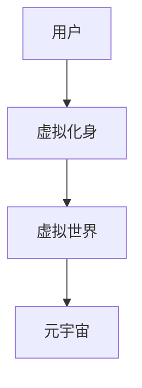
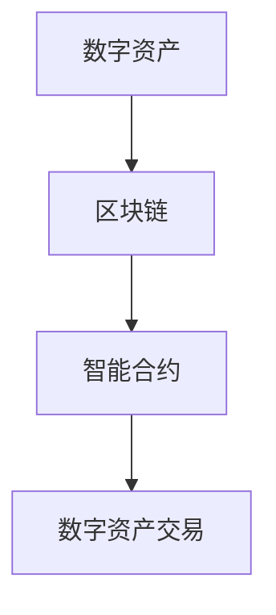
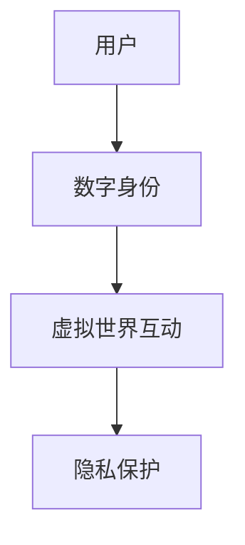
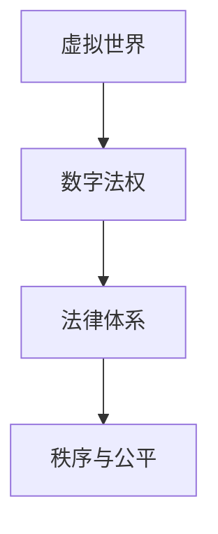

                 

元宇宙、法律体系、虚拟世界、规则构建、数字资产、智能合约、区块链、隐私保护、数字身份、数字法权

## 1. 背景介绍

随着技术的发展，元宇宙逐渐成为现实。元宇宙是一个由数字技术驱动的虚拟世界，它将虚拟现实、增强现实、人工智能、区块链等技术结合在一起，为用户提供了一个全新的互动空间。然而，随着元宇宙的兴起，如何在虚拟世界构建有效的法律体系成为一个亟待解决的问题。

## 2. 核心概念与联系

### 2.1 元宇宙与虚拟世界

元宇宙是一个虚拟世界，它由数字技术驱动，为用户提供了一个全新的互动空间。元宇宙中的虚拟世界可以是游戏、社交平台、虚拟会议室等各种形式。用户可以通过虚拟化身（avatar）在虚拟世界中互动、交流和创造。



### 2.2 数字资产与智能合约

在元宇宙中，数字资产是虚拟世界中的资产，它可以是虚拟物品、数字货币、非同质化代币（NFT）等。数字资产通常基于区块链技术进行管理和交易。智能合约是一种自动执行的计算机程序，它可以在区块链上部署，用于管理数字资产的交易和转移。



### 2.3 数字身份与隐私保护

在元宇宙中，数字身份是用户在虚拟世界中的身份标识。数字身份可以帮助用户管理自己的虚拟资产和互动。然而，数字身份也面临着隐私泄露的风险。因此，隐私保护是构建元宇宙法律体系的关键因素之一。



### 2.4 数字法权与法律体系

数字法权是指在虚拟世界中产生的法律关系。数字法权可以是合同、所有权、债权等各种形式。构建元宇宙法律体系的目的是保护数字法权，维护虚拟世界中的秩序和公平。



## 3. 核心算法原理 & 具体操作步骤

### 3.1 算法原理概述

构建元宇宙法律体系的核心算法原理是基于区块链技术的智能合约。智能合约可以自动执行合同条款，管理数字资产的交易和转移。智能合约的原理是基于密码学和数学模型构建的。

### 3.2 算法步骤详解

构建元宇宙法律体系的具体操作步骤如下：

1. 定义数字资产的属性和交易规则。
2. 设计智能合约的结构和功能。
3. 编写智能合约的源代码。
4. 部署智能合约到区块链上。
5. 创建数字资产的实例。
6. 通过智能合约管理数字资产的交易和转移。

### 3.3 算法优缺点

智能合约的优点是自动化、透明和不可篡改。智能合约可以自动执行合同条款，无需人工干预。智能合约的源代码是公开的，任何人都可以查看和审计。智能合约一旦部署到区块链上，就无法被修改或删除。

智能合约的缺点是安全性和可编程性。智能合约一旦部署到区块链上，就无法被修改或删除。如果智能合约中存在漏洞，就会导致安全风险。此外，智能合约的可编程性有限，无法支持复杂的业务逻辑。

### 3.4 算法应用领域

智能合约可以应用于各种领域，例如金融、保险、物流、供应链等。在元宇宙中，智能合约可以用于管理数字资产的交易和转移，保护数字法权，维护虚拟世界中的秩序和公平。

## 4. 数学模型和公式 & 详细讲解 & 举例说明

### 4.1 数学模型构建

构建元宇宙法律体系的数学模型是基于区块链技术的智能合约。智能合约的数学模型可以表示为以下公式：

$$智能合约 = f(数字资产, 交易规则, 合同条款)$$

其中，$f$是智能合约的函数，$数字资产$是智能合约管理的资产，$交易规则$是智能合约的交易规则，$合同条款$是智能合约的合同条款。

### 4.2 公式推导过程

智能合约的公式推导过程如下：

1. 定义数字资产的属性和交易规则。
2. 设计智能合约的结构和功能。
3. 编写智能合约的源代码。
4. 部署智能合约到区块链上。
5. 创建数字资产的实例。
6. 通过智能合约管理数字资产的交易和转移。

### 4.3 案例分析与讲解

例如，假设有两个用户A和B，他们想要交易一件数字资产。他们可以创建一个智能合约，设置交易规则和合同条款。智能合约可以自动执行合同条款，管理数字资产的交易和转移。智能合约的源代码如下：

```solidity
pragma solidity ^0.8.0;

contract DigitalAsset {
    address public owner;
    string public name;
    uint public id;

    event Transfer(address indexed from, address indexed to, uint value);

    constructor(string memory _name, uint _id) {
        owner = msg.sender;
        name = _name;
        id = _id;
    }

    function transfer(address _to, uint _value) public {
        require(msg.sender == owner, "Only the owner can transfer the asset");
        owner = _to;
        emit Transfer(msg.sender, _to, _value);
    }
}
```

## 5. 项目实践：代码实例和详细解释说明

### 5.1 开发环境搭建

构建元宇宙法律体系的开发环境需要以下软件和工具：

* 以太坊开发环境（包括Ganache、Truffle、Web3.js等）
* 智能合约编程语言（如Solidity）
* 编辑器或IDE（如Visual Studio Code、Remix等）

### 5.2 源代码详细实现

以下是一个简单的智能合约示例，用于管理数字资产的交易和转移：

```solidity
pragma solidity ^0.8.0;

contract DigitalAsset {
    address public owner;
    string public name;
    uint public id;

    event Transfer(address indexed from, address indexed to, uint value);

    constructor(string memory _name, uint _id) {
        owner = msg.sender;
        name = _name;
        id = _id;
    }

    function transfer(address _to, uint _value) public {
        require(msg.sender == owner, "Only the owner can transfer the asset");
        owner = _to;
        emit Transfer(msg.sender, _to, _value);
    }
}
```

### 5.3 代码解读与分析

智能合约的源代码包含以下主要组成部分：

* `pragma solidity ^0.8.0;`：指定智能合约使用的Solidity版本。
* `contract DigitalAsset {... }`：定义智能合约的名称和结构。
* `address public owner;`：定义智能合约的所有者地址。
* `string public name;`：定义智能合约管理的数字资产的名称。
* `uint public id;`：定义智能合约管理的数字资产的ID。
* `event Transfer(address indexed from, address indexed to, uint value);`：定义智能合约的事件，记录数字资产的转移。
* `constructor(string memory _name, uint _id) {... }`：定义智能合约的构造函数，初始化智能合约的属性。
* `function transfer(address _to, uint _value) public {... }`：定义智能合约的转移函数，管理数字资产的交易和转移。

### 5.4 运行结果展示

智能合约部署到区块链上后，用户可以通过智能合约的函数管理数字资产的交易和转移。例如，用户可以调用`transfer`函数将数字资产转移给其他用户。

## 6. 实际应用场景

### 6.1 虚拟物品交易

在元宇宙中，虚拟物品交易是一个常见的应用场景。用户可以创建智能合约，管理虚拟物品的交易和转移。智能合约可以自动执行合同条款，保护买卖双方的权益。

### 6.2 数字货币交易

数字货币是元宇宙中的一种数字资产。用户可以创建智能合约，管理数字货币的交易和转移。智能合约可以自动执行合同条款，保护买卖双方的权益。

### 6.3 非同质化代币（NFT）交易

非同质化代币（NFT）是一种唯一的数字资产。用户可以创建智能合约，管理NFT的交易和转移。智能合约可以自动执行合同条款，保护买卖双方的权益。

### 6.4 未来应用展望

随着元宇宙的发展，元宇宙法律体系的应用场景将会越来越丰富。未来，元宇宙法律体系将会应用于虚拟世界的各个领域，保护数字法权，维护虚拟世界中的秩序和公平。

## 7. 工具和资源推荐

### 7.1 学习资源推荐

* [以太坊开发者文档](https://ethereum.org/en/developers/)
* [Solidity语言文档](https://docs.soliditylang.org/en/latest/)
* [区块链技术与应用](https://book.feixiaohao.com/blockchain/)

### 7.2 开发工具推荐

* [Ganache](https://www.trufflesuite.com/ganache)
* [Truffle](https://www.trufflesuite.com/truffle)
* [Remix](https://remix.ethereum.org/)
* [Web3.js](https://web3js.readthedocs.io/en/v1.7.3/web3-eth-contract.html)

### 7.3 相关论文推荐

* [Decentralized Autonomous Organizations](https://arxiv.org/abs/1607.01345)
* [The DAO Hack Returns and the Future of Decentralized Organizations](https://arxiv.org/abs/1608.01658)
* [A Survey of Blockchain-Based Digital Rights Management Systems](https://ieeexplore.ieee.org/document/8942542)

## 8. 总结：未来发展趋势与挑战

### 8.1 研究成果总结

本文介绍了元宇宙法律体系的核心概念、算法原理、数学模型和实际应用场景。构建元宇宙法律体系的核心是基于区块链技术的智能合约。智能合约可以自动执行合同条款，管理数字资产的交易和转移。智能合约的优点是自动化、透明和不可篡改。智能合约的缺点是安全性和可编程性。

### 8.2 未来发展趋势

元宇宙法律体系的未来发展趋势是与区块链技术的发展密切相关的。随着区块链技术的发展，智能合约的安全性和可编程性将会得到提高。此外，元宇宙法律体系的应用场景将会越来越丰富，保护数字法权，维护虚拟世界中的秩序和公平。

### 8.3 面临的挑战

元宇宙法律体系面临的挑战是如何保护用户的隐私和安全。在虚拟世界中，用户的数字身份和数字资产面临着隐私泄露和安全风险。如何构建安全可靠的隐私保护机制是元宇宙法律体系面临的关键挑战之一。

### 8.4 研究展望

未来的研究方向是如何构建安全可靠的隐私保护机制，如何提高智能合约的安全性和可编程性，如何应用元宇宙法律体系于虚拟世界的各个领域。此外，如何构建跨区块链的智能合约，如何构建元宇宙法律体系的标准化框架也是未来研究的方向之一。

## 9. 附录：常见问题与解答

### 9.1 什么是元宇宙？

元宇宙是一个由数字技术驱动的虚拟世界，它将虚拟现实、增强现实、人工智能、区块链等技术结合在一起，为用户提供了一个全新的互动空间。

### 9.2 什么是智能合约？

智能合约是一种自动执行的计算机程序，它可以在区块链上部署，用于管理数字资产的交易和转移。

### 9.3 什么是数字资产？

数字资产是虚拟世界中的资产，它可以是虚拟物品、数字货币、非同质化代币（NFT）等。

### 9.4 什么是数字法权？

数字法权是指在虚拟世界中产生的法律关系。数字法权可以是合同、所有权、债权等各种形式。

### 9.5 如何构建元宇宙法律体系？

构建元宇宙法律体系的核心是基于区块链技术的智能合约。智能合约可以自动执行合同条款，管理数字资产的交易和转移。智能合约的原理是基于密码学和数学模型构建的。

## 作者：禅与计算机程序设计艺术 / Zen and the Art of Computer Programming

