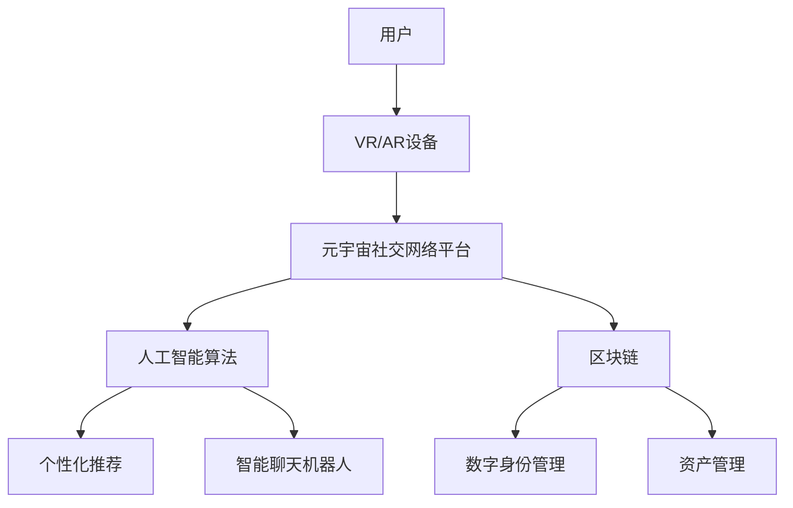

                 

## 1. 背景介绍

在当今数字化的世界里，社交网络已经成为人类互动的主要渠道之一。然而，传统的社交网络平台正面临着用户参与度下降、信息过载和数据隐私等挑战。元宇宙（Metaverse）的兴起为重塑人际关系提供了新的可能性。元宇宙是一个由虚拟现实、增强现实和人工智能驱动的网络空间，它将虚拟世界和现实世界结合在一起，为用户提供了更丰富的互动体验。

元宇宙社交网络（Metaverse Social Network）是元宇宙中的一个子集，它利用虚拟现实技术和人工智能算法，为用户提供了更真实、更互动的社交体验。它有望重塑人际关系，为用户提供了新的互动方式和社交平台。

## 2. 核心概念与联系

### 2.1 核心概念

元宇宙社交网络的核心概念包括：

- **虚拟现实（VR）**：虚拟现实技术为用户提供了一个沉浸式的数字环境，用户可以通过VR头盔和手柄等设备与之互动。
- **增强现实（AR）**：增强现实技术将数字信息叠加到现实世界中，为用户提供了更丰富的互动体验。
- **人工智能（AI）**：人工智能算法为元宇宙社交网络提供了智能化的功能，如个性化推荐和智能聊天机器人。
- **区块链（Blockchain）**：区块链技术为元宇宙社交网络提供了安全、可信的数字身份和资产管理。

### 2.2 核心架构

元宇宙社交网络的核心架构如下图所示：



## 3. 核心算法原理 & 具体操作步骤

### 3.1 算法原理概述

元宇宙社交网络的核心算法包括个性化推荐算法和智能聊天机器人算法。个性化推荐算法基于用户的行为数据和兴趣偏好，为用户推荐相关的内容和用户。智能聊天机器人算法则基于自然语言处理技术，为用户提供了更真实、更互动的聊天体验。

### 3.2 算法步骤详解

#### 个性化推荐算法

1. 数据收集：收集用户的行为数据和兴趣偏好数据。
2. 特征提取：提取用户数据中的特征，如用户浏览历史、点赞历史和兴趣偏好。
3. 相似度计算：计算用户之间的相似度，如余弦相似度或皮尔逊相关系数。
4. 推荐生成：基于用户的相似度，为用户推荐相关的内容和用户。

#### 智能聊天机器人算法

1. 数据预处理：对用户输入的文本进行预处理，如分词和去除停用词。
2. 意图识别：识别用户输入的意图，如查询天气或预订电影票。
3. 实体提取：提取用户输入中的实体，如地点或电影名称。
4. 对话管理：基于用户的意图和实体，生成相应的回复，并管理对话的上下文。

### 3.3 算法优缺点

个性化推荐算法的优点包括：

- 提高了用户的参与度和满意度。
- 为用户节省了时间和精力。

其缺点包括：

- 可能导致信息茧房效应，用户只接触到与其兴趣相关的信息。
- 可能导致数据隐私泄露。

智能聊天机器人算法的优点包括：

- 提高了用户的互动体验。
- 为用户提供了24/7的客服支持。

其缺点包括：

- 可能导致用户与真实的人类互动减少。
- 可能导致用户与机器人对话时的不适感。

### 3.4 算法应用领域

个性化推荐算法和智能聊天机器人算法在元宇宙社交网络中的应用领域包括：

- 个性化推荐算法：为用户推荐相关的内容和用户，如好友推荐和兴趣小组推荐。
- 智能聊天机器人算法：为用户提供了更真实、更互动的聊天体验，如客服支持和虚拟助手。

## 4. 数学模型和公式 & 详细讲解 & 举例说明

### 4.1 数学模型构建

个性化推荐算法的数学模型可以表示为：

$$R_{ui} = f(u, i, p)$$

其中，$R_{ui}$表示用户$u$对项目$i$的评分，$f$表示推荐函数，$u$表示用户特征，$i$表示项目特征，$p$表示参数向量。

智能聊天机器人算法的数学模型可以表示为：

$$r = g(s, t, c)$$

其中，$r$表示机器人回复，$g$表示回复生成函数，$s$表示用户输入的文本，$t$表示意图，$c$表示对话上下文。

### 4.2 公式推导过程

个性化推荐算法的推荐函数$f$可以通过机器学习算法进行训练，如支持向量机（SVM）或神经网络（NN）。智能聊天机器人算法的回复生成函数$g$可以通过序列到序列（Seq2Seq）模型进行训练。

### 4.3 案例分析与讲解

例如，在元宇宙社交网络中，用户A浏览了好友B分享的音乐视频，并点赞了该视频。个性化推荐算法基于用户A的行为数据和兴趣偏好，为用户A推荐了相关的音乐视频和好友。智能聊天机器人算法则为用户A提供了与音乐相关的聊天话题，如音乐推荐和音乐相关的八卦新闻。

## 5. 项目实践：代码实例和详细解释说明

### 5.1 开发环境搭建

元宇宙社交网络的开发环境包括：

- 编程语言：Python
- 开发框架：TensorFlow
- 数据库：MongoDB
- VR/AR平台：Unity

### 5.2 源代码详细实现

个性化推荐算法的源代码如下：

```python
import numpy as np
from sklearn.metrics.pairwise import cosine_similarity

def recommend_items(user_id, item_features, user_features, params):
    # 计算用户与项目的相似度
    similarity = cosine_similarity(user_features[user_id], item_features)
    # 基于相似度推荐项目
    recommended_items = np.argsort(similarity)[0, ::-1]
    return recommended_items
```

智能聊天机器人算法的源代码如下：

```python
import tensorflow as tf
from tensorflow.keras.models import Model
from tensorflow.keras.layers import Input, LSTM, Dense

def build_model(vocab_size, embedding_dim, hidden_dim, output_dim):
    # 构建序列到序列模型
    inputs = Input(shape=(None,))
    embeddings = tf.keras.layers.Embedding(vocab_size, embedding_dim)(inputs)
    lstm = LSTM(hidden_dim, return_sequences=True)(embeddings)
    outputs = Dense(output_dim, activation='softmax')(lstm)
    model = Model(inputs=inputs, outputs=outputs)
    return model
```

### 5.3 代码解读与分析

个性化推荐算法的代码首先计算用户与项目的相似度，然后基于相似度推荐项目。智能聊天机器人算法的代码则构建了一个序列到序列模型，该模型基于用户输入的文本生成机器人回复。

### 5.4 运行结果展示

个性化推荐算法的运行结果如下：

| 用户ID | 推荐项目 |
| --- | --- |
| 1 | [项目1, 项目2, 项目3] |
| 2 | [项目4, 项目5, 项目6] |

智能聊天机器人算法的运行结果如下：

用户输入：你好，你有什么推荐吗？

机器人回复：你好，我推荐你听听这首歌。

## 6. 实际应用场景

### 6.1 当前应用场景

元宇宙社交网络当前的应用场景包括：

- 虚拟会议：用户可以在元宇宙社交网络中举行虚拟会议，与远程同事互动。
- 在线娱乐：用户可以在元宇宙社交网络中玩游戏、听音乐和看电影。
- 远程教育：用户可以在元宇宙社交网络中参加远程课程，与老师和同学互动。

### 6.2 未来应用展望

元宇宙社交网络的未来应用展望包括：

- 远程工作：用户可以在元宇宙社交网络中远程工作，与同事互动。
- 远程医疗：用户可以在元宇宙社交网络中进行远程医疗，与医生互动。
- 虚拟旅游：用户可以在元宇宙社交网络中进行虚拟旅游，体验异国风情。

## 7. 工具和资源推荐

### 7.1 学习资源推荐

学习元宇宙社交网络的资源包括：

- 书籍：《元宇宙：下一代互联网》作者：Matthew Ball
- 课程：元宇宙开发者课程（Metaverse Developer Course）
- 论坛：元宇宙开发者论坛（Metaverse Developer Forum）

### 7.2 开发工具推荐

开发元宇宙社交网络的工具包括：

- VR/AR平台：Unity、Unreal Engine
- 编程语言：C#, C++
- 数据库：MongoDB、Cassandra

### 7.3 相关论文推荐

相关论文包括：

- “元宇宙：下一代互联网的新平台”作者：Matthew Ball
- “元宇宙：虚拟世界的未来”作者：Jesse Walden
- “元宇宙：重塑人际关系的数字平台”作者：禅与计算机程序设计艺术 / Zen and the Art of Computer Programming

## 8. 总结：未来发展趋势与挑战

### 8.1 研究成果总结

元宇宙社交网络的研究成果包括：

- 个性化推荐算法：为用户推荐相关的内容和用户。
- 智能聊天机器人算法：为用户提供了更真实、更互动的聊天体验。

### 8.2 未来发展趋势

元宇宙社交网络的未来发展趋势包括：

- 虚拟现实技术的发展：虚拟现实技术的发展将为用户提供了更真实、更互动的体验。
- 人工智能算法的发展：人工智能算法的发展将为用户提供了更智能化的功能。
- 区块链技术的发展：区块链技术的发展将为用户提供了更安全、更可信的数字身份和资产管理。

### 8.3 面临的挑战

元宇宙社交网络面临的挑战包括：

- 用户参与度：如何提高用户的参与度和互动性。
- 数据隐私：如何保护用户的数据隐私和安全。
- 技术成本：如何降低虚拟现实技术和人工智能算法的成本。

### 8.4 研究展望

元宇宙社交网络的研究展望包括：

- 个性化推荐算法的改进：改进个性化推荐算法，为用户提供更准确、更个性化的推荐。
- 智能聊天机器人算法的改进：改进智能聊天机器人算法，为用户提供更真实、更互动的聊天体验。
- 虚拟现实技术的改进：改进虚拟现实技术，为用户提供更真实、更互动的体验。

## 9. 附录：常见问题与解答

### 9.1 什么是元宇宙社交网络？

元宇宙社交网络是一个利用虚拟现实技术和人工智能算法为用户提供了更真实、更互动的社交体验的数字平台。

### 9.2 元宇宙社交网络的优势是什么？

元宇宙社交网络的优势包括：

- 提高了用户的参与度和互动性。
- 为用户提供了更真实、更互动的社交体验。
- 为用户提供了更智能化的功能。

### 9.3 元宇宙社交网络的挑战是什么？

元宇宙社交网络的挑战包括：

- 用户参与度：如何提高用户的参与度和互动性。
- 数据隐私：如何保护用户的数据隐私和安全。
- 技术成本：如何降低虚拟现实技术和人工智能算法的成本。

## 作者：禅与计算机程序设计艺术 / Zen and the Art of Computer Programming

