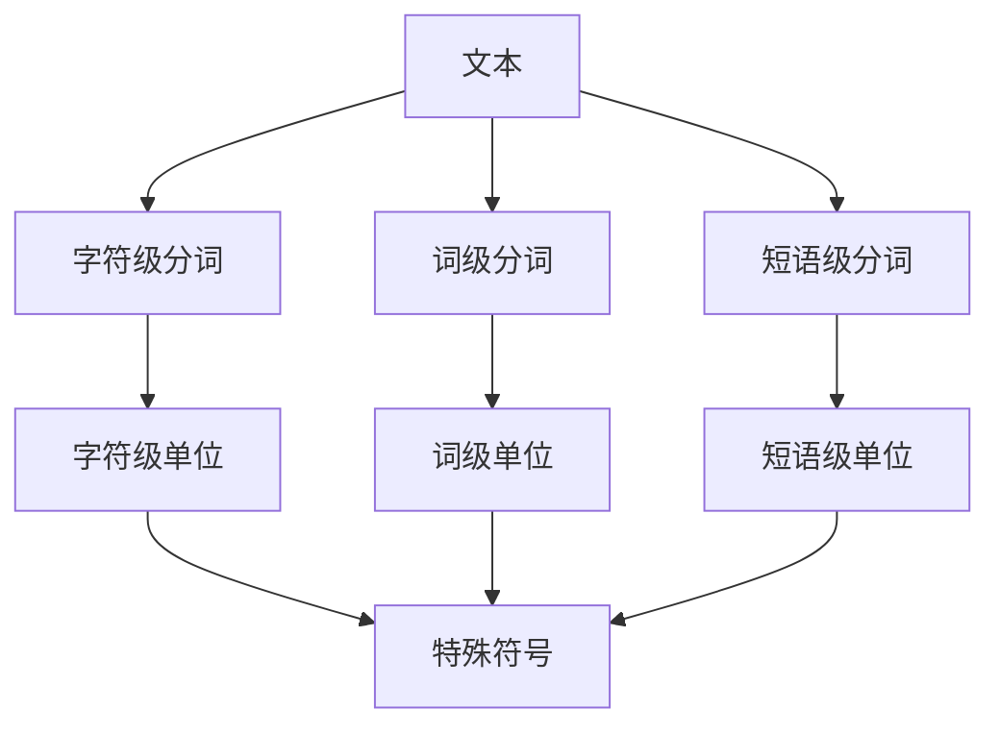

                 

## 1. 背景介绍

分词（Tokenization）是自然语言处理（NLP）中的一项基本任务，其目的是将一段文本切分成更小的单位，如单词或短语。分词的目的是为了提取文本中的关键信息，以便于进一步的文本分析和处理。分词的质量直接影响着后续NLP任务的性能，如命名实体识别、词性标注、语义分析等。

## 2. 核心概念与联系

### 2.1 核心概念

- **字符级分词（Character-level Tokenization）**：将文本切分成字符级单位。
- **词级分词（Word-level Tokenization）**：将文本切分成词级单位。
- **短语级分词（N-gram Tokenization）**：将文本切分成短语级单位。
- **特殊符号（Punctuation）**：分词时需要考虑的特殊符号，如标点符号、数字等。

### 2.2 核心概念联系 Mermaid 流程图



## 3. 核心算法原理 & 具体操作步骤

### 3.1 算法原理概述

分词算法的原理是基于一定的规则或模型对文本进行切分。常见的分词算法包括基于规则的分词算法和基于统计模型的分词算法。

### 3.2 算法步骤详解

#### 3.2.1 基于规则的分词算法

1. 定义分词规则，如单词之间用空格分隔，标点符号后面不应该跟单词等。
2. 扫描文本，根据定义的规则进行切分。
3. 处理特殊情况，如数字、缩写等。

#### 3.2.2 基于统计模型的分词算法

1. 训练分词模型，如隐马尔科夫模型（HMM）或条件随机场（CRF）。
2. 使用训练好的模型对文本进行切分。
3. 处理未知单词，如使用后处理技术进行修正。

### 3.3 算法优缺点

| 算法类型 | 优点 | 缺点 |
| --- | --- | --- |
| 基于规则的分词算法 | 简单、快速、不需要训练数据 | 灵活性差、不能处理未知单词 |
| 基于统计模型的分词算法 | 灵活性好、能处理未知单词 | 需要大量训练数据、速度慢 |

### 3.4 算法应用领域

分词算法广泛应用于搜索引擎、信息检索、文本分析、机器翻译等领域。在搜索引擎中，分词可以帮助提取关键词，从而提高检索效率和准确性。在信息检索中，分词可以帮助提取文本中的关键信息，从而提高检索结果的相关性。在机器翻译中，分词可以帮助提取源语言文本中的关键信息，从而提高翻译质量。

## 4. 数学模型和公式 & 详细讲解 & 举例说明

### 4.1 数学模型构建

基于统计模型的分词算法通常使用隐马尔科夫模型（HMM）或条件随机场（CRF）作为数学模型。其中，HMM是一种统计模型，用于描述一个序列的生成过程。CRF是一种条件随机场，用于描述一个序列的标记过程。

### 4.2 公式推导过程

#### 4.2.1 HMM公式推导

给定一个观测序列$O = (o_1, o_2,..., o_T)$和一个隐藏状态序列$Q = (q_1, q_2,..., q_T)$，HMM的目标是估计隐藏状态序列$Q$。HMM的公式包括：

- 初始状态分布$\pi = P(q_1)$
- 状态转移概率$A = P(q_{t+1} | q_t)$
- 发射概率$B = P(o_t | q_t)$
- 观测序列概率$P(O | \lambda) = \sum_{Q} P(O, Q | \lambda)$

其中，$\lambda = (\pi, A, B)$是HMM的参数。

#### 4.2.2 CRF公式推导

给定一个观测序列$X = (x_1, x_2,..., x_T)$和一个标记序列$Y = (y_1, y_2,..., y_T)$，CRF的目标是估计标记序列$Y$。CRF的公式包括：

- 状态特征函数$f_t(y_t, x, t)$
- 转移特征函数$g_t(y_{t-1}, y_t, x, t)$
- 标签概率$P(Y | X) = \frac{1}{Z(X)} \exp(\sum_{t=1}^{T} \sum_{k=1}^{K} \lambda_k f_t(y_t, x, t) + \sum_{t=1}^{T-1} \sum_{k=1}^{K} \mu_k g_t(y_{t-1}, y_t, x, t))$

其中，$\lambda = (\lambda_1, \lambda_2,..., \lambda_K)$和$\mu = (\mu_1, \mu_2,..., \mu_K)$是CRF的参数，$Z(X)$是规范化因子。

### 4.3 案例分析与讲解

例如，给定一段文本"I love playing video games. I also enjoy reading books."，我们使用基于统计模型的分词算法进行分词。首先，我们需要训练一个分词模型，如HMM或CRF。然后，我们使用训练好的模型对文本进行切分。最后，我们处理未知单词，如使用后处理技术进行修正。分词结果为：

- "I"：单词
- "love"：单词
- "playing"：单词
- "video"：单词
- "games."：单词
- "I"：单词
- "also"：单词
- "enjoy"：单词
- "reading"：单词
- "books."：单词

## 5. 项目实践：代码实例和详细解释说明

### 5.1 开发环境搭建

我们使用Python语言实现分词算法，并使用NLTK（Natural Language Toolkit）库进行开发。NLTK是一个用于NLP的Python库，提供了分词、词性标注、命名实体识别等功能。

### 5.2 源代码详细实现

```python
import nltk
from nltk.tokenize import word_tokenize, sent_tokenize

# 示例文本
text = "I love playing video games. I also enjoy reading books."

# 句子分割
sentences = sent_tokenize(text)

# 单词分割
words = word_tokenize(text)

print("Sentences:", sentences)
print("Words:", words)
```

### 5.3 代码解读与分析

在代码中，我们首先导入NLTK库和分词函数`word_tokenize`和`sent_tokenize`。然后，我们定义一个示例文本。接着，我们使用`sent_tokenize`函数对文本进行句子分割，并使用`word_tokenize`函数对文本进行单词分割。最后，我们打印分割结果。

### 5.4 运行结果展示

运行代码后，我们得到以下结果：

```
Sentences: ['I love playing video games.', "I also enjoy reading books."]
Words: ['I', 'love', 'playing', 'video', 'games', '.', "I", 'also', 'enjoy','reading', 'books', '.']
```

## 6. 实际应用场景

### 6.1 分词在搜索引擎中的应用

在搜索引擎中，分词可以帮助提取关键词，从而提高检索效率和准确性。例如，用户输入搜索关键词"video games"，搜索引擎可以通过分词将其切分成"video"和"games"两个单词，从而扩展搜索范围，提高检索结果的相关性。

### 6.2 分词在信息检索中的应用

在信息检索中，分词可以帮助提取文本中的关键信息，从而提高检索结果的相关性。例如，用户输入搜索关键词"climate change"，信息检索系统可以通过分词将其切分成"climate"和"change"两个单词，从而扩展搜索范围，提高检索结果的相关性。

### 6.3 分词在机器翻译中的应用

在机器翻译中，分词可以帮助提取源语言文本中的关键信息，从而提高翻译质量。例如，给定源语言文本"I love playing video games."，机器翻译系统可以通过分词将其切分成"I"、 "love"、 "playing"、 "video"和"games"五个单词，从而提高翻译质量。

### 6.4 未来应用展望

随着NLP技术的不断发展，分词技术也将不断得到改进。未来，分词技术将更加智能化，能够处理更复杂的文本，如口语、方言、非标准语等。此外，分词技术还将与其他NLP技术结合，如命名实体识别、词性标注、语义分析等，从而提高NLP任务的性能。

## 7. 工具和资源推荐

### 7.1 学习资源推荐

- "Natural Language Processing with Python"：一本介绍NLP技术的入门书籍，提供了大量实践案例。
- "Speech and Language Processing"：一本介绍语言处理技术的经典教材，提供了详细的数学模型和公式。
- NLTK（Natural Language Toolkit）：一个用于NLP的Python库，提供了分词、词性标注、命名实体识别等功能。

### 7.2 开发工具推荐

- Python：一种用于NLP开发的流行编程语言。
- Jupyter Notebook：一种用于数据分析和可视化的开发环境。
- TensorFlow：一种用于机器学习开发的流行框架。

### 7.3 相关论文推荐

- "A Statistical Part-of-Speech Tagger"：一篇介绍基于统计模型的词性标注算法的经典论文。
- "The Penn Treebank Project"：一篇介绍基于统计模型的分词算法的经典论文。
- "Neural Machine Translation by Jointly Learning to Align and Translate"：一篇介绍基于神经网络的机器翻译算法的经典论文。

## 8. 总结：未来发展趋势与挑战

### 8.1 研究成果总结

本文介绍了分词的原理和代码实例。我们首先介绍了分词的背景和核心概念。然后，我们介绍了分词算法的原理和步骤，并比较了基于规则的分词算法和基于统计模型的分词算法的优缺点。接着，我们介绍了数学模型和公式，并给出了案例分析。最后，我们提供了代码实例和实际应用场景，并推荐了相关学习资源和开发工具。

### 8.2 未来发展趋势

未来，分词技术将更加智能化，能够处理更复杂的文本，如口语、方言、非标准语等。此外，分词技术还将与其他NLP技术结合，如命名实体识别、词性标注、语义分析等，从而提高NLP任务的性能。

### 8.3 面临的挑战

分词技术面临的挑战包括：

- 处理复杂文本：分词技术需要处理各种复杂文本，如口语、方言、非标准语等。
- 处理未知单词：分词技术需要处理未知单词，如新词、网络用语等。
- 处理特殊符号：分词技术需要处理特殊符号，如标点符号、数字等。

### 8.4 研究展望

未来，分词技术的研究将集中在以下几个方向：

- 智能化分词：研究更智能化的分词技术，能够处理更复杂的文本。
- 结合其他NLP技术：研究分词技术与其他NLP技术的结合，如命名实体识别、词性标注、语义分析等。
- 处理复杂文本：研究处理复杂文本的分词技术，如口语、方言、非标准语等。

## 9. 附录：常见问题与解答

**Q1：什么是分词？**

A1：分词是自然语言处理（NLP）中的一项基本任务，其目的是将一段文本切分成更小的单位，如单词或短语。

**Q2：分词的目的是什么？**

A2：分词的目的是为了提取文本中的关键信息，以便于进一步的文本分析和处理。分词的质量直接影响着后续NLP任务的性能，如命名实体识别、词性标注、语义分析等。

**Q3：分词算法有哪些？**

A3：常见的分词算法包括基于规则的分词算法和基于统计模型的分词算法。基于规则的分词算法简单快速，但灵活性差，不能处理未知单词。基于统计模型的分词算法灵活性好，能处理未知单词，但需要大量训练数据，速度慢。

**Q4：分词在哪些领域有应用？**

A4：分词算法广泛应用于搜索引擎、信息检索、文本分析、机器翻译等领域。在搜索引擎中，分词可以帮助提取关键词，从而提高检索效率和准确性。在信息检索中，分词可以帮助提取文本中的关键信息，从而提高检索结果的相关性。在机器翻译中，分词可以帮助提取源语言文本中的关键信息，从而提高翻译质量。

**Q5：分词技术面临的挑战是什么？**

A5：分词技术面临的挑战包括处理复杂文本、处理未知单词和处理特殊符号。未来，分词技术的研究将集中在智能化分词、结合其他NLP技术和处理复杂文本等方向。

## 作者：禅与计算机程序设计艺术 / Zen and the Art of Computer Programming

