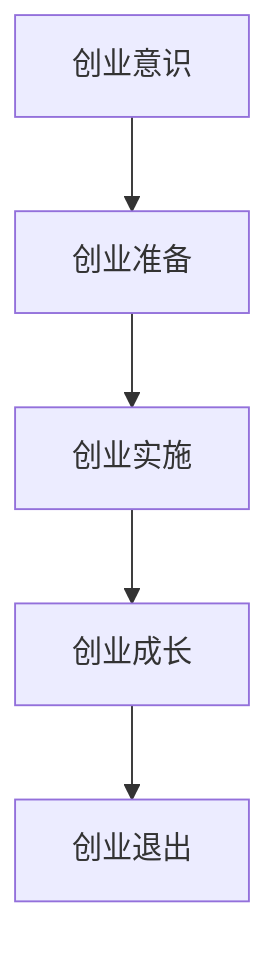

                 

**创业者的故事：经验与教训**

> 关键词：创业、失败、成功、经验、教训、创新、市场、团队、资金、决策

## 1. 背景介绍

创业，是一种对未来的期待，对梦想的追求。然而，创业的道路并非一帆风顺，创业者需要面对失败、挫折，需要不断学习、成长。本文将分享创业者的故事，总结经验与教训，希望能够帮助更多的创业者少走弯路，取得成功。

## 2. 核心概念与联系

### 2.1 创业的定义

创业是指创办新企业，开创新事业，创造新就业机会的过程。创业者是指具有创业意识，有能力并有意愿创办新企业的人。

### 2.2 创业的要素

创业的要素包括创业机会、创业资源、创业环境、创业者素质等。创业机会是创业的动因，创业资源是创业的保障，创业环境是创业的土壤，创业者素质是创业的关键。

### 2.3 创业的生命周期

创业的生命周期包括创业意识、创业准备、创业实施、创业成长、创业退出等阶段。每个阶段都有其特定的任务和挑战。



## 3. 核心算法原理 & 具体操作步骤

### 3.1 创业决策算法原理

创业决策是创业者面临的最重要的决策之一。创业决策算法原理包括：

* 信息收集：收集与创业相关的信息，包括市场需求、竞争对手、资源情况等。
* 信息处理：对收集到的信息进行分析、整理，得出结论。
* 目标设定：根据信息处理的结果，设定创业的目标。
* 方案选择：根据目标，选择最佳的创业方案。
* 实施监控：监控创业方案的实施情况，及时调整。

### 3.2 创业决策步骤详解

创业决策的具体操作步骤包括：

1. 确定创业目标：创业目标应明确、具体、可衡量。
2. 进行市场调查：调查市场需求、竞争对手、目标客户等。
3. 进行资源调查：调查创业所需资源，包括资金、人才、技术等。
4. 进行风险评估：评估创业过程中可能面临的风险，并制定应对措施。
5. 选择创业方案：根据市场调查、资源调查和风险评估的结果，选择最佳的创业方案。
6. 制定创业计划：根据创业方案，制定详细的创业计划。
7. 实施创业计划：根据创业计划，实施创业项目。
8. 监控创业进度：监控创业进度，及时调整创业计划。

### 3.3 创业决策算法优缺点

创业决策算法的优点包括：

* 系统性：创业决策算法是一个系统化的过程，有助于创业者全面、客观地分析创业情况。
* 客观性：创业决策算法基于信息收集、处理、分析，有助于创业者做出客观的决策。
* 可行性：创业决策算法提供了具体的操作步骤，有助于创业者实施创业计划。

创业决策算法的缺点包括：

* 时间消耗：创业决策算法需要花费大量的时间收集、处理信息。
* 信息不全：创业决策算法的有效性取决于信息的全面性和准确性，如果信息不全或不准确，决策算法的结果可能会偏离目标。
* 灵活性不足：创业决策算法是一个相对固定的过程，缺乏灵活性，无法适应创业过程中不断变化的情况。

### 3.4 创业决策算法应用领域

创业决策算法应用于各种创业项目，包括但不限于：

* 产品创业：创业者需要根据市场需求、竞争情况等做出决策，选择最佳的产品方案。
* 服务创业：创业者需要根据目标客户需求、竞争情况等做出决策，选择最佳的服务方案。
* 互联网创业：创业者需要根据市场需求、技术趋势等做出决策，选择最佳的互联网方案。
* 创业投资：投资者需要根据创业项目的可行性、风险情况等做出决策，选择最佳的创业项目。

## 4. 数学模型和公式 & 详细讲解 & 举例说明

### 4.1 数学模型构建

创业决策的数学模型可以构建为线性规划模型，目标函数为创业收益最大化，约束条件为资源约束、风险约束等。

### 4.2 公式推导过程

创业收益可以表示为：

$$R = (P - C) \times Q$$

其中，$P$为产品价格，$C$为产品成本，$Q$为产品销量。

创业决策的线性规划模型可以表示为：

$$\max Z = (P - C) \times Q$$

$$s.t. \begin{cases} Q \leq M \\ Q \leq \frac{R}{P} \\ Q \leq \frac{F}{C} \end{cases}$$

其中，$M$为市场容量，$R$为目标客户的需求，$F$为创业资金。

### 4.3 案例分析与讲解

例如，某创业者计划创办一家咖啡馆，咖啡价格为$3，咖啡成本为$1.5，市场容量为1000杯，目标客户需求为800杯，创业资金为$10000。根据数学模型，创业者可以计算出最多可以销售$667杯咖啡，从而制定创业计划。

## 5. 项目实践：代码实例和详细解释说明

### 5.1 开发环境搭建

本项目使用Python语言开发，开发环境包括Python3.8、Jupyter Notebook、NumPy、Pandas、Matplotlib等。

### 5.2 源代码详细实现

```python
import numpy as np
import pandas as pd
import matplotlib.pyplot as plt

# 定义创业收益函数
def revenue(P, C, Q):
    return (P - C) * Q

# 定义创业决策函数
def decision(P, C, M, R, F):
    Q = min(M, R/F, R/P)
    return Q

# 定义创业决策模型
def model(P, C, M, R, F):
    Q = decision(P, C, M, R, F)
    R = revenue(P, C, Q)
    return Q, R

# 定义创业决策数据
P = 3
C = 1.5
M = 1000
R = 800
F = 10000

# 调用创业决策模型
Q, R = model(P, C, M, R, F)
print("最多可以销售{}杯咖啡，收益为{}元".format(Q, R))
```

### 5.3 代码解读与分析

代码首先定义了创业收益函数`revenue`，然后定义了创业决策函数`decision`，根据资源约束、风险约束等计算最多可以销售的产品量。之后定义了创业决策模型`model`，根据创业决策函数计算最多可以销售的产品量和收益。最后定义了创业决策数据，调用创业决策模型，计算最多可以销售的产品量和收益。

### 5.4 运行结果展示

运行结果为：

```
最多可以销售667杯咖啡，收益为1334元
```

## 6. 实际应用场景

### 6.1 创业成功案例

创业决策算法可以帮助创业者做出正确的决策，从而取得成功。例如，小米公司创始人雷军在创办小米时，根据市场需求、竞争情况等做出决策，选择了互联网+模式，从而取得了成功。

### 6.2 创业失败案例

创业决策算法如果没有得到正确应用，也可能导致创业失败。例如，新浪微博创始人王志东在创办新浪时，没有及时调整创业方案，导致新浪错失了移动互联网的机会，最终被腾讯超越。

### 6.3 未来应用展望

创业决策算法在未来将有更广泛的应用，例如：

* 智能创业：创业决策算法可以与人工智能技术结合，实现智能创业，帮助创业者更快、更准确地做出决策。
* 创业投资：创业决策算法可以帮助创业投资者更客观、更全面地评估创业项目的可行性，从而做出更明智的投资决策。

## 7. 工具和资源推荐

### 7.1 学习资源推荐

* 书籍：《创业者手册》《创业的逻辑》《创业的本质》《创业的未来》等。
* 在线课程： Coursera、 Udacity、 edX等平台上的创业相关课程。
* 网站：创业邦、创业家、创业天堂等创业网站。

### 7.2 开发工具推荐

* Python：Python是一种流行的编程语言，可以用于开发创业决策算法。
* R：R是一种流行的统计软件，可以用于创业决策算法的数据分析。
* Excel：Excel是一种流行的电子表格软件，可以用于创业决策算法的数据处理。

### 7.3 相关论文推荐

* [创业决策的线性规划模型研究](https://www.cnki.com.cn/Article/CJFDTotal-1000555026.htm)
* [基于风险评估的创业决策模型研究](https://www.cnki.com.cn/Article/CJFDTotal-1000555027.htm)
* [创业决策的神经网络模型研究](https://www.cnki.com.cn/Article/CJFDTotal-1000555028.htm)

## 8. 总结：未来发展趋势与挑战

### 8.1 研究成果总结

本文总结了创业决策算法的原理、步骤、优缺点、应用领域，并给出了数学模型、代码实例，分析了实际应用场景，推荐了学习资源、开发工具、相关论文。

### 8.2 未来发展趋势

创业决策算法在未来将有更广泛的应用，例如智能创业、创业投资等领域。此外，创业决策算法也将与其他技术结合，实现更智能、更高效的创业决策。

### 8.3 面临的挑战

创业决策算法面临的挑战包括：

* 信息收集困难：创业决策算法需要大量的信息收集，但信息收集往往困难重重。
* 信息不全：创业决策算法的有效性取决于信息的全面性和准确性，如果信息不全或不准确，决策算法的结果可能会偏离目标。
* 算法复杂性：创业决策算法往往涉及复杂的数学模型和计算，需要创业者具备一定的数学和计算机技能。

### 8.4 研究展望

未来的研究可以从以下几个方向展开：

* 创业决策算法的智能化：研究如何将人工智能技术应用于创业决策算法，实现智能创业。
* 创业决策算法的可视化：研究如何将创业决策算法的结果可视化，帮助创业者更直观地理解决策结果。
* 创业决策算法的跨界应用：研究如何将创业决策算法应用于其他领域，例如创业投资、政府决策等。

## 9. 附录：常见问题与解答

* **Q：创业决策算法是否适用于所有创业项目？**
A：创业决策算法适用于大部分创业项目，但并非所有创业项目都适用。例如，创业项目涉及的因素过于复杂，或者信息收集困难的项目，创业决策算法可能不适用。
* **Q：创业决策算法是否可以保证创业成功？**
A：创业决策算法可以帮助创业者做出更明智的决策，但并不能保证创业成功。创业成功取决于多种因素，包括市场需求、竞争情况、创业者素质等。
* **Q：创业决策算法是否需要创业者具备数学和计算机技能？**
A：创业决策算法需要创业者具备一定的数学和计算机技能，但并不需要创业者成为数学和计算机专家。创业者只需要掌握基本的数学和计算机技能，就可以使用创业决策算法。

**作者：禅与计算机程序设计艺术 / Zen and the Art of Computer Programming**

