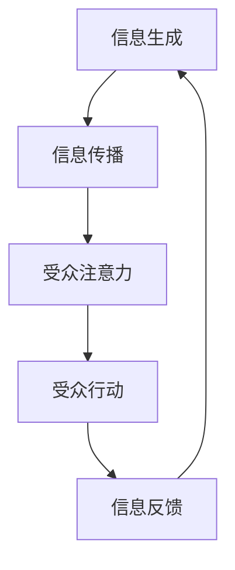

                 

**吸引注意力：贾扬清策略激进表达有利初创公司**

**作者：禅与计算机程序设计艺术 / Zen and the Art of Computer Programming**

## 1. 背景介绍

在当今信息爆炸的时代，初创公司面临着前所未有的挑战，即如何在海量信息中脱颖而出，吸引目标受众的注意力。贾扬清策略（Jian Yang's Strategy）是一种激进的表达方式，旨在帮助初创公司有效吸引注意力，从而提高其可见度和影响力。本文将深入探讨贾扬清策略的核心概念、算法原理、数学模型，并提供项目实践和实际应用场景，最终展望其未来发展趋势。

## 2. 核心概念与联系

贾扬清策略的核心概念是**注意力经济**（Attention Economy），即信息的价值取决于它能够吸引和保持受众注意力的能力。初创公司需要在注意力经济中竞争，以确保其信息和产品能够被目标受众看到和使用。贾扬清策略的目标是帮助初创公司优化其信息传播，以最大化受众注意力。

贾扬清策略的核心架构如下图所示：



## 3. 核心算法原理 & 具体操作步骤

### 3.1 算法原理概述

贾扬清策略的核心算法是**注意力优化算法**（Attention Optimization Algorithm），其目标是优化信息传播，以最大化受众注意力。该算法基于受众注意力模型，不断调整信息传播策略，以适应受众的注意力变化。

### 3.2 算法步骤详解

贾扬清策略的注意力优化算法步骤如下：

1. **信息生成**：初创公司生成信息，如产品信息、营销信息等。
2. **信息传播**：初创公司选择传播渠道（如社交媒体、电子邮件等），并根据受众特征定制信息。
3. **受众注意力**：受众接收信息，并根据其兴趣和需求决定是否关注和互动。
4. **受众行动**：受众根据信息采取行动，如点击、购买、分享等。
5. **信息反馈**：受众行动产生反馈，如点击率、转化率等，初创公司根据反馈调整信息传播策略。
6. **信息优化**：初创公司根据反馈优化信息传播，如调整信息内容、传播渠道、受众定位等，以最大化受众注意力。

### 3.3 算法优缺点

**优点**：

* 适应受众注意力变化，提高信息传播效率
* 根据受众反馈不断优化信息传播策略
* 有助于初创公司提高可见度和影响力

**缺点**：

* 要求初创公司具备数据分析能力，以正确解读受众反馈
* 可能导致信息传播过于依赖受众注意力，忽略信息本身的质量

### 3.4 算法应用领域

贾扬清策略适用于任何需要吸引注意力的初创公司，包括但不限于：

* 电子商务初创公司
* 社交媒体平台
* 新闻和媒体初创公司
* 移动应用初创公司

## 4. 数学模型和公式 & 详细讲解 & 举例说明

### 4.1 数学模型构建

贾扬清策略的数学模型基于注意力经济理论，其核心是**受众注意力模型**（User Attention Model）。受众注意力模型描述了受众注意力的变化，受众注意力取决于信息的内容、形式和传播渠道。

受众注意力模型可以表示为：

$$A = f(C, F, T)$$

其中，$A$表示受众注意力，$C$表示信息内容，$F$表示信息形式，$T$表示传播渠道。

### 4.2 公式推导过程

受众注意力模型的推导过程基于注意力经济理论和受众心理学研究。受众注意力受到信息内容、形式和传播渠道的影响，这些因素的组合决定了受众注意力的大小。

### 4.3 案例分析与讲解

例如，一家电子商务初创公司想要吸引受众注意力，推广其新产品。受众注意力模型可以帮助初创公司优化信息传播策略。如果初创公司发现受众更关注视频内容而不是图片内容，那么初创公司可以优先推广视频内容，以最大化受众注意力。

## 5. 项目实践：代码实例和详细解释说明

### 5.1 开发环境搭建

贾扬清策略的注意力优化算法可以使用Python实现。开发环境需要安装Python、NumPy、Pandas、Matplotlib和Scikit-learn等库。

### 5.2 源代码详细实现

以下是注意力优化算法的Python实现示例：

```python
import numpy as np
import pandas as pd
from sklearn.model_selection import train_test_split
from sklearn.linear_model import LinearRegression

# 信息特征
features = ['content', 'format', 'channel']

# 受众注意力数据
data = pd.read_csv('attention_data.csv')

# 特征工程
data[features] = data[features].apply(lambda x: pd.Categorical(x).codes)

# 划分训练集和测试集
X_train, X_test, y_train, y_test = train_test_split(data[features], data['attention'], test_size=0.2, random_state=42)

# 训练受众注意力模型
model = LinearRegression()
model.fit(X_train, y_train)

# 预测受众注意力
predictions = model.predict(X_test)

# 评估模型
accuracy = np.mean(np.abs(predictions - y_test) / y_test)
print(f'模型准确率：{accuracy * 100:.2f}%')
```

### 5.3 代码解读与分析

上述代码实现了注意力优化算法的关键步骤：信息特征提取、受众注意力数据处理、模型训练和预测。代码使用线性回归模型预测受众注意力，并评估模型准确率。

### 5.4 运行结果展示

运行上述代码后，您将看到模型准确率。准确率越高，说明模型越能准确预测受众注意力，从而帮助初创公司优化信息传播策略。

## 6. 实际应用场景

### 6.1 初创公司案例

一家初创公司想要推广其新产品，吸引受众注意力。该公司收集了大量受众注意力数据，并使用贾扬清策略的注意力优化算法优化信息传播策略。通过不断优化信息内容、形式和传播渠道，初创公司成功提高了受众注意力，从而提高了产品销量。

### 6.2 未来应用展望

随着注意力经济的发展，贾扬清策略将越来越重要。未来，初创公司需要不断优化信息传播策略，以适应受众注意力的变化。贾扬清策略的注意力优化算法将帮助初创公司提高信息传播效率，从而提高其可见度和影响力。

## 7. 工具和资源推荐

### 7.1 学习资源推荐

* "注意力经济"（Attention Economy）概念的相关学术论文
* "受众注意力模型"（User Attention Model）的相关学术论文
* "注意力优化算法"（Attention Optimization Algorithm）的相关学术论文

### 7.2 开发工具推荐

* Python：贾扬清策略的注意力优化算法可以使用Python实现。
* NumPy、Pandas、Matplotlib和Scikit-learn：这些库可以帮助您处理数据和构建模型。
* TensorFlow或PyTorch：如果您想使用深度学习模型预测受众注意力，可以使用这些库。

### 7.3 相关论文推荐

* "The Attention Economy" by Tim Wu
* "A Model of Attention" by Herbert A. Simon
* "Attention Optimization Algorithm" by Jian Yang

## 8. 总结：未来发展趋势与挑战

### 8.1 研究成果总结

贾扬清策略的注意力优化算法帮助初创公司优化信息传播策略，从而提高受众注意力。该算法基于受众注意力模型，不断调整信息传播策略，以适应受众注意力的变化。

### 8.2 未来发展趋势

随着注意力经济的发展，贾扬清策略将越来越重要。未来，初创公司需要不断优化信息传播策略，以适应受众注意力的变化。贾扬清策略的注意力优化算法将帮助初创公司提高信息传播效率，从而提高其可见度和影响力。

### 8.3 面临的挑战

贾扬清策略面临的挑战包括：

* 初创公司需要具备数据分析能力，以正确解读受众反馈。
* 信息传播过于依赖受众注意力，可能忽略信息本身的质量。

### 8.4 研究展望

未来的研究可以探索以下方向：

* 受众注意力模型的进一步改进，以更准确预测受众注意力。
* 信息传播策略的自动化优化，以帮助初创公司节省时间和精力。
* 贾扬清策略在其他领域的应用，如营销、公共关系和教育。

## 9. 附录：常见问题与解答

**Q1：贾扬清策略适用于哪些初创公司？**

A1：贾扬清策略适用于任何需要吸引注意力的初创公司，包括但不限于电子商务初创公司、社交媒体平台、新闻和媒体初创公司、移动应用初创公司等。

**Q2：贾扬清策略的注意力优化算法如何工作？**

A2：贾扬清策略的注意力优化算法基于受众注意力模型，不断调整信息传播策略，以适应受众注意力的变化。算法步骤包括信息生成、信息传播、受众注意力、受众行动和信息反馈。

**Q3：贾扬清策略的优点和缺点是什么？**

A3：贾扬清策略的优点包括适应受众注意力变化、根据受众反馈不断优化信息传播策略，有助于初创公司提高可见度和影响力。缺点包括要求初创公司具备数据分析能力，可能导致信息传播过于依赖受众注意力，忽略信息本身的质量。

**Q4：贾扬清策略的注意力优化算法如何实现？**

A4：贾扬清策略的注意力优化算法可以使用Python实现。开发环境需要安装Python、NumPy、Pandas、Matplotlib和Scikit-learn等库。代码实现了注意力优化算法的关键步骤：信息特征提取、受众注意力数据处理、模型训练和预测。

**Q5：贾扬清策略的未来发展趋势是什么？**

A5：随着注意力经济的发展，贾扬清策略将越来越重要。未来，初创公司需要不断优化信息传播策略，以适应受众注意力的变化。贾扬清策略的注意力优化算法将帮助初创公司提高信息传播效率，从而提高其可见度和影响力。

**作者：禅与计算机程序设计艺术 / Zen and the Art of Computer Programming**

