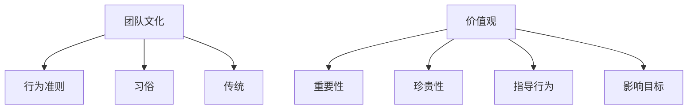

                 

**团队研发文化和价值观建设与传承**

## 1. 背景介绍

在当今快速变化的技术环境中，软件开发团队的成功不仅取决于其技术能力，还取决于其文化和价值观。良好的团队文化和价值观可以提高团队凝聚力，增强创新能力，提高开发效率，并最终提高软件质量。本文将探讨如何建设和传承团队研发文化和价值观，以助力团队取得长期成功。

## 2. 核心概念与联系

### 2.1 团队文化

团队文化是指团队成员共同认可和遵循的行为准则、习俗和传统。它是团队凝聚力的基础，影响着团队的沟通、合作和决策方式。

### 2.2 价值观

价值观是指团队认为重要和珍贵的东西。它指导着团队的行为和决策，并影响着团队的目标和动机。

### 2.3 关系图

以下是团队文化和价值观的关系图，使用Mermaid语法绘制：



## 3. 核心算法原理 & 具体操作步骤

### 3.1 算法原理概述

建设和传承团队研发文化和价值观的过程可以看作是一个反馈系统。团队文化和价值观的建设需要不断地识别、评估和改进，以适应团队的变化和外部环境的变化。

### 3.2 算法步骤详解

1. **识别核心价值观**：团队需要识别出其核心价值观，这些价值观应该指导团队的行为和决策。
2. **建立行为准则**：团队需要建立行为准则，这些准则应该反映团队的价值观，并指导团队的行为。
3. **传达文化和价值观**：团队需要不断地传达其文化和价值观，以确保所有成员都理解和认同它们。
4. **评估文化和价值观**：团队需要定期评估其文化和价值观，看看它们是否仍然适合团队的需求和外部环境。
5. **改进文化和价值观**：如果文化和价值观不再适合，团队需要改进它们，以适应变化的环境。

### 3.3 算法优缺点

**优点**：

* 提高团队凝聚力
* 增强创新能力
* 提高开发效率
* 提高软件质量

**缺点**：

* 需要持续的努力和投入
* 需要团队的共同参与和认同

### 3.4 算法应用领域

这个算法适用于任何需要协作开发软件的团队，包括但不限于软件开发公司、开源项目、政府机构和非营利组织。

## 4. 数学模型和公式 & 详细讲解 & 举例说明

### 4.1 数学模型构建

我们可以使用社会系统动力学模型来建模团队文化和价值观的建设和传承过程。这个模型考虑了团队成员的行为、互动和反馈，并使用差分方程来描述系统的动态。

### 4.2 公式推导过程

假设团队有N个成员，每个成员i有文化和价值观的认同度$C_i(t)$，时间t。我们可以使用以下差分方程来描述系统的动态：

$$\frac{dC_i}{dt} = \alpha \sum_{j=1}^{N} a_{ij} (C_j - C_i) + \beta (C_{des} - C_i)$$

其中，$a_{ij}$是成员i和j之间的互动强度，$C_{des}$是团队的目标文化和价值观认同度，$\alpha$和$\beta$是系统的参数。

### 4.3 案例分析与讲解

例如，假设一个软件开发团队有5名成员，目标是建立一个开放和协作的文化。团队可以使用上述模型来评估其文化和价值观的建设情况，并调整其互动强度和目标认同度以改进文化和价值观的建设。

## 5. 项目实践：代码实例和详细解释说明

### 5.1 开发环境搭建

我们将使用Python和NumPy来实现上述模型。我们需要安装NumPy库，可以使用以下命令：

```bash
pip install numpy
```

### 5.2 源代码详细实现

以下是实现上述模型的Python代码：

```python
import numpy as np

def team_culture_model(N, a, alpha, beta, C_des, dt, T):
    C = np.zeros((N, T))
    C[:, 0] = np.random.rand(N)

    for t in range(1, T):
        C[:, t] = C[:, t-1] + dt * (alpha * np.dot(a, C[:, t-1] - C[:, t-1]) + beta * (C_des - C[:, t-1]))

    return C
```

### 5.3 代码解读与分析

* `N`是团队成员的数量。
* `a`是互动强度矩阵。
* `alpha`和`beta`是系统的参数。
* `C_des`是目标文化和价值观认同度。
* `dt`是时间步长。
* `T`是模拟的时间步数。
* 函数返回一个数组，其中每一行对应一个团队成员，每一列对应一个时间步，值表示该成员在该时间步的文化和价值观认同度。

### 5.4 运行结果展示

以下是使用上述代码模拟一个团队的文化和价值观建设情况的示例：

```python
N = 5
a = np.array([[0, 1, 0, 0, 0], [1, 0, 1, 0, 0], [0, 1, 0, 1, 0], [0, 0, 1, 0, 1], [0, 0, 0, 1, 0]])
alpha = 0.5
beta = 0.1
C_des = 1.0
dt = 0.1
T = 100

C = team_culture_model(N, a, alpha, beta, C_des, dt, T)

import matplotlib.pyplot as plt

plt.plot(C)
plt.xlabel('Time')
plt.ylabel('Culture and Value Alignment')
plt.show()
```

这将生成一个图表，显示每个团队成员的文化和价值观认同度随时间变化的情况。

## 6. 实际应用场景

### 6.1 当前应用

这个模型可以应用于任何需要协作开发软件的团队，包括但不限于软件开发公司、开源项目、政府机构和非营利组织。

### 6.2 未来应用展望

随着团队规模的扩大和远程协作的增多，这个模型的应用将变得越来越重要。它可以帮助团队建立和传承文化和价值观，提高团队凝聚力，增强创新能力，提高开发效率，并最终提高软件质量。

## 7. 工具和资源推荐

### 7.1 学习资源推荐

* "建设高绩效团队"（Patrick Lencioni）
* "五个难以驯服的关键绩效指标"（Jeremy J. Shapiro）
* "高效能人士的七个习惯"（Stephen R. Covey）

### 7.2 开发工具推荐

* Python和NumPy：用于实现数学模型。
* Matplotlib：用于可视化模拟结果。

### 7.3 相关论文推荐

* "Social dynamics in teams: A social systems dynamics approach"（Mark Mortensen and Martine Haas）
* "The role of culture in software engineering"（Susan M. Eggers and Barbara Kitchenham）

## 8. 总结：未来发展趋势与挑战

### 8.1 研究成果总结

本文介绍了如何建设和传承团队研发文化和价值观，并提出了一个数学模型来建模和评估文化和价值观的建设情况。我们还提供了一个Python代码实例来实现这个模型。

### 8.2 未来发展趋势

随着团队规模的扩大和远程协作的增多，建设和传承团队文化和价值观将变得越来越重要。我们预计会看到更多的研究和实践关注这个领域。

### 8.3 面临的挑战

* **变化的环境**：团队需要不断地适应变化的环境，这需要不断地评估和改进文化和价值观。
* **团队成员的变化**：团队成员的变化会影响文化和价值观，团队需要不断地适应新成员并重新评估其文化和价值观。
* **远程协作**：远程协作增加了传达和维护文化和价值观的难度。

### 8.4 研究展望

我们计划在未来的研究中考虑更复杂的模型，并将模型应用于更多的实际场景。我们还计划开发更多的工具和资源，帮助团队建设和传承文化和价值观。

## 9. 附录：常见问题与解答

**Q：如何开始建设团队文化和价值观？**

**A：识别核心价值观是一个好的开始。团队需要识别出其核心价值观，这些价值观应该指导团队的行为和决策。**

**Q：如何传达文化和价值观？**

**A：团队需要不断地传达其文化和价值观，可以通过会议、邮件、博客文章等方式。**

**Q：如何评估文化和价值观？**

**A：团队需要定期评估其文化和价值观，看看它们是否仍然适合团队的需求和外部环境。可以使用调查问卷、焦点小组等方式。**

**Q：如何改进文化和价值观？**

**A：如果文化和价值观不再适合，团队需要改进它们，可以通过修改行为准则、调整目标等方式。**

## 作者：禅与计算机程序设计艺术 / Zen and the Art of Computer Programming

