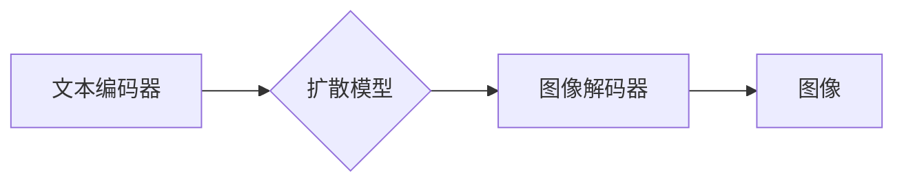

> Stable Diffusion,文本到图像生成,扩散模型,深度学习,图像生成,代码实例

## 1. 背景介绍

近年来，人工智能领域取得了令人瞩目的进展，其中文本到图像生成技术尤为引人注目。能够根据文本描述生成逼真的图像，这项技术在艺术创作、游戏开发、广告设计等领域拥有巨大的应用潜力。

Stable Diffusion 是一个开源的文本到图像生成模型，由 Stability AI 开发。它基于扩散模型的原理，能够以惊人的精度和创造力将文本描述转化为图像。相较于其他文本到图像生成模型，Stable Diffusion 具有以下优势：

* **开源和可定制:**  Stable Diffusion 的代码和模型权重都公开可获取，允许开发者自由修改和定制模型，以满足特定需求。
* **高分辨率图像生成:**  Stable Diffusion 可以生成高分辨率图像，达到甚至超过 1024x1024 像素，满足高质量图像生成的需求。
* **高效的训练和推理:**  Stable Diffusion 的训练和推理速度相对较快，即使在普通硬件上也能实现较好的性能。

## 2. 核心概念与联系

### 2.1 扩散模型

扩散模型是一种基于概率的生成模型，其核心思想是将数据逐渐添加噪声，最终变成纯噪声，然后通过学习逆过程，将纯噪声逐渐还原成原始数据。

### 2.2 文本到图像生成

文本到图像生成模型的目标是根据文本描述生成相应的图像。它需要将文本信息转化为图像特征，并利用这些特征生成图像。

### 2.3 Stable Diffusion 架构

Stable Diffusion 的架构主要包含以下部分：

* **文本编码器:** 将文本描述编码为向量表示。
* **扩散模型:**  将图像逐渐添加噪声，并学习逆过程，将噪声还原成图像。
* **图像解码器:** 将扩散模型生成的图像特征解码成可视化的图像。

**Mermaid 流程图:**

## 3. 核心算法原理 & 具体操作步骤

### 3.1 算法原理概述

Stable Diffusion 基于扩散模型的原理，其核心算法可以概括为以下步骤：

1. **前向过程 (添加噪声):** 将图像逐渐添加噪声，直到变成纯噪声。
2. **反向过程 (去除噪声):** 学习逆过程，从纯噪声中逐渐去除噪声，最终生成图像。

### 3.2 算法步骤详解

1. **前向过程:**

   * 从原始图像开始，每次添加少量噪声，直到图像变成纯噪声。
   * 噪声的添加方式可以是随机的，也可以是基于图像特征的。

2. **反向过程:**

   * 从纯噪声开始，学习去除噪声的过程。
   * 利用训练数据，学习噪声的分布和去除噪声的策略。
   * 通过迭代地去除噪声，最终生成图像。

### 3.3 算法优缺点

**优点:**

* **生成高质量图像:**  Stable Diffusion 可以生成逼真、高质量的图像。
* **可定制性强:**  模型可以根据需要进行修改和定制。
* **开源和易于使用:**  代码和模型权重公开可获取，方便开发者使用和研究。

**缺点:**

* **训练成本高:**  训练扩散模型需要大量的计算资源和时间。
* **生成图像可能存在偏差:**  训练数据可能存在偏差，导致生成的图像也存在偏差。

### 3.4 算法应用领域

* **艺术创作:**  生成艺术作品、插画、概念设计等。
* **游戏开发:**  生成游戏场景、角色、道具等。
* **广告设计:**  生成广告图片、产品展示图等。
* **教育和科研:**  用于图像识别、图像理解、计算机视觉等研究。

## 4. 数学模型和公式 & 详细讲解 & 举例说明

### 4.1 数学模型构建

Stable Diffusion 的数学模型主要基于变分自编码器 (VAE) 和扩散模型的结合。

* **VAE:** 用于将图像编码为低维向量表示，并学习图像的潜在空间结构。
* **扩散模型:** 用于学习图像的噪声添加和去除过程，并生成新的图像。

### 4.2 公式推导过程

由于篇幅限制，这里只列举一些关键公式，详细推导过程可以参考论文。

* **噪声添加过程:**

$$
x_t = \sqrt{1-\beta_t}x_{t-1} + \sqrt{\beta_t}\epsilon_t
$$

其中：

* $x_t$ 是时间步 t 的图像。
* $\beta_t$ 是时间步 t 的噪声比例。
* $\epsilon_t$ 是高斯噪声。

* **噪声去除过程:**

$$
\hat{x}_{t-1} = \frac{x_t - \sqrt{\beta_t}\epsilon_t}{\sqrt{1-\beta_t}}
$$

其中：

* $\hat{x}_{t-1}$ 是时间步 t-1 的图像估计值。

### 4.3 案例分析与讲解

假设我们想要生成一张猫的图像。

1. 我们首先将文本描述 "猫" 编码为向量表示。
2. 然后，我们将纯噪声图像通过扩散模型的反向过程，逐步去除噪声，并根据文本编码向量进行引导。
3. 最后，我们得到一张符合文本描述的猫的图像。

## 5. 项目实践：代码实例和详细解释说明

### 5.1 开发环境搭建

Stable Diffusion 的开发环境搭建需要以下软件：

* Python 3.7+
* PyTorch 1.7+
* CUDA 11.0+ (可选，用于加速训练和推理)

### 5.2 源代码详细实现

Stable Diffusion 的源代码可以在 GitHub 上找到：https://github.com/CompVis/stable-diffusion

### 5.3 代码解读与分析

Stable Diffusion 的代码主要包含以下部分：

* **文本编码器:** 使用 Transformer 模型进行文本编码。
* **扩散模型:** 使用 UNet 架构进行图像生成。
* **图像解码器:** 使用 UNet 架构进行图像解码。

### 5.4 运行结果展示

运行 Stable Diffusion 的代码可以生成符合文本描述的图像。

## 6. 实际应用场景

### 6.1 艺术创作

Stable Diffusion 可以帮助艺术家快速生成创意构思，并探索新的艺术风格。

### 6.2 游戏开发

Stable Diffusion 可以用于生成游戏场景、角色、道具等，节省游戏开发的时间和成本。

### 6.3 广告设计

Stable Diffusion 可以用于生成吸引人的广告图片，提升广告效果。

### 6.4 未来应用展望

Stable Diffusion 的未来应用前景广阔，例如：

* **个性化内容生成:**  根据用户的喜好生成个性化的图像内容。
* **虚拟现实和增强现实:**  用于生成虚拟场景和增强现实体验。
* **医学图像分析:**  用于辅助医生诊断和治疗。

## 7. 工具和资源推荐

### 7.1 学习资源推荐

* **Stable Diffusion 官方文档:** https://stability.ai/blog/stable-diffusion-v1-release
* **Hugging Face:** https://huggingface.co/docs/diffusers/index

### 7.2 开发工具推荐

* **PyTorch:** https://pytorch.org/
* **CUDA:** https://developer.nvidia.com/cuda-downloads

### 7.3 相关论文推荐

* **Diffusion Models Beat GANs on Image Synthesis:** https://arxiv.org/abs/2006.11239

## 8. 总结：未来发展趋势与挑战

### 8.1 研究成果总结

Stable Diffusion 的出现标志着文本到图像生成技术取得了新的突破。它开源、可定制、高效的特点，推动了该领域的快速发展。

### 8.2 未来发展趋势

* **更高质量的图像生成:**  研究人员将继续探索新的算法和模型架构，以生成更高质量、更逼真的图像。
* **更强大的文本理解能力:**  研究人员将致力于提高模型对文本的理解能力，使其能够生成更符合文本描述的图像。
* **更广泛的应用场景:**  文本到图像生成技术将应用于更多领域，例如教育、医疗、设计等。

### 8.3 面临的挑战

* **数据偏差:**  训练数据可能存在偏差，导致生成的图像也存在偏差。
* **伦理问题:**  文本到图像生成技术可能被用于生成虚假信息或进行恶意攻击。

### 8.4 研究展望

未来，文本到图像生成技术将继续朝着更高质量、更智能、更安全的方向发展。

## 9. 附录：常见问题与解答

### 9.1 如何安装 Stable Diffusion？

...

### 9.2 如何使用 Stable Diffusion 生成图像？

...

### 9.3 Stable Diffusion 的训练数据是什么？

...

作者：禅与计算机程序设计艺术 / Zen and the Art of Computer Programming 
<end_of_turn>