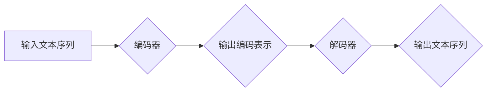

> Transformer, 大模型, 自然语言处理, 机器翻译, 文本生成, 编码器-解码器, self-attention, BERT, GPT

## 1. 背景介绍

近年来，深度学习在人工智能领域取得了突破性进展，其中自然语言处理（NLP）领域尤为突出。传统的基于循环神经网络（RNN）的模型在处理长文本序列时存在效率低下和梯度消失等问题。2017年，Google发布了基于注意力机制的Transformer模型，彻底改变了NLP领域的研究方向，并取得了显著的成果。

Transformer模型的核心优势在于其并行计算能力和长距离依赖建模能力。它摒弃了RNN的循环结构，采用自注意力机制（self-attention）来捕捉文本序列中的长距离依赖关系，从而有效解决了RNN模型的瓶颈问题。自注意力机制能够同时关注文本序列中的所有词，并计算每个词与其他词之间的相关性，从而构建更丰富的语义表示。

自Transformer模型问世以来，其架构和思想被广泛应用于各种NLP任务，例如机器翻译、文本摘要、问答系统、文本生成等。基于Transformer的模型，如BERT、GPT、T5等，在多个NLP benchmark 上取得了state-of-the-art的性能，并推动了人工智能技术的快速发展。

## 2. 核心概念与联系

Transformer模型的核心概念包括：

* **编码器-解码器架构:** Transformer模型采用编码器-解码器架构，其中编码器负责将输入文本序列编码成语义表示，解码器则根据编码后的表示生成输出文本序列。

* **自注意力机制:** 自注意力机制是Transformer模型的核心创新点，它能够捕捉文本序列中的长距离依赖关系，并构建更丰富的语义表示。

* **多头注意力:** 多头注意力机制通过使用多个注意力头，可以从不同的角度捕捉文本序列中的信息，从而提高模型的表达能力。

* **前馈神经网络:** 前馈神经网络在编码器和解码器中用于处理自注意力机制输出的特征，并进一步提取语义信息。

* **位置编码:** 由于Transformer模型没有循环结构，无法直接捕捉文本序列中的位置信息。因此，需要使用位置编码来嵌入位置信息，以便模型能够理解文本序列的顺序关系。

**Mermaid 流程图:**



## 3. 核心算法原理 & 具体操作步骤

### 3.1  算法原理概述

Transformer模型的核心算法是自注意力机制。自注意力机制通过计算每个词与其他词之间的相关性，来捕捉文本序列中的长距离依赖关系。

### 3.2  算法步骤详解

1. **计算词嵌入:** 将每个词转换为低维向量表示，称为词嵌入。

2. **计算注意力权重:** 对于每个词，计算它与其他词之间的相关性，并得到一个注意力权重向量。注意力权重向量表示每个词对其他词的影响程度。

3. **加权求和:** 将每个词的词嵌入与对应的注意力权重向量相乘，并求和，得到每个词的上下文表示。

4. **多头注意力:** 使用多个注意力头，分别计算每个词与其他词之间的相关性，并将多个注意力头的输出进行拼接，得到更丰富的上下文表示。

5. **前馈神经网络:** 将上下文表示输入到前馈神经网络中，进一步提取语义信息。

### 3.3  算法优缺点

**优点:**

* 能够捕捉长距离依赖关系。
* 并行计算能力强。
* 表现能力强，在多个NLP任务上取得了state-of-the-art的性能。

**缺点:**

* 计算复杂度高。
* 训练数据量大。

### 3.4  算法应用领域

自注意力机制广泛应用于各种NLP任务，例如：

* 机器翻译
* 文本摘要
* 问答系统
* 文本生成
* 语义理解

## 4. 数学模型和公式 & 详细讲解 & 举例说明

### 4.1  数学模型构建

Transformer模型的数学模型主要包括以下几个部分：

* **词嵌入层:** 将每个词转换为低维向量表示。

* **多头注意力层:** 计算每个词与其他词之间的相关性，并得到注意力权重向量。

* **前馈神经网络层:** 进一步提取语义信息。

* **位置编码层:** 嵌入位置信息。

### 4.2  公式推导过程

**自注意力机制的计算公式:**

$$
Attention(Q, K, V) = softmax(\frac{QK^T}{\sqrt{d_k}})V
$$

其中：

* $Q$：查询矩阵
* $K$：键矩阵
* $V$：值矩阵
* $d_k$：键向量的维度
* $softmax$：softmax函数

**多头注意力的计算公式:**

$$
MultiHead(Q, K, V) = Concat(head_1, head_2, ..., head_h)W^O
$$

其中：

* $head_i$：第 $i$ 个注意力头的输出
* $h$：注意力头的数量
* $W^O$：输出权重矩阵

### 4.3  案例分析与讲解

假设我们有一个句子 "The cat sat on the mat"，我们使用自注意力机制来计算每个词与其他词之间的相关性。

* 对于词 "The"，它与 "cat" 的相关性较高，因为它们是主语和谓语的关系。
* 对于词 "sat"，它与 "cat" 和 "mat" 的相关性较高，因为它们是动作和宾语的关系。

通过计算每个词与其他词之间的相关性，我们可以得到一个更丰富的语义表示，从而更好地理解句子的含义。

## 5. 项目实践：代码实例和详细解释说明

### 5.1  开发环境搭建

* Python 3.6+
* TensorFlow 2.0+
* PyTorch 1.0+

### 5.2  源代码详细实现

```python
import tensorflow as tf

# 定义词嵌入层
embedding_layer = tf.keras.layers.Embedding(input_dim=vocab_size, output_dim=embedding_dim)

# 定义多头注意力层
multi_head_attention_layer = tf.keras.layers.MultiHeadAttention(num_heads=8, key_dim=embedding_dim)

# 定义前馈神经网络层
ffn_layer = tf.keras.layers.Dense(units=embedding_dim, activation="relu")

# 定义Transformer编码器块
def transformer_encoder_block(inputs, embedding_dim):
    # 词嵌入
    embedded_inputs = embedding_layer(inputs)
    # 多头注意力
    attention_output = multi_head_attention_layer(embedded_inputs, embedded_inputs, embedded_inputs)
    # 前馈神经网络
    ffn_output = ffn_layer(attention_output)
    # 残差连接和层归一化
    output = tf.keras.layers.LayerNormalization()(attention_output + ffn_output)
    return output

# 定义Transformer模型
class TransformerModel(tf.keras.Model):
    def __init__(self, vocab_size, embedding_dim, num_layers, num_heads):
        super(TransformerModel, self).__init__()
        self.embedding_layer = embedding_layer
        self.encoder_blocks = [transformer_encoder_block(embedding_dim=embedding_dim) for _ in range(num_layers)]

    def call(self, inputs):
        # 词嵌入
        embedded_inputs = self.embedding_layer(inputs)
        # 编码器块
        for encoder_block in self.encoder_blocks:
            embedded_inputs = encoder_block(embedded_inputs)
        return embedded_inputs
```

### 5.3  代码解读与分析

* **词嵌入层:** 将每个词转换为低维向量表示。
* **多头注意力层:** 计算每个词与其他词之间的相关性，并得到注意力权重向量。
* **前馈神经网络层:** 进一步提取语义信息。
* **Transformer编码器块:** 将词嵌入、多头注意力和前馈神经网络层组合在一起，构成一个编码器块。
* **Transformer模型:** 将多个编码器块堆叠在一起，构成一个完整的Transformer模型。

### 5.4  运行结果展示

运行代码后，可以得到每个词的上下文表示，并用于后续的NLP任务。

## 6. 实际应用场景

Transformer模型在各种NLP任务中都有着广泛的应用，例如：

* **机器翻译:** Transformer模型能够捕捉长距离依赖关系，从而提高机器翻译的准确率。

* **文本摘要:** Transformer模型能够提取文本的关键信息，并生成简洁的摘要。

* **问答系统:** Transformer模型能够理解自然语言问题，并从文本中找到答案。

* **文本生成:** Transformer模型能够生成流畅自然的文本，例如对话系统、故事生成等。

### 6.4  未来应用展望

Transformer模型的应用前景十分广阔，未来可能在以下领域得到更广泛的应用：

* **代码生成:** Transformer模型能够学习代码的语法和语义，并生成新的代码。
* **药物研发:** Transformer模型能够分析生物数据，并预测药物的活性。
* **个性化推荐:** Transformer模型能够理解用户的偏好，并推荐个性化的内容。

## 7. 工具和资源推荐

### 7.1  学习资源推荐

* **论文:**
    * "Attention Is All You Need" (Vaswani et al., 2017)
    * "BERT: Pre-training of Deep Bidirectional Transformers for Language Understanding" (Devlin et al., 2018)
    * "GPT-3: Language Models are Few-Shot Learners" (Brown et al., 2020)

* **博客:**
    * Jay Alammar's Blog: https://jalammar.github.io/
    * The Gradient: https://thegradient.pub/

### 7.2  开发工具推荐

* **TensorFlow:** https://www.tensorflow.org/
* **PyTorch:** https://pytorch.org/
* **Hugging Face Transformers:** https://huggingface.co/transformers/

### 7.3  相关论文推荐

* **BERT:** https://arxiv.org/abs/1810.04805
* **GPT-2:** https://openai.com/blog/better-language-models/
* **T5:** https://arxiv.org/abs/1910.10683

## 8. 总结：未来发展趋势与挑战

### 8.1  研究成果总结

Transformer模型的出现彻底改变了NLP领域的研究方向，并取得了显著的成果。其并行计算能力强、长距离依赖建模能力强等特点使其在各种NLP任务上都取得了state-of-the-art的性能。

### 8.2  未来发展趋势

Transformer模型的未来发展趋势包括：

* **模型规模的进一步扩大:** 更大的模型规模能够学习更丰富的语义表示，从而提高模型的性能。
* **模型效率的提升:** 如何提高Transformer模型的训练和推理效率是未来研究的重要方向。
* **模型的泛化能力增强:** 如何使Transformer模型能够更好地泛化到新的任务和领域是未来研究的挑战。

### 8.3  面临的挑战

Transformer模型也面临着一些挑战，例如：

* **训练数据量大:** Transformer模型需要大量的训练数据才能达到最佳性能。
* **计算资源消耗大:** Transformer模型的训练和推理需要大量的计算资源。
* **可解释性差:** Transformer模型的内部机制比较复杂，难以解释其决策过程。

### 8.4  研究展望

未来，Transformer模型的研究将继续深入，并应用于更多领域。相信Transformer模型将在人工智能领域发挥越来越重要的作用。

## 9. 附录：常见问题与解答

* **什么是自注意力机制？**