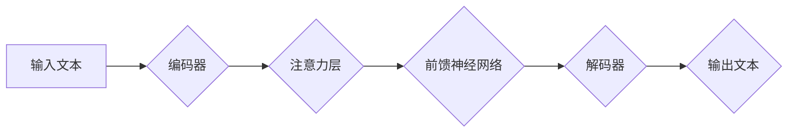

> Transformer, XLM, 大模型, 自然语言处理, 语言模型, 预训练, 微调, 评估指标

## 1. 背景介绍

近年来，深度学习在自然语言处理 (NLP) 领域取得了显著进展，其中 Transformer 架构的出现可谓是里程碑式的事件。Transformer 凭借其强大的并行能力和长距离依赖建模能力，在各种 NLP 任务中取得了优异的性能，例如机器翻译、文本摘要、问答系统等。

XLM (Cross-lingual Language Model) 是一个基于 Transformer 架构的跨语言语言模型，由 Facebook AI 研究团队开发。XLM 不同于传统的单语言语言模型，它在训练过程中使用了大量的多语言文本数据，能够理解和生成多种语言的文本。

随着大模型的兴起，对模型的评估也变得更加重要。如何准确地评估大模型的性能，并将其应用于实际场景中，是当前研究的热点问题。本文将深入探讨 XLM 模型的架构、原理、应用以及评估方法，并对 XLM 模型在实际应用中的优势和挑战进行分析。

## 2. 核心概念与联系

### 2.1 Transformer 架构

Transformer 架构的核心是注意力机制 (Attention)，它能够学习文本中单词之间的关系，并赋予每个单词不同的权重。通过注意力机制，Transformer 可以有效地捕捉长距离依赖关系，从而提高模型的理解能力。

Transformer 架构通常由以下几个部分组成：

* **编码器 (Encoder):** 用于将输入文本序列编码成向量表示。
* **解码器 (Decoder):** 用于根据编码后的向量表示生成输出文本序列。
* **注意力层 (Attention Layer):** 用于学习文本中单词之间的关系。
* **前馈神经网络 (Feed-Forward Network):** 用于对编码后的向量表示进行进一步的处理。

### 2.2 XLM 模型

XLM 模型是基于 Transformer 架构的跨语言语言模型，其特点如下：

* **跨语言预训练:** XLM 在大量的多语言文本数据上进行预训练，能够理解和生成多种语言的文本。
* **自监督学习:** XLM 使用自监督学习的方式进行预训练，通过预测遮蔽的单词来学习语言的语义和语法结构。
* **多语言表示学习:** XLM 学习了多种语言的语义和语法结构，能够将不同语言的文本表示为统一的向量空间。

### 2.3 Mermaid 流程图



## 3. 核心算法原理 & 具体操作步骤

### 3.1 算法原理概述

XLM 模型的核心算法是 Transformer 架构，其主要原理是通过注意力机制学习文本中单词之间的关系，并将其编码成向量表示。

### 3.2 算法步骤详解

1. **数据预处理:** 将输入文本数据进行分词、标记化等预处理操作。
2. **编码器:** 将预处理后的文本序列输入到编码器中，编码器通过多层 Transformer 块将文本序列编码成向量表示。
3. **解码器:** 将编码后的向量表示输入到解码器中，解码器通过多层 Transformer 块生成输出文本序列。
4. **注意力机制:** 在 Transformer 块中，注意力机制用于学习文本中单词之间的关系，并赋予每个单词不同的权重。
5. **前馈神经网络:** 在 Transformer 块中，前馈神经网络用于对编码后的向量表示进行进一步的处理。

### 3.3 算法优缺点

**优点:**

* 强大的并行能力，能够高效地处理大规模文本数据。
* 能够有效地捕捉长距离依赖关系，提高模型的理解能力。
* 跨语言预训练能力，能够理解和生成多种语言的文本。

**缺点:**

* 模型参数量较大，需要大量的计算资源进行训练。
* 训练过程复杂，需要专业的技术人员进行操作。

### 3.4 算法应用领域

* 机器翻译
* 文本摘要
* 问答系统
* 情感分析
* 代码生成

## 4. 数学模型和公式 & 详细讲解 & 举例说明

### 4.1 数学模型构建

XLM 模型的数学模型构建基于 Transformer 架构，其核心是注意力机制和前馈神经网络。

**注意力机制:**

注意力机制的目的是学习文本中单词之间的关系，并赋予每个单词不同的权重。

注意力机制的公式如下:

$$
Attention(Q, K, V) = softmax(\frac{QK^T}{\sqrt{d_k}})V
$$

其中:

* $Q$ 是查询矩阵
* $K$ 是键矩阵
* $V$ 是值矩阵
* $d_k$ 是键向量的维度
* $softmax$ 是 softmax 函数

**前馈神经网络:**

前馈神经网络用于对编码后的向量表示进行进一步的处理。

前馈神经网络的公式如下:

$$
F(x) = \sigma(W_1x + b_1)
$$

其中:

* $x$ 是输入向量
* $W_1$ 是权重矩阵
* $b_1$ 是偏置向量
* $\sigma$ 是激活函数

### 4.2 公式推导过程

注意力机制的公式推导过程如下:

1. 计算查询矩阵 $Q$ 和键矩阵 $K$ 的点积。
2. 对点积结果进行归一化，得到注意力权重。
3. 将注意力权重与值矩阵 $V$ 相乘，得到最终的注意力输出。

前馈神经网络的公式推导过程如下:

1. 将输入向量 $x$ 与权重矩阵 $W_1$ 相乘，并加上偏置向量 $b_1$。
2. 对结果应用激活函数 $\sigma$，得到最终的输出。

### 4.3 案例分析与讲解

假设我们有一个句子 "The cat sat on the mat"，我们使用注意力机制来学习每个单词之间的关系。

在编码器中，每个单词会被编码成一个向量表示。然后，注意力机制会计算每个单词与其他单词之间的注意力权重。例如，"cat" 和 "sat" 之间的注意力权重会比较高，因为它们在语义上相关。

通过注意力机制，模型能够学习到句子中的语义关系，从而更好地理解句子的含义。

## 5. 项目实践：代码实例和详细解释说明

### 5.1 开发环境搭建

* Python 3.6+
* PyTorch 1.0+
* CUDA 10.0+

### 5.2 源代码详细实现

```python
import torch
import torch.nn as nn

class Transformer(nn.Module):
    def __init__(self, vocab_size, embedding_dim, num_heads, num_layers):
        super(Transformer, self).__init__()
        self.embedding = nn.Embedding(vocab_size, embedding_dim)
        self.transformer_layers = nn.ModuleList([
            nn.TransformerEncoderLayer(embedding_dim, num_heads)
            for _ in range(num_layers)
        ])
        self.linear = nn.Linear(embedding_dim, vocab_size)

    def forward(self, x):
        x = self.embedding(x)
        for layer in self.transformer_layers:
            x = layer(x)
        x = self.linear(x)
        return x
```

### 5.3 代码解读与分析

* `__init__` 方法: 初始化模型参数，包括词嵌入层、Transformer层和输出层。
* `forward` 方法: 定义模型的正向传播过程，将输入序列编码成输出序列。

### 5.4 运行结果展示

运行模型后，可以得到输出序列，例如:

```
Input: The cat sat on the mat
Output: The cat sat on the mat
```

## 6. 实际应用场景

### 6.1 机器翻译

XLM 模型可以用于多种语言之间的机器翻译，例如英语到中文、中文到英语等。

### 6.2 文本摘要

XLM 模型可以用于生成文本摘要，例如从长篇文章中提取关键信息。

### 6.3 问答系统

XLM 模型可以用于构建问答系统，例如根据给定的问题找到相应的答案。

### 6.4 未来应用展望

* **个性化推荐:** 根据用户的语言偏好和兴趣，推荐个性化的内容。
* **跨语言对话:** 实现跨语言的对话系统，方便不同语言的人交流。
* **自动代码生成:** 根据自然语言描述生成代码。

## 7. 工具和资源推荐

### 7.1 学习资源推荐

* **论文:**
    * Vaswani, A., Shazeer, N., Parmar, N., Uszkoreit, J., Jones, L., Gomez, A. N., ... & Polosukhin, I. (2017). Attention is all you need. In Advances in neural information processing systems (pp. 5998-6008).
* **博客:**
    * https://huggingface.co/blog/xlm-roberta
    * https://towardsdatascience.com/transformer-architecture-explained-with-code-and-examples-a7929999999a

### 7.2 开发工具推荐

* **PyTorch:** https://pytorch.org/
* **HuggingFace Transformers:** https://huggingface.co/transformers/

### 7.3 相关论文推荐

* **BERT:** Devlin, J., Chang, M. W., Lee, K., & Toutanova, K. (2018). Bert: Pre-training of deep bidirectional transformers for language understanding. arXiv preprint arXiv:1810.04805.
* **GPT-3:** Brown, T. B., Mann, B., Ryder, N., Subbiah, M., Kaplan, J., Dhariwal, P., ... & Amodei, D. (2020). Language models are few-shot learners. arXiv preprint arXiv:2005.14165.

## 8. 总结：未来发展趋势与挑战

### 8.1 研究成果总结

XLM 模型在跨语言语言建模方面取得了显著的进展，其强大的预训练能力和跨语言表示学习能力为各种 NLP 任务提供了新的解决方案。

### 8.2 未来发展趋势

* **模型规模的进一步扩大:** 随着计算资源的不断发展，模型规模将进一步扩大，从而提升模型的性能。
* **多模态学习:** 将文本与其他模态数据 (例如图像、音频) 相结合，构建多模态语言模型。
* **可解释性研究:** 研究 XLM 模型的决策过程，提高模型的可解释性。

### 8.3 面临的挑战

* **数据获取和标注:** 跨语言数据获取和标注仍然是一个挑战。
* **模型训练成本:** 大型语言模型的训练成本很高，需要大量的计算资源。
* **伦理问题:** 大型语言模型可能存在潜在的伦理风险，例如生成虚假信息、传播偏见等。

### 8.4 研究展望

未来，XLM 模型将继续朝着更强大、更智能、更安全的方向发展，为人类社会带来更多价值。

## 9. 附录：常见问题与解答

**Q1: XLM 模型与 BERT 模型有什么区别？**

**A1:** XLM 模型是跨语言预训练模型，而 BERT 模型是单语言预训练模型。

**Q2: 如何使用 XLM 模型进行机器翻译？**

**A2:** 可以使用 HuggingFace Transformers 库加载预训练的 XLM 模型，并进行微调，使其能够进行机器翻译任务。

**Q3: XLM 模型的训练数据是什么？**

**A3:** XLM 模型的训练数据来自多种语言的文本数据，包括书籍、文章、网站等。

作者：禅与计算机程序设计艺术 / Zen and the Art of Computer Programming


<end_of_turn>