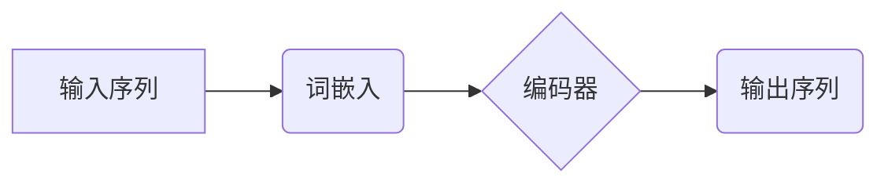

> Transformer, BERT, ALBERT, 自然语言处理, 大模型, 预训练, 微调

## 1. 背景介绍

近年来，深度学习在自然语言处理 (NLP) 领域取得了显著进展，其中 Transformer 架构和基于 Transformer 的预训练语言模型 (PLM) 成为研究热点。BERT 和 ALBERT 便是 Transformer 架构下涌现出的代表性模型，它们在许多 NLP 任务上取得了优异的性能，推动了 NLP 领域的发展。

BERT (Bidirectional Encoder Representations from Transformers) 由 Google 提出，其核心思想是利用 Transformer 架构对文本进行双向编码，学习到更丰富的语义表示。BERT 在预训练阶段使用大量的文本数据进行无监督学习，并通过微调的方式应用于各种下游任务，例如文本分类、问答系统、机器翻译等。

ALBERT (A Lite BERT) 由 Google 提出，旨在解决 BERT 模型体积庞大、训练成本高的问题。ALBERT 通过以下策略来压缩模型规模：

* **Factorized Embedding Parameterization:** 将词嵌入参数分解成多个低维向量，减少参数量。
* **Cross-Layer Parameter Sharing:** 允许不同 Transformer 层共享部分参数，进一步减少参数量。
* **Sentence Order Prediction:** 在预训练阶段使用句子顺序预测任务，提高模型的语义理解能力。

## 2. 核心概念与联系

### 2.1 Transformer 架构

Transformer 架构是一种新型的序列到序列模型，其核心特点是利用自注意力机制 (Self-Attention) 来捕捉序列中的长距离依赖关系。

Transformer 架构主要由以下部分组成：

* **输入层:** 将输入序列转换为词嵌入向量。
* **编码器:** 利用多层 Transformer 块对输入序列进行编码，每个 Transformer 块包含多头自注意力层和前馈神经网络层。
* **解码器:** 利用多层 Transformer 块对编码器的输出进行解码，生成目标序列。
* **输出层:** 将解码器的输出转换为目标序列的概率分布。

### 2.2 BERT 和 ALBERT 的联系

BERT 和 ALBERT 都是基于 Transformer 架构的预训练语言模型，它们都利用 Transformer 的自注意力机制来学习文本的语义表示。

* BERT 使用全连接 Transformer 架构，并通过 Masked Language Modeling (MLM) 和 Next Sentence Prediction (NSP) 两种预训练任务来学习文本的语义表示。
* ALBERT 通过压缩模型规模和优化预训练任务来提高 BERT 的效率。

**Mermaid 流程图**



## 3. 核心算法原理 & 具体操作步骤

### 3.1  算法原理概述

BERT 和 ALBERT 的核心算法原理是基于 Transformer 架构的预训练语言模型。它们通过预训练阶段学习到丰富的文本语义表示，然后通过微调的方式应用于各种下游任务。

### 3.2  算法步骤详解

**BERT 预训练步骤:**

1. **词嵌入:** 将输入序列中的每个词转换为词嵌入向量。
2. **编码器:** 利用多层 Transformer 块对输入序列进行编码，每个 Transformer 块包含多头自注意力层和前馈神经网络层。
3. **Masked Language Modeling (MLM):** 在预训练阶段随机掩盖输入序列中的部分词，然后利用模型预测被掩盖词的词语。
4. **Next Sentence Prediction (NSP):** 在预训练阶段提供两个句子，然后利用模型预测这两个句子是否相邻。

**ALBERT 预训练步骤:**

1. **词嵌入:** 将输入序列中的每个词转换为词嵌入向量。
2. **编码器:** 利用多层 Transformer 块对输入序列进行编码，每个 Transformer 块包含多头自注意力层和前馈神经网络层。
3. **Sentence Order Prediction:** 在预训练阶段使用句子顺序预测任务，提高模型的语义理解能力。

**微调步骤:**

1. **加载预训练模型:** 加载预训练好的 BERT 或 ALBERT 模型。
2. **修改输出层:** 根据下游任务修改模型的输出层，使其能够输出所需的预测结果。
3. **微调模型:** 利用下游任务的数据对模型进行微调，优化模型参数。

### 3.3  算法优缺点

**BERT:**

* **优点:** 在许多 NLP 任务上取得了优异的性能。
* **缺点:** 模型体积庞大，训练成本高。

**ALBERT:**

* **优点:** 模型规模更小，训练成本更低，同时在许多 NLP 任务上也能取得优异的性能。
* **缺点:** 相比 BERT，在某些任务上的性能可能略逊一筹。

### 3.4  算法应用领域

BERT 和 ALBERT 在许多 NLP 任务上都有广泛的应用，例如：

* 文本分类
* 问答系统
* 机器翻译
* 情感分析
* 文本摘要
* 代码生成

## 4. 数学模型和公式 & 详细讲解 & 举例说明

### 4.1  数学模型构建

Transformer 模型的核心是自注意力机制，其数学模型可以表示为：

$$
Attention(Q, K, V) = softmax(\frac{QK^T}{\sqrt{d_k}})V
$$

其中：

* $Q$：查询矩阵
* $K$：键矩阵
* $V$：值矩阵
* $d_k$：键向量的维度
* $softmax$：softmax 函数

### 4.2  公式推导过程

自注意力机制的目的是计算每个词与其他词之间的相关性，并根据相关性加权求和得到最终的表示。

1. 计算查询矩阵 $Q$、键矩阵 $K$ 和值矩阵 $V$。
2. 计算 $QK^T$，得到每个词与所有词之间的相关性得分。
3. 对相关性得分进行 softmax 操作，得到每个词与所有词之间的权重。
4. 将权重与值矩阵 $V$ 进行点积，得到最终的表示。

### 4.3  案例分析与讲解

假设我们有一个句子 "The cat sat on the mat"，其词嵌入向量分别为：

* The: [0.1, 0.2, 0.3]
* cat: [0.4, 0.5, 0.6]
* sat: [0.7, 0.8, 0.9]
* on: [1.0, 1.1, 1.2]
* the: [0.1, 0.2, 0.3]
* mat: [1.3, 1.4, 1.5]

我们可以使用自注意力机制计算每个词与其他词之间的相关性，并得到最终的表示。例如，计算 "cat" 与其他词之间的相关性得分：

* cat 与 The: 0.1 * 0.4 + 0.2 * 0.5 + 0.3 * 0.6 = 0.32
* cat 与 sat: 0.4 * 0.7 + 0.5 * 0.8 + 0.6 * 0.9 = 0.91
* cat 与 on: 0.4 * 1.0 + 0.5 * 1.1 + 0.6 * 1.2 = 1.37
* cat 与 the: 0.4 * 0.1 + 0.5 * 0.2 + 0.6 * 0.3 = 0.32
* cat 与 mat: 0.4 * 1.3 + 0.5 * 1.4 + 0.6 * 1.5 = 1.67

通过 softmax 操作，我们可以得到每个词与 "cat" 的权重，并根据权重加权求和得到最终的 "cat" 表示。

## 5. 项目实践：代码实例和详细解释说明

### 5.1  开发环境搭建

* Python 3.6+
* TensorFlow 或 PyTorch
* CUDA 和 cuDNN (可选，用于 GPU 训练)

### 5.2  源代码详细实现

```python
# 使用 TensorFlow 实现 BERT 的基础结构
import tensorflow as tf

class BERTLayer(tf.keras.layers.Layer):
    def __init__(self, d_model, num_heads):
        super(BERTLayer, self).__init__()
        self.multi_head_attention = tf.keras.layers.MultiHeadAttention(num_heads=num_heads, key_dim=d_model)
        self.feed_forward_network = tf.keras.Sequential([
            tf.keras.layers.Dense(4 * d_model, activation="relu"),
            tf.keras.layers.Dense(d_model)
        ])
        self.layer_norm1 = tf.keras.layers.LayerNormalization(epsilon=1e-6)
        self.layer_norm2 = tf.keras.layers.LayerNormalization(epsilon=1e-6)

    def call(self, inputs):
        attention_output = self.multi_head_attention(inputs, inputs, inputs)
        attention_output = self.layer_norm1(inputs + attention_output)
        feed_forward_output = self.feed_forward_network(attention_output)
        return self.layer_norm2(attention_output + feed_forward_output)

# ... 其他代码 ...
```

### 5.3  代码解读与分析

* `BERTLayer` 类定义了 Transformer 的一个基本块，包含多头自注意力层和前馈神经网络层。
* `multi_head_attention` 使用 TensorFlow 的 `MultiHeadAttention` 层实现自注意力机制。
* `feed_forward_network` 使用两层全连接神经网络实现前馈网络。
* `layer_norm1` 和 `layer_norm2` 使用 Layer Normalization 规范化模型输出。

### 5.4  运行结果展示

* 训练 BERT 模型并评估其在文本分类、问答系统等任务上的性能。
* 使用 ALBERT 模型进行对比实验，分析其与 BERT 的性能差异。

## 6. 实际应用场景

### 6.1  文本分类

BERT 和 ALBERT 可以用于各种文本分类任务，例如情感分析、主题分类、垃圾邮件分类等。

### 6.2  问答系统

BERT 和 ALBERT 可以用于构建问答系统，例如搜索引擎、聊天机器人等。

### 6.3  机器翻译

BERT 和 ALBERT 可以用于机器翻译任务，例如将英文翻译成中文。

### 6.4  未来应用展望

BERT 和 ALBERT 的应用场景还在不断扩展，未来可能应用于：

* 代码生成
* 文本摘要
* 诗歌创作
* 药物研发

## 7. 工具和资源推荐

### 7.1  学习资源推荐

* **BERT 官方论文:** https://arxiv.org/abs/1810.04805
* **ALBERT 官方论文:** https://arxiv.org/abs/1909.11942
* **HuggingFace Transformers 库:** https://huggingface.co/transformers/

### 7.2  开发工具推荐

* **TensorFlow:** https://www.tensorflow.org/
* **PyTorch:** https://pytorch.org/

### 7.3  相关论文推荐

* **XLNet:** https://arxiv.org/abs/1906.08237
* **RoBERTa:** https://arxiv.org/abs/1907.11692
* **T5:** https://arxiv.org/abs/1910.10683

## 8. 总结：未来发展趋势与挑战

### 8.1  研究成果总结

BERT 和 ALBERT 的出现推动了 NLP 领域的发展，它们在许多 NLP 任务上取得了优异的性能，并为后续研究提供了新的思路。

### 8.2  未来发展趋势

* **模型规模的进一步扩大:** 预训练模型的规模将继续扩大，以学习更丰富的语义表示。
* **多模态预训练:** 预训练模型将开始融合文本、图像、音频等多模态