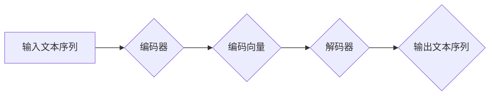

> Transformer, 自然语言处理, 深度学习, 编码器-解码器, 注意力机制, 预训练模型, 迁移学习, 效率优化, 硬件加速

## 1. 背景介绍

自2017年谷歌发布了基于Transformer架构的论文《Attention Is All You Need》以来，Transformer架构迅速席卷了自然语言处理（NLP）领域，并取得了令人瞩目的成就。从机器翻译、文本摘要到对话系统，Transformer架构在各种NLP任务上都展现出了强大的性能，并推动了该领域的发展。

然而，随着Transformer架构的广泛应用，也逐渐暴露了一些问题，例如：

* **计算复杂度高:** Transformer架构的注意力机制需要计算所有词对之间的关系，随着序列长度的增加，计算复杂度呈指数级增长，难以处理长文本。
* **参数量大:** Transformer模型通常拥有大量的参数，需要大量的计算资源和存储空间进行训练和部署。
* **训练成本高:** 训练大型Transformer模型需要消耗大量的计算资源和时间，成本较高。

这些问题限制了Transformer架构在某些应用场景中的应用，例如实时语音识别、机器翻译等需要低延迟和高效率的场景。

## 2. 核心概念与联系

Transformer架构的核心思想是利用注意力机制来捕捉文本序列中词之间的关系，并通过编码器-解码器结构进行文本生成。

**2.1 编码器-解码器结构**

Transformer架构由编码器和解码器两部分组成。编码器负责将输入文本序列编码成一个固定长度的向量表示，解码器则根据编码后的向量表示生成输出文本序列。

**2.2 注意力机制**

注意力机制是Transformer架构的核心，它允许模型关注输入序列中与当前词相关的词，并根据这些关系计算词的权重。

**2.3 Mermaid 流程图**



## 3. 核心算法原理 & 具体操作步骤

### 3.1  算法原理概述

Transformer架构的核心算法是基于注意力机制的编码器-解码器结构。编码器通过多层Transformer块对输入文本序列进行编码，每个Transformer块包含一个多头注意力层和一个前馈神经网络层。解码器也通过多层Transformer块生成输出文本序列，每个Transformer块包含一个多头注意力层和一个前馈神经网络层，并利用掩码机制防止解码器访问未来词的信息。

### 3.2  算法步骤详解

1. **输入处理:** 将输入文本序列转换为词嵌入向量。
2. **编码器:**
    * 将词嵌入向量输入到编码器的第一层Transformer块。
    * 每个Transformer块包含一个多头注意力层和一个前馈神经网络层。
    * 将编码器的输出作为编码向量。
3. **解码器:**
    * 将编码向量作为解码器的输入。
    * 每个Transformer块包含一个多头注意力层和一个前馈神经网络层。
    * 使用掩码机制防止解码器访问未来词的信息。
    * 将解码器的输出作为输出文本序列。

### 3.3  算法优缺点

**优点:**

* **强大的性能:** Transformer架构在各种NLP任务上都取得了令人瞩目的成绩。
* **并行化能力强:** Transformer架构的注意力机制可以并行计算，提高训练效率。
* **可扩展性强:** Transformer架构可以轻松扩展到处理更长的文本序列。

**缺点:**

* **计算复杂度高:** Transformer架构的注意力机制需要计算所有词对之间的关系，随着序列长度的增加，计算复杂度呈指数级增长。
* **参数量大:** Transformer模型通常拥有大量的参数，需要大量的计算资源和存储空间进行训练和部署。
* **训练成本高:** 训练大型Transformer模型需要消耗大量的计算资源和时间，成本较高。

### 3.4  算法应用领域

Transformer架构在以下领域得到了广泛应用:

* **机器翻译:** Transformer架构在机器翻译任务上取得了显著的性能提升。
* **文本摘要:** Transformer架构可以用于生成高质量的文本摘要。
* **对话系统:** Transformer架构可以用于构建更自然、更流畅的对话系统。
* **文本生成:** Transformer架构可以用于生成各种类型的文本，例如诗歌、小说、代码等。

## 4. 数学模型和公式 & 详细讲解 & 举例说明

### 4.1  数学模型构建

Transformer架构的核心是注意力机制，其数学模型可以表示为：

$$
Attention(Q, K, V) = softmax(\frac{QK^T}{\sqrt{d_k}})V
$$

其中：

* $Q$：查询矩阵
* $K$：键矩阵
* $V$：值矩阵
* $d_k$：键向量的维度
* $softmax$：softmax函数

### 4.2  公式推导过程

注意力机制的目的是计算每个词与其他词之间的关系权重。

1. 计算查询矩阵 $Q$ 与键矩阵 $K$ 的点积，并除以 $\sqrt{d_k}$。
2. 应用 softmax 函数将点积结果转换为概率分布。
3. 将概率分布与值矩阵 $V$ 相乘，得到每个词的加权和，即注意力输出。

### 4.3  案例分析与讲解

假设我们有一个句子 "The cat sat on the mat"，我们想要计算 "cat" 与其他词之间的关系。

1. 将每个词转换为词嵌入向量，得到 $Q$、$K$ 和 $V$ 矩阵。
2. 计算 $Q$ 与 $K$ 的点积，并除以 $\sqrt{d_k}$。
3. 应用 softmax 函数将点积结果转换为概率分布，例如 "cat" 与 "sat" 的关系权重较高。
4. 将概率分布与 $V$ 相乘，得到 "cat" 与其他词的加权和，例如 "cat" 与 "sat" 的关系更强。

## 5. 项目实践：代码实例和详细解释说明

### 5.1  开发环境搭建

* Python 3.7+
* PyTorch 1.7+
* CUDA 10.2+

### 5.2  源代码详细实现

```python
import torch
import torch.nn as nn

class Transformer(nn.Module):
    def __init__(self, vocab_size, embedding_dim, num_heads, num_layers):
        super(Transformer, self).__init__()
        self.embedding = nn.Embedding(vocab_size, embedding_dim)
        self.transformer_layers = nn.ModuleList([
            nn.TransformerEncoderLayer(embedding_dim, num_heads)
            for _ in range(num_layers)
        ])
        self.linear = nn.Linear(embedding_dim, vocab_size)

    def forward(self, x):
        x = self.embedding(x)
        for layer in self.transformer_layers:
            x = layer(x)
        x = self.linear(x)
        return x
```

### 5.3  代码解读与分析

* `__init__` 方法初始化模型参数，包括词嵌入层、Transformer层和输出层。
* `forward` 方法定义模型的正向传播过程，将输入词序列转换为输出词序列。

### 5.4  运行结果展示

训练好的Transformer模型可以用于各种NLP任务，例如机器翻译、文本摘要等。

## 6. 实际应用场景

Transformer架构在以下实际应用场景中得到了广泛应用:

* **机器翻译:** Google Translate、DeepL 等机器翻译系统都采用了Transformer架构。
* **文本摘要:** BART、T5 等文本摘要模型都基于Transformer架构。
* **对话系统:** LaMDA、GPT-3 等对话系统都采用了Transformer架构。
* **代码生成:** Codex 等代码生成模型都基于Transformer架构。

### 6.4  未来应用展望

Transformer架构在未来将继续推动NLP领域的进步，并应用于更多领域，例如：

* **多模态理解:** 将Transformer架构扩展到处理图像、音频等多模态数据。
* **知识图谱构建:** 利用Transformer架构构建更准确、更完整的知识图谱。
* **个性化推荐:** 利用Transformer架构进行个性化推荐，例如推荐电影、书籍、商品等。

## 7. 工具和资源推荐

### 7.1  学习资源推荐

* **论文:**
    * Attention Is All You Need
    * BERT: Pre-training of Deep Bidirectional Transformers for Language Understanding
    * GPT-3: Language Models are Few-Shot Learners
* **博客:**
    * The Illustrated Transformer
    * Jay Alammar's Blog
* **课程:**
    * Stanford CS224N: Natural Language Processing with Deep Learning

### 7.2  开发工具推荐

* **PyTorch:** 深度学习框架
* **TensorFlow:** 深度学习框架
* **Hugging Face Transformers:** 预训练Transformer模型库

### 7.3  相关论文推荐

* **BERT:** Pre-training of Deep Bidirectional Transformers for Language Understanding
* **GPT-3:** Language Models are Few-Shot Learners
* **T5:** Text-to-Text Transfer Transformer

## 8. 总结：未来发展趋势与挑战

### 8.1  研究成果总结

Transformer架构在NLP领域取得了显著的成果，推动了该领域的发展。

### 8.2  未来发展趋势

Transformer架构的未来发展趋势包括：

* **效率优化:** 降低Transformer架构的计算复杂度和参数量，提高训练和部署效率。
* **硬件加速:** 利用专用硬件加速Transformer模型的训练和推理。
* **多模态理解:** 将Transformer架构扩展到处理图像、音频等多模态数据。

### 8.3  面临的挑战

Transformer架构也面临一些挑战，例如：

* **可解释性:** Transformer模型的决策过程难以解释，这限制了其在一些安全关键应用中的应用。
* **数据依赖性:** Transformer模型的性能依赖于大量高质量的训练数据。
* **公平性:** Transformer模型可能存在偏见，需要进行公平性评估和缓解。

### 8.4  研究展望

未来研究将继续探索Transformer架构的改进和扩展，以解决上述挑战，并推动Transformer架构在更多领域得到应用。

## 9. 附录：常见问题与解答

* **Transformer架构与RNN架构相比有什么区别?**

Transformer架构与RNN架构的主要区别在于：

* Transformer架构使用注意力机制来捕捉文本序列中词之间的关系，而RNN架构使用循环结构。
* Transformer架构可以并行计算，而RNN架构只能顺序计算。
* Transformer架构可以处理更长的文本序列，而RNN架构容易出现梯度消失问题。

* **如何训练Transformer模型?**

Transformer模型的训练过程通常包括以下步骤：

1. 将文本序列转换为词嵌入向量。
2. 将词嵌入向量输入到Transformer架构中。
3. 使用交叉熵损失函数计算模型的损失。
4. 使用优化算法更新模型参数。

* **如何部署Transformer模型?**

Transformer模型可以部署在各种平台上，例如云服务器、边缘设备等。

作者：禅与计算机程序设计艺术 / Zen and the Art of Computer Programming


<end_of_turn>